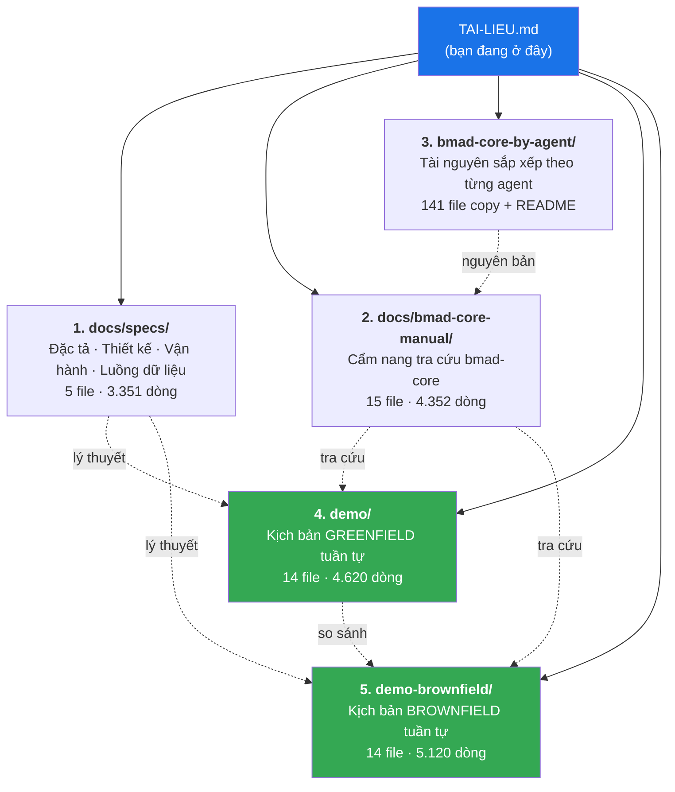

# TÀI LIỆU TIẾNG VIỆT — BMAD-METHOD™ v4.44.2

> **Điểm vào duy nhất** cho toàn bộ tài liệu tiếng Việt phân tích framework này. Nếu bạn không biết bắt đầu từ đâu, hãy đọc bảng "Bắt đầu từ đâu" ngay dưới.
>
> Tài liệu gốc (tiếng Anh) của dự án vẫn ở [`README.md`](./README.md) và [`docs/`](./docs/).

---

## Bắt đầu từ đâu

| Bạn là ai / muốn gì | Đọc cái này trước | Thời gian |
|---|---|---|
| **Chưa biết BMAD là gì, muốn thấy nó chạy thế nào** | [demo/12-tong-ket-so-do.md](./demo/12-tong-ket-so-do.md) → rồi [demo/README.md](./demo/README.md) từ đầu | 20 phút / 2 giờ |
| **Sắp dùng cho dự án MỚI** | [demo/](./demo/README.md) — kịch bản greenfield tuần tự 14 bước | 2 giờ |
| **Sắp dùng cho dự án ĐANG CHẠY** | [demo-brownfield/](./demo-brownfield/README.md) — kịch bản brownfield | 2 giờ |
| **Cần tra cú pháp, lệnh, quy tắc cụ thể** | [docs/bmad-core-manual/](./docs/bmad-core-manual/README.md) — cẩm nang 15 file | tra khi cần |
| **Muốn dùng thủ công, không cài đặt** | [docs/bmad-core-manual/13-cong-thuc-van-hanh-thu-cong.md](./docs/bmad-core-manual/13-cong-thuc-van-hanh-thu-cong.md) | 30 phút |
| **Muốn xem tài nguyên của một agent gom một chỗ** | [bmad-core-by-agent/](./bmad-core-by-agent/README.md) | tra khi cần |
| **Cần hiểu kiến trúc/thuật toán bên dưới framework** | [docs/specs/02-thiet-ke-he-thong.md](./docs/specs/02-thiet-ke-he-thong.md) | 1 giờ |
| **Cần vận hành thật: cài, CI, nâng cấp, sự cố** | [docs/specs/03-van-hanh-he-thong.md](./docs/specs/03-van-hanh-he-thong.md) | 1 giờ |
| **Muốn biết repo có lỗi/không nhất quán gì cần tránh** | [docs/bmad-core-manual/14-tra-cuu-nhanh-va-canh-bao.md](./docs/bmad-core-manual/14-tra-cuu-nhanh-va-canh-bao.md) phần B | 15 phút |

---

## Năm bộ tài liệu



### 1. `docs/specs/` — Đặc tả, thiết kế, vận hành hệ thống

Tài liệu **cấp hệ thống**: framework này gồm gì, được thiết kế thế nào, vận hành ra sao.

| File | Nội dung | Dòng |
|---|---|---|
| [00-INDEX.md](./docs/specs/00-INDEX.md) | Chỉ mục + bản đồ hệ thống | 55 |
| [01-dac-ta-he-thong.md](./docs/specs/01-dac-ta-he-thong.md) | SRS: 12 nhóm yêu cầu chức năng FR-A…FR-L · 11 đặc tả cấu trúc dữ liệu · 15 NFR · ma trận truy vết | 782 |
| [02-thiet-ke-he-thong.md](./docs/specs/02-thiet-ke-he-thong.md) | SDD: kiến trúc 5 tầng · phân rã module · thiết kế lớp tooling · 7 thuật toán cốt lõi · máy trạng thái · 18 quyết định thiết kế | 681 |
| [03-van-hanh-he-thong.md](./docs/specs/03-van-hanh-he-thong.md) | Runbook: cài đặt · cấu hình · quy trình hằng ngày · vận hành repo · CI/CD · nâng cấp–sửa chữa · bảng xử lý sự cố | 805 |
| [04-luong-du-lieu-end-to-end.md](./docs/specs/04-luong-du-lieu-end-to-end.md) | Luồng dữ liệu từ lời chào cài đặt tới khi dự án hoàn thành · sổ đăng ký artifact · ma trận CRUD · 22 điểm dừng human-in-the-loop · 27 bất biến dữ liệu | 1036 |

### 2. `docs/bmad-core-manual/` — Cẩm nang tra cứu `bmad-core`

Tài liệu **theo từng thành phần**, viết để **dùng thủ công** (đọc → chọn agent/task/template → dán prompt vào bất kỳ LLM).

| File | Nội dung |
|---|---|
| [README.md](./docs/bmad-core-manual/README.md) | Chỉ mục |
| [01](./docs/bmad-core-manual/01-tong-quan-kien-truc-thu-muc.md) · [02](./docs/bmad-core-manual/02-core-config.md) | Tổng quan thư mục · `core-config.yaml` |
| [03](./docs/bmad-core-manual/03-agents.md) · [04](./docs/bmad-core-manual/04-giao-thuc-kich-hoat-va-lenh.md) | 10 agent · giao thức kích hoạt & hệ lệnh |
| [05](./docs/bmad-core-manual/05-tasks-tai-lieu.md) · [06](./docs/bmad-core-manual/06-tasks-story.md) · [07](./docs/bmad-core-manual/07-tasks-qa.md) | 3 nhóm task: tài liệu · story · QA |
| [08](./docs/bmad-core-manual/08-templates.md) · [09](./docs/bmad-core-manual/09-checklists.md) · [10](./docs/bmad-core-manual/10-data.md) | 13 template · 6 checklist · 6 file data |
| [11](./docs/bmad-core-manual/11-workflows.md) · [12](./docs/bmad-core-manual/12-agent-teams.md) | 6 workflow · 4 team + `common/utils` |
| [13](./docs/bmad-core-manual/13-cong-thuc-van-hanh-thu-cong.md) | **13 công thức chạy thủ công** + 4 "kit" dán ngữ cảnh |
| [14](./docs/bmad-core-manual/14-tra-cuu-nhanh-va-canh-bao.md) | Tra cứu nhanh + **18 điểm không nhất quán trong repo** |

### 3. `bmad-core-by-agent/` — Tài nguyên sắp xếp theo agent

Bản **copy** của `bmad-core/` + `common/`, tổ chức lại theo từng agent để đọc tập trung. File dùng chung được nhân bản vào từng thư mục.

11 thư mục: `00-shared-dung-chung/` + 10 thư mục agent. 74/74 file nguồn được phủ, 141 bản copy khớp hash SHA-256 với bản gốc. Có `_regenerate.js` để dựng lại.

👉 [bmad-core-by-agent/README.md](./bmad-core-by-agent/README.md)

### 4. `demo/` — Kịch bản GREENFIELD

Ví dụ cụ thể: web app ghi chi tiêu **ChiTieu** (2 epic, 7 story). Mỗi bước ghi rõ: **gọi lệnh gì · agent nạp file nào · diễn biến hội thoại · file nào sinh ra với nội dung mẫu · trạng thái đĩa trước/sau · cơ chế nào chi phối · bạn tự làm gì**.

👉 [demo/README.md](./demo/README.md) · điểm nhấn: [09 QA review gate PASS](./demo/09-story-1-1-qa.md) và [10 story rủi ro cao FAIL→PASS](./demo/10-story-1-2-rui-ro-cao.md)

### 5. `demo-brownfield/` — Kịch bản BROWNFIELD

Ví dụ cụ thể: thêm tính năng vào hệ thống bán hàng **BanHang** đã chạy 3 năm, 0 test, 0 tài liệu, người viết đã rời công ty.

👉 [demo-brownfield/README.md](./demo-brownfield/README.md) · điểm nhấn: [03 document-project](./demo-brownfield/03-document-project.md) và [11 hai lối tắt](./demo-brownfield/11-loi-tat-thay-doi-nho.md)

---

## Ba việc phải làm trước khi dùng framework cho dự án thật

Rút ra từ cả hai demo. Bỏ qua sẽ gặp lỗi ở giữa đường:

| # | Việc | Vì sao | Chi tiết |
|---|---|---|---|
| 1 | **Điền `bmad-core/data/technical-preferences.md`** | Mặc định chỉ có `None Listed`. Điền vào ⇒ Architect chọn đúng stack ngay, không hỏi 10 câu. Với brownfield, đây là **hàng rào** ngăn agent đề xuất viết lại hệ thống | [demo/01](./demo/01-cai-dat.md) · [demo-brownfield/01](./demo-brownfield/01-cai-dat-va-flatten.md) |
| 2 | **Sửa `bmad-core/tasks/apply-qa-fixes.md`** | File viết cứng lệnh Deno (`deno lint`, `deno test -A`) và đường dẫn dự án khác (`deps.ts`, `src/core/di.ts`). Không sửa ⇒ Dev agent chạy lệnh không tồn tại | [manual/14 §B4](./docs/bmad-core-manual/14-tra-cuu-nhanh-va-canh-bao.md) |
| 3 | **Đối chiếu `devLoadAlwaysFiles` với tên section thật** | `core-config.yaml` trỏ `docs/architecture/source-tree.md`, nhưng template `fullstack-architecture` đặt tên section là "Unified Project Structure" ⇒ lệch tên. Template `brownfield-architecture` thì khớp | [demo/05](./demo/05-architect.md) · [manual/14 §B5](./docs/bmad-core-manual/14-tra-cuu-nhanh-va-canh-bao.md) |

Bổ sung nên làm: thêm `test-levels-framework.md` và `test-priorities-matrix.md` vào `dependencies.data` của `bmad-core/agents/qa.md` — hai file này bị `test-design.md` yêu cầu nạp nhưng không agent nào khai báo.

---

## Bốn khái niệm cốt lõi cần nắm

| Khái niệm | Nghĩa | Đọc thêm |
|---|---|---|
| **Vibe CEO** | Bạn định hướng và quyết định; agent thực thi. Bạn là trọng tài chất lượng cuối cùng — không agent nào được tự đánh `Done` | [manual/10 §1](./docs/bmad-core-manual/10-data.md) |
| **Nén ngữ cảnh vào story** | SM biến kiến trúc 1400 dòng thành một story tự chứa, mọi chi tiết kèm `[Source: …]`. Dev đọc story là đủ, **không** đọc PRD/architecture | [manual/06 §1](./docs/bmad-core-manual/06-tasks-story.md) · [demo/07](./demo/07-story-1-1-sm.md) |
| **Gate là advisory** | QA đưa PASS/CONCERNS/FAIL/WAIVED kèm lý do, nhưng **không chặn**. Đội tự chọn ngưỡng chất lượng — nhưng phải quyết định có ý thức | [manual/07 §5-6](./docs/bmad-core-manual/07-tasks-qa.md) |
| **Chat mới mỗi lần đổi agent** | SM → Dev → QA, mỗi vai một hội thoại sạch. Đây là lý do chất lượng không suy giảm | [manual/04 §6](./docs/bmad-core-manual/04-giao-thuc-kich-hoat-va-lenh.md) |

---

## Ghi chú về tính chính xác

| Loại nội dung | Mức tin cậy |
|---|---|
| Lệnh · đường dẫn file · tên section · quy tắc · ngưỡng số · cấu trúc template | **Tra trực tiếp từ mã nguồn** `bmad-core/` v4.44.2 và `tools/` |
| 18 điểm không nhất quán (manual/14 §B) | **Đã xác minh** bằng cách đọc file gốc |
| Nội dung ví dụ trong `demo/` và `demo-brownfield/` (PRD, mã nguồn, số liệu) | **Minh hoạ do tôi soạn** — không phải log của một lần chạy thật. LLM thật sẽ sinh nội dung khác, cấu trúc và luồng thì giống |

Hai demo đều ghi rõ điều này ở đầu `README.md` của chúng.

---

## Bản đồ thư mục

```text
BMAD-METHOD-4.44.2/
├── TAI-LIEU.md                  ← bạn đang ở đây
├── README.md                     ← readme gốc của dự án (tiếng Anh)
│
├── docs/
│   ├── specs/                    ← BỘ 1: đặc tả · thiết kế · vận hành · luồng dữ liệu
│   ├── bmad-core-manual/         ← BỘ 2: cẩm nang tra cứu bmad-core
│   └── *.md                      ← tài liệu gốc: user-guide, core-architecture,
│                                   working-in-the-brownfield, flattener…
├── bmad-core-by-agent/           ← BỘ 3: tài nguyên theo từng agent (bản copy)
├── demo/                         ← BỘ 4: kịch bản greenfield
├── demo-brownfield/              ← BỘ 5: kịch bản brownfield
│
├── bmad-core/                    ← NGUỒN THẬT của framework (đừng sửa bản copy)
├── common/                       ← tài nguyên dùng chung
├── expansion-packs/              ← 5 gói mở rộng
├── tools/                        ← tooling Node.js
└── dist/                         ← bundle dựng sẵn cho web UI
```

⚠️ **Sửa hành vi agent thì sửa trong `bmad-core/`**, không sửa `bmad-core-by-agent/` — thư mục đó chỉ là bản copy để đọc.
