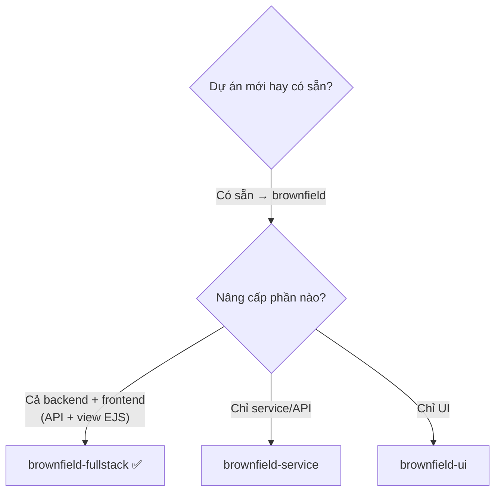

[⬅ Chỉ mục demo](./README.md) · [Bước sau ➡](./01-cai-dat-va-flatten.md)

# Bước 0 — Hệ thống hiện có và điều bạn KHÔNG biết

## Hệ thống: BanHang

Hệ thống bán hàng nội bộ, chạy production **3 năm**, phục vụ 12 nhân viên bán hàng và một app mobile cho shipper.

```text
banhang/
├── server.js                  ← entry point, 340 dòng
├── routes/
│   ├── orders.js              ← 620 dòng  ⚠️ file to nhất
│   ├── customers.js           ← 210 dòng
│   ├── products.js            ← 180 dòng
│   └── reports.js             ← 290 dòng
├── models/
│   ├── Order.js
│   ├── Customer.js
│   └── Product.js
├── views/                     ← 14 file EJS
├── public/js/                 ← jQuery, 8 file
├── utils/
│   ├── db.js
│   └── helpers.js             ← 150 dòng, "mọi thứ" nằm ở đây
├── package.json
└── README.md                  ← 5 dòng
```

| Chỉ số | Giá trị |
|---|---|
| Tổng dòng code | ~18.000 |
| Số file | 42 |
| Test tự động | **0** |
| Tài liệu | README 5 dòng: "npm install, npm start, cần MongoDB" |
| CI/CD | **không có** — deploy bằng `git pull` + `pm2 restart` trên VPS |
| Người viết chính | **đã rời công ty 8 tháng trước** |
| Người đang bảo trì | bạn, mới nhận 2 tuần |

`package.json`:

```json
{
  "dependencies": {
    "express": "^4.17.1",
    "mongoose": "^5.12.3",
    "ejs": "^3.1.6",
    "moment": "^2.29.1",
    "body-parser": "^1.19.0"
  },
  "engines": { "node": "16.x" }
}
```

## Yêu cầu từ ban giám đốc

> *"Thêm chương trình khách hàng thân thiết. Khách mua nhiều thì tích điểm, dùng điểm giảm giá cho đơn sau. Làm trong tháng này."*

## Điều bạn BIẾT

- Hệ thống đang chạy và **không được phép hỏng** — 12 người dùng nó mỗi ngày
- Có một app mobile của shipper gọi API — bạn không biết chính xác endpoint nào
- Logic tính tiền đơn hàng nằm đâu đó trong `routes/orders.js` hoặc `utils/helpers.js`
- Không có môi trường staging. Chỉ có production và máy local của bạn

## Điều bạn KHÔNG biết — và đây là vấn đề thật

| Câu hỏi | Trạng thái |
|---|---|
| Luồng đặt hàng đi qua những hàm nào? | ❓ |
| Tổng tiền đơn hàng được tính ở mấy chỗ? | ❓ |
| App mobile gọi những endpoint nào, với payload gì? | ❓ |
| Collection `orders` có những field nào thực sự đang dùng? | ❓ |
| Có chỗ nào ngầm phụ thuộc vào cấu trúc response không? | ❓ |
| Deploy sai thì rollback thế nào? | ❓ |
| Có "gotcha" nào mà người viết cũ biết mà không ghi lại? | ❓ |

⚠️ **Nếu bạn bắt đầu code ngay bây giờ**, bạn sẽ sửa `routes/orders.js`, deploy, và phát hiện app mobile ngừng hoạt động — vì bạn đã đổi shape của response mà không biết ai đang dùng nó.

🔴 **Đây chính là lý do brownfield có một bước mà greenfield không có: `*document-project`.**

## Chọn workflow

Tra bảng trong [`../docs/bmad-core-manual/11-workflows.md`](../docs/bmad-core-manual/11-workflows.md):



⇒ Dùng **`brownfield-fullstack`** (`bmad-core/workflows/brownfield-fullstack.yaml`).

🔴 Workflow này khác hai workflow brownfield còn lại: **nó có bước phân loại và định tuyến ở đầu**, cho phép "thoát sớm" nếu enhancement nhỏ. Xem [bước 2](./02-phan-loai-va-dinh-tuyen.md).

## Nguyên tắc số 1 của brownfield

`docs/working-in-the-brownfield.md` mở đầu bằng đúng một câu:

> *"Regardless of what you plan for your existing project you want to start agentic coding with, **producing contextual artifacts for agents is of the highest importance**."*

Và ở mục Best Practices:

> **1. Always Document First** — *"Even if you think you know the codebase: run `document-project` to capture current state. AI agents need this context. Discovers undocumented patterns."*

⚠️ Câu *"Even if you think you know the codebase"* là dành cho bạn. Kể cả khi bạn tự tin, hãy chạy `document-project` — nó phát hiện những pattern không được ghi ở đâu.

## Khi nào KHÔNG dùng luồng brownfield

`working-in-the-brownfield.md` nói rõ một ngoại lệ:

> *Nếu bạn vừa hoàn thành MVP bằng BMad và muốn tiếp tục post-MVP, dễ hơn là nói với PM tạo một epic mới thêm vào PRD, shard epic đó ra, cập nhật tài liệu kiến trúc với Architect, rồi làm tiếp.*

⇒ Nếu dự án của bạn **đã** có `docs/prd.md` + `docs/architecture.md` do BMad tạo, đừng dùng luồng brownfield. Chỉ cần `@pm` thêm epic mới.

Demo này áp dụng cho tình huống ngược lại: **hệ thống không do BMad tạo, không có tài liệu.**

## Trạng thái đĩa lúc bắt đầu

📂 `D:\projects\banhang\`

```text
banhang/
├── 42 file mã nguồn (18k dòng)
├── README.md (5 dòng)
└── (không có: test · docs · CI · .bmad-core)
```

---

⚙️ **Cơ chế bên dưới**

Chưa có gì chạy. Nhưng quyết định quan trọng nhất đã được đưa ra: **bạn sẽ không code trước khi hiểu hệ thống**. Ba bước tới đây (`flatten` → phân loại → `document-project`) tồn tại chỉ để phục vụ một mục tiêu: biến 18.000 dòng code không tài liệu thành **ngữ cảnh mà AI agent đọc được**.

---

[⬅ Chỉ mục demo](./README.md) · [Bước sau: cài đặt + làm phẳng codebase ➡](./01-cai-dat-va-flatten.md)
