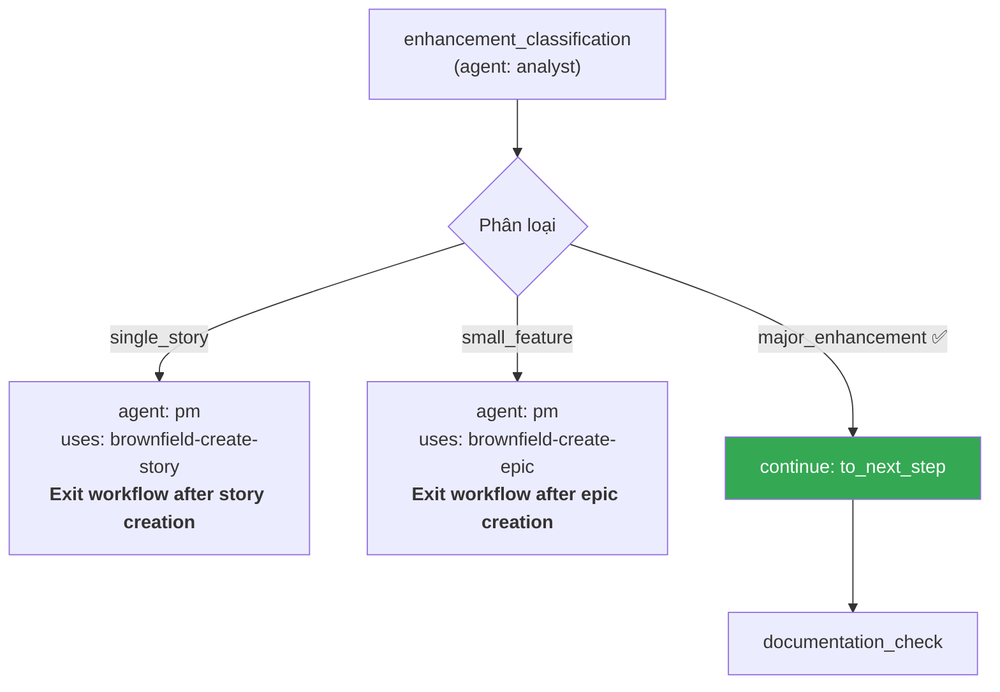

[⬅ Bước trước](./01-cai-dat-va-flatten.md) · [Chỉ mục](./README.md) · [Bước sau ➡](./03-document-project.md)

# Bước 2 — Phân loại phạm vi và định tuyến 🔴

Đây là bước **chỉ có trong `brownfield-fullstack`**. Nó tồn tại để trả lời một câu hỏi rất thực dụng: *bạn có thực sự cần PRD + Architecture đầy đủ cho việc này không?*

## Bước 1 của workflow: `enhancement_classification`

```text
👤 Bạn: @analyst

🤖 Xin chào! Tôi là Mary 📊 — Business Analyst.
   [hiện 10 lệnh]

👤 Bạn: Tôi cần thêm tính năng khách hàng thân thiết vào hệ thống BanHang
   đang chạy. Nên bắt đầu từ đâu?
```

Agent nhận ra đây là brownfield và mở workflow tương ứng:

```text
🤖 Đây là dự án brownfield. Tôi sẽ theo brownfield-fullstack workflow, bắt đầu
   bằng bước phân loại phạm vi.

   Can you describe the enhancement scope? Is this a small fix, a feature
   addition, or a major enhancement requiring architectural changes?
```

⚙️ **Cơ chế**: câu hỏi này lấy **nguyên văn** từ `bmad-core/workflows/brownfield-fullstack.yaml`, bước `enhancement_classification`.

## Ba nhánh phân loại

```text
🤖 Dựa vào câu trả lời của bạn, tôi sẽ định tuyến theo một trong ba nhánh:

   | Phạm vi | Định tuyến | Tài liệu cần |
   |---------|-----------|--------------|
   | Single story (< 4 giờ) | task brownfield-create-story → THOÁT workflow | không cần PRD |
   | Small feature (1–3 story) | task brownfield-create-epic → THOÁT workflow | không cần PRD |
   | Major enhancement (nhiều epic) | tiếp tục workflow đầy đủ | PRD + có thể cần Architecture |

   Hãy giúp tôi phân loại. Ba câu hỏi:

   1. Tính năng này cần thay đổi cấu trúc dữ liệu không (thêm collection,
      thêm field vào collection đang có)?
   2. Nó có chạm vào luồng nghiệp vụ đang chạy không?
   3. Bạn hình dung nó gồm bao nhiêu phần việc độc lập?
```

## Hội thoại phân loại thật

```text
👤 Bạn:
   1. Có — cần lưu điểm của khách, và cần biết đơn nào đã tích điểm rồi.
   2. Có — phải tính điểm khi tạo đơn, và cho phép trừ điểm khi đặt đơn mới.
   3. Tôi nghĩ khoảng 4-5 phần: lưu điểm, tích điểm khi có đơn, đổi điểm,
      xem lịch sử điểm, và trang quản trị để nhân viên xem.

🤖 Phân loại: **MAJOR ENHANCEMENT**.

   Ba dấu hiệu quyết định:

   1. **Thay đổi mô hình dữ liệu** — thêm collection mới VÀ sửa collection
      `orders` đang có. Đây là thay đổi có rủi ro migration.
   2. **Chạm luồng nghiệp vụ đang chạy** — logic tạo đơn hàng là đường dẫn
      quan trọng nhất của hệ thống. Sửa nó có rủi ro regression cao.
   3. **4–5 phần việc độc lập** — vượt ngưỡng 3 story của nhánh small feature.

   ⇒ Tiếp tục workflow đầy đủ: cần PRD, và rất có thể cần cả tài liệu kiến trúc.

   Nếu bạn chỉ cần "hiển thị điểm của khách trên trang chi tiết khách hàng"
   (đọc dữ liệu đã có, không sửa gì), tôi sẽ định tuyến sang
   brownfield-create-story và bạn xong việc trong một buổi.
```

⚠️ **Đừng phóng đại hay thu nhỏ phạm vi**. Cả hai đều tốn kém:

| Sai | Hậu quả |
|---|---|
| Phân loại **quá nhỏ** (chọn single story cho việc lớn) | Không có PRD ⇒ không có AC rõ ⇒ Dev tự quyết ⇒ vỡ luồng đơn hàng |
| Phân loại **quá lớn** (làm PRD đầy đủ cho một bug fix) | Mất 2 ngày viết tài liệu cho việc 30 phút |

## Bước 2 của workflow: `routing_decision`



Hai nhánh thoát sớm được minh hoạ đầy đủ ở [bước 11](./11-loi-tat-thay-doi-nho.md).

## Bước 3 của workflow: `documentation_check`

```text
🤖 [step: documentation_check · agent: analyst · condition: major_enhancement_path]

   Đang kiểm tra tài liệu hiện có của dự án:

   - Tìm tài liệu kiến trúc: ❌ không có
   - Tìm đặc tả API: ❌ không có
   - Tìm coding standards: ❌ không có
   - README.md: ✓ có, nhưng 5 dòng — chỉ hướng dẫn `npm install`

   Đánh giá: **tài liệu KHÔNG đủ**.

   Không có tài liệu nào giúp một AI agent hiểu:
   - Luồng đặt hàng đi qua những hàm nào
   - Tổng tiền được tính ở đâu
   - App mobile gọi endpoint nào với payload gì
   - Ràng buộc và "gotcha" của hệ thống

   ⇒ Kích hoạt bước project_analysis: phải chạy *document-project TRƯỚC
     khi tạo PRD.
```

⚙️ **Cơ chế** — hai nhánh của bước này (nguyên văn từ workflow):

| Kết quả kiểm tra | Hành động |
|---|---|
| **Đủ** (có architecture docs, API specs, coding standards, còn cập nhật) | **Bỏ qua** `document-project`, đi thẳng tới PRD |
| **Không đủ** | Chạy `document-project` trước |

🔴 Đây là chỗ tiết kiệm thật: nếu hệ thống của bạn đã có tài liệu tốt, bạn **không phải** chạy lại `document-project`. Workflow không bắt bạn làm việc vô ích.

## Chọn cách tiếp cận: PRD-first hay Document-first

`docs/working-in-the-brownfield.md` nêu hai cách, và đây là lúc quyết định:

### Approach A — PRD-First

```text
1. @pm  → *create-brownfield-prd        (định nghĩa yêu cầu trước)
2. @architect → *document-project        (chỉ tài liệu hoá vùng PRD chỉ ra)
```

**Tốt cho**: codebase lớn, monorepo, hoặc khi bạn biết chính xác muốn xây gì.
**Lợi thế then chốt**: *"The PRD identifies which parts of your monorepo/large codebase actually need documentation!"*

Ví dụ: nếu bạn nói *"Add payment processing to user service"*, `document-project` sẽ chỉ tài liệu hoá user service, API endpoints, database schema, payment integrations — **bỏ qua** admin panel, module báo cáo, các microservice không liên quan.

### Approach B — Document-First

```text
1. @architect → *document-project        (tài liệu hoá toàn bộ)
2. @pm  → *create-brownfield-prd         (tạo PRD với ngữ cảnh đầy đủ)
```

**Tốt cho**: codebase nhỏ, hệ thống chưa biết rõ, hoặc thay đổi mang tính khám phá.
**Đánh đổi**: *"More thorough - captures everything"* nhưng có thể tạo tài liệu quá nhiều.

### Quyết định của demo

```text
👤 Bạn: Codebase chỉ 18k dòng, 42 file — không lớn. Và tôi thực sự chưa hiểu
   hệ thống. Chọn Approach B.

🤖 Đồng ý. Với 18k dòng thì tài liệu hoá toàn bộ vẫn nằm trong tầm kiểm soát,
   và bạn cần hiểu hệ thống trước khi viết yêu cầu — nếu không PRD sẽ dựa trên
   giả định sai.

   Ngoài ra: tính năng khách hàng thân thiết chạm vào cả orders, customers, và
   view — tức là gần như toàn bộ hệ thống. PRD-first cũng sẽ dẫn tới việc tài
   liệu hoá phần lớn codebase.

   ⇒ Chuyển sang bước project_analysis: @architect → *document-project
```

⚙️ **Bảng chọn nhanh:**

| Codebase | Bạn hiểu hệ thống? | Chọn |
|---|---|---|
| Lớn / monorepo | Hiểu rõ muốn xây gì | **A — PRD-first** |
| Lớn / monorepo | Chưa hiểu | A, nhưng viết PRD sơ bộ rồi tinh chỉnh sau khi có tài liệu |
| Nhỏ / vừa | Chưa hiểu | **B — Document-first** ✅ demo này |
| Nhỏ / vừa | Hiểu rõ | B (nhanh) hoặc bỏ qua nếu tài liệu đã đủ |

## Trạng thái sau bước 2

Chưa có file nào được tạo. Nhưng bốn quyết định đã được chốt:

| Quyết định | Giá trị |
|---|---|
| Workflow | `brownfield-fullstack` |
| Phân loại phạm vi | **major enhancement** ⇒ cần PRD |
| Tài liệu hiện có | **không đủ** ⇒ phải chạy `document-project` |
| Cách tiếp cận | **Approach B — Document-first** |

## Bạn tự làm gì ở bước này

- [ ] Trả lời trung thực 3 câu hỏi phân loại — đừng phóng đại cũng đừng thu nhỏ
- [ ] Nếu phạm vi là 1 story hoặc 1–3 story: **thoát workflow**, sang [bước 11](./11-loi-tat-thay-doi-nho.md), tiết kiệm hàng giờ
- [ ] Tự kiểm tài liệu hiện có: có architecture doc? API spec? coding standards? Còn cập nhật không?
- [ ] Chọn A hay B theo bảng ở trên
- [ ] Nếu chọn A: viết PRD trước rồi mới `document-project` **có phạm vi**

---

[⬅ Bước trước](./01-cai-dat-va-flatten.md) · [Chỉ mục](./README.md) · [Bước sau: document-project ➡](./03-document-project.md)
