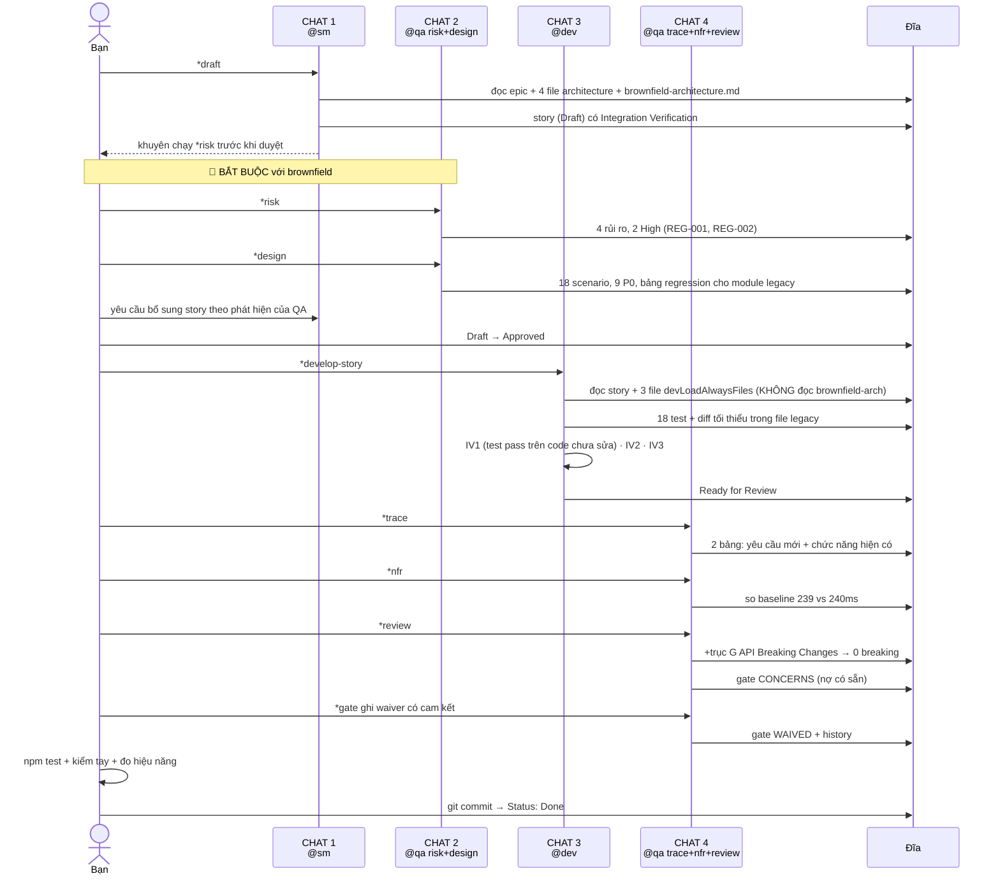

[⬅ Bước trước](./09-dev-story.md) · [Chỉ mục](./README.md) · [Bước sau ➡](./11-loi-tat-thay-doi-nho.md)

# Bước 10 — QA: `*trace` → `*nfr` → `*review` → gate

> ⚠️ **MỞ CHAT MỚI.** Đây là chat thứ 4 cho story 1.1 (SM → QA risk/design → Dev → QA review).

## 10.1 `*trace` — truy vết yêu cầu ↔ test

```text
👤 Bạn: @qa → *trace docs/stories/1.1.nen-tang-cong-tac-test-luoi-an-toan.md
```

🔴 Với brownfield, `*trace` có thêm một nhiệm vụ: theo `working-in-the-brownfield.md`, nó phải map cả **"existing functionality preservation"**, không chỉ yêu cầu mới.

```text
🤖 ## Coverage Summary

   ### Yêu cầu MỚI (Acceptance Criteria)
   | AC | Nội dung | Coverage | Test |
   |----|----------|----------|------|
   | 1 | npm test chạy được với Jest | full | smoke.test.js |
   | 2 | Regression POST giữ `total_amount` | full | INT-001, INT-002, INT-003 |
   | 3 | Regression PUT giữ hành vi | full | INT-007, INT-008 |
   | 4 | Regression GET trả 5 field + camelCase | full | INT-004, INT-005 |
   | 5 | `LOYALTY_ENABLED` qua module cấu hình, mặc định false | full | UNIT-001..004 |
   | 6 | `.env.example` + `.gitignore` | none | ⚠️ không kiểm được tự động |

   ### 🔴 Chức năng HIỆN CÓ phải được bảo toàn (brownfield-specific)
   | Chức năng legacy | Coverage | Test | Ghi chú |
   |-----------------|----------|------|---------|
   | `POST /api/orders` tạo đơn | full | INT-001..003 | khoá cả shape lỗi |
   | `PUT /api/orders/:id` sửa đơn | full | INT-007, INT-008 | |
   | `GET /api/orders/:id` chi tiết | full | INT-004, INT-005 | 5 field app mobile |
   | `GET /api/orders` danh sách | full | INT-009, INT-010, INT-012 | kèm `?limit=abc` |
   | App khởi động được | full | E2E-001 smoke | REG-001 |
   | **Trang EJS render đúng** | **none** ❌ | — | ⚠️ chỉ kiểm tay (IV2) |
   | `utils/helpers.js` tính VAT | none | — | KHÔNG chạm ⇒ không bắt buộc |
   | `routes/customers.js` | none | — | KHÔNG chạm ⇒ không bắt buộc |

   ### Given-When-Then cho các mapping quan trọng (tài liệu hoá, không phải code BDD)

   **AC4 / bảo vệ app mobile:**
   - **Given** một đơn hàng đã tồn tại với khách "Trần Văn A" và tổng 150.000đ
   - **When** gọi `GET /api/orders/:id`
   - **Then** response chứa đúng 5 key `_id`, `customerName`, `totalAmount`,
     `status`, `createdAt`, và **không** chứa `total_amount`
   ⇒ `tests/integration/orders-regression.test.js:78`

   **REG-002 / khoá hành vi không nhất quán:**
   - **Given** hệ thống hiện trả `total_amount` ở POST và `totalAmount` ở GET
   - **When** chạy toàn bộ regression suite trên code chưa sửa logic (IV1)
   - **Then** 18/18 test pass
   ⇒ bằng chứng: Debug Log References của Dev ghi "npm test cuối: 18/18 pass"

   ## Critical Gaps

   ```yaml
   coverage_gaps:
     - requirement: 'Chức năng hiện có: các trang EJS render đúng'
       gap: 'Không có test tự động cho view layer; chỉ kiểm tay (IV2)'
       severity: medium
       suggested_test:
         type: e2e
         description: 'Playwright kiểm 3 trang render và có dữ liệu — cần cho story 1.5 (thêm UI điểm)'
     - requirement: 'AC6: .env.example và .gitignore'
       gap: 'Không kiểm được tự động'
       severity: low
       suggested_test:
         type: unit
         description: 'Test đọc file .gitignore và xác nhận có dòng .env — rẻ, nên thêm'
   ```

   ## Gate YAML Block
   ```yaml
   trace:
     totals: { requirements: 6, full: 5, partial: 0, none: 1 }
     planning_ref: 'docs/qa/assessments/1.1-test-design-20260813.md'
     uncovered:
       - ac: 'AC6'
         reason: 'Kiểm cấu hình file không được tự động hoá'
     existing_functionality:
       totals: { modules_touched: 2, modules_with_regression_tests: 2 }
       uncovered:
         - module: 'views/*.ejs'
           reason: 'Không có test tự động cho view layer; bù bằng kiểm tay IV2'
     notes: 'Xem docs/qa/assessments/1.1-trace-20260814.md'
   ```

   ✅ **Điểm quan trọng nhất**: `modules_touched: 2` và
     `modules_with_regression_tests: 2` ⇒ **đạt chuẩn brownfield**
     "Every touched legacy module needs tests".

   Traceability: docs/qa/assessments/1.1-trace-20260814.md
```

⚙️ **Cơ chế** — hai bảng riêng biệt ("yêu cầu mới" và "chức năng hiện có") là điểm khác biệt của `*trace` trong brownfield. Bảng thứ hai trả lời câu hỏi mà greenfield không cần hỏi: *tôi có bảo vệ được cái đang chạy không?*

## 10.2 `*nfr` — đối chiếu baseline

```text
👤 Bạn: *nfr docs/stories/1.1.nen-tang-cong-tac-test-luoi-an-toan.md
```

```text
🤖 Đánh giá bộ bốn cốt lõi.

   Tìm ngưỡng trong: AC của story · docs/architecture/*.md · technical-preferences.md
   ✓ Tìm thấy baseline hiệu năng: POST 240ms, GET list 180ms
     [Source: docs/qa/assessments/1.1-test-design-20260813.md#performance-baseline]
   ✓ Tìm thấy chuẩn brownfield: "Must maintain or improve current metrics"
   ⚠️ Không tìm thấy ngưỡng bảo mật cụ thể cho story này

   ```yaml
   nfr_validation:
     _assessed: [security, performance, reliability, maintainability]
     security:
       status: CONCERNS
       notes: 'Story không làm tệ hơn, nhưng credential vẫn hardcode trong
               utils/db.js (nợ đã có, ngoài phạm vi). Điểm cộng: db.connect()
               từ chối URI không chứa "test" — ngăn test chạy trên production.'
     performance:
       status: PASS
       notes: 'POST /api/orders trung vị 239ms vs baseline 240ms — không suy giảm.
               Hợp lý vì story không thêm logic runtime (LOYALTY_ENABLED=false).'
     reliability:
       status: PASS
       notes: 'require.main guard đúng pattern; app khởi động được (E2E-001);
               config ném lỗi rõ ràng khi thiếu MONGO_URI.'
     maintainability:
       status: CONCERNS
       notes: 'View layer vẫn 0% test coverage. Story 1.5 sẽ thêm UI vào view
               chưa có lưới an toàn nào — rủi ro cho story sau.'
   ```

   ## Deterministic Status Rules
   Không có FAIL. Có 2 CONCERNS ⇒ tổng thể **CONCERNS**.

   quality_score = 100 − 20×0 − 10×2 = **80**

   ## 🔴 Backward Compatibility Validation (brownfield-specific)
   | Kiểm | Kết quả | Bằng chứng |
   |------|---------|-----------|
   | Shape response `/api/orders*` không đổi | ✅ | 8 contract test, INT-001..010 |
   | Không đổi schema | ✅ | story không chạm model |
   | Không đổi cách deploy | ✅ | không thêm build step; `npm start` vẫn chạy |
   | App mobile không bị ảnh hưởng | ✅ | 5 field được khoá bằng test INT-004 |
   | Hiệu năng không suy giảm | ✅ | 239ms vs 240ms |

   ## Critical Issues
   Không có issue chặn.

   ## Quick Wins
   1. Test đọc `.gitignore` xác nhận có `.env` — 5 dòng code, đóng gap AC6
   2. Chuyển `utils/db.js` sang dùng `MONGO_URI` — biến đã sẵn sàng, ~10 dòng,
      đóng nợ bảo mật lâu năm

   NFR assessment: docs/qa/assessments/1.1-nfr-20260814.md
```

⚙️ **Cơ chế** — chú ý cách QA xử lý nợ có sẵn:

> *"Story không làm tệ hơn, nhưng credential vẫn hardcode (nợ đã có, ngoài phạm vi)."*

QA **không** cho FAIL vì lỗi của hệ thống cũ. Nó cho **CONCERNS** và ghi rõ đây là nợ có sẵn. Đây là phân biệt cốt lõi của brownfield: *lỗi do enhancement của tôi* vs *lỗi hệ thống vốn đã có*.

## 10.3 `*review` — review toàn diện

```text
👤 Bạn: *review docs/stories/1.1.nen-tang-cong-tac-test-luoi-an-toan.md
```

```text
🤖 ## Đánh giá độ sâu — 5 dấu hiệu leo thang

   | Dấu hiệu | Story 1.1 |
   |---|---|
   | Chạm file auth/payment/security | Không |
   | Không thêm test | Không — story này TOÀN là test |
   | Diff > 500 dòng | ⚠️ **CÓ** — 640 dòng (chủ yếu là test) |
   | Gate trước FAIL/CONCERNS | Không có gate trước |
   | > 5 AC | ⚠️ **CÓ** — 6 AC + 3 IV |

   ⇒ 2 dấu hiệu ⇒ review kỹ. Ngoài ra 🔴 đây là brownfield chạm file legacy
     ⇒ tôi thêm một trục phân tích: **API Breaking Changes**.

   ## Sáu trục + 1 trục brownfield

   ### A. Requirements Traceability
   [đã làm ở *trace] 5/6 AC full; AC6 không tự động hoá được.
   🔴 2/2 module legacy bị chạm đều có regression test — đạt chuẩn.

   ### B. Code Quality
   ✓ `config/index.js`: `parseBool` tách riêng, test được; mặc định an toàn
     (chỉ chuỗi `'true'` mới bật) — đây là quyết định đúng cho một công tắc
     an toàn vận hành
   ✓ `db.connect()` từ chối URI không chứa "test" — 3 dòng, ngăn được sự cố
     nghiêm trọng. Tôi đánh giá đây là điểm sáng nhất của story
   ✓ Diff trong `server.js` chỉ +5 −1 — kỷ luật tốt với file legacy
   ⚠️ `tests/helpers/fixtures.js` có `makeCustomer` và `makeProduct` trả về
     document đã save. Nếu về sau cần fixture không save, sẽ phải sửa. Chấp
     nhận được ở mức hiện tại.

   **Refactoring tôi đã thực hiện:** 1 chỗ.

   1. **File:** `tests/helpers/db.js`
      **Change:** đổi `if (!/test/i.test(TEST_URI))` thành kiểm tên database
      thay vì toàn bộ URI
      **Why:** URI production `mongodb://admin:x@10.0.0.5:27017/banhang` may mắn
      không chứa "test", nhưng nếu host là `test-db.internal` thì URI production
      SẼ chứa "test" và bảo vệ này thất bại — đúng lúc nguy hiểm nhất
      **How:** parse phần path của URI, chỉ kiểm tên database:
      ```js
      const dbName = new URL(TEST_URI).pathname.slice(1);
      if (!/test/i.test(dbName)) throw new Error('Database test phải có chữ "test" trong TÊN');
      ```
      ✓ Đã chạy `npm test` sau refactor: 18/18 pass

   ### C. Test Architecture
   ✓ Tỉ lệ 6 unit / 11 integration / 1 e2e — hợp lý cho story mục tiêu là
     khoá hành vi API
   ✓ Test stateless, `afterEach(db.clear)`, chạy song song được
   ✓ Không có hard wait
   ✓ 🔴 **Khối comment cảnh báo ở đầu file regression test** — tôi đánh giá đây
     là artifact quan trọng nhất Dev tạo ra trong story này. Nó là thứ duy nhất
     ngăn người sau "chuẩn hoá" `total_amount` và làm chết app mobile
   ⚠️ `views/*.ejs` không có test — ghi nhận, ảnh hưởng story 1.5

   ### D. NFR
   [đã làm ở *nfr] security CONCERNS · performance PASS · reliability PASS ·
   maintainability CONCERNS

   ### E. Testability
   - Controllability ✓ `loadConfig(env)` và fixture cho phép kiểm soát input
   - Observability ✓ lỗi nêu rõ biến/nguyên nhân
   - Debuggability ✓ test có tên mô tả hành vi, dễ định vị khi fail

   ### F. Technical Debt
   1. `views/*.ejs` 0% coverage — **medium**, ảnh hưởng story 1.5
   2. `utils/db.js` credential hardcode — **medium**, nợ có sẵn, ngoài phạm vi
   3. `const PORT = 3000` chưa đọc từ config — **low**, cố ý giữ diff nhỏ
   4. Code chết `routes/orders.js:52` (`if (!orders)`) — **low**, Dev phát hiện
      và ghi nhận, không sửa — đúng

   ### 🔴 G. API Breaking Changes (trục riêng của brownfield)
   Kiểm từng endpoint mà app mobile dùng:

   | Endpoint | Trước story | Sau story | Breaking? |
   |----------|-------------|-----------|-----------|
   | `GET /api/orders` | array, `?limit`, `?skip` | không đổi | ✅ Không |
   | `GET /api/orders/:id` | 5 field, `totalAmount` | không đổi | ✅ Không |
   | `POST /api/orders` | `total_amount` | không đổi | ✅ Không |
   | `PUT /api/orders/:id` | không đổi | không đổi | ✅ Không |

   **Kết luận: KHÔNG có breaking change.** Diff duy nhất trong file route là
   **không có** — Dev không chạm `routes/orders.js`. Diff chỉ ở `server.js`
   (không ảnh hưởng contract).

   ## Áp thuật toán gate THEO THỨ TỰ

   **1. Risk thresholds** — có `risk_summary` từ `*risk`:
      - REG-001 (score 6): đã giảm nhẹ ✓ — pattern `require.main` đúng, có smoke
        test E2E-001, Dev đã kiểm `npm start`, subtask kiểm `pm2 logs` có trong story
      - REG-002 (score 6): đã giảm nhẹ ✓ — IV1 thực hiện và pass 18/18, có khối
        comment cảnh báo, test khẳng định tường minh tên field
      - TECH-001, OPS-001 (score 3): đã giảm nhẹ ✓
      ⇒ không còn rủi ro chưa xử lý ở mức ≥ 6 ⇒ **không FAIL, không CONCERNS từ risk**

   **2. Test coverage gaps** — so với 9 P0 test của `*design`:
      | P0 test | Có? |
      |---|---|
      | UNIT-001, UNIT-002 | ✅ |
      | INT-001, INT-002, INT-004, INT-005, INT-006, INT-007 | ✅ |
      | E2E-001 | ✅ |
      ⇒ **9/9 P0 test có mặt** ⇒ không CONCERNS từ coverage
      ⇒ Gap còn lại (views EJS, AC6) đều **không phải P0** ⇒ không đẩy gate

   **3. Issue severity**:
      - MNT-001 (views 0% coverage): **medium**
      - SEC-001 (credential hardcode, nợ có sẵn): **medium**
      ⇒ có medium ⇒ **CONCERNS**

   **4. NFR**: security CONCERNS, maintainability CONCERNS ⇒ **CONCERNS**

   ⇒ **gate = CONCERNS**

   quality_score = 100 − 20×0 − 10×2 = **80**
```

## Đầu ra 1 — QA Results

```markdown
## QA Results

### Review Date: 2026-08-14

### Reviewed By: Quinn (Test Architect)

### Code Quality Assessment
Chất lượng cao cho một story hạ tầng brownfield. Ba điểm sáng: (1) diff trong
file legacy tối thiểu (+5 −1 trong `server.js`), (2) `db.connect()` từ chối URI
không phải test — 3 dòng ngăn được sự cố nghiêm trọng, (3) khối comment cảnh báo
ở đầu file regression test, giải thích rõ vì sao KHÔNG được "sửa cho đẹp" sự
không nhất quán `total_amount`/`totalAmount`.

Dev phát hiện code chết tại `routes/orders.js:52` và **không sửa** — đúng, vì
nằm ngoài phạm vi. Ghi nhận đầy đủ trong Completion Notes.

### Refactoring Performed
- **File**: `tests/helpers/db.js`
  - **Change**: kiểm chữ "test" trong **tên database** thay vì toàn bộ URI
  - **Why**: URI production có thể chứa "test" ở phần host (ví dụ
    `test-db.internal`) ⇒ bảo vệ thất bại đúng lúc nguy hiểm nhất
  - **How**: parse `new URL(uri).pathname` để lấy tên database, chỉ kiểm phần đó
  - Đã chạy `npm test` sau refactor: 18/18 pass

### Compliance Check
- Coding Standards: ✓ CommonJS, `{ message }` cho lỗi, camelCase cho code mới
- Critical Integration Rules: ✓ không sửa/xoá key nào trong response `/api/orders*`
- Project Structure: ✓ `tests/`, `config/` khớp `source-tree.md`
- Testing Strategy: ✓ regression test cho 2/2 module legacy bị chạm
- All ACs Met: ✓ 5/6 có bằng chứng tự động; AC6 kiểm bằng mắt (chấp nhận được)
- 🔴 Integration Verification: ✓ 3/3 (IV1 18/18 pass · IV2 kiểm tay 3 trang ·
  IV3 239ms vs baseline 240ms)

### Improvements Checklist
- [x] Refactor `db.connect()` kiểm tên database thay vì toàn URI
- [x] Xác nhận 9/9 P0 test có mặt
- [x] Xác nhận không có breaking change trên 4 endpoint
- [ ] Thêm test đọc `.gitignore` xác nhận có `.env` (đóng gap AC6, ~5 dòng)
- [ ] **Trước story 1.5**: thêm e2e test cho view layer (Playwright) — story 1.5
      sẽ sửa `views/customers/detail.ejs` mà hiện chưa có lưới an toàn nào
- [ ] Chuyển `utils/db.js` sang dùng `MONGO_URI` (nợ có sẵn, biến đã sẵn sàng)

### Security Review
Story **không làm tệ hơn** tình trạng bảo mật hiện tại. Điểm cộng: `db.connect()`
ngăn test chạy trên DB production.
⚠️ Nợ có sẵn chưa xử lý: credential hardcode trong `utils/db.js`. Đây **không
phải lỗi của story này** nhưng là rủi ro thật, đã có trong git history. Khuyến
nghị làm thành story riêng, không nhét vào enhancement loyalty.

### Performance Considerations
POST /api/orders trung vị 239ms vs baseline 240ms — không suy giảm. Đúng như kỳ
vọng vì `LOYALTY_ENABLED=false` nên không có logic runtime mới.
🔴 Baseline này giờ đã được ghi lại và có test đo — các story sau (1.3 tích điểm)
sẽ so được với nó. Đây là giá trị dài hạn của story 1.1.

### 🔴 Backward Compatibility Assessment
| Kiểm | Kết quả |
|------|---------|
| Shape response 4 endpoint `/api/orders*` | ✅ không đổi, có 8 contract test |
| Schema database | ✅ không chạm |
| Cách deploy | ✅ không thêm build step |
| 5 field app mobile dùng | ✅ được khoá bằng test |
| Hiệu năng | ✅ 239ms vs 240ms |
**Không có breaking change.**

### Files Modified During Review
- `tests/helpers/db.js` (refactor kiểm tên database)
→ Đề nghị Dev cập nhật File List cho file này.

### Gate Status
Gate: CONCERNS → docs/qa/gates/1.1-nen-tang-cong-tac-test-luoi-an-toan.yml
Risk profile: docs/qa/assessments/1.1-risk-20260813.md
Test design: docs/qa/assessments/1.1-test-design-20260813.md
Trace: docs/qa/assessments/1.1-trace-20260814.md
NFR assessment: docs/qa/assessments/1.1-nfr-20260814.md

### Recommended Status
✓ Ready for Done — với ghi nhận 2 issue medium là **nợ có sẵn của hệ thống**,
không phải khiếm khuyết của story này.
(Story owner decides final status)
```

## Đầu ra 2 — File gate

📂 `docs/qa/gates/1.1-nen-tang-cong-tac-test-luoi-an-toan.yml`

```yaml
schema: 1
story: '1.1'
story_title: 'Nền tảng — công tắc tính năng, test framework, lưới an toàn'
gate: CONCERNS
status_reason: 'Đạt 6/6 AC và 3/3 Integration Verification, 9/9 P0 test, không có breaking change. Hai issue medium đều là nợ có sẵn của hệ thống, không phải khiếm khuyết của story.'
reviewer: 'Quinn (Test Architect)'
updated: '2026-08-14T11:30:00Z'

waiver: { active: false }

top_issues:
  - id: 'MNT-001'
    severity: medium
    finding: 'View layer (views/*.ejs) có 0% test coverage. Story 1.5 sẽ sửa views/customers/detail.ejs mà không có lưới an toàn.'
    suggested_action: 'Thêm e2e test (Playwright) cho 3 trang chính TRƯỚC story 1.5'
    suggested_owner: dev
  - id: 'SEC-001'
    severity: medium
    finding: 'Credential MongoDB hardcode trong utils/db.js, có trong git history. Nợ có sẵn, không do story này gây ra.'
    suggested_action: 'Story riêng: chuyển utils/db.js sang dùng MONGO_URI (biến đã sẵn sàng)'
    suggested_owner: dev
  - id: 'TEST-001'
    severity: low
    finding: 'AC6 (.env.example và .gitignore) không có test tự động'
    suggested_action: 'Thêm test đọc .gitignore xác nhận có dòng .env (~5 dòng)'
    suggested_owner: dev

risk_summary:
  totals: { critical: 0, high: 0, medium: 2, low: 2 }
  recommendations:
    must_fix: []
    monitor:
      - 'MNT-001 phải xử lý TRƯỚC story 1.5 (story đó sửa view)'
      - 'SEC-001 nên làm thành story riêng, không nhét vào enhancement loyalty'

quality_score: 80
expires: '2026-08-28T11:30:00Z'

evidence:
  tests_reviewed: 18
  risks_identified: 4
  trace:
    ac_covered: [1, 2, 3, 4, 5]
    ac_gaps: [6]
  # 🔴 brownfield-specific
  existing_functionality:
    modules_touched: 2
    modules_with_regression_tests: 2
    endpoints_contract_tested: 4
    breaking_changes_detected: 0
  performance:
    baseline_ms: 240
    measured_ms: 239
    regression: false

nfr_validation:
  security:
    status: CONCERNS
    notes: 'Không làm tệ hơn; nợ có sẵn (credential hardcode). Điểm cộng: db.connect() từ chối URI không phải test'
  performance:
    status: PASS
    notes: '239ms vs baseline 240ms — không suy giảm'
  reliability:
    status: PASS
    notes: 'require.main guard đúng; smoke test xác nhận app khởi động; config ném lỗi rõ ràng'
  maintainability:
    status: CONCERNS
    notes: 'View layer vẫn 0% coverage — rủi ro cho story 1.5'

recommendations:
  immediate: []
  future:
    - action: 'Thêm e2e test cho view layer trước story 1.5'
      refs: ['views/customers/detail.ejs', 'views/orders/list.ejs']
    - action: 'Story riêng: chuyển utils/db.js sang MONGO_URI'
      refs: ['utils/db.js']
    - action: 'Test đọc .gitignore xác nhận có .env'
      refs: ['.gitignore']
```

## 10.4 Bạn quyết định: CONCERNS thì làm gì

Đây là tình huống **rất thường gặp với brownfield**: gate CONCERNS vì nợ của hệ thống cũ, không vì lỗi của story.

```text
👤 Bạn: Hai issue medium đều là nợ có sẵn. MNT-001 (view không test) tôi sẽ xử
   lý trước story 1.5 như QA đề xuất. SEC-001 tôi tạo story riêng.
   Tôi muốn có dấu vết chính thức cho quyết định này.

👤 Bạn: *gate docs/stories/1.1.nen-tang-cong-tac-test-luoi-an-toan.yml
   Ghi waiver: hai issue medium là nợ có sẵn của hệ thống, không do story này.
   MNT-001 cam kết xử lý trước story 1.5. SEC-001 chuyển thành story riêng.
```

```text
🤖 Cập nhật gate thành WAIVED với dấu vết đầy đủ.
```

```yaml
schema: 1
story: '1.1'
story_title: 'Nền tảng — công tắc tính năng, test framework, lưới an toàn'
gate: WAIVED
status_reason: 'Hai issue medium là nợ kỹ thuật có sẵn của hệ thống, không phải khiếm khuyết của story. Được chấp nhận với cam kết xử lý cụ thể.'
reviewer: 'Quinn (Test Architect)'
updated: '2026-08-14T14:00:00Z'

waiver:
  active: true
  reason: 'MNT-001 (view 0% coverage) và SEC-001 (credential hardcode) đều tồn tại TRƯỚC enhancement này. Story 1.1 không làm tệ hơn và đã đạt mọi AC + IV. MNT-001 cam kết xử lý trước story 1.5; SEC-001 chuyển thành story độc lập ngoài epic loyalty.'
  approved_by: 'Chủ dự án'

top_issues:
  # giữ nguyên 3 issue — waiver KHÔNG xoá issue, chỉ ghi nhận đã chấp nhận
  - id: 'MNT-001'
    severity: medium
    finding: 'View layer 0% test coverage'
    suggested_action: 'e2e test trước story 1.5'
    suggested_owner: dev
  - id: 'SEC-001'
    severity: medium
    finding: 'Credential hardcode trong utils/db.js (nợ có sẵn)'
    suggested_action: 'Story riêng ngoài epic loyalty'
    suggested_owner: dev
  - id: 'TEST-001'
    severity: low
    finding: 'AC6 không có test tự động'
    suggested_action: 'Test đọc .gitignore'
    suggested_owner: dev

quality_score: 80

history:
  - at: '2026-08-14T11:30:00Z'
    gate: CONCERNS
    note: 'Review lần đầu: 2 issue medium là nợ có sẵn'
  - at: '2026-08-14T14:00:00Z'
    gate: WAIVED
    note: 'Chủ dự án chấp nhận nợ có sẵn, kèm cam kết: MNT-001 trước story 1.5, SEC-001 thành story riêng'
```

⚙️ **Cơ chế WAIVED** — `working-in-the-brownfield.md` ghi rõ về gate trong brownfield:

> *"May WAIVE certain legacy code issues · Documents technical debt acceptance · Tracks migration progress"*

Ba điều `WAIVED` bắt buộc phải có: `reason` · `approved_by` · và **giữ nguyên `top_issues`**. Waive **không** làm vấn đề biến mất — nó ghi lại rằng bạn đã **biết và chấp nhận có ý thức**, kèm cam kết xử lý.

⚠️ **Đừng waive khi**: issue do enhancement của bạn gây ra · bạn chưa hiểu rủi ro · không có cam kết cụ thể ("sẽ sửa sau" không phải cam kết; "sửa trước story 1.5" là cam kết).

## 10.5 Đóng story

```bash
# 1. Chạy toàn bộ regression suite
npm test        # ✓ 18/18 pass

# 2. 🔴 Kiểm tay những gì không có test tự động (IV2)
npm start
# → mở 3 trang, xác nhận hiển thị đúng

# 3. 🔴 Đo lại hiệu năng, so baseline (IV3)
# → 239ms vs 240ms ✓

# 4. COMMIT
git add -A
git commit -m "feat(story-1.1): lưới an toàn cho enhancement loyalty

Story đầu tiên của epic loyalty. KHÔNG có tính năng hướng người dùng —
mục tiêu là tạo lưới an toàn trước khi chạm code legacy.

- Jest 29 + supertest 6 (test framework đầu tiên của dự án)
- 18 test: 6 unit + 11 integration + 1 smoke
- Regression test khoá hành vi hiện tại của 4 endpoint /api/orders*
  (giữ nguyên total_amount snake_case ở POST, totalAmount camelCase ở GET —
   sự không nhất quán CỐ Ý giữ vì app mobile đang dùng)
- config/index.js: công tắc LOYALTY_ENABLED, mặc định TẮT
- db.connect() từ chối URI không phải test database
- server.js: +5 −1 dòng (export app + require.main guard)

Integration Verification: IV1 18/18 pass trên code chưa sửa logic ·
IV2 kiểm tay 3 trang ✓ · IV3 239ms vs baseline 240ms ✓
Breaking changes: 0
QA Gate: CONCERNS → WAIVED (2 issue medium là nợ có sẵn của hệ thống)

Story: docs/stories/1.1.nen-tang-cong-tac-test-luoi-an-toan.md"

# 5. Đổi Status trong story
```

```markdown
## Status
Done
```

## Trạng thái sau bước 10

📂

```text
docs/
├── brownfield-architecture.md
├── prd.md + prd/
├── architecture.md + architecture/
├── stories/1.1.*.md                    ← Status: Done ✓
└── qa/
    ├── assessments/                     ← 4 file cho một story
    │   ├── 1.1-risk-20260813.md
    │   ├── 1.1-test-design-20260813.md
    │   ├── 1.1-trace-20260814.md
    │   └── 1.1-nfr-20260814.md
    └── gates/
        └── 1.1-nen-tang-cong-tac-test-luoi-an-toan.yml   ← WAIVED, có history
```

## Vòng story brownfield đầy đủ — sơ đồ



## Bạn tự làm gì ở bước này

- [ ] Mở **chat mới**
- [ ] Chạy `*trace` — đọc **cả hai bảng**, đặc biệt bảng "chức năng hiện có"
- [ ] Kiểm `modules_touched` == `modules_with_regression_tests` — đạt chuẩn brownfield chưa?
- [ ] Chạy `*nfr` — kiểm mục **so baseline hiệu năng**. Không có baseline thì kết quả vô nghĩa
- [ ] Chạy `*review` — đọc mục **API Breaking Changes**: `breaking_changes_detected: 0` là điều bạn cần
- [ ] Khi gate CONCERNS: **phân loại** issue — do enhancement hay nợ có sẵn?
- [ ] Nếu là nợ có sẵn: waive **có cam kết cụ thể**, không waive chung chung
- [ ] Tự chạy regression suite + **kiểm tay** phần không có test + **đo hiệu năng**
- [ ] Commit với message ghi rõ **breaking changes: 0** và kết quả IV

---

[⬅ Bước trước](./09-dev-story.md) · [Chỉ mục](./README.md) · [Bước sau: hai lối tắt ➡](./11-loi-tat-thay-doi-nho.md)
