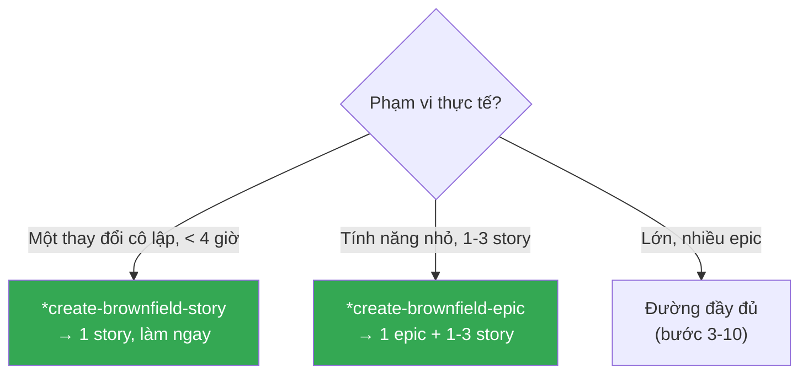
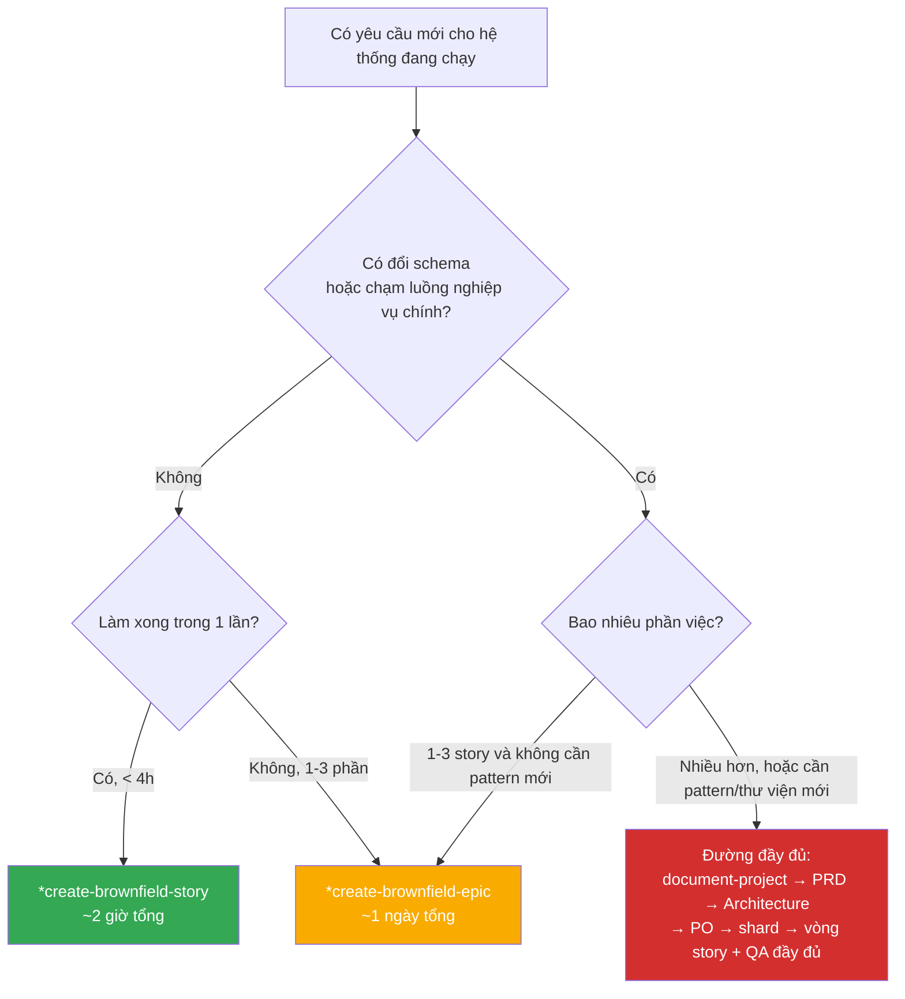

[⬅ Bước trước](./10-qa-review.md) · [Chỉ mục](./README.md) · [Bước sau ➡](./12-tong-ket-so-do.md)

# Bước 11 — Hai lối tắt cho thay đổi nhỏ 🔴

Bước 3–10 là đường đầy đủ: `document-project` → PRD → Architecture → PO → shard → story → QA → dev → QA. Với một enhancement lớn, đó là đầu tư đúng.

Nhưng **phần lớn công việc brownfield hằng ngày không lớn như vậy**. Đó là lý do workflow có hai lối thoát sớm ở [bước 2](./02-phan-loai-va-dinh-tuyen.md).

## Bảng chọn lối



| | `brownfield-create-story` | `brownfield-create-epic` | Đường đầy đủ |
|---|---|---|---|
| Thời lượng ước tính | < 4 giờ | 1–3 story | nhiều epic |
| Cần PRD? | ❌ | ❌ | ✅ |
| Cần Architecture? | ❌ | ❌ | ✅ nếu có pattern mới |
| Cần `document-project`? | ❌ nếu đã hiểu vùng đó | ❌ nếu tài liệu đủ | ✅ nếu tài liệu thiếu |
| Thời gian lập kế hoạch | ~15 phút | ~45 phút | 1–2 ngày |

---

## Lối tắt 1 — `*create-brownfield-story` cho một thay đổi cô lập

### Tình huống thật

> *"Trang chi tiết khách hàng không hiện tổng số đơn hàng của khách. Nhân viên phải đếm tay. Thêm một dòng 'Tổng số đơn: N' vào trang đó."*

Phân tích: đọc dữ liệu đã có (`orders` với `customerId`), thêm một dòng vào view. Không đổi schema, không đổi API, không chạm luồng nghiệp vụ.

⇒ **Single story, < 4 giờ.**

### Khi nào dùng task này

Từ `bmad-core/tasks/brownfield-create-story.md`:

- Sửa lỗi hoặc tính năng rất nhỏ
- Thay đổi rất cô lập
- **Không có tác động kiến trúc**
- Đường triển khai rõ ràng

### Lệnh

```text
👤 Bạn: @pm

🤖 Xin chào! Tôi là John 📋 — Product Manager.

👤 Bạn: *create-brownfield-story
   Yêu cầu: thêm dòng "Tổng số đơn hàng: N" vào trang chi tiết khách hàng.
```

### Diễn biến — Bước 1: Quick Project Assessment

```text
🤖 Đang nạp .bmad-core/tasks/brownfield-create-story.md...

   Trước khi tạo story, tôi cần đánh giá nhanh 5 điều:

   1. Chức năng liên quan hiện có nằm ở đâu?
   2. Công nghệ dùng ở vùng đó?
   3. Điểm chạm với hệ thống là gì?
   4. Pattern nào phải theo?
   5. Có tài liệu nào về vùng này?

👤 Bạn:
   1. views/customers/detail.ejs và routes/customers.js
   2. EJS + Mongoose 5, không có jQuery ở trang này
   3. Chỉ đọc collection orders, đếm theo customerId
   4. Route handler render EJS với object data — xem routes/customers.js:20
   5. Có docs/brownfield-architecture.md

🤖 Đủ thông tin. Đây thực sự là thay đổi cô lập:
   ✓ Chỉ đọc dữ liệu, không ghi
   ✓ Không đổi schema, không đổi API
   ✓ Không chạm luồng đặt hàng
   ✓ Có pattern rõ để theo

   ⚠️ Một lưu ý: `orders` hiện có ~31.000 document. `countDocuments({ customerId })`
     cần index trên `customerId`. Tôi sẽ đưa việc kiểm index vào story.
```

### File sinh ra

📂 `docs/stories/hien-tong-so-don-tren-trang-khach-hang.md`

```markdown
# Story: Hiển thị tổng số đơn hàng trên trang chi tiết khách hàng

## Status: Draft

## User Story
As một nhân viên bán hàng,
I want thấy tổng số đơn hàng của khách ngay trên trang chi tiết khách hàng,
So that tôi biết ngay khách này mua nhiều hay ít mà không phải đếm tay.

## Story Context

**Existing System Integration:**
- Integrates with: `routes/customers.js` (route `GET /customers/:id`) và
  `views/customers/detail.ejs`
- Technology: Express 4 route handler + Mongoose 5 + EJS 3
- Follows pattern: route handler truy vấn dữ liệu rồi `res.render('...', { data })`
  — xem `routes/customers.js:20`
- Touch points:
  - đọc collection `orders` với filter `{ customerId }`
  - thêm một biến vào object truyền cho view
  - thêm một dòng HTML trong `detail.ejs`

## Acceptance Criteria

**Functional:**
1. Trang `GET /customers/:id` hiện dòng "Tổng số đơn hàng: N" với N là số đơn
   của khách đó.
2. Khách chưa có đơn nào hiện "Tổng số đơn hàng: 0" (không phải rỗng hay lỗi).

**Integration:**
3. Mọi thông tin hiện có trên trang chi tiết khách hàng vẫn hiển thị đúng như trước.
4. Không thêm truy vấn nào cho các trang khác; chỉ trang chi tiết khách bị ảnh hưởng.

**Quality:**
5. Truy vấn đếm dùng index — kiểm bằng `explain()`, không được `COLLSCAN` trên
   31.000 document.
6. Thời gian tải trang chi tiết khách hàng không tăng quá 50ms so với hiện tại.

## Technical Notes

- **Integration Approach**: thêm `Order.countDocuments({ customerId: req.params.id })`
  vào route handler hiện có, truyền `orderCount` vào object render. Thêm một
  dòng `<p>` trong `detail.ejs`.
- **Existing Pattern Reference**: `routes/customers.js:20` — pattern
  `const customer = await Customer.findById(...); res.render('customers/detail', { customer })`
- **Key Constraints**:
  - ⚠️ Kiểm index trên `orders.customerId`. Nếu chưa có, thêm index là **một
    phần của story này** (nếu không, mỗi lần mở trang sẽ quét 31.000 document)
  - Không đổi cấu trúc object `customer` truyền cho view (view đang dùng nhiều field)
  - EJS thuần, không thêm jQuery vào trang này

## Definition of Done
- [ ] AC 1–6 đạt
- [ ] Đã kiểm `explain()` xác nhận dùng index
- [ ] Đã đo thời gian tải trang trước/sau
- [ ] Kiểm tay: trang chi tiết khách hàng vẫn hiển thị đủ thông tin cũ
- [ ] Kiểm tay: khách không có đơn hiện 0

## Risk and Compatibility Check

**Minimal Risk Assessment:**
- **Primary Risk**: truy vấn đếm không dùng index ⇒ mỗi lần mở trang quét
  31.000 document ⇒ trang chậm, DB tải cao
- **Mitigation**: kiểm `explain()` trước khi coi là xong; thêm index nếu thiếu
- **Rollback**: revert 2 file (`routes/customers.js`, `views/customers/detail.ejs`).
  Nếu đã thêm index thì **giữ index** — nó vô hại và có ích cho các truy vấn khác.

**Compatibility Verification:**
- [x] Không có breaking change với API hiện có (không chạm `/api/*`)
- [x] Thay đổi database: **chỉ thêm index**, không đổi schema, không đổi dữ liệu
- [x] UI thay đổi theo đúng pattern hiện có (một dòng `<p>` trong khối thông tin)
- [x] Tác động hiệu năng không đáng kể **nếu** có index (AC5, AC6 kiểm điều này)
```

### Bước 4 của task — Validation Checklist

```text
🤖 ## Validation Checklist

   **Scope Validation:**
   - [x] Story hoàn thành được trong một lần làm việc (ước tính 1–2 giờ)
   - [x] Cách tích hợp là trực tiếp, theo pattern có sẵn
   - [x] Theo đúng pattern hiện có
   - [x] Không cần thiết kế hay nghiên cứu kiến trúc

   **Clarity Check:**
   - [x] Yêu cầu story rõ ràng, không nhập nhằng
   - [x] Điểm tích hợp được nêu rõ (file:dòng)
   - [x] Cách thành công là kiểm được (explain() + đo thời gian)
   - [x] Cách rollback đơn giản, khả thi

   ✅ Story hợp lệ cho lối single-story. Bạn có thể triển khai ngay.
```

### Vòng làm việc rút gọn

```text
👤 Bạn: [đọc story, đổi Status: Draft → Approved]

👤 [CHAT MỚI] @dev → *develop-story docs/stories/hien-tong-so-don-tren-trang-khach-hang.md

🤖 [Dev nạp: dev.md + core-config + 3 file devLoadAlwaysFiles + story]

   ─── Kiểm index trước tiên (AC5) ───
   $ mongo banhang --eval "db.orders.getIndexes()"
   [ { v: 2, key: { _id: 1 }, name: '_id_' } ]
   ⚠️ KHÔNG có index trên customerId ⇒ phải thêm, theo Key Constraints của story

   $ mongo banhang --eval "db.orders.createIndex({ customerId: 1 })"
   ✓ created

   $ mongo banhang --eval "db.orders.find({customerId: ObjectId('...')}).explain('executionStats').executionStats.executionStages.stage"
   IXSCAN   ← ✓ không phải COLLSCAN

   ─── routes/customers.js — diff +2 dòng ───
   ```js
   const customer = await Customer.findById(req.params.id);
   const orderCount = await Order.countDocuments({ customerId: req.params.id });   // + mới
   res.render('customers/detail', { customer, orderCount });                        // + orderCount
   ```
   ⚠️ Cần `require('../models/Order')` ở đầu file — kiểm: đã có sẵn ✓

   ─── views/customers/detail.ejs — diff +1 dòng ───
   ```html
   <p>Tổng số đơn hàng: <%= orderCount %></p>
   ```

   ─── Đo hiệu năng (AC6) ───
   Trước: 210ms · Sau: 218ms · Chênh: +8ms (ngưỡng 50ms) ✓

   ─── Kiểm tay ───
   ✓ Khách có 14 đơn → hiện "Tổng số đơn hàng: 14"
   ✓ Khách mới, 0 đơn → hiện "Tổng số đơn hàng: 0"
   ✓ Mọi thông tin cũ trên trang vẫn đủ

   → Status: Ready for Review

👤 [CHAT MỚI] @qa → *review docs/stories/hien-tong-so-don-tren-trang-khach-hang.md

🤖 ## Đánh giá độ sâu — 5 dấu hiệu
   Không dấu hiệu nào chạm ngưỡng (không auth, có kiểm tay, diff 3 dòng,
   không gate trước, 6 AC nhưng đơn giản)
   ⇒ Review nhẹ, đúng nguyên tắc "stay concise when low risk"

   ✓ Diff 3 dòng — tối thiểu tuyệt đối
   ✓ Index được thêm và verify bằng explain() — đúng cách
   ✓ Không breaking change (không chạm /api/*)
   ✓ Hiệu năng +8ms, trong ngưỡng
   ⚠️ Không có test tự động — nhưng story này ở view layer, dự án chưa có e2e
     framework. Kiểm tay được ghi nhận đầy đủ.

   Áp thuật toán gate:
   1. Risk — không chạy *risk (đúng, story rủi ro thấp) ⇒ bỏ qua
   2. Test coverage — không chạy *design ⇒ không có hợp đồng P0
   3. Issue severity — TEST-001 (không có test tự động): **low**
   4. NFR — security PASS (chỉ đọc) · performance PASS (+8ms) ·
      reliability PASS · maintainability PASS
   ⇒ **gate = PASS**, quality_score = 100

   Ghi nhận: index `{ customerId: 1 }` mới thêm cũng có lợi cho story 1.3 của
   epic loyalty (tích điểm cần tra đơn theo khách). Tác dụng phụ tích cực.
```

```bash
git add -A
git commit -m "feat: hiện tổng số đơn hàng trên trang chi tiết khách hàng

- routes/customers.js: +2 dòng (countDocuments + truyền orderCount)
- views/customers/detail.ejs: +1 dòng
- Thêm index orders.customerId (verify IXSCAN, không COLLSCAN)
- Hiệu năng: 210ms → 218ms (ngưỡng 50ms)
- Breaking changes: 0

Story: docs/stories/hien-tong-so-don-tren-trang-khach-hang.md
QA Gate: PASS"
```

### Tổng chi phí lối tắt 1

| | Đường đầy đủ | Lối tắt single story |
|---|---|---|
| Tài liệu tạo ra | brownfield-arch + PRD + Architecture + shard | **1 file story** |
| Số chat | 4–7 | **3** |
| Thời gian lập kế hoạch | 1–2 ngày | **~15 phút** |
| Lệnh QA | risk + design + trace + nfr + review | **review** |
| Tổng thời gian | vài ngày | **~2 giờ** |

---

## Lối tắt 2 — `*create-brownfield-epic` cho tính năng nhỏ

### Tình huống thật

> *"Cho phép xuất danh sách đơn hàng của một tháng ra file CSV để kế toán đối chiếu."*

Phân tích: cần thêm nút trên UI, thêm endpoint sinh CSV, và xử lý trường hợp nhiều đơn (phân trang/streaming). Khoảng 2–3 phần việc. Không đổi schema, không chạm luồng đặt hàng.

⇒ **Small feature, 1–3 story.**

### Khi nào dùng task này

Từ `bmad-core/tasks/brownfield-create-epic.md`:

- Enhancement hoàn thành được trong **1–3 story**
- **Không cần** thay đổi kiến trúc đáng kể
- Theo pattern có sẵn
- Rủi ro tích hợp tối thiểu
- Hệ thống hiện tại ổn định và có tài liệu

**KHÔNG dùng khi**: cần thiết kế kiến trúc · cần nhiều story phối hợp · có yêu cầu tích hợp mới phức tạp.

### Lệnh

```text
👤 Bạn: @pm → *create-brownfield-epic
   Yêu cầu: xuất danh sách đơn hàng của một tháng ra CSV.
```

### File sinh ra

📂 `docs/epic-xuat-csv-don-hang.md`

```markdown
# Epic: Xuất danh sách đơn hàng ra CSV

## Epic Goal
Kế toán tải được file CSV danh sách đơn hàng của một tháng để đối chiếu, không
phải copy tay từ trang web.

## Epic Description

**Existing System Context:**
- Chức năng liên quan hiện có: trang `/orders` hiển thị danh sách đơn có bộ lọc
  theo tháng (`routes/orders.js:45`)
- Technology stack: Express 4, Mongoose 5, EJS, không có thư viện CSV
- Integration points: route `GET /api/orders` đã có logic lọc theo tháng —
  tái dùng được

**Enhancement Details:**
- Thêm gì: endpoint `GET /orders/export?month=YYYY-MM` trả file CSV; nút "Xuất
  CSV" trên trang `/orders`
- Tích hợp thế nào: tái dùng logic lọc tháng có sẵn; thêm một hàm chuyển đổi
  document → dòng CSV; set header `Content-Disposition` để browser tải file
- Tiêu chí thành công: kế toán tải được file, mở bằng Excel không lỗi encoding,
  số dòng khớp số đơn trên trang

## Stories

1. **Story 1**: Thêm endpoint xuất CSV — tái dùng logic lọc tháng, sinh CSV với
   7 cột (mã đơn, ngày, khách, SĐT, tổng tiền, trạng thái, số món), có BOM UTF-8
   để Excel đọc đúng tiếng Việt
2. **Story 2**: Thêm nút "Xuất CSV" trên trang `/orders`, giữ bộ lọc tháng đang chọn
3. **Story 3**: Xử lý tháng có nhiều đơn — stream response thay vì gom hết vào
   bộ nhớ (VPS chỉ 1GB RAM)

## Compatibility Requirements
- [x] API hiện có không đổi — chỉ **thêm** route mới `/orders/export`
- [x] Không đổi schema database
- [x] UI thay đổi theo pattern hiện có (nút trong khối bộ lọc đang có)
- [x] Tác động hiệu năng tối thiểu — endpoint mới không ảnh hưởng route cũ

## Risk Mitigation
- **Primary Risk**: tháng có nhiều đơn (tháng cao điểm ~2.800 đơn) làm cạn RAM
  khi gom hết vào một mảng trên VPS 1GB
- **Mitigation**: Story 3 dùng cursor của Mongoose và stream từng dòng ra response;
  test với dữ liệu 3.000 đơn
- **Rollback Plan**: xoá route mới + xoá nút trên view. Không có thay đổi dữ liệu
  nào cần hoàn nguyên.

## Definition of Done
- [ ] 3 story hoàn thành với AC đạt
- [ ] Chức năng hiện có được verify qua test: trang `/orders` và
      `GET /api/orders` không đổi hành vi
- [ ] Điểm tích hợp hoạt động đúng: bộ lọc tháng trên UI và trong export cho
      cùng kết quả
- [ ] Tài liệu cập nhật: thêm endpoint mới vào danh sách endpoint trong
      `docs/brownfield-architecture.md`
- [ ] Không có regression trong chức năng hiện có (chạy `npm test`)

## Validation Checklist

**Scope Validation:**
- [x] Epic hoàn thành được trong 3 story
- [x] Không cần thay đổi kiến trúc
- [x] Enhancement theo pattern hiện có
- [x] Độ phức tạp tích hợp có thể quản lý

**Risk Assessment:**
- [x] Rủi ro với hệ thống hiện có ở mức thấp
- [x] Có kế hoạch rollback
- [x] Cách test phủ cả chức năng hiện có
- [x] Đội có đủ hiểu biết về vùng tích hợp này

**Completeness Check:**
- [x] Mục tiêu epic rõ và khả thi
- [x] Story có phạm vi hợp lý
- [x] Yêu cầu thành công kiểm được
- [x] Đã nêu phụ thuộc (Story 2 cần Story 1; Story 3 cải tiến Story 1)
```

### Bước 4 của task — Handoff to Story Manager

```text
🤖 ## Handoff to Story Manager

   Gửi tới SM (hoặc bạn tự làm nếu tự triển khai):

   > Vui lòng phát triển story chi tiết cho epic này. Ngữ cảnh quan trọng:
   >
   > - Đây là enhancement cho hệ thống đang chạy: **BanHang** (Express 4 +
   >   Mongoose 5 + EJS, Node 16)
   > - Điểm tích hợp: `routes/orders.js:45` (logic lọc theo tháng — TÁI DÙNG,
   >   không viết lại), `views/orders/list.ejs` (khối bộ lọc)
   > - Pattern hiện có phải theo: route handler async, `res.render` cho view,
   >   `res.json` cho API; xem `docs/architecture/coding-standards.md` nếu đã có
   > - Yêu cầu tương thích then chốt: **chỉ THÊM** route mới, không sửa
   >   `GET /api/orders` (app mobile đang dùng)
   > - Ràng buộc hạ tầng: VPS 1GB RAM ⇒ Story 3 phải stream, không gom mảng
   >
   > Epic phải giữ **tính toàn vẹn của hệ thống hiện có** trong suốt quá trình.
```

### Vòng làm việc

Từ đây bạn vào vòng story bình thường, nhưng **không có PRD và Architecture**:

```text
@sm → *draft        (SM đọc docs/epic-xuat-csv-don-hang.md thay cho docs/prd/epic-*.md)
@dev → *develop-story
@qa → *review
```

⚠️ **Lưu ý về `create-next-story`**: task này mặc định tìm epic theo `epicFilePattern: epic-{n}*.md` trong `prdShardedLocation`. Với lối tắt epic, file epic của bạn nằm ở `docs/epic-xuat-csv-don-hang.md` — **không khớp mẫu**. Hai cách xử lý:

```text
Cách A: đặt tên file khớp mẫu và đúng chỗ
        docs/prd/epic-2-xuat-csv-don-hang.md

Cách B: chỉ đường dẫn tường minh cho SM
        👤 "@sm tạo story đầu tiên từ docs/epic-xuat-csv-don-hang.md"
```

Demo dùng **cách B** vì lối tắt epic không có `docs/prd/`.

---

## Bảng quyết định nhanh — dùng hằng ngày



## Ba dấu hiệu bạn đã chọn sai lối

| Dấu hiệu | Nghĩa là | Làm gì |
|---|---|---|
| Đang làm lối single-story mà Dev **HALT 2 lần** vì thiếu thông tin | Phạm vi lớn hơn bạn tưởng | Dừng, quay lại `*create-brownfield-epic` hoặc đường đầy đủ |
| Đang làm đường đầy đủ mà PRD chỉ có **1 story** | Phạm vi nhỏ hơn bạn tưởng | Bỏ PRD, dùng `*create-brownfield-story` |
| Lối tắt epic mà story thứ 2 cần **đổi schema** | Vượt tiêu chí "không thay đổi kiến trúc" | Nâng lên đường đầy đủ, ít nhất là làm Architecture |

⚠️ **Sai lối tốn kém hơn bạn nghĩ**: chọn lối tắt cho việc lớn dẫn tới Dev tự quyết định kiến trúc mà không có ai review — và với brownfield, quyết định kiến trúc sai có thể phá hệ thống đang chạy.

## Bạn tự làm gì ở bước này

- [ ] Trước mỗi yêu cầu mới: chạy bảng quyết định ở trên, **đừng mặc định đường đầy đủ**
- [ ] Với lối single-story: vẫn phải có **Risk and Compatibility Check** và **Rollback** — task đã ép sẵn
- [ ] Với lối epic: đọc **Validation Checklist** — nếu có mục nào không tick được, bạn đã chọn sai lối
- [ ] Với lối epic: quyết định đặt file epic ở đâu để SM tìm được (cách A hoặc B ở trên)
- [ ] Nếu Dev HALT nhiều lần: dừng lại và nâng lối, đừng cố chữa cháy

---

[⬅ Bước trước](./10-qa-review.md) · [Chỉ mục](./README.md) · [Bước sau: tổng kết ➡](./12-tong-ket-so-do.md)
