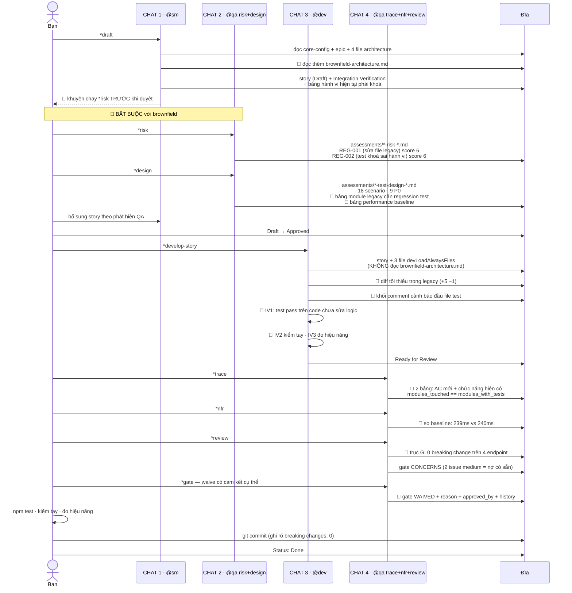

[⬅ Bước trước](./11-loi-tat-thay-doi-nho.md) · [Chỉ mục](./README.md)

# Bước 12 — Tổng kết: sơ đồ, bảng tra, bài học brownfield

File này là **bản đồ một trang** của demo brownfield. Nếu bạn chỉ đọc một file, đọc file này.

---

## 1. Toàn bộ hành trình trên một sơ đồ

```mermaid
flowchart TD
    START(["Yêu cầu: thêm 'Khách hàng thân thiết'<br/>vào hệ thống 3 năm, 0 test, 0 tài liệu"]) --> S1

    S1["<b>npx bmad-method install</b> + <b>flatten</b><br/>+ git tag + mongodump + đo baseline 240ms"]

    S1 --> S2{"<b>@analyst</b> phân loại phạm vi"}
    S2 -->|"&lt; 4h"| R1["*create-brownfield-story → xong sau ~2h"]
    S2 -->|"1-3 story"| R2["*create-brownfield-epic → xong sau ~1 ngày"]
    S2 -->|"major ✅"| S3{"Tài liệu đủ chưa?"}

    S3 -->|"Đủ"| S5
    S3 -->|"Không ✅"| S4["<b>@architect *document-project</b><br/>→ brownfield-architecture.md<br/>7 nợ kỹ thuật · 4 gotcha · 8 endpoint<br/>🔴 PHÁT HIỆN: tính tiền 3 chỗ khác nhau = BUG"]

    S4 --> S5["<b>@pm *create-brownfield-prd</b><br/>→ prd.md<br/>6 FR · 4 NFR · <b>4 CR tương thích</b><br/>+ Risk Assessment · 5 story có <b>Integration Verification</b>"]

    S5 --> S6{"Cần Architecture riêng?"}
    S6 -->|"Chỉ pattern có sẵn"| S8
    S6 -->|"Có tầng service mới ✅"| S7["<b>@architect *create-brownfield-architecture</b><br/>so sánh 3 phương án tích hợp<br/>+ <b>Rollback 4 mức</b> + Critical Integration Rules"]

    S7 --> S8["<b>@po *execute-checklist-po</b><br/>🔴 §7 RISK MANAGEMENT hoạt động<br/>bắt được: migration chưa kiểm chứng<br/>+ chưa liên lạc bên app mobile"]
    S8 -->|"91% — 3 việc"| S5
    S8 -->|"100%"| S9["<b>@po *shard-doc</b> ×2<br/>(KHÔNG shard brownfield-architecture.md)"]

    subgraph LOOP["Vòng story brownfield — 4 chat"]
        S10["CHAT 1 · <b>@sm *draft</b><br/>đọc thêm brownfield-architecture.md<br/>→ story ghi rõ HÀNH VI HIỆN TẠI phải khoá"]
        S11["CHAT 2 · <b>@qa *risk + *design</b> 🔴 BẮT BUỘC<br/>REG-001, REG-002 score 6<br/>18 scenario · 9 P0 · bảng regression legacy"]
        S12["Bạn duyệt → Approved"]
        S13["CHAT 3 · <b>@dev *develop-story</b><br/>diff legacy +5 −1 · feature flag OFF<br/>IV1: 18/18 pass trên code chưa sửa"]
        S14["CHAT 4 · <b>@qa *trace *nfr *review</b><br/>2 bảng trace · so baseline 239/240ms<br/>trục G: 0 breaking change"]
        S15["gate CONCERNS → <b>WAIVED</b> có cam kết"]
        S16["Bạn: regression + kiểm tay + đo → COMMIT → Done"]
        S10 --> S11 --> S12 --> S13 --> S14 --> S15 --> S16
    end

    S9 --> S10
    S16 -->|"còn story"| S10
    S16 -->|"hết 5 story"| END(["Tính năng chạy · hệ thống cũ nguyên vẹn<br/>+ 18 test đầu tiên của dự án"])

    style S4 fill:#f9ab00,color:#fff
    style S8 fill:#f9ab00,color:#fff
    style S11 fill:#d32f2f,color:#fff
    style S15 fill:#f9ab00,color:#fff
    style END fill:#34a853,color:#fff
```



---

## 2. Sổ đăng ký artifact brownfield

🔴 = chỉ có ở brownfield

| Artifact | Tạo bởi | Đọc bởi | Sửa bởi |
|----------|---------|---------|---------|
| 🔴 `flattened-codebase.xml` | `npx bmad-method flatten` | agent trên web UI | tạo lại khi cần |
| 🔴 `docs/brownfield-architecture.md` | architect `*document-project` | pm · architect · **sm** · qa `*risk` · bạn | architect |
| `docs/prd.md` | pm `*create-brownfield-prd` | architect · po · *(shard → sm)* | pm |
| `docs/architecture.md` | architect `*create-brownfield-architecture` | po · *(shard → sm, dev)* | architect |
| `architecture/coding-standards.md` | md-tree | sm · **dev (mọi task)** · qa | — |
| 🔴 …mục **Critical Integration Rules** trong đó | architect | **dev** | architect |
| 🔴 `architecture/infrastructure-*.md` mục **Rollback Strategy** | architect | bạn (khi deploy) · qa | architect |
| `docs/stories/*.md` | **sm** | dev · qa · sm (story sau) · bạn | sm · dev · qa · bạn *(theo section)* |
| 🔴 …mục **Integration Verification** trong story | sm | dev (phải chứng minh) · qa | sm |
| 🔴 …mục **Hành vi HIỆN TẠI phải khoá lại** | sm | **dev** | sm |
| 🔴 Khối comment cảnh báo đầu file regression test | **dev** | người/agent sau này | dev |
| `qa/assessments/*-risk-*.md` | qa `*risk` | qa `*review` · dev | qa |
| 🔴 …mục **Regression Risk** trong đó | qa | bạn · dev | qa |
| `qa/assessments/*-test-design-*.md` | qa `*design` | qa `*trace` · dev | qa |
| 🔴 …bảng **Existing Functionality Requiring Regression Tests** | qa | dev | qa |
| 🔴 …bảng **Performance Baseline to Maintain** | qa | qa `*nfr` · dev | qa |
| `qa/gates/*.yml` | **qa** | dev · bạn | **chỉ qa** |
| 🔴 …khối `evidence.existing_functionality` | qa | bạn | qa |
| 🔴 …khối `waiver` với `reason` + `approved_by` | qa (theo quyết định của bạn) | bạn · đội | qa |
| 🔴 git tag `pre-*-baseline` + mongodump | **bạn** | bạn (khi rollback) | bạn |
| 🔴 Số đo baseline hiệu năng | **bạn** | qa `*design` · qa `*nfr` | bạn |

---

## 3. Bảng so sánh: greenfield vs brownfield, từng bước

| Bước | Greenfield ([demo](../demo/README.md)) | Brownfield (demo này) |
|------|---------------------------------------|----------------------|
| **Chuẩn bị** | cài BMad | cài BMad + **flatten** + **git tag** + **dump DB** + **đo baseline** |
| **Bước 1** | `@analyst *brainstorm` | 🔴 **phân loại phạm vi + định tuyến 3 nhánh** |
| **Bước 2** | `*create-project-brief` | 🔴 **`*document-project`** — nắm thực trạng |
| **PRD** | `prd-tmpl` — FR/NFR/epic | `brownfield-prd-tmpl` — **+ CR tương thích + Risk Assessment + Integration Verification mỗi story** |
| **UX** | `*create-front-end-spec` đầy đủ | mục **UI Enhancement Goals** trong PRD — tích hợp với UI cũ |
| **Architecture** | thiết kế lý tưởng, 21 section | **cặp existing│new mỗi section** + **Rollback Strategy** + **Critical Integration Rules** |
| **Quyết định** | luôn cần Architecture | 🔴 **`architecture_decision`** — có thể bỏ nếu chỉ theo pattern cũ |
| **PO checklist** | §7 = N/A | 🔴 **§7 RISK MANAGEMENT hoạt động** |
| **Shard** | prd + architecture | prd + architecture; **không** shard `brownfield-architecture.md` |
| **SM đọc** | epic + 4–12 file architecture | **+ `brownfield-architecture.md`** để biết hành vi hiện tại |
| **Story có** | AC + Tasks + Dev Notes | **+ Integration Verification + bảng hành vi hiện tại phải khoá** |
| **QA trước code** | tuỳ chọn | 🔴 **`*risk` + `*design` gần như bắt buộc** |
| **Risk scoring** | 6 nhóm chuẩn | **+ công thức brownfield**: regression = điểm tích hợp × tuổi code |
| **Test** | test cho tính năng mới | **+ regression test cho mọi module legacy bị chạm** |
| **Dev kỷ luật** | code sạch | **+ diff tối thiểu trong file legacy, không "dọn dẹp"** |
| **Feature flag** | ít cần | 🔴 **gần như bắt buộc** nếu không có staging |
| **`*trace`** | 1 bảng: AC ↔ test | **2 bảng: + chức năng hiện có phải bảo toàn** |
| **`*nfr`** | so ngưỡng trong AC | **+ so baseline đã đo trước** |
| **`*review`** | 6 trục | **+ trục G: API Breaking Changes** |
| **Gate** | PASS/CONCERNS/FAIL | **WAIVED dùng thường** — chấp nhận nợ legacy có cam kết |
| **Deploy** | CI/CD | 🔴 **3 pha: deploy tắt → migrate → bật** |
| **Trước khi Done** | test + lint pass | **+ kiểm tay phần không có test + đo lại hiệu năng** |

---

## 4. Sơ đồ một vòng story brownfield



---

## 5. Mười cơ chế brownfield đã thấy hoạt động

| # | Cơ chế | Xuất hiện ở | Nó ngăn điều gì |
|---|--------|-------------|-----------------|
| 1 | **Phân loại phạm vi + định tuyến 3 nhánh** | [02](./02-phan-loai-va-dinh-tuyen.md) | Làm PRD 2 ngày cho việc 30 phút |
| 2 | **`documentation_check`** — bỏ qua `document-project` nếu tài liệu đủ | [02](./02-phan-loai-va-dinh-tuyen.md) | Tài liệu hoá lại thứ đã có tài liệu |
| 3 | **`*document-project` ghi THỰC TRẠNG, không phải lý tưởng** | [03](./03-document-project.md) | Sửa code dựa trên giả định sai; phát hiện được bug VAT 3 chỗ |
| 4 | **Compatibility Requirements (CR)** | [04](./04-pm-brownfield-prd.md) | "Đừng làm vỡ" từ lời nhắc mơ hồ thành 4 yêu cầu kiểm được |
| 5 | **Integration Verification mỗi story** | [04](./04-pm-brownfield-prd.md), [07](./07-story-sm.md) | Chỉ kiểm tính năng mới mà không kiểm tính năng cũ |
| 6 | **Rollback Strategy 4 mức + Feature flag** | [05](./05-architect-brownfield.md) | Không có cách tắt nhanh khi sự cố trên production không staging |
| 7 | **§7 RISK MANAGEMENT của PO** | [06](./06-po-validate-va-shard.md) | Bỏ qua việc con người phải làm (liên lạc bên tích hợp, kiểm chứng migration) |
| 8 | **Bảng "hành vi hiện tại phải khoá lại" trong story** | [07](./07-story-sm.md) | Dev viết test theo hành vi *nó cho là đúng* rồi "sửa" code cho khớp |
| 9 | **Brownfield risk scoring + `*design` bảng regression** | [08](./08-qa-risk-design.md) | Bỏ sót regression test cho module legacy bị chạm |
| 10 | **Trục G API Breaking Changes + gate WAIVED có cam kết** | [10](./10-qa-review.md) | Phá consumer bên ngoài; hoặc chặn story vì nợ không phải lỗi của nó |

---

## 6. Bảy chỗ dễ làm sai nhất — riêng brownfield

| # | Sai | Dấu hiệu nhận biết | Sửa |
|---|-----|-------------------|-----|
| 1 | **Bỏ qua `*document-project`** vì "tôi hiểu hệ thống rồi" | Dev HALT liên tục vì thiếu thông tin; phát hiện gotcha khi đã deploy | Chạy nó. `working-in-the-brownfield.md`: *"Even if you think you know the codebase"* |
| 2 | **Viết PRD greenfield cho dự án brownfield** | PRD không có Compatibility Requirements, story không có Integration Verification | Dùng `brownfield-prd-tmpl`, không phải `prd-tmpl` |
| 3 | **Để agent "làm đẹp" tài liệu thực trạng** | `brownfield-architecture.md` viết "hệ thống tuân theo MVC rõ ràng" trong khi logic nằm hết trong route | Yêu cầu sửa; tài liệu phải phản ánh **REALITY including technical debt** |
| 4 | **Test khoá sai hành vi** | Dev "chuẩn hoá" tên field trong test; IV1 fail nhưng Dev sửa code thay vì sửa test | IV1 là bước bắt buộc: test phải pass trên code **chưa sửa logic** |
| 5 | **Dev "dọn dẹp" file legacy** | Diff trong file legacy là +80 −40 thay vì +5 −1 | Yêu cầu diff tối thiểu; refactor là story riêng |
| 6 | **Waive gate mà không có cam kết** | `reason: "sẽ sửa sau"` | Cam kết phải cụ thể: *"MNT-001 xử lý trước story 1.5"* |
| 7 | **Deploy một pha** | git pull + restart + bật tính năng cùng lúc | 3 pha: deploy tắt → migrate → bật. Mỗi pha kiểm riêng |

---

## 7. Năm việc phải làm trước khi bắt đầu enhancement brownfield thật

### 1. Tag git + dump DB + đo baseline hiệu năng

```bash
git status                       # phải sạch
git tag pre-<feature>-baseline && git push --tags
mongodump --uri="$URI" --out=./backup-$(date +%F)
# đo 3-5 endpoint quan trọng nhất, ghi lại số ms
```

Không có baseline, `*nfr` chỉ có thể nói *"Target unknown"* và bạn không biết mình có làm chậm hệ thống hay không.

### 2. Điền `technical-preferences.md` bằng **ràng buộc**, không phải mong muốn

Với brownfield, file này là **hàng rào**: nó ngăn Architect đề xuất "chuyển sang TypeScript + NestJS". Ghi rõ: phiên bản runtime bị khoá, thư viện không được đổi, deploy không có build step, RAM giới hạn. Xem mẫu ở [bước 1](./01-cai-dat-va-flatten.md#13-điền-technical-preferencesmd--với-ràng-buộc-của-hệ-thống-cũ).

### 3. Xác nhận với **mọi consumer** của API trước khi làm gì

Trong demo, việc gọi bên app mobile biến CR1 từ "bảo thủ vì không biết" thành "chính xác vì đã biết" — và §7 của PO checklist chính là chỗ bắt bạn làm việc này. Agent không làm được thay bạn.

### 4. Sửa `apply-qa-fixes.md` theo stack thật

File này viết cứng lệnh Deno (`deno lint`, `deno test -A`) và đường dẫn dự án khác (`deps.ts`, `src/core/di.ts`). Với BanHang phải là `npm test`. Không sửa ⇒ Dev chạy lệnh không tồn tại ở [bước 10](./10-qa-review.md) khi cần áp fix.

### 5. Bổ sung `dependencies.data` cho `qa.md`

`test-design.md` **yêu cầu** nạp `test-levels-framework.md` và `test-priorities-matrix.md`, nhưng `qa.md` chỉ khai báo `technical-preferences.md`. Với brownfield bạn dùng `*design` nhiều hơn ⇒ thiếu hai file này thì phân loại P0/P1 và chọn mức test sẽ không theo chuẩn.

```yaml
# bmad-core/agents/qa.md
dependencies:
  data:
    - technical-preferences.md
    - test-levels-framework.md      # thêm
    - test-priorities-matrix.md     # thêm
```

---

## 8. Con số của demo này

| Chỉ số | Giá trị |
|---|---|
| Story hoàn thành trong demo | 1/5 (story 1.1 làm chi tiết; 4 story còn lại theo cùng khuôn) |
| Tài liệu tạo ra trước khi code | 3 (brownfield-architecture · prd · architecture) + 22 file sharded |
| Nợ kỹ thuật được phát hiện | 7 |
| Gotcha được ghi lại | 4 |
| Bug được phát hiện mà chưa ai biết | 1 (tính tiền 3 chỗ, báo cáo lệch 10%) |
| Rủi ro regression được nhận diện trước khi code | 2 (score 6) |
| Test đầu tiên của dự án | 18 |
| Breaking change gây ra | **0** |
| Suy giảm hiệu năng | **0** (239ms vs baseline 240ms) |
| Diff trong file legacy | +5 −1 dòng |
| Số chat cho story 1.1 | 4 |
| Gate | CONCERNS → WAIVED (nợ có sẵn, có cam kết) |

🔴 **Điều đáng chú ý nhất**: sau story đầu tiên, người dùng **không thấy tính năng nào**. `LOYALTY_ENABLED=false`. Thứ bạn có là 18 test và một công tắc. Với brownfield, đó là kết quả **đúng** — bạn đã mua được quyền sửa code legacy một cách an toàn.

---

## 9. So sánh: có BMAD và không có BMAD, cho brownfield

| | Không có BMAD | Có BMAD (như demo) |
|---|---|---|
| Hiểu hệ thống | đọc code khi cần, giữ trong đầu | `brownfield-architecture.md`: 7 nợ + 4 gotcha + 8 endpoint, ghi lại được |
| Bug ẩn | phát hiện khi có sự cố | tìm ra bug VAT 3 chỗ **trong lúc tài liệu hoá** |
| Cái gì không được phá | "cẩn thận nhé" | 4 CR kiểm được + 8 contract test |
| Rủi ro regression | biết sau khi vỡ | REG-001, REG-002 chấm điểm **trước khi code** |
| Test cho legacy code | không có | regression test cho **mọi module bị chạm** |
| Hiệu năng | cảm giác | 239ms vs baseline 240ms, có số |
| Consumer bên ngoài | hy vọng không vỡ | xác nhận chính xác 2 endpoint + 5 field, khoá bằng test |
| Rollback | `git revert` và cầu nguyện | 4 mức, mức 1 dưới 1 phút |
| Nợ kỹ thuật | tích tụ vô hình | ghi trong gate `top_issues` + `monitor`, waive **có cam kết** |
| Bài học | mất theo hội thoại | Completion Notes → story sau → coding-standards |
| **Chi phí** | thấp lúc đầu, **rất cao khi vỡ production** | cao ở 3 bước đầu, thấp và **an toàn** về sau |

⚙️ Đánh đổi trung thực: với brownfield, phần "cao lúc đầu" nặng hơn greenfield — bạn phải bỏ ra `document-project` + PRD + Architecture trước khi viết dòng code đầu tiên. Nhưng cái bạn mua được cũng lớn hơn: **quyền sửa một hệ thống đang chạy mà không làm 12 người mất việc trong một buổi chiều**.

---

## 10. Đọc tiếp gì

| Bạn muốn | Đọc |
|---|---|
| Demo greenfield để so sánh | [`../demo/README.md`](../demo/README.md) |
| Hướng dẫn brownfield gốc của framework (606 dòng) | [`../docs/working-in-the-brownfield.md`](../docs/working-in-the-brownfield.md) |
| Chi tiết `document-project`, `brownfield-create-epic/story` | [`../docs/bmad-core-manual/05-tasks-tai-lieu.md`](../docs/bmad-core-manual/05-tasks-tai-lieu.md) · [`06-tasks-story.md`](../docs/bmad-core-manual/06-tasks-story.md) |
| Chi tiết 7 task QA và thuật toán gate | [`../docs/bmad-core-manual/07-tasks-qa.md`](../docs/bmad-core-manual/07-tasks-qa.md) |
| Công cụ flatten | [`../docs/flattener.md`](../docs/flattener.md) |
| Cấu trúc template brownfield | [`../docs/bmad-core-manual/08-templates.md`](../docs/bmad-core-manual/08-templates.md) |
| Chạy thủ công không cần cài đặt | [`../docs/bmad-core-manual/13-cong-thuc-van-hanh-thu-cong.md`](../docs/bmad-core-manual/13-cong-thuc-van-hanh-thu-cong.md) |
| 18 điểm không nhất quán trong repo | [`../docs/bmad-core-manual/14-tra-cuu-nhanh-va-canh-bao.md`](../docs/bmad-core-manual/14-tra-cuu-nhanh-va-canh-bao.md) |
| Luồng dữ liệu chi tiết ở mức trường/khoá | [`../docs/specs/04-luong-du-lieu-end-to-end.md`](../docs/specs/04-luong-du-lieu-end-to-end.md) |
| Tài nguyên của từng agent gom một chỗ | [`../bmad-core-by-agent/README.md`](../bmad-core-by-agent/README.md) |

---

[⬅ Bước trước](./11-loi-tat-thay-doi-nho.md) · [Chỉ mục demo brownfield](./README.md)
