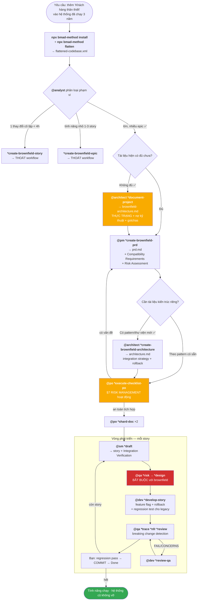

# DEMO BROWNFIELD — Kịch bản thêm tính năng vào hệ thống đang chạy

> **Đây là kịch bản MINH HOẠ**, không phải log của một lần chạy thật. Mọi **lệnh, đường dẫn file, quy tắc, ngưỡng số, tên section** đều tra đúng từ `bmad-core/` v4.44.2 và `docs/working-in-the-brownfield.md`. Phần **nội dung** (mã nguồn legacy, PRD, số liệu) là ví dụ tôi soạn để bạn hình dung.
>
> Nếu bạn chưa đọc [demo greenfield](../demo/README.md), nên đọc nó trước — demo này tập trung vào **những gì KHÁC** khi làm trên hệ thống đã tồn tại.

---

## Đề bài của demo

**BanHang** — hệ thống bán hàng nội bộ đã chạy production **3 năm**. Node 16 + Express 4 + MongoDB, frontend EJS + jQuery. **Không có test nào. README 5 dòng. Người viết đã rời công ty 8 tháng trước.**

Nhiệm vụ: thêm tính năng **"Khách hàng thân thiết"** — tích điểm theo đơn hàng, đổi điểm thành giảm giá.

Đây là `brownfield-fullstack` với phân loại **major enhancement**.

---

## Vì sao brownfield khác greenfield

| | Greenfield | Brownfield |
|---|---|---|
| Điểm bắt đầu | ý tưởng trong đầu bạn | **codebase bạn không hiểu hết** |
| Rủi ro chính | làm sai thứ cần làm | **làm vỡ thứ đang chạy** |
| Bước đầu tiên | `@analyst *brainstorm` | **`*document-project`** — nắm thực trạng |
| Tài liệu kiến trúc | thiết kế lý tưởng | **thực trạng, kể cả nợ kỹ thuật và chỗ chắp vá** |
| `*risk` của QA | tuỳ chọn | **gần như bắt buộc** — regression risk |
| Test | viết mới cho tính năng mới | **+ regression test cho legacy code bị chạm** |
| Mỗi story cần | AC + task | **+ rollback plan + feature flag + compatibility check** |
| Gate WAIVED | ít dùng | **dùng thường** — chấp nhận nợ của legacy code |
| PO checklist | §7 = N/A | **§7 RISK MANAGEMENT hoạt động** |

---

## Đọc theo thứ tự

| # | File | Bước | Lệnh chính | Kết quả |
|---|------|------|-----------|---------|
| 0 | [00-boi-canh.md](./00-boi-canh.md) | Hệ thống hiện có & điều bạn KHÔNG biết | — | 18k dòng code, 0 test, 0 tài liệu |
| 1 | [01-cai-dat-va-flatten.md](./01-cai-dat-va-flatten.md) | Cài + làm phẳng codebase | `npx bmad-method install` · `npx bmad-method flatten` | `.bmad-core/` + `flattened-codebase.xml` |
| 2 | [02-phan-loai-va-dinh-tuyen.md](./02-phan-loai-va-dinh-tuyen.md) | Phân loại phạm vi & định tuyến | `@analyst` classify | 3 nhánh → chọn **major enhancement** |
| 3 | [03-document-project.md](./03-document-project.md) | **Nắm thực trạng** | `@architect` → `*document-project` | `docs/brownfield-architecture.md` — nợ kỹ thuật + gotchas |
| 4 | [04-pm-brownfield-prd.md](./04-pm-brownfield-prd.md) | PRD cho enhancement | `@pm` → `*create-brownfield-prd` | `docs/prd.md` — có Compatibility Requirements + Risk Assessment |
| 5 | [05-architect-brownfield.md](./05-architect-brownfield.md) | Kiến trúc tích hợp | `@architect` → `*create-brownfield-architecture` | `docs/architecture.md` — integration strategy + rollback |
| 6 | [06-po-validate-va-shard.md](./06-po-validate-va-shard.md) | Chốt kiểm an toàn tích hợp | `@po` → `*execute-checklist-po` → `*shard-doc` | §7 RISK MANAGEMENT hoạt động |
| 7 | [07-story-sm.md](./07-story-sm.md) | SM tạo story 1.1 | `@sm` → `*draft` | Story có Integration Verification |
| 8 | [08-qa-risk-design.md](./08-qa-risk-design.md) | **Rủi ro trước khi code** | `@qa` → `*risk` → `*design` | REG-001 score 9 · 31 test, 12 regression |
| 9 | [09-dev-story.md](./09-dev-story.md) | Dev triển khai an toàn | `@dev` → `*develop-story` | Feature flag + rollback + regression test cho legacy |
| 10 | [10-qa-review.md](./10-qa-review.md) | Review + gate | `*trace` → `*nfr` → `*review` | gate CONCERNS → **WAIVED có lý do** |
| 11 | [11-loi-tat-thay-doi-nho.md](./11-loi-tat-thay-doi-nho.md) | Hai lối tắt | `*create-brownfield-epic` · `*create-brownfield-story` | Không cần PRD đầy đủ |
| 12 | [12-tong-ket-so-do.md](./12-tong-ket-so-do.md) | Tổng kết | — | Sơ đồ, bảng tra, bài học |

---

## Bản đồ toàn bộ kịch bản



---

## Bảng tổng: lệnh → đọc file nào → sinh file nào

| Bước | Lệnh | Agent ĐỌC | Agent GHI |
|------|------|-----------|-----------|
| 1a | `npx bmad-method install` | `bmad-core/**` | `.bmad-core/**` · `.claude/commands/BMad/**` |
| 1b | `npx bmad-method flatten` | toàn bộ codebase (qua `git ls-files`), `.gitignore`, `.bmad-flattenignore` | `flattened-codebase.xml` |
| 2 | `@analyst` phân loại | `analyst.md` · `core-config.yaml` · `workflows/brownfield-fullstack.yaml` | — (chỉ hội thoại quyết định) |
| 3 | `@architect` → `*document-project` | `architect.md` · `tasks/document-project.md` · **toàn bộ codebase / XML** | `docs/brownfield-architecture.md` |
| 4 | `@pm` → `*create-brownfield-prd` | `pm.md` · `tasks/create-doc.md` · `templates/brownfield-prd-tmpl.yaml` · `data/elicitation-methods.md` · `docs/brownfield-architecture.md` | `docs/prd.md` |
| 5 | `@architect` → `*create-brownfield-architecture` | `templates/brownfield-architecture-tmpl.yaml` · `docs/prd.md` · `docs/brownfield-architecture.md` · `data/technical-preferences.md` | `docs/architecture.md` |
| 6a | `@po` → `*execute-checklist-po` | `tasks/execute-checklist.md` · `checklists/po-master-checklist.md` · cả 3 tài liệu trên | báo cáo |
| 6b | `*shard-doc` ×2 | `tasks/shard-doc.md` · `core-config.yaml` | `docs/prd/` · `docs/architecture/` |
| 7 | `@sm` → `*draft` | `tasks/create-next-story.md` · `templates/story-tmpl.yaml` · `docs/prd/epic-1-*.md` · các file `docs/architecture/*` | `docs/stories/1.1.*.md` |
| 8a | `@qa` → `*risk` | `tasks/risk-profile.md` · story · `docs/brownfield-architecture.md` | `docs/qa/assessments/1.1-risk-*.md` |
| 8b | `@qa` → `*design` | `tasks/test-design.md` · `data/test-levels-framework.md` · `data/test-priorities-matrix.md` | `docs/qa/assessments/1.1-test-design-*.md` |
| 9 | `@dev` → `*develop-story` | `dev.md` · `core-config.yaml` · 3 file `devLoadAlwaysFiles` · story | mã nguồn · regression test · Dev Agent Record |
| 10 | `@qa` → `*trace` `*nfr` `*review` | 3 task tương ứng · story · mã nguồn trong File List | 2 assessment + QA Results + `docs/qa/gates/1.1-*.yml` |
| 11 | `@pm` → `*create-brownfield-epic` / `*create-brownfield-story` | `tasks/brownfield-create-epic.md` / `brownfield-create-story.md` | epic hoặc story độc lập |

---

## Liên quan

- **Điểm vào cho mọi bộ tài liệu**: [`../TAI-LIEU.md`](../TAI-LIEU.md)
- Demo greenfield để so sánh: [`../demo/README.md`](../demo/README.md)
- Tra cú pháp, lệnh, quy tắc: [`../docs/bmad-core-manual/README.md`](../docs/bmad-core-manual/README.md)
- Hướng dẫn brownfield gốc của framework (606 dòng): [`../docs/working-in-the-brownfield.md`](../docs/working-in-the-brownfield.md)

## Quy ước trình bày

| Khối | Nghĩa |
|------|-------|
| ```text 👤 Bạn: … ``` | Bạn gõ |
| ```text 🤖 Agent: … ``` | Agent trả lời (rút gọn) |
| 📂 | Cây file / thay đổi trên đĩa |
| ⚙️ **Cơ chế bên dưới** | Quy tắc nào trong `bmad-core` đang chi phối |
| ⚠️ | Chỗ dễ làm sai |
| 🔴 | Đặc thù brownfield — không có ở greenfield |
