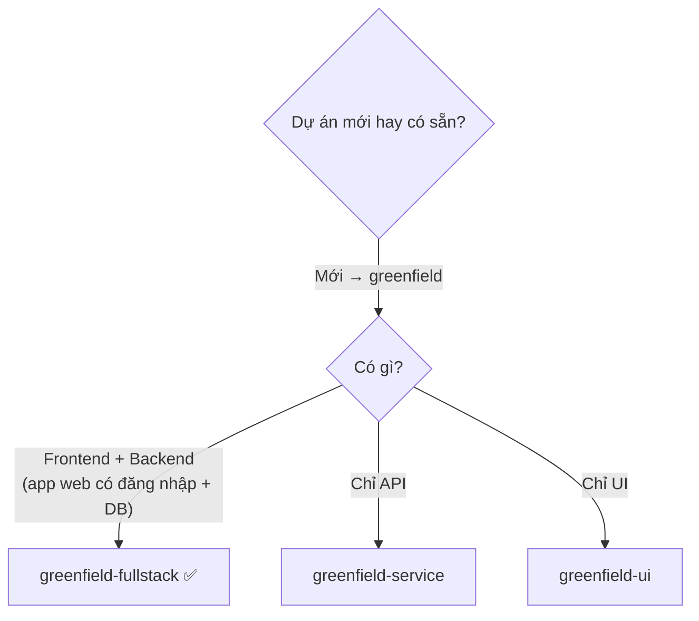

[⬅ Chỉ mục demo](./README.md) · [Bước sau ➡](./01-cai-dat.md)

# Bước 0 — Bối cảnh & trạng thái ban đầu

## Đề bài

Bạn muốn xây **ChiTieu** — một web app ghi chi tiêu cá nhân.

Ý tưởng ban đầu chỉ có bấy nhiêu này trong đầu bạn:

> *"Tôi muốn một app web để ghi chi tiêu hằng ngày, xem được tháng này tiêu bao nhiêu, phân theo loại (ăn uống, đi lại, nhà cửa…). Chỉ dùng một mình, không cần chia sẻ. Muốn làm nhanh, khoảng 2–3 tuần."*

Đó là **tất cả** những gì bạn có. Không PRD, không kiến trúc, không biết dùng công nghệ gì.

## Trạng thái đĩa lúc bắt đầu

📂 `D:\projects\chitieu\`

```text
chitieu/
└── (rỗng)
```

## Bạn chưa có gì

| Thứ | Có? |
|-----|-----|
| Yêu cầu được viết ra | ❌ |
| Phạm vi MVP rõ ràng | ❌ |
| Quyết định công nghệ | ❌ |
| Chia epic / story | ❌ |
| Chuẩn code, cấu trúc thư mục | ❌ |
| Chiến lược test | ❌ |

## Chọn workflow

Tra bảng trong [`../docs/bmad-core-manual/11-workflows.md`](../docs/bmad-core-manual/11-workflows.md):



⇒ Dùng **`greenfield-fullstack`** (`bmad-core/workflows/greenfield-fullstack.yaml`).

Workflow này quy định 19 bước. Demo sẽ đi qua tất cả.

## Bạn sẽ đóng vai gì

Theo triết lý của framework (`bmad-core/data/bmad-kb.md`), bạn là **"Vibe CEO"** — không viết code, không viết tài liệu, mà:

| Việc của bạn | Việc của agent |
|-------------|----------------|
| **Direct** — nêu tầm nhìn, trả lời câu hỏi của agent | Soạn tài liệu, viết code, viết test |
| **Refine** — chọn phương án ở mỗi điểm elicitation | Đề xuất phương án kèm trade-off |
| **Oversee** — duyệt story, quyết định `Done`, commit | Báo cáo, tự kiểm bằng checklist |

Bạn là **trọng tài chất lượng cuối cùng**. Không có agent nào được tự quyết chuyển story sang `Done`.

## Môi trường demo dùng

| Thành phần | Lựa chọn của demo |
|-----------|------------------|
| IDE | Claude Code *(cú pháp `/agent`; demo viết `@agent` cho dễ đọc — cả hai đều là gọi agent)* |
| Pha hoạch định | Làm luôn trong IDE *(để demo liền mạch; thực tế bạn nên làm trên web UI cho rẻ)* |
| Node.js | 20.10.0+ |
| `md-tree` | đã cài global *(cần cho bước shard)* |

## Chi phí ước tính nếu làm thật

| Pha | Nơi làm | Vì sao |
|-----|---------|--------|
| Brainstorm → Architecture | **Web UI** (Gemini Gem / CustomGPT) | Tài liệu lớn, context lớn, chi phí thấp |
| Từ shard trở đi | **IDE** | Cần thao tác file thật |

Demo này làm hết trong IDE để bạn thấy liền mạch, nhưng hãy nhớ ranh giới đó.

---

⚙️ **Cơ chế bên dưới**

Chưa có gì chạy. Điều duy nhất đã được quyết định là **chọn workflow** — và workflow chỉ là **tài liệu điều hướng**, không tự chạy. Nó nói cho bạn biết gọi agent nào, theo thứ tự nào, và câu bàn giao giữa các bước là gì (`handoff_prompts`).

---

[⬅ Chỉ mục demo](./README.md) · [Bước sau: Cài đặt ➡](./01-cai-dat.md)
