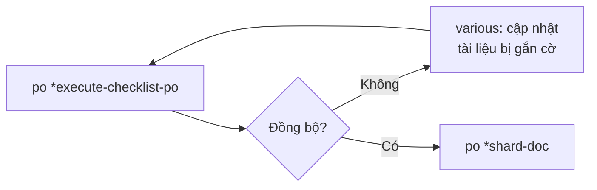

[⬅ Bước trước](./05-architect.md) · [Chỉ mục](./README.md) · [Bước sau ➡](./07-story-1-1-sm.md)

# Bước 6 — PO chốt kiểm + chẻ tài liệu

Bước này là **ranh giới giữa hai pha**. Sau đây bạn không tạo tài liệu nữa; bạn viết code.

---

## 6.1 PO chốt kiểm toàn bộ artifact

```text
👤 Bạn: @po

🤖 Xin chào! Tôi là Sarah 📝 — Product Owner.
   [hiện 10 lệnh]

👤 Bạn: *execute-checklist-po
```

### Agent nạp gì

```text
.bmad-core/agents/po.md
.bmad-core/core-config.yaml
.bmad-core/tasks/execute-checklist.md              ← engine chạy checklist
.bmad-core/checklists/po-master-checklist.md       ← 10 section
docs/project-brief.md
docs/prd.md
docs/front-end-spec.md
docs/architecture.md
```

### Chọn chế độ

```text
🤖 Tôi sẽ chạy po-master-checklist. Bạn muốn:

  1. Section by section (interactive) — rất tốn thời gian
  2. All at once (YOLO) — khuyến nghị cho checklist, có tổng kết ở cuối

👤 Bạn: 2
```

### Kết quả

```text
🤖 ## PO Master Validation Checklist — Kết quả

   | # | Section                                 | Pass rate |
   |---|----------------------------------------|-----------|
   | 1 | PROJECT SETUP & INITIALIZATION         | 6/6  100% |
   | 2 | INFRASTRUCTURE & DEPLOYMENT            | 7/7  100% |
   | 3 | EXTERNAL DEPENDENCIES & INTEGRATIONS   | 5/5  100% |
   | 4 | UI/UX CONSIDERATIONS [[UI/UX ONLY]]    | 6/6  100% |
   | 5 | USER/AGENT RESPONSIBILITY              | 3/4   75% |
   | 6 | FEATURE SEQUENCING & DEPENDENCIES      | 5/6   83% |
   | 7 | RISK MANAGEMENT [[BROWNFIELD ONLY]]    | N/A       |
   | 8 | MVP SCOPE ALIGNMENT                    | 5/5  100% |
   | 9 | DOCUMENTATION & HANDOFF                | 4/5   80% |
   |10 | POST-MVP CONSIDERATIONS                | 2/2  100% |
   |   | **TỔNG (bỏ §7 N/A)**                    | **43/46  93%** |

   ### ❌ / ⚠️ Cần xử lý — 3 việc

   **1. §5 — USER/AGENT RESPONSIBILITY** ⚠️
   Chưa nói rõ ai tạo project Supabase và ai cấu hình biến môi trường. Đây là
   việc **con người** phải làm, agent không làm được (không có credential).
   → Đề xuất: thêm vào AC của Story 1.1 một mục "Người dùng tạo project Supabase
     và điền `.env.local` theo `.env.example`".

   **2. §6 — FEATURE SEQUENCING** ❌
   Story 2.1 (Thêm giao dịch) có AC yêu cầu "lưu giao dịch cho người dùng đang
   đăng nhập", nhưng Story 1.3 (Bảo vệ route) mới là story tạo ra helper lấy
   session ở server. Thứ tự hiện tại là 1.3 → 2.1 nên **đúng**, nhưng PRD chưa
   ghi phụ thuộc này ⇒ nếu ai đó đổi thứ tự sẽ vỡ.
   → Đề xuất: thêm dòng "Depends on: Story 1.3" vào Story 2.1.

   **3. §9 — DOCUMENTATION & HANDOFF** ⚠️
   `devLoadAlwaysFiles` trong core-config.yaml trỏ tới
   `docs/architecture/source-tree.md`, nhưng architecture.md đặt tên section là
   "Unified Project Structure" ⇒ sau khi shard sẽ ra tên khác, Dev agent sẽ
   không tìm thấy file.
   → Đề xuất: sửa core-config.yaml (cách A) hoặc đổi tên section (cách B).

   **Kết luận: CHƯA đồng bộ.** Cần xử lý 3 việc trên trước khi shard.
```

⚙️ **Cơ chế**: PO là **người gác cổng** giữa hai pha. Kết quả này điều khiển luồng của workflow:



Chú ý việc #3: PO tìm ra **đúng vấn đề** mà tôi đã cảnh báo ở [bước 5](./05-architect.md). Đây là giá trị thực của checklist — nó bắt được lỗi mà con người dễ bỏ qua.

### Vòng sửa

```text
👤 Bạn: [mở .bmad-core/core-config.yaml, sửa devLoadAlwaysFiles thành
        docs/architecture/unified-project-structure.md]

👤 Bạn: @pm
👤 Bạn: Thêm vào Story 1.1 một AC về việc người dùng tạo project Supabase
        và điền .env.local. Thêm "Depends on: Story 1.3" vào Story 2.1.

🤖 [PM cập nhật docs/prd.md]

👤 Bạn: @po
👤 Bạn: *execute-checklist-po

🤖 ## Kết quả lần 2
   | TỔNG | 46/46  100% |
   **Kết luận: ĐỒNG BỘ.** Sẵn sàng chẻ tài liệu và bắt đầu phát triển.
```

---

## 6.2 Chẻ tài liệu (sharding)

```text
👤 Bạn: *shard-doc docs/prd.md docs/prd
```

### Agent nạp gì

```text
.bmad-core/tasks/shard-doc.md
.bmad-core/core-config.yaml       ← đọc markdownExploder
```

### Diễn biến

```text
🤖 Đã đọc core-config.yaml: markdownExploder = true.
   Thử chạy công cụ tự động...

   $ md-tree explode docs/prd.md docs/prd

   ✓ Đã chẻ thành công 9 file.

   Tài liệu đã được chẻ. DỪNG tại đây — không cần xử lý thêm.
```

⚙️ **Cơ chế quan trọng**: khi `markdownExploder: true`, task **BẮT BUỘC dừng** sau khi công cụ thành công — nó **không** được tự chẻ tay. Nếu công cụ không có:

```text
🤖 The markdownExploder setting is enabled but the md-tree command is not
   available. Please either:

   1. Install @kayvan/markdown-tree-parser globally with:
      npm install -g @kayvan/markdown-tree-parser
   2. Or set markdownExploder to false in .bmad-core/core-config.yaml

   IMPORTANT: STOP HERE - do not proceed with manual sharding until one of
   the above actions is taken.
```

⚠️ Đừng ép agent chẻ tay khi cờ đang bật. Hãy cài công cụ hoặc đổi cờ.

### Lặp cho architecture

```text
👤 Bạn: *shard-doc docs/architecture.md docs/architecture

🤖 $ md-tree explode docs/architecture.md docs/architecture
   ✓ Đã chẻ thành công 21 file.
```

---

## Kết quả trên đĩa — TRƯỚC và SAU

### Trước

```text
docs/
├── prd.md                  ← 1 file, ~600 dòng
└── architecture.md         ← 1 file, ~1400 dòng
```

### Sau

```text
docs/
├── prd.md                                   ← file gốc GIỮ NGUYÊN
├── prd/                                     ← MỚI
│   ├── index.md                             ← H1 gốc + link tới 8 file
│   ├── goals-and-background-context.md
│   ├── requirements.md
│   ├── user-interface-design-goals.md
│   ├── technical-assumptions.md
│   ├── epic-list.md
│   ├── epic-1-nen-tang-xac-thuc.md          ⭐ SM sẽ đọc file này
│   ├── epic-2-giao-dich-bao-cao.md          ⭐
│   ├── checklist-results-report.md
│   └── next-steps.md
├── architecture.md                          ← file gốc GIỮ NGUYÊN
└── architecture/                            ← MỚI
    ├── index.md
    ├── introduction.md
    ├── high-level-architecture.md
    ├── tech-stack.md                        ⭐ devLoadAlwaysFiles
    ├── data-models.md
    ├── api-spec.md
    ├── components.md
    ├── external-apis.md
    ├── core-workflows.md
    ├── database-schema.md
    ├── frontend-architecture.md
    ├── backend-architecture.md
    ├── unified-project-structure.md         ⭐ devLoadAlwaysFiles
    ├── development-workflow.md
    ├── deployment-architecture.md
    ├── security-and-performance.md
    ├── testing-strategy.md                  ⭐ create-next-story đọc
    ├── coding-standards.md                  ⭐ devLoadAlwaysFiles
    ├── error-handling-strategy.md
    ├── monitoring-and-observability.md
    └── checklist-results-report.md
```

### Heading được hạ một cấp

`docs/prd.md` có:

```markdown
## Requirements
### Functional
FR1: ...
```

`docs/prd/requirements.md` thành:

```markdown
# Requirements
## Functional
FR1: ...
```

### `index.md` được sinh tự động

📂 `docs/prd/index.md`

```markdown
# ChiTieu Product Requirements Document (PRD)

## Sections

- [Goals and Background Context](./goals-and-background-context.md)
- [Requirements](./requirements.md)
- [User Interface Design Goals](./user-interface-design-goals.md)
- [Technical Assumptions](./technical-assumptions.md)
- [Epic List](./epic-list.md)
- [Epic 1 Nền tảng & Xác thực](./epic-1-nen-tang-xac-thuc.md)
- [Epic 2 Giao dịch & Báo cáo](./epic-2-giao-dich-bao-cao.md)
- [Checklist Results Report](./checklist-results-report.md)
- [Next Steps](./next-steps.md)
```

---

## Kiểm tra sau khi shard — 6 việc

```bash
# 1. Có file epic khớp epicFilePattern: epic-{n}*.md ?
ls docs/prd/epic-*.md
#   docs/prd/epic-1-nen-tang-xac-thuc.md
#   docs/prd/epic-2-giao-dich-bao-cao.md          ✓

# 2. Ba file trong devLoadAlwaysFiles có tồn tại?
ls docs/architecture/coding-standards.md \
   docs/architecture/tech-stack.md \
   docs/architecture/unified-project-structure.md   ✓

# 3. Có index.md?
ls docs/prd/index.md docs/architecture/index.md      ✓

# 4. Sơ đồ Mermaid còn nguyên?
grep -c '```mermaid' docs/architecture/high-level-architecture.md   # ≥ 1  ✓

# 5. Code fence không bị đứt? (số ``` phải là số chẵn)
grep -c '```' docs/architecture/coding-standards.md                 # số chẵn ✓

# 6. Không mất nội dung? So tổng dòng
wc -l docs/prd.md                # 612
cat docs/prd/*.md | wc -l        # 620  (chênh nhẹ do index.md thêm vào — bình thường)
```

⚙️ **Cơ chế**: task yêu cầu việc chẻ phải **khả nghịch** — từ các mảnh phải ghép lại được tài liệu gốc. Nếu số dòng chênh nhiều, hãy kiểm lại.

---

## Trạng thái sau bước 6 — điểm chuyển pha

📂

```text
chitieu/
├── .bmad-core/         ← framework
├── .claude/            ← command của IDE
└── docs/
    ├── brainstorming-session-results.md
    ├── project-brief.md
    ├── prd.md          + prd/ (10 file)
    ├── front-end-spec.md
    └── architecture.md + architecture/ (21 file)
```

**Chưa có một dòng code nào.** Và đó là điều đúng.

| Có | Chưa có |
|---|---|
| ✅ Yêu cầu FR/NFR rõ ràng, kiểm được | ❌ Mã nguồn |
| ✅ 2 epic, 7 story, mỗi story có AC đo được | ❌ Test |
| ✅ Stack chốt với phiên bản cụ thể | ❌ Deploy |
| ✅ Schema DB + RLS | ❌ `docs/stories/` |
| ✅ 7 luật coding standards | ❌ `docs/qa/` |
| ✅ Cấu trúc thư mục tới từng file | |
| ✅ Chiến lược test 3 tầng | |
| ✅ PO xác nhận 46/46 đồng bộ | |

## Câu bàn giao

`handoff_prompts.complete`:

> *"All planning artifacts validated and saved in `docs/` folder. Move to IDE environment to begin development."*

## Bạn tự làm gì ở bước này

- [ ] Đọc báo cáo PO, sửa **hết** các mục ❌ và ⚠️ thuộc trách nhiệm mình, rồi **chạy lại checklist**
- [ ] Cài `md-tree` nếu chưa có: `npm install -g @kayvan/markdown-tree-parser`
- [ ] Shard **cả hai** tài liệu
- [ ] Chạy 6 lệnh kiểm tra ở trên
- [ ] **Commit** toàn bộ `docs/` — đây là mốc đáng lưu
- [ ] **MỞ CHAT MỚI** trước khi sang bước 7

⚠️ **Không shard trên Web UI.** `bmad-kb.md` cảnh báo rõ: *"Do NOT shard in Web UI - copying many small files is painful!"* Nếu bạn hoạch định trên web, hãy copy 2 file `prd.md` + `architecture.md` về project rồi mới shard trong IDE.

---

[⬅ Bước trước](./05-architect.md) · [Chỉ mục](./README.md) · [Bước sau: SM tạo story 1.1 ➡](./07-story-1-1-sm.md)
