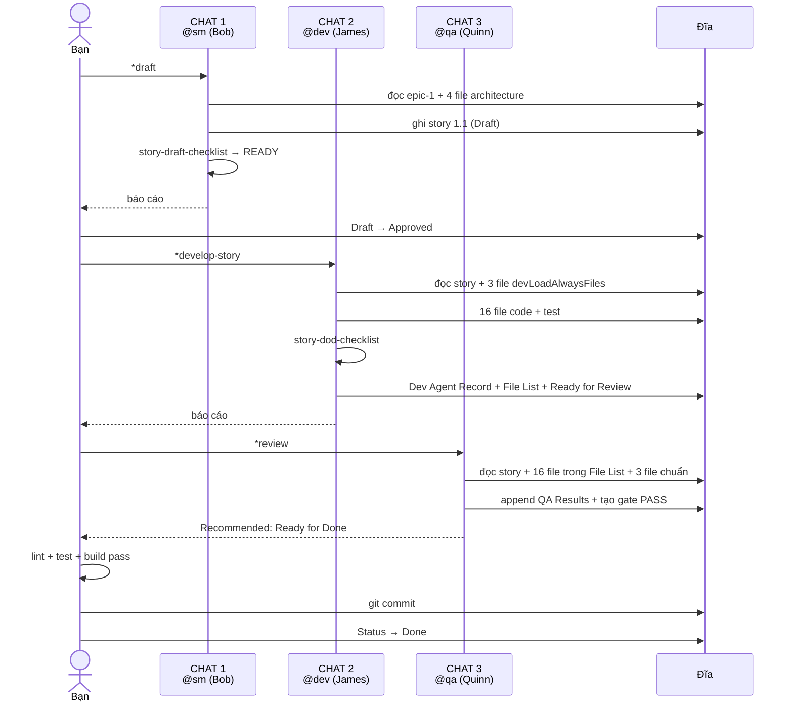

[⬅ Bước trước](./08-story-1-1-dev.md) · [Chỉ mục](./README.md) · [Bước sau ➡](./10-story-1-2-rui-ro-cao.md)

# Bước 9 — QA review Story 1.1 → gate PASS → Done

> ⚠️ **MỞ CHAT MỚI** lần nữa. Đây là chat thứ 3 cho story này (SM → Dev → QA).

## Lệnh

```text
👤 Bạn: @qa

🤖 Xin chào, tôi là Quinn 🧪 — Test Architect & Quality Advisor.

   Tôi không chỉ review code — tôi đánh giá kiến trúc test, rủi ro, và chất
   lượng phi chức năng. Quyền của tôi là cố vấn: tôi đưa quyết định gate
   PASS/CONCERNS/FAIL/WAIVED kèm lý do, nhưng KHÔNG chặn bạn. Chủ story
   quyết định trạng thái cuối.

   Các lệnh khả dụng:
     1. *help
     2. *risk-profile {story}   — ma trận rủi ro
     3. *test-design {story}    — chiến lược test
     4. *trace {story}          — truy vết AC ↔ test
     5. *nfr-assess {story}     — đánh giá yêu cầu phi chức năng
     6. *review {story}         — review toàn diện + gate
     7. *gate {story}           — cập nhật quyết định gate
     8. *exit

👤 Bạn: *review docs/stories/1.1.khoi-tao-du-an-va-pipeline.md
```

## Agent nạp gì

```text
.bmad-core/agents/qa.md
.bmad-core/core-config.yaml                       → qa.qaLocation = docs/qa
.bmad-core/tasks/review-story.md
.bmad-core/templates/qa-gate-tmpl.yaml
docs/stories/1.1.khoi-tao-du-an-va-pipeline.md    ← story
+ mã nguồn của MỌI file trong File List           ← 16 file
+ tests/unit/env.test.ts
docs/architecture/coding-standards.md
docs/architecture/testing-strategy.md
docs/architecture/unified-project-structure.md
```

## Bước 1 — Kiểm tiền đề + đánh giá độ sâu review

```text
🤖 ## Kiểm tiền đề
   ✓ Status = "Ready for Review"
   ✓ File List có 16 file thêm mới + 1 file sửa — không rỗng, có vẻ đầy đủ
   ✓ npm test: 3/3 pass

   ## Đánh giá độ sâu — kiểm 5 dấu hiệu leo thang

   | Dấu hiệu | Story 1.1 | Kết luận |
   |---|---|---|
   | Chạm file auth/payment/security | Không | — |
   | Không thêm test | Có 3 test | — |
   | Diff > 500 dòng | ~380 dòng | — |
   | Gate trước FAIL/CONCERNS | Không có gate trước | — |
   | > 5 acceptance criteria | 6 AC | ⚠️ CÓ |

   ⇒ Một dấu hiệu chạm ngưỡng (6 AC). Tôi sẽ review **kỹ hơn mức tối thiểu**
     nhưng không cần deep review toàn diện, vì đây là story hạ tầng, rủi ro thấp.
```

⚙️ **Cơ chế**: QA tự điều chỉnh độ sâu theo tín hiệu rủi ro — nguyên tắc *"Depth As Needed: Go deep based on risk signals, stay concise when low risk"*. Story hạ tầng không cần đối xử như story auth.

## Bước 2 — Sáu trục phân tích

```text
🤖 ### A. Requirements Traceability

   | AC | Nội dung | Test xác thực | Độ phủ |
   |----|----------|---------------|--------|
   | 1 | npm run dev mở được trang chủ, hiện tên app | ❌ không có test tự động | **none** |
   | 2 | npm run lint không lỗi, không cảnh báo | CI job `npm run lint` | full |
   | 3 | npm test chạy được và pass | CI job `npm test` + 3 unit test | full |
   | 4 | CI chạy lint + test trên mọi PR | ❌ chưa có PR nào để chứng minh | **partial** |
   | 5 | README ghi cách chạy local | ❌ không kiểm được tự động | none (chấp nhận được) |
   | 6 | Người dùng tạo Supabase + điền .env.local | 3 unit test cho parseEnv | full |

   Given-When-Then cho AC6 (tài liệu hoá, không phải code BDD):
   - **Given** biến môi trường thiếu NEXT_PUBLIC_SUPABASE_ANON_KEY
   - **When** parseEnv được gọi
   - **Then** ném lỗi có chứa tên biến thiếu
   ⇒ `tests/unit/env.test.ts:15`

   **Khoảng trống:** AC1 và AC4 không có bằng chứng tự động.

   ### B. Code Quality Review

   ✓ `lib/env.ts` — thiết kế tốt: tham số hoá `raw` cho phép test không mock global
   ✓ Dùng `safeParse` + thông điệp lỗi nêu tên biến — người chạy lần đầu biết sửa gì
   ✓ Không có trùng lặp, không có code chết
   ⚠️ `export const env = parseEnv()` chạy ở top-level — Dev đã tự ghi nhận là nợ
     kỹ thuật trong Completion Notes. Tôi đồng ý với đánh giá và cách xử lý
     (hoãn tới khi có nhiều module dùng tới). Không phải vấn đề chặn.

   **Refactoring tôi đã thực hiện:** không có. Code đã sạch, refactor lúc này
   là thay đổi vô ích và tăng rủi ro.

   ### C. Test Architecture Assessment

   ✓ Mức test đúng: `parseEnv` là logic thuần ⇒ unit test là đúng mức
     (theo test-levels-framework: "Pure functions and business logic" → Unit)
   ✓ 3 case đúng yêu cầu testing-strategy: 1 hợp lệ + 2 sai
   ✓ Test stateless, không phụ thuộc thứ tự, chạy song song được
   ✓ Không có hard wait, không flaky
   ⚠️ Thiếu test cho AC1 (smoke test trang chủ render được)

   ### D. Non-Functional Requirements

   | NFR | Trạng thái | Ghi chú |
   |-----|-----------|---------|
   | Security | **PASS** | Không hardcode secret; `.env.local` trong `.gitignore`; `npm audit` 0 vulnerabilities |
   | Performance | **PASS** | Không áp dụng ở story hạ tầng; build time 18s là bình thường |
   | Reliability | **PASS** | Validate env lúc khởi động ⇒ fail nhanh, fail rõ. Đây là thiết kế đúng |
   | Maintainability | **PASS** | 7 luật coding standards được tuân thủ; README đủ để người mới chạy được |

   ### E. Testability Evaluation

   - **Controllability**: ✓ `parseEnv(raw)` cho phép kiểm soát input hoàn toàn
   - **Observability**: ✓ lỗi nêu rõ biến nào thiếu
   - **Debuggability**: ✓ thông điệp lỗi dẫn thẳng tới nguyên nhân

   ### F. Technical Debt

   1. `env` khởi tạo ở top-level (Dev đã ghi nhận) — **low**
   2. Thiếu smoke test cho trang chủ — **low**, nên thêm khi có UI thật ở story 2.x
```

## Bước 3–6

```text
🤖 ### Standards Compliance Check
   ✓ coding-standards.md: 7/7 luật áp dụng được đều tuân thủ
   ✓ unified-project-structure.md: mọi file đúng vị trí đã định
   ✓ testing-strategy.md: đúng mức test, đúng vị trí file, đúng số case

   ### Acceptance Criteria Validation
   6/6 AC được hiện thực. AC1, AC4, AC5 xác minh bằng tay (chấp nhận được cho
   story hạ tầng), 3 AC còn lại có bằng chứng tự động.

   ### Documentation and Comments
   ✓ `parseEnv` có comment giải thích vì sao nhận tham số
   ✓ README đủ 4 mục
```

## Quyết định gate — áp thuật toán tất định

```text
🤖 ## Áp thuật toán gate theo THỨ TỰ

   **1. Risk thresholds** — chưa chạy *risk cho story này ⇒ không có risk_summary
      ⇒ bỏ qua bước 1

   **2. Test coverage gaps** — có chạy *design cho story này không? Không.
      ⇒ không có danh sách P0 test để so ⇒ không có "thiếu P0" ⇒ bỏ qua bước 2

   **3. Issue severity** — 2 issue tìm được:
      - TEST-001: thiếu smoke test cho AC1 → severity **low**
      - MNT-001: env khởi tạo top-level → severity **low**
      ⇒ không có high, không có medium ⇒ chưa quyết định ở bước 3

   **4. NFR statuses** — security PASS · performance PASS · reliability PASS ·
      maintainability PASS
      ⇒ không có FAIL, không có CONCERNS ⇒ **gate = PASS**

   quality_score = 100 − (20 × 0 FAIL) − (10 × 0 CONCERNS) = **100**
```

⚙️ **Cơ chế**: hai issue mức `low` **không** đẩy gate xuống CONCERNS. Chỉ `medium` mới → CONCERNS, `high` mới → FAIL. Đây là lý do thang severity chỉ có đúng 3 giá trị cố định `low|medium|high` — để quyết định không bị mơ hồ.

---

## Đầu ra 1 — QA Results trong story

📂 Append vào `docs/stories/1.1.khoi-tao-du-an-va-pipeline.md`:

```markdown
## QA Results

### Review Date: 2026-08-10

### Reviewed By: Quinn (Test Architect)

### Code Quality Assessment
Chất lượng tốt cho một story hạ tầng. `lib/env.ts` thể hiện quyết định thiết kế
đúng: tham số hoá `raw` để test được mà không mock global, dùng `safeParse` để
gói lỗi thành thông điệp nêu rõ biến thiếu. Không có trùng lặp, không có code
chết, tuân thủ đủ 7 luật coding standards.

### Refactoring Performed
Không có. Code đã sạch; refactor lúc này chỉ tăng rủi ro mà không thêm giá trị.

### Compliance Check
- Coding Standards: ✓ 7/7 luật áp dụng được đều tuân thủ
- Project Structure: ✓ mọi file đúng vị trí theo unified-project-structure.md
- Testing Strategy: ✓ đúng mức test (unit cho logic thuần), đúng vị trí, đúng số case
- All ACs Met: ✓ 6/6 (AC1, AC4, AC5 xác minh bằng tay — chấp nhận được cho story hạ tầng)

### Improvements Checklist
- [x] Xác nhận 3 test case của `parseEnv` phủ đúng ranh giới (hợp lệ / thiếu biến / URL sai)
- [ ] Thêm smoke test cho trang chủ (AC1) — đề xuất làm ở story 2.x khi có UI thật
- [ ] Chuyển `env` sang lazy getter khi có ≥ 3 module import `lib/env.ts`
      (Dev đã ghi nhận nợ này trong Completion Notes)

### Security Review
Không phát hiện vấn đề. `.env.local` đã trong `.gitignore`; không có secret
hardcode; `npm audit` báo 0 vulnerabilities. Việc validate env lúc khởi động là
điểm cộng: cấu hình sai làm app fail ngay thay vì fail ngầm khi chạy.

### Performance Considerations
Không áp dụng ở story hạ tầng. Build time 18s nằm trong mức bình thường.

### Files Modified During Review
Không có — tôi không sửa file nào.

### Gate Status
Gate: PASS → docs/qa/gates/1.1-khoi-tao-du-an-va-pipeline.yml

### Recommended Status
✓ Ready for Done
(Story owner decides final status)
```

⚠️ QA **chỉ** append vào section này. Mọi section khác của story không được chạm.

---

## Đầu ra 2 — File gate

📂 `docs/qa/gates/1.1-khoi-tao-du-an-va-pipeline.yml` *(thư mục `docs/qa/gates/` được tạo mới)*

```yaml
schema: 1
story: '1.1'
story_title: 'Khởi tạo dự án và pipeline'
gate: PASS
status_reason: 'Đủ 6/6 AC, không có issue mức medium hoặc cao, cả 4 NFR đạt với bằng chứng.'
reviewer: 'Quinn (Test Architect)'
updated: '2026-08-10T14:22:00Z'

waiver: { active: false }

top_issues:
  - id: 'TEST-001'
    severity: low
    finding: 'AC1 (trang chủ render được) không có test tự động'
    suggested_action: 'Thêm smoke test khi story 2.x tạo UI thật'
    suggested_owner: dev
  - id: 'MNT-001'
    severity: low
    finding: 'env khởi tạo ở top-level module, gây phụ thuộc env khi import trong test'
    suggested_action: 'Chuyển sang lazy getter khi có ≥3 module import lib/env.ts'
    suggested_owner: dev

risk_summary:
  totals: { critical: 0, high: 0, medium: 0, low: 2 }
  recommendations:
    must_fix: []
    monitor:
      - 'MNT-001 khi số module dùng lib/env.ts tăng'

quality_score: 100
expires: '2026-08-24T14:22:00Z'

evidence:
  tests_reviewed: 3
  risks_identified: 2
  trace:
    ac_covered: [2, 3, 6]
    ac_gaps: [1, 4, 5]

nfr_validation:
  security: { status: PASS, notes: 'Không secret hardcode; .env.local đã gitignore; audit sạch' }
  performance: { status: PASS, notes: 'Không áp dụng ở story hạ tầng' }
  reliability: { status: PASS, notes: 'Validate env lúc khởi động — fail nhanh, fail rõ' }
  maintainability: { status: PASS, notes: 'Tuân thủ đủ coding standards; README đủ dùng' }

recommendations:
  immediate: []
  future:
    - action: 'Thêm smoke test cho trang chủ'
      refs: ['app/page.tsx']
    - action: 'Lazy hoá khởi tạo env'
      refs: ['lib/env.ts:24']
```

⚙️ **Cơ chế `ac_gaps: [1, 4, 5]`**: gate ghi nhận **trung thực** rằng 3 AC không có bằng chứng tự động — nhưng vì chúng không phải P0 test và không phải security/data-loss, gate vẫn PASS. Nếu là AC về bảo mật thì kết quả sẽ khác hoàn toàn (xem [bước 10](./10-story-1-2-rui-ro-cao.md)).

---

## Bạn đóng story

```text
👤 Bạn: [đọc QA Results và gate]
```

### Ba việc bắt buộc trước khi đánh `Done`

```bash
# 1. XÁC NHẬN toàn bộ regression + lint đang pass
npm run lint    # ✓ 0 lỗi, 0 cảnh báo
npm test        # ✓ 3/3 pass
npm run build   # ✓ thành công

# 2. COMMIT — workflow ghi hoa việc này:
#    "IMPORTANT: COMMIT YOUR CHANGES BEFORE PROCEEDING!"
git add -A
git commit -m "feat(story-1.1): khởi tạo dự án Next.js + CI + validate env

- Next.js 14.2 App Router + TypeScript 5.5 + Tailwind 3.4
- lib/env.ts validate biến môi trường bằng Zod (coding standard #1)
- Vitest 2.0 với 3 test case cho parseEnv
- GitHub Actions CI: lint + test trên mọi PR
- README + .env.example

Story: docs/stories/1.1.khoi-tao-du-an-va-pipeline.md
QA Gate: PASS (quality_score 100)"

# 3. Đổi Status trong file story
```

```markdown
## Status
Done                                ← bạn đổi, không phải agent
```

⚙️ **Cơ chế**: **chỉ bạn** được đánh `Done`. QA chỉ *"Recommended Status: ✓ Ready for Done"* kèm ghi chú *"(Story owner decides final status)"*. Gate là **advisory**, không phải cổng chặn.

---

## Trạng thái sau bước 9 — vòng story đầu tiên hoàn tất

📂

```text
chitieu/
├── app/  lib/  tests/  .github/        ← code đã commit
└── docs/
    ├── prd.md + prd/
    ├── architecture.md + architecture/
    ├── stories/
    │   └── 1.1.khoi-tao-du-an-va-pipeline.md    ← Status: Done ✓
    └── qa/                                      ← MỚI
        └── gates/
            └── 1.1-khoi-tao-du-an-va-pipeline.yml
```

## Tổng kết vòng đầu — 3 chat, 3 vai, 1 story



## Bạn tự làm gì ở bước này

- [ ] Mở **chat mới** (thứ 3 cho story này)
- [ ] Đọc **cả** QA Results **và** file gate — gate có thông tin mà QA Results không có (`ac_gaps`, `quality_score`, `expires`)
- [ ] Xem các mục `[ ]` chưa tick trong Improvements Checklist — quyết định làm ngay hay ghi nợ
- [ ] **Tự chạy** lint + test + build, đừng chỉ tin agent
- [ ] **COMMIT** trước khi đổi Status
- [ ] Đổi `Status: Done`
- [ ] Nén hội thoại / mở chat mới trước khi sang story 1.2

---

[⬅ Bước trước](./08-story-1-1-dev.md) · [Chỉ mục](./README.md) · [Bước sau: story rủi ro cao, vòng QA đầy đủ ➡](./10-story-1-2-rui-ro-cao.md)
