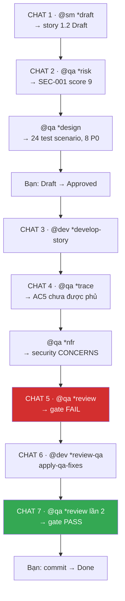

[⬅ Bước trước](./09-story-1-1-qa.md) · [Chỉ mục](./README.md) · [Bước sau ➡](./11-ket-thuc.md)

# Bước 10 — Story 1.2: vòng đầy đủ cho story rủi ro cao

Story 1.1 là đường thẳng. Story 1.2 (**Đăng ký và đăng nhập**) chạm auth ⇒ đây là lúc dùng **toàn bộ** bộ công cụ QA và bạn sẽ thấy gate **FAIL** rồi được sửa thành **PASS**.

## Toàn cảnh bước này



---

## 10.1 SM tạo story 1.2 — điểm khác: đọc story trước

```text
👤 [CHAT MỚI] @sm → *draft

🤖 [Bước 0] Nạp core-config.yaml ✓

   [Bước 1] Kiểm docs/stories/ → tìm thấy 1.1.khoi-tao-du-an-va-pipeline.md
   Kiểm Status của story cao nhất: **Done** ✓
   ⇒ Được phép tạo story tiếp theo trong epic hiện tại: 1.2

   Identified next story for preparation: 1.2 - Đăng ký và đăng nhập

   [Bước 2] Đọc Dev Agent Record của story 1.1...
   ✓ Completion Notes: pattern parseEnv(raw = process.env) nên dùng lại
   ✓ Nợ kỹ thuật đã ghi: env khởi tạo top-level, chuyển lazy khi ≥3 module dùng
   ✓ Debug Log: lint từng fail vì unused import ⇒ chú ý import sạch

   [Bước 3] Story này là Backend/API + Frontend ⇒ đọc CẢ HAI nhóm:
     MỌI story:  tech-stack · unified-project-structure · coding-standards · testing-strategy
     Backend:    data-models · database-schema · backend-architecture · api-spec · external-apis
     Frontend:   frontend-architecture · components · core-workflows
   ⇒ 12 file
```

⚙️ **Cơ chế** — đây là **vòng phản hồi giữa các story**: nợ kỹ thuật và bài học của 1.1 đi vào Dev Notes của 1.2 mà không cần bạn nhớ gì.

Trích Dev Notes của story 1.2 (phần khác biệt so với 1.1):

```markdown
### Previous Story Insights
Từ story 1.1:
- Pattern `parseEnv(raw = process.env)` cho phép test không mock global —
  áp dụng lại cho module đọc cấu hình Supabase.
- Nợ kỹ thuật: `env` khởi tạo top-level. Story này sẽ là module thứ 2 import
  `lib/env.ts`; chưa đạt ngưỡng 3 nên **chưa** xử lý, nhưng ghi nhận lại.
- Lint từng fail vì unused import ⇒ giữ import sạch từ đầu.
[Source: docs/stories/1.1.khoi-tao-du-an-va-pipeline.md#dev-agent-record]

### API Specifications
- `POST /api/auth/dang-ky` — body `{ email, password }`, trả `201` + session
- `POST /api/auth/dang-nhap` — body `{ email, password }`, trả `200` + session
- Lỗi trả dạng `{ error: { code, message } }`, KHÔNG tiết lộ email có tồn tại
  (AC 3)
- Rate limit áp ở `app/api/auth/dang-nhap/route.ts`: 5 lần / 15 phút / IP (AC 5)
[Source: architecture/api-spec.md#authentication-endpoints]

### Technical Constraints
- Mật khẩu KHÔNG BAO GIỜ xuất hiện trong log hay response (AC 6, và luật #4
  của coding standards)
- Dùng Supabase Auth, KHÔNG tự viết hashing (anti-pattern trong
  technical-preferences.md)
[Source: architecture/coding-standards.md#critical-rules]
[Source: architecture/tech-stack.md#tech-stack]
```

---

## 10.2 QA vào sớm: `*risk`

```text
👤 [CHAT MỚI] @qa → *risk docs/stories/1.2.dang-ky-va-dang-nhap.md
```

```text
🤖 Đang nạp .bmad-core/tasks/risk-profile.md...

   ## Risk Matrix

   | Risk ID  | Description | Probability | Impact | Score | Priority |
   |----------|-------------|-------------|--------|-------|----------|
   | SEC-001  | Thiếu rate limiting ⇒ brute force mật khẩu | High (3) | High (3) | **9** | Critical |
   | SEC-002  | Thông báo lỗi tiết lộ email tồn tại (user enumeration) | Medium (2) | Medium (2) | 4 | Medium |
   | SEC-003  | Mật khẩu bị log khi debug | Medium (2) | High (3) | 6 | High |
   | DATA-001 | RLS chưa bật ⇒ user đọc được dữ liệu người khác | Low (1) | High (3) | 3 | Low |
   | TECH-001 | Session không giữ sau reload (cấu hình cookie sai) | Medium (2) | Low (1) | 2 | Low |

   ## Critical Risks Requiring Immediate Attention

   ### 1. SEC-001: Thiếu rate limiting trên endpoint đăng nhập
   - **Score: 9 (Critical)** — xác suất cao vì endpoint công khai và mặc định
     không có giới hạn; tác động cao vì dẫn tới chiếm tài khoản
   - **Mitigation (preventive):**
     - Áp giới hạn 5 lần / 15 phút / IP tại `app/api/auth/dang-nhap/route.ts`
     - Trả HTTP 429 kèm `Retry-After`
     - Ghi log số lần thử (KHÔNG log mật khẩu)
   - **Testing requirements:**
     - Integration test: gọi 6 lần liên tiếp, lần thứ 6 phải trả 429
     - Integration test: sau 15 phút, đếm reset
   - **Residual risk:** Low — brute force phân tán qua nhiều IP vẫn khả thi,
     nhưng ngoài phạm vi MVP
   - **Owner:** dev · **Timeline:** trước khi merge story này

   ## Risk Scoring
   Base 100 − 20 (SEC-001 critical) − 10 (SEC-003 high) − 5 (SEC-002 medium)
            − 2 (DATA-001) − 2 (TECH-001) = **61**

   ## Integration with Quality Gates
   ⚠️ Có risk score = 9 ⇒ theo quy tắc tất định: **nếu SEC-001 chưa được giảm
     nhẹ tại thời điểm review, gate = FAIL** (trừ khi được waive).

   ## Risk-Based Testing Strategy
   **Priority 1 — Critical risk tests:** rate limiting (SEC-001)
   **Priority 2 — High risk tests:** không log mật khẩu (SEC-003)
   **Priority 3 — Medium/Low:** thông báo lỗi trung tính (SEC-002), RLS (DATA-001)

   Risk profile: docs/qa/assessments/1.2-risk-20260810.md
```

📂 Sinh ra: `docs/qa/assessments/1.2-risk-20260810.md`

⚙️ **Cơ chế — đây là giá trị lớn nhất của `*risk`**: bạn biết **trước khi viết một dòng code** rằng thiếu rate limiting sẽ làm gate FAIL. Dev có thể làm đúng ngay từ đầu.

---

## 10.3 `*design` — thiết kế test theo rủi ro

```text
👤 *design docs/stories/1.2.dang-ky-va-dang-nhap.md
```

```text
🤖 Đang nạp test-design.md + test-levels-framework.md + test-priorities-matrix.md...

   ## Test Strategy Overview
   - Total test scenarios: 24
   - Unit: 13 (54%) · Integration: 9 (38%) · E2E: 2 (8%)
   - Priority: P0: 8 · P1: 10 · P2: 6

   ## Test Scenarios by Acceptance Criteria

   ### AC5: Endpoint đăng nhập giới hạn 5 lần / 15 phút / IP
   | ID | Level | Priority | Test | Justification |
   |----|-------|----------|------|---------------|
   | 1.2-UNIT-009 | Unit | **P0** | Bộ đếm tăng đúng và reset sau TTL | Logic thuần của rate limiter |
   | 1.2-INT-005 | Integration | **P0** | Lần thử thứ 6 trả HTTP 429 + Retry-After | Cần đi qua Route Handler thật |
   | 1.2-INT-006 | Integration | P1 | Đếm theo IP, IP khác không bị ảnh hưởng | Ranh giới component |
   → mitigates_risks: ['SEC-001']

   ### AC6: Mật khẩu không xuất hiện trong log hay response
   | ID | Level | Priority | Test | Justification |
   |----|-------|----------|------|---------------|
   | 1.2-UNIT-011 | Unit | **P0** | Hàm sanitize loại bỏ field password/token | Logic thuần |
   | 1.2-INT-007 | Integration | **P0** | Response đăng nhập lỗi không chứa password | Kiểm hợp đồng API |
   | 1.2-INT-008 | Integration | **P0** | Log của handler không chứa giá trị password | Kiểm side-effect |
   → mitigates_risks: ['SEC-003']

   ### AC3: Lỗi đăng nhập không tiết lộ email tồn tại
   | 1.2-INT-004 | Integration | P1 | Email không tồn tại và mật khẩu sai trả CÙNG message |
   → mitigates_risks: ['SEC-002']

   [... AC1, AC2, AC4 ...]

   ## Recommended Execution Order
   1. P0 Unit (fail fast) — 4 test
   2. P0 Integration — 4 test
   3. P0 E2E — 0 test
   4. P1 — 10 test
   5. P2 — 6 test

   ## Gate YAML Block
   ```yaml
   test_design:
     scenarios_total: 24
     by_level: { unit: 13, integration: 9, e2e: 2 }
     by_priority: { p0: 8, p1: 10, p2: 6 }
     coverage_gaps: []
   ```

   Test design matrix: docs/qa/assessments/1.2-test-design-20260810.md
   P0 tests identified: 8
```

⚙️ **Cơ chế "shift left"**: 54% test ở mức unit, chỉ 8% e2e. Rate limiter được test **cả** ở unit (logic đếm) **và** integration (đi qua handler thật) vì nó là đường dẫn critical — đúng nguyên tắc *"Critical paths have multiple levels"*.

**Bạn giờ có 8 P0 test là hợp đồng rõ ràng.** Thiếu bất kỳ P0 test nào ⇒ gate CONCERNS; thiếu P0 test về security ⇒ gate **FAIL**.

---

## 10.4 Bạn duyệt story → Dev triển khai

```text
👤 [đọc story + risk + test-design, đổi Status: Draft → Approved]

👤 [CHAT MỚI] @dev → *develop-story docs/stories/1.2.dang-ky-va-dang-nhap.md
```

Dev triển khai 5 task. Nhưng — và đây là điểm của demo — Dev **bỏ sót** rate limiting:

```text
🤖 ─── Task 4: Endpoint đăng nhập (AC: 3, 5, 6) ───

   app/api/auth/dang-nhap/route.ts:
   ```ts
   import { NextResponse } from 'next/server';
   import { createServerClient } from '@/lib/supabase/server';
   import { loginSchema } from '@/lib/schemas/auth';

   export async function POST(request: Request) {
     const body = await request.json();
     const parsed = loginSchema.safeParse(body);
     if (!parsed.success) {
       return NextResponse.json(
         { error: { code: 'INVALID_INPUT', message: 'Email hoặc mật khẩu không hợp lệ' } },
         { status: 400 },
       );
     }
     const supabase = createServerClient();
     const { error } = await supabase.auth.signInWithPassword(parsed.data);
     if (error) {
       // AC3: message trung tính, không tiết lộ email có tồn tại
       return NextResponse.json(
         { error: { code: 'INVALID_CREDENTIALS', message: 'Email hoặc mật khẩu không đúng' } },
         { status: 401 },
       );
     }
     return NextResponse.json({ ok: true });
   }
   ```

   ✓ AC3 đạt (message trung tính)
   ✓ AC6 đạt (không log, không trả password)
   ⚠️ AC5 (rate limiting): Supabase Auth có giới hạn nội bộ nên tôi cho rằng
     đã được xử lý ở tầng dịch vụ.

   [... Task 5, DoD checklist, Status: Ready for Review]
```

⚠️ **Đây là lỗi thật hay gặp**: Dev **suy luận** rằng dịch vụ bên dưới đã xử lý, thay vì hiện thực đúng con số mà AC yêu cầu (5 lần / 15 phút / IP). Nó không cố ý làm sai — nó tự lấp một khoảng trống bằng phỏng đoán.

---

## 10.5 Kiểm giữa kỳ: `*trace` và `*nfr`

```text
👤 [CHAT MỚI] @qa → *trace docs/stories/1.2.dang-ky-va-dang-nhap.md
```

```text
🤖 ## Coverage Summary
   | Requirement | Coverage | Ghi chú |
   |-------------|----------|---------|
   | AC1 đăng ký + email trùng | full | 1.2-UNIT-001..003, 1.2-INT-001 |
   | AC2 luật mật khẩu | full | 1.2-UNIT-004..007 |
   | AC3 lỗi trung tính | full | 1.2-INT-004 |
   | AC4 session giữ sau reload | integration | 1.2-INT-003 |
   | **AC5 rate limiting** | **none** ❌ | không tìm thấy test nào |
   | AC6 không log/trả password | partial ⚠️ | có 1.2-UNIT-011 nhưng thiếu 1.2-INT-008 (kiểm log) |

   ## Critical Gaps

   ```yaml
   coverage_gaps:
     - requirement: 'AC5: Endpoint đăng nhập giới hạn 5 lần / 15 phút / IP'
       gap: 'Không có test, và không tìm thấy mã hiện thực rate limiting'
       severity: high
       suggested_test:
         type: integration
         description: 'Gọi 6 lần liên tiếp, lần 6 phải trả 429 kèm Retry-After'
     - requirement: 'AC6: Mật khẩu không xuất hiện trong log'
       gap: 'Chưa có test kiểm side-effect ghi log'
       severity: medium
       suggested_test:
         type: integration
         description: 'Spy logger, xác nhận không có giá trị password trong output'
   ```

   ## Gate YAML Block
   ```yaml
   trace:
     totals: { requirements: 6, full: 3, partial: 1, none: 1, integration: 1 }
     planning_ref: 'docs/qa/assessments/1.2-test-design-20260810.md'
     uncovered:
       - ac: 'AC5'
         reason: 'Không có test và không có mã hiện thực rate limiting'
   ```

   ⚠️ AC5 tương ứng 2 test P0 trong test-design (1.2-UNIT-009, 1.2-INT-005) —
     **thiếu P0 test về security** ⇒ theo quy tắc gate: **FAIL**.
```

```text
👤 *nfr docs/stories/1.2.dang-ky-va-dang-nhap.md
```

```text
🤖 Đánh giá bộ bốn cốt lõi (chế độ không tương tác ⇒ mặc định 4 NFR).

   Tìm ngưỡng trong: AC của story · docs/architecture/*.md · technical-preferences.md
   ✓ Tìm thấy ngưỡng rate limit: 5 lần / 15 phút / IP (AC5)
   ✓ Tìm thấy yêu cầu hash mật khẩu: NFR2
   ✓ Tìm thấy yêu cầu RLS: NFR3

   ```yaml
   nfr_validation:
     _assessed: [security, performance, reliability, maintainability]
     security:
       status: FAIL
       notes: 'AC5 yêu cầu rate limiting 5/15ph/IP nhưng không có mã hiện thực.
               Endpoint đăng nhập công khai không giới hạn ⇒ brute force khả thi.'
     performance:
       status: PASS
       notes: 'Đăng nhập ~180ms, dưới ngưỡng ngầm định'
     reliability:
       status: CONCERNS
       notes: 'Không có xử lý khi Supabase Auth trả 5xx — client sẽ thấy lỗi thô'
     maintainability:
       status: PASS
       notes: 'Zod schema dùng chung FE-BE, tuân thủ coding standards'
   ```

   ## Deterministic Status Rules
   Có 1 NFR = FAIL ⇒ tổng thể FAIL.

   quality_score = 100 − 20×1 (FAIL) − 10×1 (CONCERNS) = **70**

   NFR assessment: docs/qa/assessments/1.2-nfr-20260810.md
```

---

## 10.6 `*review` lần 1 → gate FAIL

```text
👤 [CHAT MỚI] @qa → *review docs/stories/1.2.dang-ky-va-dang-nhap.md
```

```text
🤖 ## Đánh giá độ sâu — 5 dấu hiệu

   | Dấu hiệu | Story 1.2 |
   |---|---|
   | Chạm file auth/payment/security | ⚠️ **CÓ** — toàn bộ story là auth |
   | Không thêm test | Không (có 19 test) |
   | Diff > 500 dòng | ⚠️ **CÓ** — 640 dòng |
   | Gate trước FAIL/CONCERNS | Không (1.1 PASS) |
   | > 5 AC | ⚠️ **CÓ** — 6 AC |

   ⇒ 3 dấu hiệu chạm ngưỡng ⇒ **DEEP REVIEW**

   ## Refactoring tôi đã thực hiện

   Có 2 chỗ tôi sửa trực tiếp vì an toàn và rõ ràng:

   1. **File:** `app/api/auth/dang-nhap/route.ts`
      **Change:** tách khối build response lỗi thành hàm `authError(code, message)`
      **Why:** ba nhánh lỗi lặp lại cùng cấu trúc; sửa một chỗ dễ quên chỗ khác
      **How:** giảm trùng lặp, đảm bảo mọi lỗi auth có cùng shape `{error:{code,message}}`

   2. **File:** `lib/schemas/auth.ts`
      **Change:** thêm `.trim().toLowerCase()` cho email trước khi validate
      **Why:** `User@Mail.com ` và `user@mail.com` là cùng một tài khoản, nhưng
               Supabase coi là khác ⇒ người dùng sẽ tạo trùng tài khoản
      **How:** chuẩn hoá ở một chỗ duy nhất, dùng chung FE-BE

   ✓ Đã chạy npm test sau refactor: 19/19 pass

   ## Áp thuật toán gate THEO THỨ TỰ

   **1. Risk thresholds** — có risk_summary từ *risk:
      SEC-001 score = 9 và **chưa được giảm nhẹ** (không có mã rate limiting)
      ⇒ **gate = FAIL** ngay tại bước 1

   *(Vẫn ghi nhận các bước sau để bạn có bức tranh đầy đủ:)*
   **2. Test coverage gaps** — thiếu 1.2-UNIT-009 và 1.2-INT-005, đều là P0 về
      security ⇒ cũng dẫn tới FAIL
   **3. Issue severity** — có 1 issue high (SEC-001) ⇒ FAIL
   **4. NFR** — security = FAIL ⇒ FAIL

   Bốn bước độc lập đều cho cùng kết luận.

   quality_score = 100 − 20×1 − 10×1 = **70**
```

📂 `docs/qa/gates/1.2-dang-ky-va-dang-nhap.yml`

```yaml
schema: 1
story: '1.2'
story_title: 'Đăng ký và đăng nhập'
gate: FAIL
status_reason: 'AC5 (rate limiting 5/15ph/IP) không được hiện thực; risk SEC-001 score 9 chưa giảm nhẹ; thiếu 2 P0 test về security.'
reviewer: 'Quinn (Test Architect)'
updated: '2026-08-11T09:40:00Z'

waiver: { active: false }

top_issues:
  - id: 'SEC-001'
    severity: high
    finding: 'Endpoint POST /api/auth/dang-nhap không có rate limiting. AC5 yêu cầu 5 lần/15 phút/IP. Mã hiện tại dựa vào giả định rằng Supabase Auth đã xử lý, nhưng ngưỡng mặc định của Supabase khác con số AC yêu cầu và không kiểm chứng được từ phía ứng dụng.'
    suggested_action: 'Hiện thực rate limiting tại Route Handler; trả 429 kèm Retry-After; thêm 1.2-UNIT-009 và 1.2-INT-005'
    suggested_owner: dev
  - id: 'TEST-001'
    severity: medium
    finding: 'Thiếu integration test kiểm log không chứa mật khẩu (1.2-INT-008)'
    suggested_action: 'Spy logger trong integration test của endpoint đăng nhập'
    suggested_owner: dev
  - id: 'REL-001'
    severity: medium
    finding: 'Không xử lý khi Supabase Auth trả 5xx — lỗi thô lộ ra client'
    suggested_action: 'Bắt lỗi hạ tầng, trả 503 với message trung tính'
    suggested_owner: dev

risk_summary:
  totals: { critical: 1, high: 1, medium: 1, low: 2 }
  recommendations:
    must_fix:
      - 'SEC-001: hiện thực rate limiting và 2 P0 test tương ứng'
    monitor:
      - 'SEC-002: user enumeration — đã xử lý, cần giữ khi thêm endpoint mới'

quality_score: 70
expires: '2026-08-25T09:40:00Z'

evidence:
  tests_reviewed: 19
  risks_identified: 5
  trace:
    ac_covered: [1, 2, 3, 4]
    ac_gaps: [5, 6]

nfr_validation:
  security: { status: FAIL, notes: 'AC5 rate limiting không được hiện thực' }
  performance: { status: PASS, notes: 'Đăng nhập ~180ms' }
  reliability: { status: CONCERNS, notes: 'Chưa xử lý 5xx từ Supabase Auth' }
  maintainability: { status: PASS, notes: 'Zod schema dùng chung, tuân thủ standards' }

recommendations:
  immediate:
    - action: 'Hiện thực rate limiting 5 lần/15 phút/IP + trả 429'
      refs: ['app/api/auth/dang-nhap/route.ts']
    - action: 'Thêm test 1.2-UNIT-009 và 1.2-INT-005'
      refs: ['tests/unit/rate-limit.test.ts', 'tests/integration/dang-nhap.test.ts']
  future:
    - action: 'Cân nhắc rate limit phân tán khi có nhiều instance'
      refs: ['lib/rate-limit.ts']
```

QA Results append vào story:

```markdown
### Gate Status
Gate: FAIL → docs/qa/gates/1.2-dang-ky-va-dang-nhap.yml
Risk profile: docs/qa/assessments/1.2-risk-20260810.md
NFR assessment: docs/qa/assessments/1.2-nfr-20260810.md

### Improvements Checklist
- [x] Refactor: tách hàm authError() để 3 nhánh lỗi có cùng shape
- [x] Refactor: chuẩn hoá email bằng .trim().toLowerCase() trong schema
- [ ] **Hiện thực rate limiting 5 lần/15 phút/IP (SEC-001, chặn)**
- [ ] Thêm test 1.2-UNIT-009 (bộ đếm + TTL) và 1.2-INT-005 (429)
- [ ] Thêm test 1.2-INT-008 (log không chứa password)
- [ ] Xử lý 5xx từ Supabase Auth, trả 503 trung tính

### Files Modified During Review
- app/api/auth/dang-nhap/route.ts (refactor authError)
- lib/schemas/auth.ts (chuẩn hoá email)
→ Đề nghị Dev cập nhật File List cho 2 file này.

### Recommended Status
✗ Changes Required - See unchecked items above
(Story owner decides final status)
```

⚙️ **Hai điều đáng chú ý**:

1. **QA sửa code trực tiếp** khi an toàn (2 refactor), và **giải thích WHY + HOW** cho từng thay đổi — mục đích là để bạn học được, không chỉ để code đẹp hơn.
2. **QA yêu cầu Dev cập nhật File List** cho file mà QA đã sửa — QA không tự sửa File List vì đó là section của Dev.

---

## 10.7 Dev áp fix: `*review-qa`

```text
👤 [CHAT MỚI] @dev → *review-qa
```

⚠️ **Trước lần đầu dùng lệnh này**, bạn phải sửa `.bmad-core/tasks/apply-qa-fixes.md`: nó viết cứng lệnh Deno (`deno lint`, `deno test -A`) và đường dẫn của dự án khác (`deps.ts`, `src/core/di.ts`). Với ChiTieu, sửa thành `npm run lint` và `npm test`.

```text
🤖 Đang nạp apply-qa-fixes.md...
   Đọc gate mới nhất: docs/qa/gates/1.2-dang-ky-va-dang-nhap.yml
   Đọc assessments: 1.2-risk-*, 1.2-test-design-*, 1.2-trace-*, 1.2-nfr-*

   ## Kế hoạch fix TẤT ĐỊNH theo thứ tự ưu tiên

   1. **[high] SEC-001** — rate limiting            ← ưu tiên 1: issue high
   2. **[NFR FAIL] security** — cùng gốc SEC-001    ← ưu tiên 2
   3. **[NFR CONCERNS] reliability** — REL-001 5xx  ← ưu tiên 2
   4. **[coverage_gaps P0]** 1.2-UNIT-009, 1.2-INT-005  ← ưu tiên 3
   5. **[trace uncovered]** AC5, AC6                ← ưu tiên 4
   6. **[medium] TEST-001** — 1.2-INT-008           ← ưu tiên 6

   Hướng dẫn của task: ưu tiên viết test đóng khoảng trống TRƯỚC hoặc CÙNG LÚC
   với sửa code. Tôi làm test trước.

   ─── Fix 1: rate limiting (SEC-001) ───

   lib/rate-limit.ts:
   ```ts
   type Bucket = { count: number; resetAt: number };
   const buckets = new Map<string, Bucket>();

   export const RATE_LIMIT = { max: 5, windowMs: 15 * 60 * 1000 } as const;

   export function checkRateLimit(
     key: string,
     now: number = Date.now(),
   ): { allowed: boolean; retryAfterSec: number } {
     const bucket = buckets.get(key);
     if (!bucket || now >= bucket.resetAt) {
       buckets.set(key, { count: 1, resetAt: now + RATE_LIMIT.windowMs });
       return { allowed: true, retryAfterSec: 0 };
     }
     if (bucket.count >= RATE_LIMIT.max) {
       return { allowed: false, retryAfterSec: Math.ceil((bucket.resetAt - now) / 1000) };
     }
     bucket.count += 1;
     return { allowed: true, retryAfterSec: 0 };
   }

   export function resetRateLimit() { buckets.clear(); }   // cho test
   ```

   Tham số `now` theo đúng pattern đã học từ story 1.1 (parseEnv nhận raw)
   ⇒ test được TTL mà không cần fake timer toàn cục.

   tests/unit/rate-limit.test.ts (1.2-UNIT-009, P0):
   ```ts
   import { describe, it, expect, beforeEach } from 'vitest';
   import { checkRateLimit, resetRateLimit, RATE_LIMIT } from '@/lib/rate-limit';

   beforeEach(() => resetRateLimit());

   describe('checkRateLimit', () => {
     it('cho phép đúng 5 lần rồi chặn lần thứ 6', () => {
       for (let i = 0; i < RATE_LIMIT.max; i++) {
         expect(checkRateLimit('ip-1', 1000).allowed).toBe(true);
       }
       const blocked = checkRateLimit('ip-1', 1000);
       expect(blocked.allowed).toBe(false);
       expect(blocked.retryAfterSec).toBe(900);
     });

     it('reset sau khi hết cửa sổ 15 phút', () => {
       for (let i = 0; i < RATE_LIMIT.max; i++) checkRateLimit('ip-2', 1000);
       expect(checkRateLimit('ip-2', 1000).allowed).toBe(false);
       expect(checkRateLimit('ip-2', 1000 + RATE_LIMIT.windowMs).allowed).toBe(true);
     });

     it('đếm độc lập theo key', () => {
       for (let i = 0; i < RATE_LIMIT.max; i++) checkRateLimit('ip-3', 1000);
       expect(checkRateLimit('ip-3', 1000).allowed).toBe(false);
       expect(checkRateLimit('ip-4', 1000).allowed).toBe(true);
     });
   });
   ```

   app/api/auth/dang-nhap/route.ts — thêm vào đầu handler:
   ```ts
   const ip = request.headers.get('x-forwarded-for')?.split(',')[0]?.trim() ?? 'unknown';
   const limit = checkRateLimit(`dang-nhap:${ip}`);
   if (!limit.allowed) {
     return NextResponse.json(
       { error: { code: 'RATE_LIMITED', message: 'Quá nhiều lần thử. Vui lòng thử lại sau.' } },
       { status: 429, headers: { 'Retry-After': String(limit.retryAfterSec) } },
     );
   }
   ```

   ─── Fix 2: xử lý 5xx (REL-001) ───
   Phân biệt lỗi credential (401) với lỗi hạ tầng (503):
   ```ts
   if (error) {
     if (error.status && error.status >= 500) {
       console.error('[dang-nhap] lỗi hạ tầng auth', { code: error.code });  // KHÔNG log body
       return authError('AUTH_UNAVAILABLE', 'Hệ thống đang bận, thử lại sau', 503);
     }
     return authError('INVALID_CREDENTIALS', 'Email hoặc mật khẩu không đúng', 401);
   }
   ```

   ─── Fix 3: test integration (1.2-INT-005, 1.2-INT-008) ───
   [thêm 2 test vào tests/integration/dang-nhap.test.ts]

   ─── Validate ───
   $ npm run lint   → ✓ 0 lỗi, 0 cảnh báo
   $ npm test       → ✓ 25/25 pass  (19 cũ + 3 unit + 2 integration + 1 log)
   $ npm run build  → ✓ thành công

   ## Cập nhật story (CHỈ section được phép của Dev)

   - Tasks/Subtasks: tick 4 subtask fix mới thêm
   - Debug Log References: thêm 3 dòng lệnh + kết quả
   - Completion Notes: mô tả 3 fix, lý do, cách làm
   - File List: thêm lib/rate-limit.ts, tests/unit/rate-limit.test.ts,
     và 2 file QA đã sửa (app/api/auth/dang-nhap/route.ts, lib/schemas/auth.ts)
   - Change Log: entry mới ngày 2026-08-11
   - Status: **Ready for Review** (theo Status Rule: gate ban đầu là FAIL ⇒
     không được đặt Ready for Done; phải để QA review lại)

   ⚠️ Tôi KHÔNG sửa file gate. Quyền sở hữu gate thuộc QA.
     Đề nghị chạy lại @qa *review để cập nhật gate.
```

⚙️ **Cơ chế Status Rule** trong `apply-qa-fixes.md`:

| Điều kiện | Status |
|---|---|
| Gate là **PASS** và mọi gap đã đóng | `Ready for Done` |
| Còn lại | `Ready for Review` + thông báo QA review lại |

Ở đây gate là FAIL ⇒ Dev **bắt buộc** để `Ready for Review`. Dev không được tự tuyên bố xong.

---

## 10.8 `*review` lần 2 → gate PASS

```text
👤 [CHAT MỚI] @qa → *review docs/stories/1.2.dang-ky-va-dang-nhap.md
```

```text
🤖 ## Đánh giá độ sâu
   ⚠️ Dấu hiệu "gate trước là FAIL" ⇒ vẫn DEEP REVIEW

   ## Kiểm lại từng mục trong gate cũ

   | Issue | Trước | Giờ | Bằng chứng |
   |-------|-------|-----|-----------|
   | SEC-001 rate limiting | ❌ không có | ✅ đã hiện thực | lib/rate-limit.ts + 429 + Retry-After |
   | 1.2-UNIT-009 (P0) | ❌ thiếu | ✅ có | tests/unit/rate-limit.test.ts, 3 case |
   | 1.2-INT-005 (P0) | ❌ thiếu | ✅ có | tests/integration/dang-nhap.test.ts |
   | TEST-001 log password | ❌ thiếu | ✅ có | 1.2-INT-008, spy logger |
   | REL-001 xử lý 5xx | ❌ không có | ✅ có | phân biệt 503 vs 401 |

   ## Truy vết lại
   | AC | Coverage |
   |----|----------|
   | AC1..AC4 | full |
   | AC5 | **full** ✓ (1.2-UNIT-009 + 1.2-INT-005) |
   | AC6 | **full** ✓ (1.2-UNIT-011 + 1.2-INT-007 + 1.2-INT-008) |
   ⇒ 6/6 AC được phủ, không còn ac_gaps

   ## Ghi nhận thêm
   ✓ Dev dùng lại pattern `checkRateLimit(key, now = Date.now())` — cùng ý tưởng
     với `parseEnv(raw = process.env)` của story 1.1. Đây là dấu hiệu tốt: bài học
     giữa các story đang được truyền lại thật sự.
   ⚠️ Nợ mới: rate limit dùng Map in-memory ⇒ không đúng khi có nhiều instance
     serverless. Với MVP một người dùng thì chấp nhận được, nhưng phải ghi nhận.

   ## Áp thuật toán gate

   1. **Risk**: SEC-001 (score 9) → **đã giảm nhẹ, có bằng chứng và có test**
      ⇒ không còn rủi ro chưa xử lý ở mức ≥ 6
   2. **Test coverage**: không thiếu P0 test nào ⇒ không CONCERNS
   3. **Issue severity**: issue còn lại là ARCH-001 (Map in-memory) — severity **low**
      ⇒ không FAIL, không CONCERNS
   4. **NFR**: security PASS · performance PASS · reliability PASS · maintainability PASS
      ⇒ **gate = PASS**

   quality_score = 100 − 0 − 0 = **100**
```

📂 Gate được cập nhật (chú ý mục `history` append-only):

```yaml
schema: 1
story: '1.2'
story_title: 'Đăng ký và đăng nhập'
gate: PASS
status_reason: 'SEC-001 đã được giảm nhẹ với mã hiện thực và 2 P0 test; 6/6 AC được phủ; cả 4 NFR đạt.'
reviewer: 'Quinn (Test Architect)'
updated: '2026-08-11T15:05:00Z'

waiver: { active: false }

top_issues:
  - id: 'ARCH-001'
    severity: low
    finding: 'Rate limit dùng Map in-memory, không chia sẻ giữa nhiều instance serverless'
    suggested_action: 'Chuyển sang store phân tán khi mở rộng nhiều người dùng'
    suggested_owner: dev

risk_summary:
  totals: { critical: 0, high: 0, medium: 0, low: 1 }
  recommendations:
    must_fix: []
    monitor:
      - 'ARCH-001 khi số người dùng tăng hoặc chạy nhiều instance'

quality_score: 100
expires: '2026-08-25T15:05:00Z'

evidence:
  tests_reviewed: 25
  risks_identified: 5
  trace:
    ac_covered: [1, 2, 3, 4, 5, 6]
    ac_gaps: []

nfr_validation:
  security: { status: PASS, notes: 'Rate limiting 5/15ph/IP có test; không log password; message trung tính' }
  performance: { status: PASS, notes: 'Đăng nhập ~180ms; rate limit thêm <1ms' }
  reliability: { status: PASS, notes: 'Phân biệt 401 credential vs 503 hạ tầng' }
  maintainability: { status: PASS, notes: 'Pattern tham số hoá thời gian, test được TTL' }

history:
  - at: '2026-08-11T09:40:00Z'
    gate: FAIL
    note: 'Thiếu rate limiting (SEC-001) và 2 P0 test về security'
  - at: '2026-08-11T15:05:00Z'
    gate: PASS
    note: 'Đã hiện thực rate limiting + đủ test; xử lý 5xx'
```

---

## 10.9 Bạn đóng story

```bash
npm run lint    # ✓
npm test        # ✓ 25/25
npm run build   # ✓

git add -A
git commit -m "feat(story-1.2): đăng ký và đăng nhập email/mật khẩu

- Supabase Auth cho đăng ký/đăng nhập, không tự viết hashing
- Rate limiting 5 lần/15 phút/IP tại Route Handler, trả 429 + Retry-After
- Message lỗi trung tính, không tiết lộ email tồn tại
- Không log mật khẩu; phân biệt 401 credential vs 503 hạ tầng
- 25 test (13 unit + 10 integration + 2 e2e)

Story: docs/stories/1.2.dang-ky-va-dang-nhap.md
QA Gate: FAIL → PASS (quality_score 70 → 100)
Risk: SEC-001 (score 9) đã giảm nhẹ"
```

Rồi đổi `Status: Done`.

---

## Bài học của bước 10

| Điều xảy ra | Cơ chế nào bắt được | Nếu không có BMAD |
|---|---|---|
| Dev suy luận "Supabase đã xử lý rate limiting" | `*trace` phát hiện AC5 coverage = **none**; thuật toán gate cho **FAIL** | Lỗ hổng bảo mật lên production, phát hiện khi bị tấn công |
| Thiếu test kiểm log không chứa password | `*design` đã định 8 P0 test làm hợp đồng; `*trace` so với hợp đồng đó | Không ai biết thiếu, vì "test đều pass" |
| Không xử lý 5xx từ dịch vụ ngoài | `*nfr` mục reliability | Người dùng thấy lỗi thô, không có cách chẩn đoán |
| Email chưa chuẩn hoá | QA refactor trực tiếp trong `*review` | Người dùng tạo tài khoản trùng, khó gỡ về sau |
| Nợ kỹ thuật Map in-memory | Ghi vào gate `top_issues` severity low + `monitor` | Bị quên tới khi mở rộng thì vỡ |

**Chi phí thêm**: 4 lệnh QA (`*risk`, `*design`, `*trace`, `*nfr`) + 1 vòng fix.
**Đổi lại**: một lỗ hổng brute force bị bắt **trước khi** lên production, và 6 test mới bảo vệ nó mãi về sau.

⚙️ Đó là lý do `docs/user-guide.md` khuyên: **story rủi ro cao thì luôn chạy `*risk` và `*design` trước khi code**.

---

## Bạn tự làm gì ở bước này

- [ ] Với story chạm auth/payment/dữ liệu quan trọng: chạy `*risk` + `*design` **trước** khi duyệt story
- [ ] Đọc `risk_summary` — story có risk ≥ 9 nghĩa là gate **sẽ** FAIL nếu không giảm nhẹ
- [ ] Coi danh sách P0 test từ `*design` là **hợp đồng**, không phải gợi ý
- [ ] Giữa lúc code: chạy `*trace` để biết còn AC nào chưa được phủ
- [ ] Khi gate FAIL: **đừng** waive nếu chưa hiểu rõ rủi ro. Waive cần `reason` + `approved_by`
- [ ] Sau khi Dev fix: **bắt buộc** QA review lại — Dev không được tự đóng
- [ ] Đọc mục `history` trong gate để thấy hành trình FAIL → PASS

---

[⬅ Bước trước](./09-story-1-1-qa.md) · [Chỉ mục](./README.md) · [Bước sau: kết thúc dự án ➡](./11-ket-thuc.md)
