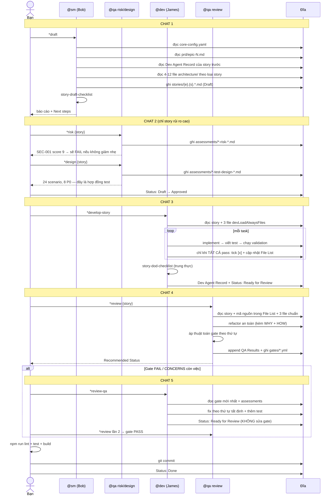

[⬅ Bước trước](./11-ket-thuc.md) · [Chỉ mục](./README.md)

# Bước 12 — Tổng kết: sơ đồ, bảng tra, bài học

File này là **bản đồ một trang** của toàn bộ demo. Nếu bạn chỉ đọc một file, đọc file này.

---

## 1. Toàn bộ hành trình trên một sơ đồ

```mermaid
flowchart TD
    START(["Ý tưởng: 'app ghi chi tiêu'"]) --> INSTALL

    INSTALL["<b>npx bmad-method install</b><br/>→ .bmad-core/ + .claude/commands/"]

    subgraph P1["PHA 1 — HOẠCH ĐỊNH · 0 dòng code"]
        A["<b>@analyst</b> *brainstorm<br/>→ brainstorming-session-results.md"]
        B["<b>@analyst</b> *create-project-brief<br/>→ project-brief.md"]
        C["<b>@pm</b> *create-prd<br/>→ prd.md · 7 FR · 5 NFR · 2 epic · 7 story"]
        D["<b>@ux-expert</b> *create-front-end-spec<br/>→ front-end-spec.md"]
        E["<b>@architect</b> *create-full-stack-architecture<br/>→ architecture.md · 21 section"]
        F{"<b>@po</b> *execute-checklist-po<br/>46 mục kiểm"}
        A --> B --> C --> D --> E --> F
    end

    INSTALL --> A
    F -->|"93% — 3 việc phải sửa"| G["Agent liên quan sửa artifact"]
    G --> F
    F -->|"100% đồng bộ"| H["<b>@po</b> *shard-doc ×2<br/>→ prd/ 10 file · architecture/ 21 file"]

    subgraph P2["PHA 2 — PHÁT TRIỂN · lặp 7 lần"]
        I["CHAT MỚI<br/><b>@sm</b> *draft<br/>đọc epic + 4-12 file architecture<br/>→ story Draft, mọi chi tiết có [Source]"]
        J{"Story rủi ro cao?"}
        K["<b>@qa</b> *risk → *design<br/>→ ma trận rủi ro + 8 P0 test"]
        L["Bạn duyệt: Draft → Approved"]
        M["CHAT MỚI<br/><b>@dev</b> *develop-story<br/>đọc story + 3 file devLoadAlwaysFiles<br/>→ code + test → Ready for Review"]
        N["<b>@qa</b> *trace / *nfr<br/>kiểm giữa kỳ"]
        O["CHAT MỚI<br/><b>@qa</b> *review<br/>→ QA Results + gate .yml"]
        P{"Gate?"}
        Q["CHAT MỚI<br/><b>@dev</b> *review-qa<br/>apply-qa-fixes theo thứ tự tất định"]
        R["Bạn: lint + test + build pass<br/>→ COMMIT → Status: Done"]
        I --> J
        J -->|Có| K --> L
        J -->|Không| L
        L --> M --> N --> O --> P
        P -->|"FAIL / CONCERNS còn việc"| Q --> O
        P -->|"PASS / WAIVED"| R
    end

    H --> I
    R -->|"còn story trong epic"| I
    R -->|"hết epic"| S["Retrospective<br/>→ đưa bài học vào coding-standards<br/>+ technical-preferences"]
    S -->|"còn epic"| I
    S -->|"hết epic"| END(["7/7 story Done · 52 test · dự án hoàn thành"])

    style INSTALL fill:#1a73e8,color:#fff
    style F fill:#f9ab00,color:#fff
    style H fill:#1a73e8,color:#fff
    style P fill:#f9ab00,color:#fff
    style R fill:#34a853,color:#fff
    style END fill:#34a853,color:#fff
```

---

## 2. Sổ đăng ký artifact — ai tạo, ai đọc, ai sửa

| Artifact | Tạo bởi | Đọc bởi | Sửa bởi |
|----------|---------|---------|---------|
| `.bmad-core/**` | installer | mọi agent | installer (update/repair) |
| `core-config.yaml` | installer | **mọi agent** lúc kích hoạt | bạn |
| `technical-preferences.md` | **bạn** | pm · architect · ux-expert · qa | bạn |
| `brainstorming-session-results.md` | analyst | analyst (khi làm brief) | analyst |
| `project-brief.md` | analyst | pm | analyst |
| `prd.md` | pm | ux-expert · architect · po · *(shard → sm)* | pm |
| `front-end-spec.md` | ux-expert | architect · po | ux-expert |
| `architecture.md` | architect | po · *(shard → sm, dev)* | architect |
| `prd/epic-N-*.md` | md-tree (shard) | **sm** | — |
| `architecture/tech-stack.md` | md-tree | sm · **dev (mọi task)** | — |
| `architecture/coding-standards.md` | md-tree | sm · **dev (mọi task)** · qa | — |
| `architecture/unified-project-structure.md` | md-tree | sm · **dev (mọi task)** · qa | — |
| `architecture/testing-strategy.md` | md-tree | sm · qa | — |
| `stories/{e}.{s}.*.md` | **sm** | dev · qa · sm (story sau) · bạn | sm · dev · qa · bạn *(theo section)* |
| Mã nguồn + test | **dev** | qa | dev · qa (refactor an toàn) |
| `qa/assessments/*-risk-*.md` | qa `*risk` | qa `*review` · dev `*review-qa` | qa |
| `qa/assessments/*-test-design-*.md` | qa `*design` | qa `*trace` · dev | qa |
| `qa/assessments/*-trace-*.md` | qa `*trace` | qa `*review` · dev | qa |
| `qa/assessments/*-nfr-*.md` | qa `*nfr` | qa `*review` · dev | qa |
| `qa/gates/{e}.{s}-*.yml` | **qa** | dev `*review-qa` · bạn | **chỉ qa** |
| `epic-N-retrospective.md` | thủ công | bạn | bạn |
| `.ai/debug-log.md` | dev | dev · bạn (khi chẩn đoán) | dev |

---

## 3. Sơ đồ một vòng story hoàn chỉnh

---

## 4. Bảng tra: story cần bao nhiêu chat và lệnh gì

| Loại story | Số chat | Trình tự lệnh |
|---|---|---|
| **Đơn giản, rủi ro thấp** *(1.1, 2.3)* | 3 | `*draft` → `*develop-story` → `*review` |
| **Trung bình** *(2.1, 2.4)* | 4 | `*draft` → `*design` → `*develop-story` → `*review` |
| **Rủi ro cao** *(1.2)* | 5–7 | `*draft` → `*risk` → `*design` → `*develop-story` → `*trace` → `*nfr` → `*review` → `*review-qa` → `*review` |
| **Có thay đổi phạm vi** *(2.2)* | +1 | thêm `*correct-course` (agent pm/po/sm) |

---

## 5. Chín cơ chế đã thấy hoạt động trong demo

| # | Cơ chế | Xuất hiện ở | Nó ngăn điều gì |
|---|--------|-------------|-----------------|
| 1 | **Giao thức kích hoạt**: đọc hết file agent → nạp core-config → chào + `*help` → HALT | mọi bước | Agent tự tiện làm việc chưa được yêu cầu |
| 2 | **Elicitation 9 lựa chọn + rationale 4 phần** | [02](./02-analyst-brief.md), [03](./03-pm-prd.md), [04](./04-ux-spec.md), [05](./05-architect.md) | Agent "chạy một hơi" ra tài liệu bạn không kiểm soát |
| 3 | **Checklist ở mọi mốc** | pm-checklist · architect-checklist · po-master · story-draft · story-dod | Lỗi trượt qua các mốc chuyển giao |
| 4 | **Sharding** | [06](./06-po-validate-va-shard.md) | SM/Dev phải nạp tài liệu 1400 dòng cho mỗi story |
| 5 | **Nén ngữ cảnh vào story + bắt buộc `[Source:]`** | [07](./07-story-1-1-sm.md) | Dev đi đọc PRD/architecture ⇒ ngữ cảnh phình, chất lượng giảm |
| 6 | **`devLoadAlwaysFiles` gọn** | [08](./08-story-1-1-dev.md) | Dev tốn ngữ cảnh cho tài liệu thay vì cho code |
| 7 | **Thuật toán gate tất định 4 bước** | [09](./09-story-1-1-qa.md), [10](./10-story-1-2-rui-ro-cao.md) | Quyết định chất lượng phụ thuộc tâm trạng của model |
| 8 | **Quyền ghi theo section, cưỡng chế 3 lớp** | mọi bước có story | Nhiều agent ghi cùng file rồi phá nhau |
| 9 | **Vòng phản hồi giữa các story** *(Dev Agent Record → story sau)* | [10](./10-story-1-2-rui-ro-cao.md) §10.1 | Lặp lại cùng một sai lầm ở story tiếp theo |

---

## 6. Sáu chỗ dễ làm sai nhất — và cách nhận biết

| # | Sai | Dấu hiệu nhận biết | Sửa |
|---|-----|-------------------|-----|
| 1 | **Dùng lại chat khi đổi agent** | Agent nhắc lại chuyện của vai trước, chất lượng giảm dần | Mở chat mới mỗi lần SM → Dev → QA |
| 2 | **Duyệt story mà không đọc** | Dev liên tục hỏi lại, hoặc tự đi đọc PRD | Áp "câu hỏi vàng": dev lạ đọc story này làm được không? |
| 3 | **Bỏ qua elicitation cho nhanh** | Tài liệu ra một lượt, không có rationale | Yêu cầu làm lại từng section; dùng `#yolo` chỉ khi đã rất rõ |
| 4 | **Ép agent bỏ qua HALT** | Bạn gõ "cứ tiếp tục đi" khi Dev báo blocking | Xử lý **nguyên nhân gốc**; HALT là bảo vệ, không phải lỗi |
| 5 | **Waive gate mà không hiểu rủi ro** | Gate WAIVED nhưng `reason` chung chung | Đọc `risk_summary` và `top_issues` trước khi waive |
| 6 | **Bảo Dev sửa khi thực chất là thay đổi phạm vi** | PRD/spec dần lệch khỏi code | Dùng `*correct-course` → Sprint Change Proposal |

---

## 7. Ba việc phải làm một lần trước khi bắt đầu dự án thật

Rút ra từ demo — nếu bỏ qua, bạn sẽ gặp lỗi ở giữa đường:

### 1. Điền `technical-preferences.md`

Mặc định file này chỉ có `None Listed`. Điền vào ⇒ Architect chọn đúng stack ngay ở [bước 5](./05-architect.md) thay vì hỏi bạn 10 câu. Xem mẫu ở [01-cai-dat.md](./01-cai-dat.md#việc-bạn-nên-làm-ngay-nhưng-hầu-hết-mọi-người-bỏ-qua).

### 2. Sửa `apply-qa-fixes.md` theo stack của bạn

File này viết cứng lệnh Deno (`deno lint`, `deno test -A`) và đường dẫn dự án khác (`deps.ts`, `src/core/di.ts`). Không sửa ⇒ ở [bước 10](./10-story-1-2-rui-ro-cao.md#107-dev-áp-fix-review-qa) Dev sẽ chạy lệnh không tồn tại.

### 3. Đối chiếu `devLoadAlwaysFiles` với tên section thật của architecture

`core-config.yaml` mặc định trỏ tới `docs/architecture/source-tree.md`, nhưng template `fullstack-architecture` đặt tên section là **"Unified Project Structure"** ⇒ sau khi shard sẽ ra tên khác. `po-master-checklist` bắt được lỗi này ở [bước 6](./06-po-validate-va-shard.md), nhưng biết trước thì đỡ mất một vòng.

Ngoài ra: thêm `test-levels-framework.md` và `test-priorities-matrix.md` vào `dependencies.data` của `qa.md` — hai file này bị `test-design.md` yêu cầu nạp nhưng không agent nào khai báo.

---

## 8. So sánh: có BMAD và không có BMAD

| | Không có BMAD | Có BMAD (như demo) |
|---|---|---|
| Yêu cầu | trong đầu bạn, mơ hồ | 7 FR + 5 NFR đo được, có checklist xác nhận |
| Quyết định công nghệ | vừa làm vừa chọn | chốt trước, có phiên bản cụ thể, có lý do ghi lại |
| Ngữ cảnh cho AI | dán lại mỗi lần, mỗi lần một kiểu | nén sẵn trong story, có trích nguồn |
| Test | viết khi nhớ ra | hợp đồng P0/P1/P2 từ `*design`, `*trace` kiểm |
| Bảo mật | phát hiện khi bị tấn công | SEC-001 bị bắt **trước khi** có dòng code nào |
| Khi thay đổi phạm vi | sửa code, tài liệu lệch dần | Sprint Change Proposal, cập nhật đủ 3 artifact |
| Bài học | mất theo hội thoại | vào Completion Notes → story sau → coding-standards |
| Dấu vết quyết định | không có | 7 gate `.yml` + 9 assessment + 2 retrospective |
| **Chi phí** | thấp lúc đầu, cao về sau | cao lúc đầu (pha hoạch định), thấp về sau |

⚙️ Đánh đổi trung thực: BMAD **chậm hơn** ở 20% đầu (hoạch định) và **nhanh hơn** ở 80% sau. Với script 200 dòng thì nó là gánh nặng. Với dự án nhiều story, nhiều phiên làm việc, nhiều người thì nó là thứ giữ cho dự án không rã.

---

## 9. Đọc tiếp gì

| Bạn muốn | Đọc |
|---|---|
| Hiểu chi tiết một agent / task / template cụ thể | [`../docs/bmad-core-manual/README.md`](../docs/bmad-core-manual/README.md) |
| Chạy thủ công không cần cài đặt (dán prompt vào bất kỳ LLM) | [`../docs/bmad-core-manual/13-cong-thuc-van-hanh-thu-cong.md`](../docs/bmad-core-manual/13-cong-thuc-van-hanh-thu-cong.md) |
| Xem tài nguyên của từng agent gom một chỗ | [`../bmad-core-by-agent/README.md`](../bmad-core-by-agent/README.md) |
| Hiểu kiến trúc và thuật toán bên dưới framework | [`../docs/specs/02-thiet-ke-he-thong.md`](../docs/specs/02-thiet-ke-he-thong.md) |
| Luồng dữ liệu chi tiết ở mức trường/khoá | [`../docs/specs/04-luong-du-lieu-end-to-end.md`](../docs/specs/04-luong-du-lieu-end-to-end.md) |
| Vận hành thật: cài, cấu hình, CI, nâng cấp, xử lý sự cố | [`../docs/specs/03-van-hanh-he-thong.md`](../docs/specs/03-van-hanh-he-thong.md) |
| 18 điểm không nhất quán trong repo cần biết | [`../docs/bmad-core-manual/14-tra-cuu-nhanh-va-canh-bao.md`](../docs/bmad-core-manual/14-tra-cuu-nhanh-va-canh-bao.md) |
| Dự án brownfield (code đã có sẵn) | [`../docs/working-in-the-brownfield.md`](../docs/working-in-the-brownfield.md) |

---

[⬅ Bước trước](./11-ket-thuc.md) · [Chỉ mục demo](./README.md)
