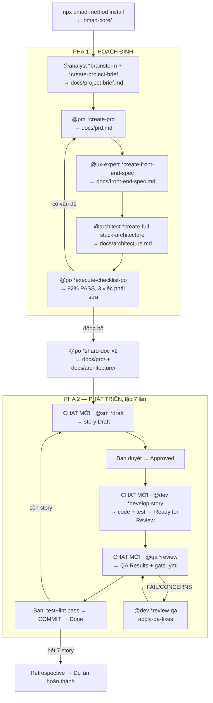

# DEMO — Kịch bản chạy BMAD-METHOD từ đầu đến cuối

> **Đây là kịch bản MINH HOẠ**, không phải log của một lần chạy thật. Mọi **lệnh, đường dẫn file, quy tắc, ngưỡng số, tên section** đều tra đúng từ `bmad-core/` v4.44.2. Phần **nội dung** (chữ trong PRD, mã nguồn, số liệu) là ví dụ tôi soạn để bạn hình dung — LLM thật sẽ sinh nội dung khác nhưng **cấu trúc và luồng thì giống hệt**.

---

## Đề bài của demo

Xây **ChiTieu** — web app ghi chi tiêu cá nhân. MVP: đăng ký/đăng nhập, thêm–sửa–xoá giao dịch, phân loại, báo cáo tháng.

Dự án **greenfield**, có UI ⇒ dùng workflow `greenfield-fullstack`.

---

## Đọc theo thứ tự

| # | File | Bước | Lệnh chính | Kết quả |
|---|------|------|-----------|---------|
| 0 | [00-boi-canh.md](./00-boi-canh.md) | Bối cảnh & trạng thái ban đầu | — | Thư mục rỗng |
| 1 | [01-cai-dat.md](./01-cai-dat.md) | Cài framework | `npx bmad-method install` | `.bmad-core/` + command của IDE |
| 2 | [02-analyst-brief.md](./02-analyst-brief.md) | Brainstorm + Project Brief | `@analyst` → `*brainstorm` → `*create-project-brief` | `docs/project-brief.md` |
| 3 | [03-pm-prd.md](./03-pm-prd.md) | PRD | `@pm` → `*create-prd` | `docs/prd.md` (7 FR · 5 NFR · 2 epic · 7 story) |
| 4 | [04-ux-spec.md](./04-ux-spec.md) | UI/UX Spec | `@ux-expert` → `*create-front-end-spec` | `docs/front-end-spec.md` |
| 5 | [05-architect.md](./05-architect.md) | Kiến trúc | `@architect` → `*create-full-stack-architecture` | `docs/architecture.md` |
| 6 | [06-po-validate-va-shard.md](./06-po-validate-va-shard.md) | Chốt kiểm + chẻ tài liệu | `@po` → `*execute-checklist-po` → `*shard-doc` | `docs/prd/` + `docs/architecture/` |
| 7 | [07-story-1-1-sm.md](./07-story-1-1-sm.md) | SM tạo story 1.1 | `@sm` → `*draft` | `docs/stories/1.1.*.md` (Draft) |
| 8 | [08-story-1-1-dev.md](./08-story-1-1-dev.md) | Dev triển khai 1.1 | `@dev` → `*develop-story` | Mã nguồn + test + Ready for Review |
| 9 | [09-story-1-1-qa.md](./09-story-1-1-qa.md) | QA review 1.1 | `@qa` → `*review` | Gate **PASS** → Done |
| 10 | [10-story-1-2-rui-ro-cao.md](./10-story-1-2-rui-ro-cao.md) | Vòng đầy đủ cho story rủi ro cao | `*risk` → `*design` → dev → `*trace`/`*nfr` → `*review` **FAIL** → `*review-qa` → **PASS** | Minh hoạ toàn bộ cơ chế QA |
| 11 | [11-ket-thuc.md](./11-ket-thuc.md) | Hết epic → hoàn thành dự án | lặp SM→Dev→QA | 7/7 story Done |
| 12 | [12-tong-ket-so-do.md](./12-tong-ket-so-do.md) | Tổng kết: sơ đồ, bảng artifact, bài học | — | Toàn cảnh |

---

## Bản đồ toàn bộ kịch bản



---

## Bảng tổng: lệnh → đọc file nào → sinh file nào

| Bước | Lệnh | Agent ĐỌC | Agent GHI |
|------|------|-----------|-----------|
| 1 | `npx bmad-method install` | `bmad-core/**` (nguồn npm) | `.bmad-core/**` · `.claude/commands/BMad/**` · `install-manifest.yaml` |
| 2a | `@analyst` *(kích hoạt)* | `analyst.md` · `core-config.yaml` | — *(chỉ chào + `*help`)* |
| 2b | `*brainstorm "app chi tiêu"` | `tasks/facilitate-brainstorming-session.md` · `data/brainstorming-techniques.md` · `templates/brainstorming-output-tmpl.yaml` | `docs/brainstorming-session-results.md` |
| 2c | `*create-project-brief` | `tasks/create-doc.md` · `templates/project-brief-tmpl.yaml` · `data/elicitation-methods.md` | `docs/project-brief.md` |
| 3 | `@pm` → `*create-prd` | `pm.md` · `core-config.yaml` · `tasks/create-doc.md` · `templates/prd-tmpl.yaml` · `data/elicitation-methods.md` · `data/technical-preferences.md` · `docs/project-brief.md` | `docs/prd.md` |
| 4 | `@ux-expert` → `*create-front-end-spec` | `ux-expert.md` · `templates/front-end-spec-tmpl.yaml` · `docs/prd.md` | `docs/front-end-spec.md` |
| 5 | `@architect` → `*create-full-stack-architecture` | `architect.md` · `templates/fullstack-architecture-tmpl.yaml` · `data/technical-preferences.md` · `docs/prd.md` · `docs/front-end-spec.md` | `docs/architecture.md` |
| 6a | `@po` → `*execute-checklist-po` | `po.md` · `tasks/execute-checklist.md` · `checklists/po-master-checklist.md` · cả 3 tài liệu trên | báo cáo *(không ghi file)* |
| 6b | `*shard-doc docs/prd.md docs/prd` | `tasks/shard-doc.md` · `core-config.yaml` (`markdownExploder`) | `docs/prd/index.md` + `epic-1-*.md` + `epic-2-*.md` + 6 file khác |
| 7 | `@sm` → `*draft` | `sm.md` · `core-config.yaml` · `tasks/create-next-story.md` · `templates/story-tmpl.yaml` · `docs/prd/epic-1-*.md` · 4 file `docs/architecture/*` · `checklists/story-draft-checklist.md` | `docs/stories/1.1.khoi-tao-du-an.md` |
| 8 | `@dev` → `*develop-story` | `dev.md` · `core-config.yaml` · 3 file `devLoadAlwaysFiles` · file story · `checklists/story-dod-checklist.md` | mã nguồn · test · các section Dev Agent Record của story |
| 9 | `@qa` → `*review` | `qa.md` · `tasks/review-story.md` · `templates/qa-gate-tmpl.yaml` · file story · mã nguồn trong File List | section QA Results của story · `docs/qa/gates/1.1-*.yml` |
| 10 | `*risk` · `*design` · `*trace` · `*nfr` | tương ứng 4 task QA + `data/test-levels-framework.md` + `data/test-priorities-matrix.md` | 4 file trong `docs/qa/assessments/` |
| 10b | `@dev` → `*review-qa` | `tasks/apply-qa-fixes.md` · gate `.yml` · các assessment | mã nguồn · test · story (section của Dev) |

---

## Cách dùng demo này

- **Muốn hình dung nhanh**: đọc [12-tong-ket-so-do.md](./12-tong-ket-so-do.md) trước, rồi quay lại từ file 00.
- **Muốn làm theo từng bước**: đọc tuần tự 00 → 12, mỗi file có mục "Bạn tự làm gì ở bước này".
- **Muốn biết vì sao phải làm vậy**: mỗi file có mục "Cơ chế bên dưới" giải thích quy tắc nào trong `bmad-core` đang chi phối.
- **Muốn tra cú pháp/quy tắc**: xem [`../docs/bmad-core-manual/README.md`](../docs/bmad-core-manual/README.md).
- **Muốn chạy thủ công không cài đặt**: xem [`../docs/bmad-core-manual/13-cong-thuc-van-hanh-thu-cong.md`](../docs/bmad-core-manual/13-cong-thuc-van-hanh-thu-cong.md).

## Quy ước trình bày trong demo

| Khối | Nghĩa |
|------|-------|
| ```text 👤 Bạn: … ``` | Bạn gõ |
| ```text 🤖 Agent: … ``` | Agent trả lời (rút gọn) |
| 📂 | Cây file / thay đổi trên đĩa |
| ⚙️ **Cơ chế bên dưới** | Quy tắc nào trong `bmad-core` đang chi phối |
| ⚠️ | Chỗ dễ làm sai |
