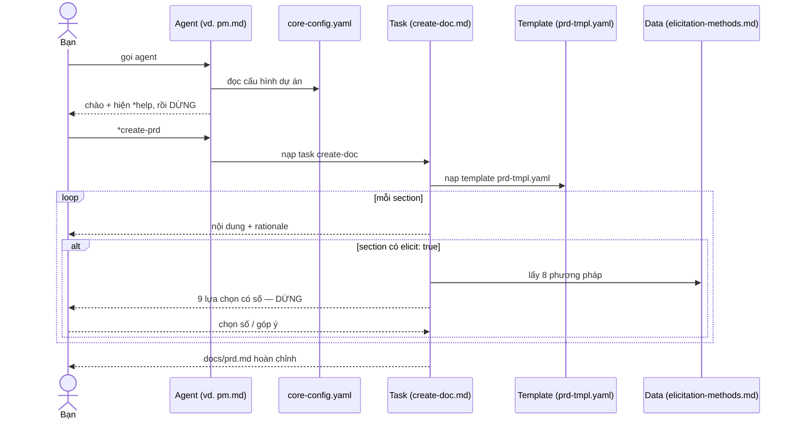

[⬅ Về chỉ mục](./README.md)

# 01 — Tổng quan & kiến trúc thư mục `bmad-core`

## 1. `bmad-core` là gì

`bmad-core/` là **bộ não** của BMAD-METHOD: một tập hợp file Markdown và YAML **không chứa một dòng mã lập trình nào**. Nó không "chạy" theo nghĩa kỹ thuật — nó được **một LLM đọc và thực thi**. Tooling trong `tools/` chỉ làm việc đóng gói và phân phối thư mục này; bỏ hết tooling đi, bạn vẫn dùng được `bmad-core` bằng cách dán nội dung file vào bất kỳ trợ lý AI nào.

Hệ quả quan trọng cho việc dùng thủ công: **mọi thứ bạn cần đều đọc được bằng mắt**. Không có cấu hình ẩn, không có trạng thái ngầm.

## 2. Cây thư mục và vai trò

```text
bmad-core/
├── core-config.yaml        ← BẢN ĐỒ dự án: agent đọc file này TRƯỚC KHI làm gì khác
├── agents/                 ← 10 VAI: persona + danh sách lệnh + whitelist phụ thuộc
│   ├── analyst.md          (Mary)      · pm.md (John)        · architect.md (Winston)
│   ├── ux-expert.md        (Sally)     · po.md (Sarah)       · sm.md (Bob)
│   ├── dev.md              (James)     · qa.md (Quinn)
│   └── bmad-master.md      · bmad-orchestrator.md
├── tasks/                  ← 21 THỦ TỤC chạy được (đọc tới đâu làm tới đó)
├── templates/              ← 13 KHUÔN đầu ra YAML (cấu trúc + chỉ dẫn cho LLM)
├── checklists/             ← 6 BỘ KIỂM chất lượng
├── data/                   ← 6 file TRI THỨC tham chiếu
├── workflows/              ← 6 TRÌNH TỰ agent–artifact theo loại dự án
└── agent-teams/            ← 4 BUNDLE vai trò (dùng cho môi trường web)

common/                     ← dùng chung giữa core và expansion pack
├── tasks/create-doc.md            ← engine sinh tài liệu từ template
├── tasks/execute-checklist.md     ← engine chạy checklist
├── utils/bmad-doc-template.md     ← đặc tả cú pháp template
└── utils/workflow-management.md   ← quy ước quản lý workflow/plan
```

> **Lưu ý khi dùng bản đã cài**: sau khi cài, `common/` được **gộp vào** `.bmad-core/` (thành `.bmad-core/tasks/create-doc.md`, `.bmad-core/utils/…`). Vì vậy khi agent nói "task `create-doc`", nó nằm ở `{root}/tasks/create-doc.md` bất kể nguồn ban đầu là `common/`.

## 3. Năm loại tài nguyên và mối quan hệ

| Loại | Trả lời câu hỏi | Định dạng | Ai gọi nó |
|------|----------------|-----------|-----------|
| **Agent** | *Tôi là ai, tôi làm được gì?* | `.md` chứa 1 block YAML | Người dùng gọi trực tiếp |
| **Task** | *Làm việc X theo các bước nào?* | `.md` văn xuôi có cấu trúc | Agent gọi khi bạn ra lệnh |
| **Template** | *Tài liệu đầu ra có hình dạng gì?* | `.yaml` | Task `create-doc` đọc |
| **Checklist** | *Đã đủ chất lượng chưa?* | `.md` có nhúng `[[LLM: …]]` | Task `execute-checklist` đọc |
| **Data** | *Tri thức/quy tắc nền để tra?* | `.md` | Task hoặc agent tra khi cần |
| **Workflow** | *Thứ tự các vai và artifact?* | `.yaml` | Người dùng hoặc orchestrator đọc |
| **Team** | *Gói vai nào đi cùng nhau?* | `.yaml` | Chỉ dùng khi dựng bundle web |

Quan hệ điển hình khi bạn ra một lệnh:



## 4. Thứ tự nạp — điều quyết định chất lượng

Đây là phần dễ làm sai nhất khi dùng thủ công. Trình tự **bắt buộc**:

| Thứ tự | Nạp gì | Vì sao |
|--------|--------|--------|
| 1 | **Toàn bộ file agent** | Là định nghĩa persona đầy đủ; không được đọc một phần |
| 2 | **`core-config.yaml`** | Agent phải biết tài liệu dự án nằm ở đâu **trước khi** chào |
| 3 | *(chỉ với `dev`)* **toàn bộ file trong `devLoadAlwaysFiles`** | Đây là "luật" mà dev phải tuân theo mọi lúc |
| 4 | **DỪNG** — chào + `*help` | Không tự ý làm gì tiếp |
| 5 | Khi có lệnh: nạp **đúng** task/template/checklist/data mà lệnh đó cần | Giữ ngữ cảnh cho công việc thật |

**Không bao giờ**: nạp trước toàn bộ `tasks/` hay `templates/`; nạp file agent khác trong lúc đang nhập một vai; để `dev` đọc PRD/architecture (trừ khi story chỉ định rõ).

## 5. Placeholder `{root}`

Trong file nguồn, đường dẫn được viết là `{root}/tasks/create-doc.md`. Ý nghĩa:

- Sau khi cài đặt: `{root}` = `.bmad-core` (hoặc `.{pack-id}` với expansion pack).
- Khi dùng thủ công: bạn tự thay `{root}` bằng đường dẫn thật, ví dụ `bmad-core/tasks/create-doc.md`.
- Quy tắc ánh xạ phụ thuộc: `dependencies.<type>.<name>` → `{root}/<type>/<name>`.
  - `templates` dùng đuôi `.yaml`; các loại còn lại dùng `.md`.

## 6. Nơi artifact được ghi ra

`bmad-core` không tự chứa artifact — nó sinh ra chúng trong project của bạn:

```text
docs/
├── brief.md hoặc project-brief.md   ← analyst (xem cảnh báo ở file 14)
├── prd.md            → shard → docs/prd/     (index.md + epic-*.md + …)
├── architecture.md   → shard → docs/architecture/ (coding-standards.md, tech-stack.md, source-tree.md, …)
├── front-end-spec.md
├── ui-architecture.md            ← front-end-architecture-tmpl (xem cảnh báo ở file 14)
├── market-research.md · competitor-analysis.md · brainstorming-session-results.md
├── stories/{epic}.{story}.{slug}.md
└── qa/
    ├── assessments/{epic}.{story}-{risk|test-design|trace|nfr}-{YYYYMMDD}.md
    └── gates/{epic}.{story}-{slug}.yml
.ai/debug-log.md                   ← dev ghi log thất bại lặp lại
```

## 7. Hai chế độ vận hành `bmad-core`

| | Chế độ IDE (khuyến nghị cho code) | Chế độ Web/thủ công (khuyến nghị cho tài liệu lớn) |
|---|---|---|
| Cách nạp agent | Slash/@ command hoặc dán file agent vào chat | Dán nội dung file agent vào chat, hoặc upload bundle `dist/teams/*.txt` |
| Truy cập file | Có — agent tự đọc/ghi file dự án | Không — bạn phải copy nội dung vào/ra bằng tay |
| Dùng cho | sharding, story, code, test, QA review | brainstorm, brief, PRD, architecture, spec |
| Cạm bẫy | ngữ cảnh phình nếu không mở chat mới | quên copy artifact về project |

Chi tiết cách chạy thủ công từng bước: xem [13 — Công thức vận hành thủ công](./13-cong-thuc-van-hanh-thu-cong.md).

## 8. Bốn nguyên tắc thiết kế bạn nên tôn trọng khi tự sửa `bmad-core`

1. **Dev agent phải gọn** — đừng thêm phụ thuộc cho `dev.md`; nhồi ngữ cảnh vào story thay vì vào agent.
2. **Ngôn ngữ tự nhiên trước** — đừng nhét mã/logic vào core; viết chỉ dẫn rõ ràng bằng tiếng Anh/Việt.
3. **Nhiều task nhỏ hơn một task nhiều nhánh** — tách theo mục đích, để agent chọn.
4. **Tái dùng `create-doc`** — cần loại tài liệu mới thì viết template mới, đừng viết task sinh tài liệu mới.

---

**Tiếp theo**: [02 — core-config.yaml](./02-core-config.md)
