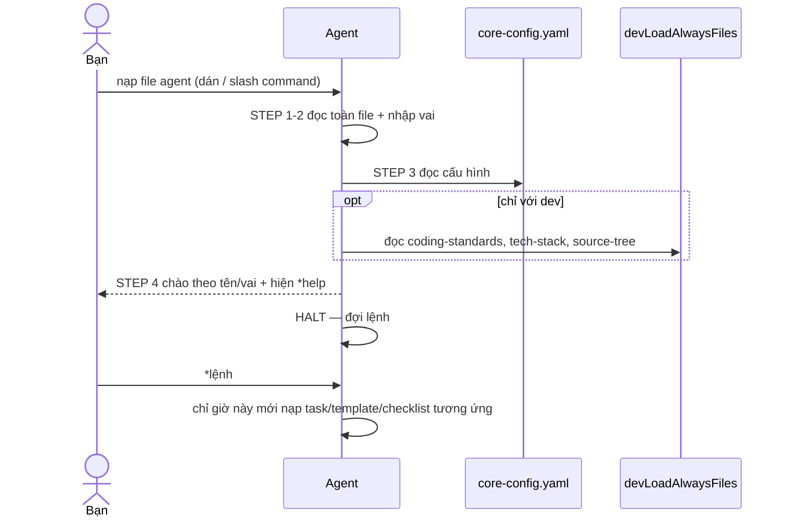

[⬅ Về chỉ mục](./README.md)

# 04 — Giao thức kích hoạt & hệ lệnh

Đây là phần "hệ điều hành" của `bmad-core`. Hiểu đúng phần này thì mọi agent đều hoạt động như thiết kế; hiểu sai thì agent sẽ trôi dạt, bịa nội dung, hoặc bỏ qua các chốt kiểm.

## 1. Giao thức kích hoạt (activation protocol)

Trình tự chuẩn, lấy nguyên văn từ `bmad-core/agents/dev.md`:

| Bước | Hành động | Ghi chú vận hành |
|------|-----------|------------------|
| STEP 1 | **Đọc TOÀN BỘ file agent** — đó là định nghĩa persona đầy đủ | Không đọc một phần, không tóm tắt |
| STEP 2 | Nhập vai theo mục `agent` và `persona` | |
| STEP 3 | **Nạp và đọc `{root}/core-config.yaml`** | Phải xong **trước khi** chào |
| STEP 4 | Chào người dùng bằng tên/vai, **chạy ngay `*help`** | |
| — | **KHÔNG** nạp file agent nào khác lúc kích hoạt | |
| — | **CHỈ** nạp file phụ thuộc khi người dùng chọn thực thi | Đây là điều giữ ngữ cảnh gọn |
| — | `agent.customization` **luôn** thắng mọi chỉ dẫn xung khắc | |
| — | Khi chạy task từ dependencies: **làm theo đúng chữ, đó là workflow chạy được, không phải tài liệu tham khảo** | |
| — | Task có `elicit=true`: **bắt buộc** tương tác đúng định dạng, không được bỏ qua để "cho nhanh" | |
| — | Khi chạy task chính thức: **chỉ dẫn của task ghi đè mọi ràng buộc hành vi nền** | |
| — | Khi liệt kê lựa chọn: **luôn dùng danh sách có số** để người dùng chỉ cần gõ số | |
| — | **GIỮ NHÂN VẬT** cho tới khi được yêu cầu thoát | |

**Riêng `dev` có thêm 4 dòng CRITICAL:**

- Đọc **toàn bộ** file trong `devLoadAlwaysFiles` — đây là luật phát triển của dự án.
- **KHÔNG** nạp file nào khác lúc khởi động ngoài story được giao và `devLoadAlwaysFiles`.
- **KHÔNG** bắt đầu phát triển khi story còn ở trạng thái draft và chưa được bảo tiếp tục.
- Khi kích hoạt: **chỉ** chào, tự chạy `*help`, rồi **HALT**. Ngoại lệ duy nhất: nếu lệnh đã được truyền kèm lúc kích hoạt.

### Sơ đồ

## 2. Hệ lệnh

### 2.1 Quy ước

- **Mọi lệnh dùng tiền tố `*`**: `*help`, `*draft`, `*review {story}`.
- Agent phải **nhắc** người dùng rằng lệnh cần tiền tố `*` (orchestrator ghi rõ điều này).
- `*help` phải hiện **danh sách có số** để bạn chọn bằng số.
- Trong bundle web, một số tài liệu dùng `/help`, `/pm` — đó là cú pháp của nền tảng host; lệnh nội bộ của agent vẫn là `*`.

### 2.2 Khớp yêu cầu linh hoạt (REQUEST-RESOLUTION)

Bạn không buộc phải nhớ tên lệnh. Agent được yêu cầu khớp mờ yêu cầu tự nhiên sang lệnh/phụ thuộc:

| Bạn nói | Agent hiểu |
|---------|-----------|
| "draft story" | `*create` → task `create-next-story` |
| "make a new prd" | task `create-doc` + template `prd-tmpl.yaml` |
| "architecture checklist" | checklist `architect-checklist` |

Nếu **không** khớp rõ ràng, agent **phải hỏi lại** — không được đoán.

### 2.3 Lệnh dùng chung ở nhiều agent

| Lệnh | Có ở | Tác dụng |
|------|------|----------|
| `*help` | tất cả | Danh sách lệnh có số |
| `*exit` | tất cả | Rời persona (một số agent hỏi xác nhận) |
| `*doc-out` | analyst, pm, architect, po, bmad-master, orchestrator | Xuất tài liệu đang làm ra file đích |
| `*yolo` | analyst, pm, architect, po, bmad-master, orchestrator | Bật/tắt YOLO |
| `*execute-checklist {name}` | architect, bmad-master (po có biến thể `*execute-checklist-po`) | Chạy checklist |
| `*correct-course` | pm, po, sm | Xử lý thay đổi giữa dòng |
| `*shard-doc` / `*shard-prd` | po, pm, architect, bmad-master | Chẻ tài liệu |

## 3. Các chế độ tương tác

| Chế độ | Kích hoạt | Hành vi | Khi nào dùng |
|--------|-----------|---------|--------------|
| **Interactive** (mặc định) | `workflow.mode: interactive` trong template | Xử lý **từng section**, dừng ở mỗi `elicit: true` | Tài liệu quan trọng: PRD, architecture, spec |
| **YOLO** | `*yolo` hoặc gõ `#yolo` trong `create-doc` | Sinh **toàn bộ** section một lượt | Khi bạn đã rất rõ yêu cầu; hoặc chạy checklist (được khuyến nghị) |
| **Non-interactive** | `workflow.mode: non-interactive` (vd. `brainstorming-output-tmpl`) | Không hỏi, chỉ ghi kết quả | Template ghi lại kết quả một phiên đã diễn ra |
| **KB mode** | `*kb` (bmad-master) hoặc `*kb-mode` (orchestrator) | Nạp `bmad-kb.md`, trình bày theo **8 chủ đề**, đợi bạn chọn | Khi bạn muốn hỏi về chính phương pháp BMad |
| **Chat mode** | `*chat-mode` (orchestrator) | Hội thoại tự do có hướng dẫn | Khi chưa biết bắt đầu từ đâu |
| **Party mode** | `*party-mode` (orchestrator) | Chat nhóm nhiều agent | Retrospective, brainstorm đa góc nhìn |

## 4. Hai định dạng elicitation — đừng nhầm

Đây là điểm khác biệt thật trong repo, cần nắm rõ khi dùng thủ công:

| | Trong task `create-doc` | Trong task `advanced-elicitation` |
|---|---|---|
| Dải số | **1–9** | **0–9** |
| Lựa chọn "đi tiếp" | **Option 1** = "Proceed to next section" | **Option 9** = "Proceed / No Further Actions" |
| Số phương pháp | 8 (option 2–9) | 9 (option 0–8) |
| Câu kết bắt buộc | "Select 1-9 or just type your question/feedback:" | "Choose a number (0-8) or 9 to proceed:" |

**Cách xử lý thực tế**: nhìn dòng nhắc mà agent in ra để biết đang ở định dạng nào. Nếu agent hỏi kiểu yes/no cho elicitation → **đó là vi phạm quy trình**, hãy yêu cầu nó trình bày lại đúng định dạng có số.

## 5. Các chốt dừng bắt buộc (đừng "sửa" chúng)

| Chốt | Ai kích hoạt | Ý nghĩa |
|------|--------------|---------|
| `elicit: true` | `create-doc` | Bạn phải xem và quyết định nội dung section |
| Thiếu `core-config.yaml` | `create-next-story`, `validate-next-story` | HALT + hướng dẫn khắc phục |
| Story trước chưa `Done` | `create-next-story` | Cảnh báo + hỏi bạn có chấp nhận rủi ro |
| Epic đã hoàn tất | `create-next-story` | Hỏi 3 lựa chọn; **tuyệt đối không tự nhảy epic** |
| 5 điều kiện blocking | `dev` | HALT chờ bạn giải quyết gốc rễ |
| Story chưa ở `Review` | `review-story` | Không review |
| File List rỗng/thiếu | `review-story` | Dừng và yêu cầu làm rõ |
| Không có artifact QA | `apply-qa-fixes` | HALT, yêu cầu QA tạo gate trước |
| `md-tree` không có | `shard-doc` | **DỪNG**, không tự chẻ tay |

**Nguyên tắc**: mỗi lần hệ thống dừng là một lần nó đang bảo vệ chất lượng. Ép agent bỏ qua chốt dừng là cách nhanh nhất để mất chất lượng và sinh ảo giác.

## 6. Quản lý ngữ cảnh hội thoại

| Quy tắc | Lý do |
|---------|-------|
| **Mở chat mới mỗi lần đổi agent** (SM → Dev → QA) | Ngữ cảnh sạch = chất lượng cao hơn; agent không bị "nhiễm" vai trước |
| Dùng **model mạnh nhất** cho `sm` | Bước tạo story quyết định toàn bộ chất lượng phía sau |
| Nén hội thoại + mở chat mới sau mỗi story | Chống suy giảm hiệu năng do ngữ cảnh phình |
| Một agent — một task — một hội thoại | Giữ trọng tâm |
| Chỉ 1 story `InProgress` tại một thời điểm | Tuần tự để kiểm soát được |

## 7. Bảng đối chiếu cú pháp gọi agent theo môi trường

| Môi trường | Cách gọi |
|-----------|----------|
| Claude Code, Windsurf, iFlow CLI | `/dev`, `/pm`, `/architect` |
| Cursor, Trae, Cline | `@dev`, `@pm`, `@architect` |
| Gemini CLI, Qwen Code | `/BMad:agents:dev`, `/BMad:tasks:create-doc` |
| Roo Code, Kilo Code | Chọn mode `bmad-dev` từ mode selector |
| GitHub Copilot | Chat view → chọn **Agent** |
| Auggie CLI | `/bmad:dev` |
| Codex CLI/Web | Prompt tự nhiên: "As dev, implement …" |
| Crush | `Ctrl+P` → `Tab` → chọn |
| Bundle web | `*agent dev` (từ orchestrator) |
| **Thủ công (bất kỳ LLM)** | Dán toàn bộ nội dung file agent + câu "Your critical operating instructions are attached, do not break character as directed" |

---

**Tiếp theo**: [05 — Tasks: tài liệu](./05-tasks-tai-lieu.md)
