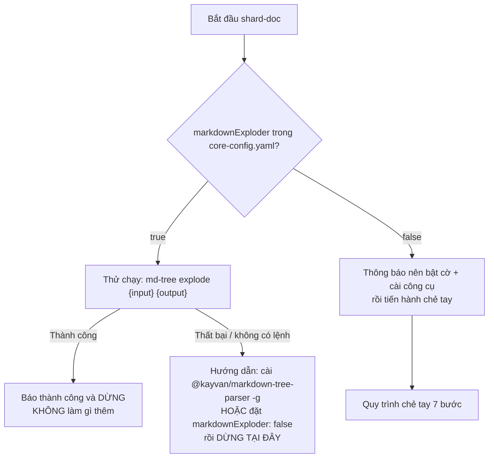

[⬅ Về chỉ mục](./README.md)

# 05 — Tasks nhóm tài liệu

Nhóm này gồm 10 task lo việc **sinh, tinh chỉnh, chẻ, đánh chỉ mục và tài liệu hoá**. Hai task quan trọng nhất (`create-doc`, `execute-checklist`) nằm ở `common/tasks/` nhưng sau khi cài sẽ ở `{root}/tasks/`.

| Task | File | Ai dùng |
|------|------|---------|
| [create-doc](#1-create-doc) | `common/tasks/create-doc.md` | analyst, pm, architect, ux-expert, bmad-master, orchestrator |
| [advanced-elicitation](#2-advanced-elicitation) | `tasks/advanced-elicitation.md` | analyst, bmad-master, orchestrator |
| [execute-checklist](#3-execute-checklist) | `common/tasks/execute-checklist.md` | pm, architect, po, sm, dev, ux-expert, bmad-master |
| [shard-doc](#4-shard-doc) | `tasks/shard-doc.md` | po, pm, architect, bmad-master |
| [index-docs](#5-index-docs) | `tasks/index-docs.md` | bmad-master |
| [document-project](#6-document-project) | `tasks/document-project.md` | analyst, architect, bmad-master |
| [facilitate-brainstorming-session](#7-facilitate-brainstorming-session) | `tasks/facilitate-brainstorming-session.md` | analyst, bmad-master |
| [create-deep-research-prompt](#8-create-deep-research-prompt) | `tasks/create-deep-research-prompt.md` | analyst, pm, architect, bmad-master |
| [generate-ai-frontend-prompt](#9-generate-ai-frontend-prompt) | `tasks/generate-ai-frontend-prompt.md` | ux-expert, bmad-master |
| [kb-mode-interaction](#10-kb-mode-interaction) | `tasks/kb-mode-interaction.md` | orchestrator |

---

## 1. `create-doc`

**Đây là engine sinh tài liệu của toàn hệ thống.** Mọi tài liệu lớn (brief, PRD, architecture, spec, research) đều đi qua đây.

**Mục đích**: đọc một template YAML và cùng bạn sinh ra tài liệu Markdown sạch, từng section một.

**Đầu vào**: một template YAML. Nếu bạn không cung cấp → task **liệt kê** toàn bộ template trong `{root}/templates` hoặc hỏi bạn.

### Cảnh báo thực thi (nguyên văn tinh thần của task)

> **ĐÂY LÀ WORKFLOW CHẠY ĐƯỢC — KHÔNG PHẢI TÀI LIỆU THAM KHẢO**
>
> 1. **VÔ HIỆU MỌI TỐI ƯU HIỆU NĂNG** — workflow này cần tương tác đầy đủ
> 2. **THỰC THI TỪNG BƯỚC BẮT BUỘC** — mỗi section xử lý tuần tự kèm phản hồi của người dùng
> 3. **ELICITATION LÀ BẮT BUỘC** — khi `elicit: true` phải dùng định dạng 1-9 và **đợi** phản hồi
> 4. **KHÔNG ĐƯỢC ĐI ĐƯỜNG TẮT**
>
> **DẤU HIỆU VI PHẠM**: nếu tạo xong trọn tài liệu mà không có tương tác của người dùng → đã vi phạm workflow này.

### Luồng xử lý

```text
1. Parse template YAML — đọc metadata + danh sách sections
2. Đặt tùy chọn — hiện chế độ hiện tại (Interactive), xác nhận file đầu ra
3. Với TỪNG section:
     - bỏ qua nếu điều kiện (condition) không thoả
     - kiểm tra quyền (owner/editors) — ghi chú nếu section bị hạn chế cho agent cụ thể
     - soạn nội dung theo `instruction` của section
     - trình bày nội dung + RATIONALE CHI TIẾT
     - NẾU elicit: true → BẮT BUỘC định dạng 9 lựa chọn có số
     - lưu vào file nếu có thể
4. Tiếp tục cho tới hết
```

### Rationale bắt buộc gồm 4 nội dung

Khi trình bày mỗi section, agent **phải** giải thích:

1. **Trade-off và lựa chọn**: đã chọn gì thay vì phương án nào, tại sao
2. **Giả định** đã dùng khi soạn
3. **Quyết định thú vị/đáng ngờ** cần bạn để ý
4. **Vùng có thể cần xác thực thêm**

### Định dạng elicitation (HARD STOP)

```text
[nội dung section]

[rationale chi tiết]

1. Proceed to next section
2. [phương pháp từ data/elicitation-methods]
3. …
9. [phương pháp thứ 8]

Select 1-9 or just type your question/feedback:
```

- **Option 1 luôn là "Proceed to next section"**.
- Option 2–9: chọn 8 phương pháp **từ `data/elicitation-methods.md`** — không được tự sáng tác phương pháp mới.
- Sau khi bạn chọn 2–9: agent chạy phương pháp → trình bày kết quả → cho 3 lựa chọn: **(1)** áp dụng thay đổi, **(2)** về menu elicitation, **(3)** hỏi thêm.

**CẤM**: câu hỏi yes/no; bất kỳ định dạng nào khác 1-9; tự tạo phương pháp elicitation.

### Chế độ YOLO

Gõ `#yolo` để chuyển sang xử lý toàn bộ section một lượt. Dùng khi bạn đã rất rõ yêu cầu và chấp nhận review sau.

### Quyền theo section

Nếu section có `owner`/`editors`/`readonly`, tài liệu sinh ra phải ghi chú, ví dụ:
`_(This section is owned by dev-agent and can only be modified by dev-agent)_`

### Cách gọi thủ công

```text
Chạy task create-doc với template prd-tmpl.yaml.
(kèm nội dung 2 file: common/tasks/create-doc.md và bmad-core/templates/prd-tmpl.yaml
 + bmad-core/data/elicitation-methods.md)
```

---

## 2. `advanced-elicitation`

**Mục đích**: lớp tinh chỉnh nội dung — có thể dùng **sau một section** trong `create-doc`, hoặc **bất cứ lúc nào** trên bất kỳ output nào của agent.

### Hai tình huống dùng

| Tình huống | Cách vào |
|-----------|----------|
| Trong lúc tạo tài liệu | Tự động được đề nghị sau mỗi section |
| Chat tự do | Bạn nói "do advanced elicitation" |

### Chiến lược chọn 9 phương pháp (agent tự chọn theo ngữ cảnh)

Trước khi hiện danh sách, agent phân tích: loại nội dung · mức phức tạp · nhu cầu của bên liên quan · mức rủi ro · tiềm năng sáng tạo. Sau đó:

1. **Luôn có 3–4 phương pháp lõi**: Expand or Contract for Audience · Critique and Refine · Identify Potential Risks · Assess Alignment with Goals
2. **4–5 phương pháp theo ngữ cảnh**:
   - Nội dung kỹ thuật → Tree of Thoughts · ReWOO · Meta-Prompting
   - Nội dung hướng người dùng → Agile Team Perspective · Stakeholder Round Table
   - Nội dung sáng tạo → Innovation Tournament · Escape Room Challenge
   - Nội dung chiến lược → Red Team vs Blue Team · Hindsight Reflection
3. **Luôn có** "Proceed / No Further Actions" ở **option 9**

### Định dạng (khác `create-doc` — chú ý!)

```text
**Advanced Elicitation Options**
Choose a number (0-8) or 9 to proceed:

0. [Tên phương pháp]
1. …
8. [Tên phương pháp]
9. Proceed / No Further Actions
```

- **0–8**: chạy phương pháp rồi **hiện lại** menu
- **9**: đi tiếp
- Gõ góp ý tự do: áp dụng thay đổi rồi tiếp tục

### Ba việc agent phải làm trước khi hiện menu

1. Tóm tắt 1–2 câu: bạn nên nhìn vào điều gì trong section vừa rồi
2. Giải thích ngắn các sơ đồ (nếu có) **trước** khi hiện menu
3. Nói rõ bạn có thể áp dụng elicitation cho **cả section** hay **từng mục** trong section

---

## 3. `execute-checklist`

**Mục đích**: xác thực tài liệu/artifact theo một checklist, một cách hệ thống.

### Luồng

```text
1. Đánh giá ban đầu
   - Có tên checklist → khớp mờ ("architecture checklist" → architect-checklist)
     · nhiều kết quả → hỏi lại
   - Không có tên → hỏi bạn, liệt kê file trong {root}/checklists/
   - Hỏi chế độ: section-by-section (interactive, rất tốn thời gian)
              hay all-at-once (YOLO — ĐƯỢC KHUYẾN NGHỊ cho checklist)
2. Thu thập tài liệu/artifact
   - Mỗi checklist tự ghi ở đầu file nó cần gì
   - Không tìm thấy/không chắc → HALT và hỏi bạn
3. Xử lý checklist theo chế độ đã chọn
4. Với từng mục: đọc yêu cầu → tìm chứng cứ trong tài liệu → đánh dấu
5. Phân tích từng section: tính tỉ lệ pass (think step by step),
   tìm chủ đề chung của các mục fail, khuyến nghị cải thiện
6. Báo cáo cuối
```

### Bốn ký hiệu đánh dấu

| Ký hiệu | Nghĩa |
|---------|-------|
| ✅ PASS | Yêu cầu rõ ràng được thoả |
| ❌ FAIL | Không thoả hoặc phủ chưa đủ |
| ⚠️ PARTIAL | Có một phần, cần cải thiện |
| N/A | Không áp dụng (phải kèm lý do) |

### Báo cáo cuối phải có

Trạng thái hoàn thành tổng · tỉ lệ pass theo section · danh sách mục fail kèm ngữ cảnh · khuyến nghị cụ thể · các mục N/A kèm biện minh.

**Ghi chú**: checklist có nhúng `[[LLM: …]]` — đó là chỉ dẫn dành riêng cho agent, **không** in ra cho người dùng.

---

## 4. `shard-doc`

**Mục đích**: chẻ một tài liệu lớn thành nhiều file nhỏ theo heading cấp 2, tạo thư mục và `index.md`.

### Đường đi quyết định (đọc kỹ — đây là chỗ hay bị hiểu sai)



> ⚠️ Khi `markdownExploder: true` mà công cụ không có, task **BẮT BUỘC DỪNG** — nó **không** được tự chẻ tay. Đừng ép agent bỏ qua điều này; hãy cài công cụ hoặc đổi cờ.

### Cài và dùng công cụ

```bash
npm install -g @kayvan/markdown-tree-parser

md-tree explode docs/prd.md docs/prd
md-tree explode docs/architecture.md docs/architecture
md-tree explode [tài-liệu-nguồn] [thư-mục-đích]
```

### Quy trình chẻ tay (khi `markdownExploder: false`)

| Bước | Việc |
|------|------|
| 1 | Xác định tài liệu và thư mục đích: `docs/prd.md` → tạo `docs/prd/` |
| 2 | Đọc **toàn bộ** tài liệu, tìm mọi heading `##`; với mỗi heading lấy nội dung tới heading `##` kế tiếp, **kể cả** subsection, code block, sơ đồ, list, bảng |
| 3 | Tạo file: tên = heading chuyển sang lowercase-dash-case (`## Tech Stack` → `tech-stack.md`); **hạ cấp heading**: `##`→`#`, `###`→`##`, `####`→`###`… |
| 4 | Tạo `index.md`: heading cấp 1 gốc + phần mở đầu trước `##` đầu tiên + danh sách link tới các file con |
| 5 | Bảo toàn nội dung đặc biệt: code fence (kèm backtick đóng), sơ đồ Mermaid, bảng, list (giữ thụt lề), inline code, link, `{{placeholder}}` |
| 6 | Xác thực: không mất section, không mất nội dung, heading đúng cấp, đủ file |
| 7 | Báo cáo: nguồn, đích, số file, danh sách file + tiêu đề |

### Ba cạm bẫy

1. **`##` bên trong code fence KHÔNG phải heading** — phải parse có ngữ cảnh markdown.
2. **Không được sửa nội dung**, chỉ điều chỉnh cấp heading.
3. **Phải khả nghịch**: từ các mảnh phải ghép lại được tài liệu gốc.

---

## 5. `index-docs`

**Mục đích**: giữ `docs/index.md` luôn đầy đủ và đúng — quét toàn bộ `docs/` (kể cả thư mục con), lập chỉ mục có mô tả, tổ chức theo cấp.

### Việc nó làm

1. Quét `docs/` và mọi thư mục con; đọc `docs/index.md` hiện có (tạo mới nếu chưa có)
2. Với mỗi file `.md`/`.txt`: lấy tiêu đề (từ heading đầu hoặc tên file), sinh mô tả ngắn từ nội dung, tạo link tương đối, xác định thuộc thư mục nào
3. Với entry trỏ tới file **không tồn tại**: hiện đầy đủ chi tiết và cho bạn chọn **1)** xoá entry, **2)** cập nhật đường dẫn, **3)** giữ lại (đánh dấu tạm không có)
4. Cập nhật `index.md`: tài liệu gốc trước, mỗi thư mục con là một section `##`

### 11 quy tắc bất di bất dịch

1. **KHÔNG BAO GIỜ** sửa nội dung file được lập chỉ mục
2. Giữ mô tả cũ nếu còn phù hợp
3. Giữ cách phân loại/nhóm đang có
4. Dùng đường dẫn tương đối, bắt đầu bằng `./`
5. Mô tả ngắn nhưng đủ thông tin
6. **KHÔNG BAO GIỜ** xoá entry mà không có xác nhận tường minh
7. Báo cáo mọi link chết/không nhất quán
8. Cho phép cập nhật đường dẫn trước khi nghĩ đến việc xoá
9. Section thư mục dùng heading cấp 2
10. Sắp thư mục theo alphabet, tài liệu gốc lên đầu
11. Trong mỗi section, sắp theo tiêu đề alphabet

### Ba trường hợp đặc biệt

- **Tài liệu đã shard**: thư mục có `index.md` → dùng tiêu đề của `index.md` làm tiêu đề section, liệt kê file con làm subsection, ghi chú "đây là tài liệu nhiều phần"
- **README**: đổi thành tiêu đề mô tả hơn dựa trên nội dung
- **Thư mục lồng sâu**: giữ cấu trúc nhưng **giới hạn 2 cấp** trong index chính; sâu hơn thì nên có index riêng

---

## 6. `document-project`

**Mục đích**: sinh tài liệu kiến trúc **brownfield** từ một codebase đang tồn tại — nắm bắt **thực trạng**, kể cả nợ kỹ thuật và những chỗ "chắp vá".

### Ba giai đoạn

| Giai đoạn | Việc |
|-----------|------|
| 1. Phân tích ban đầu | Nhận diện loại dự án, stack thật (từ `package.json`/`requirements.txt`…), cấu trúc repo; **nếu có PRD thì dùng PRD để khoanh vùng cần tài liệu hoá** |
| 2. Phân tích sâu codebase | Đọc module chính, data model, API, điểm tích hợp, quy trình build/deploy, thực trạng test |
| 3. Sinh tài liệu | Xuất "Brownfield Architecture Document" theo bộ khung cố định |

### Bộ khung tài liệu đầu ra

```text
# [Project Name] Brownfield Architecture Document
## Introduction (Document Scope · Change Log)
## Quick Reference - Key Files and Entry Points
   ### Critical Files for Understanding the System
   ### If PRD Provided - Enhancement Impact Areas
## High Level Architecture (Technical Summary · Actual Tech Stack · Repository Structure Reality Check)
## Source Tree and Module Organization (Project Structure (Actual) · Key Modules and Their Purpose)
## Data Models and APIs
## Technical Debt and Known Issues (Critical Technical Debt · Workarounds and Gotchas)
## Integration Points and External Dependencies (External Services · Internal Integration Points)
## Development and Deployment (Local Development Setup · Build and Deployment Process)
## Testing Reality (Current Test Coverage · Running Tests)
## If Enhancement PRD Provided - Impact Analysis
   (Files That Will Need Modification · New Files/Modules Needed · Integration Considerations)
## Appendix - Useful Commands and Scripts (Frequently Used Commands · Debugging and Troubleshooting)
```

### Điểm cốt lõi về triết lý

Task này ghi lại **sự thật**, không phải kiến trúc lý tưởng: các mục "Reality Check", "Technical Debt", "Workarounds and Gotchas", "Testing Reality" là cố ý — agent phải nói thẳng chỗ nào tệ.

### Hai chiến thuật dùng

| Chiến thuật | Khi nào | Cách |
|------------|---------|------|
| **PRD trước** | Codebase lớn / monorepo | Tạo brownfield PRD trước → `document-project` chỉ tài liệu hoá vùng liên quan → tránh phình tài liệu |
| **Tài liệu trước** | Dự án nhỏ | `document-project` toàn bộ → rồi mới tạo PRD |

Trên Web UI, chọn định dạng **"single document"** để dễ copy.

---

## 7. `facilitate-brainstorming-session`

**Mục đích**: dẫn dắt một phiên brainstorming tương tác, rồi (mặc định) ghi kết quả ra tài liệu.

### 5 bước

| Bước | Việc |
|------|------|
| 1. Session Setup | Xác định chủ đề, mục tiêu, có ghi tài liệu không |
| 2. Present Approach Options | Đưa các cách tiếp cận để bạn chọn |
| 3. Execute Techniques Interactively | Chạy **một** kỹ thuật tại một thời điểm |
| 4. Session Flow | Theo dõi mức tham gia, chuyển kỹ thuật khi cần |
| 5. Document Output | Ghi kết quả theo `brainstorming-output-tmpl.yaml` |

### 6 nguyên tắc — đọc kỹ, đây là điểm dễ làm sai nhất

1. **BẠN LÀ NGƯỜI DẪN DẮT (FACILITATOR)** — hướng dẫn *người dùng* tự brainstorm, **không** brainstorm thay họ (trừ khi họ yêu cầu dai dẳng)
2. **ĐỐI THOẠI TƯƠNG TÁC** — hỏi, đợi trả lời, xây trên ý của họ
3. **MỘT KỸ THUẬT MỘT LÚC** — không trộn nhiều kỹ thuật trong một lượt trả lời
4. **DUY TRÌ THAM GIA LIÊN TỤC** — ở lại với một kỹ thuật cho tới khi họ muốn đổi
5. **RÚT Ý TƯỞNG RA** — dùng câu gợi mở và ví dụ để họ tự sinh ý
6. **THÍCH ỨNG THỜI GIAN THỰC** — theo dõi và điều chỉnh

### Bốn nhóm phân loại ý tưởng ở đầu ra

- **Immediate Opportunities** — làm được ngay
- **Future Innovations** — cần phát triển/nghiên cứu thêm
- **Moonshots** — tham vọng, có tính chuyển hoá
- **Insights & Learnings** — nhận thức then chốt từ phiên

**Dữ liệu dùng**: `data/brainstorming-techniques.md` — 20 kỹ thuật, chia 5 nhóm (xem [file 10](./10-data.md)).

---

## 8. `create-deep-research-prompt`

**Mục đích**: tạo một **prompt nghiên cứu sâu** để đưa vào công cụ research (không phải tự nghiên cứu).

### Cấu trúc prompt sinh ra

```text
## Research Objective
## Background Context
## Research Questions
   ### Primary Questions (Must Answer)
   ### Secondary Questions (Nice to Have)
## Research Methodology
   ### Information Sources
   ### Analysis Frameworks
   ### Data Requirements
## Expected Deliverables
   ### Executive Summary
   ### Detailed Analysis
   ### Supporting Materials
## Success Criteria
## Timeline and Priority
```

Task có bước **chọn loại nghiên cứu** (research focus options), **xử lý đầu vào** (tận dụng brief/PRD nếu có), rồi **review & refine** prompt cùng bạn, và cuối cùng **hướng dẫn bước tiếp theo**.

**Ai dùng**: analyst (`*research-prompt {topic}`), architect (`*research {topic}`), pm, bmad-master.

---

## 9. `generate-ai-frontend-prompt`

**Mục đích**: sinh prompt tối ưu cho công cụ sinh frontend bằng AI (v0, Lovable…).

**Đầu vào**: `front-end-spec.md` + tài liệu kiến trúc frontend (hoặc fullstack) + kiến trúc hệ thống chính (để lấy hợp đồng API và stack).

### 4 nguyên tắc prompt

1. **Tường minh và chi tiết** — AI không đọc được ý bạn; mơ hồ → đầu ra chung chung/sai
2. **Lặp, đừng kỳ vọng hoàn hảo** — prompt từng component/từng phần, rồi xây tiếp
3. **Cung cấp ngữ cảnh trước** — stack, snippet có sẵn, mục tiêu dự án
4. **Mobile-first** — mô tả layout mobile trước, sau đó chỉ dẫn thích ứng tablet/desktop

### Khung 4 phần (bắt buộc)

| Phần | Nội dung | Ví dụ |
|------|----------|-------|
| 1. High-Level Goal | Mục tiêu tổng, 1–2 câu | "Create a responsive user registration form with client-side validation and API integration." |
| 2. Detailed, Step-by-Step Instructions | Danh sách có số, chia nhỏ tuần tự — **phần quan trọng nhất** | "1. Create `RegistrationForm.js`. 2. Use React hooks… 5. On submission call the API below." |
| 3. Code Examples, Data Structures & Constraints | Snippet, hợp đồng API, **và điều KHÔNG được làm** | "Use `POST /api/register`… Do NOT include a 'confirm password' field. Use Tailwind CSS." |
| 4. Strict Scope | File nào được sửa, file nào **tuyệt đối không** | "Only create `RegistrationForm.js` and add to `pages/register.js`. Do NOT alter `Navbar.js`." |

Kết thúc: xuất prompt trong một code block dễ copy, **giải thích tại sao** đưa từng thông tin vào, và **nhắc** rằng mọi mã AI sinh ra cần review + test kỹ trước khi coi là production-ready.

---

## 10. `kb-mode-interaction`

**Mục đích**: cho phép truy cập knowledge base **mà không dump toàn bộ** vào ngữ cảnh.

### 5 bước

1. **Chào và dẫn** — thông báo đã vào KB mode, giới thiệu ngắn
2. **Trình bày 8 chủ đề** và đợi bạn chọn:
   1. Setup & Installation
   2. Workflows
   3. Web vs IDE
   4. Agents
   5. Documents
   6. Agile Process
   7. Configuration
   8. Best Practices
3. **Trả lời theo ngữ cảnh** — tập trung, ngắn gọn trừ khi bạn yêu cầu chi tiết
4. **Khám phá tương tác** — gợi ý chủ đề liên quan sau mỗi câu trả lời; giữ mạch hội thoại, **không** trút dữ liệu
5. **Thoát êm** — tóm tắt điểm chính, nhắc có thể quay lại bằng `*kb-mode`, gợi ý bước tiếp theo

**Dữ liệu**: `data/bmad-kb.md` (809 dòng). Đây là cách đúng để hỏi về chính phương pháp BMad.

---

**Tiếp theo**: [06 — Tasks: story](./06-tasks-story.md)
