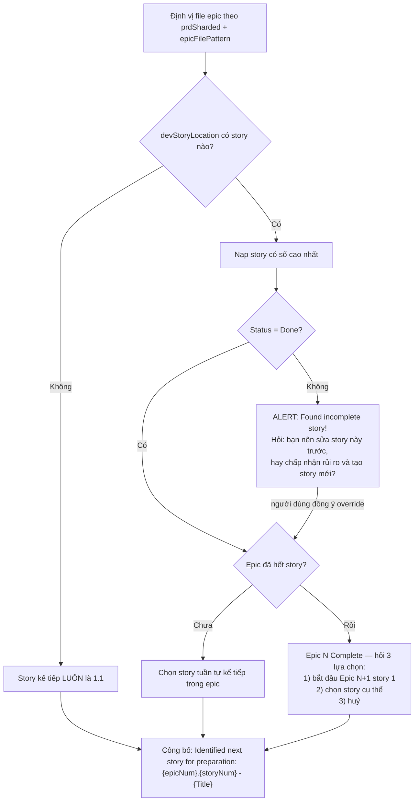
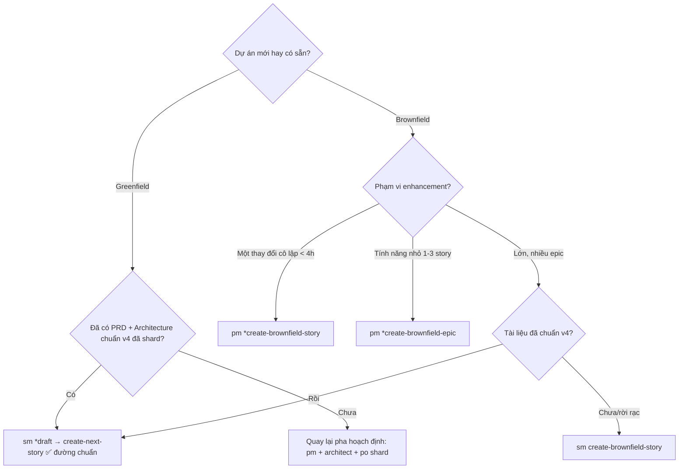

[⬅ Về chỉ mục](./README.md)

# 06 — Tasks nhóm story

Nhóm này gồm 6 task lo việc **tạo, xác thực và điều chỉnh** đơn vị công việc.

| Task | Agent chủ | Dùng khi |
|------|-----------|----------|
| [create-next-story](#1-create-next-story) | `sm` | Vòng phát triển chuẩn — **task quan trọng nhất của cả hệ thống** |
| [validate-next-story](#2-validate-next-story) | `po`, `dev` | Kiểm story draft trước khi implement |
| [correct-course](#3-correct-course) | `pm`, `po`, `sm` | Có thay đổi giữa dòng |
| [brownfield-create-epic](#4-brownfield-create-epic) | `pm`, `po` | Enhancement nhỏ 1–3 story, không cần PRD đầy đủ |
| [brownfield-create-story](#5-brownfield-create-story) | `pm`, `po` | Thay đổi đơn lẻ, cô lập (< ~4 giờ) |
| [create-brownfield-story](#6-create-brownfield-story) | `sm`, `bmad-master` | Story brownfield khi tài liệu không theo chuẩn v4 |

---

## 1. `create-next-story`

> **Đây là trái tim của phương pháp.** Chất lượng story quyết định chất lượng code. Đọc kỹ từng bước.

**Mục đích**: xác định story kế tiếp, rồi soạn một file story **tự chứa, khả thi ngay**, giàu ngữ cảnh kỹ thuật, để Dev agent thực thi hiệu quả **mà gần như không cần tự đi nghiên cứu**.

**Thực thi TUẦN TỰ — không sang bước sau khi bước hiện tại chưa xong.**

### Bước 0 — Nạp cấu hình

- Nạp `{root}/core-config.yaml`
- **Không có file → HALT** với thông điệp: *"core-config.yaml not found… 1) Copy từ GITHUB bmad-core/core-config.yaml và cấu hình, HOẶC 2) chạy BMad installer để nâng cấp và thêm file tự động."*
- Trích: `devStoryLocation`, `prd.*`, `architecture.*`

### Bước 1 — Xác định story kế tiếp



> ⚠️ **CRITICAL**: **TUYỆT ĐỐI KHÔNG tự động nhảy sang epic khác.** Người dùng **PHẢI** ra chỉ thị tường minh story nào cần tạo.

### Bước 2 — Thu thập yêu cầu + ngữ cảnh story trước

- Trích yêu cầu từ file epic đã xác định
- Nếu có story trước: đọc các section **Dev Agent Record** để lấy:
  - Completion Notes và Debug Log References
  - Sai lệch khi triển khai và quyết định kỹ thuật đã lấy
  - Khó khăn đã gặp và bài học
- Rút ra những insight có ảnh hưởng tới story hiện tại

> Đây chính là **vòng phản hồi giữa các story** — cơ chế "học" của hệ thống mà không cần bộ nhớ ngoài.

### Bước 3 — Thu thập ngữ cảnh kiến trúc

**3.1 Chiến lược đọc**

| Điều kiện | Cách đọc |
|-----------|----------|
| `architectureVersion >= v4` **và** `architectureSharded: true` | Đọc `{architectureShardedLocation}/index.md` rồi theo thứ tự bên dưới |
| Ngược lại | Dùng `architectureFile` nguyên khối, tìm các section tương ứng |

**3.2 Đọc gì theo loại story**

| Loại story | File cần đọc |
|-----------|-------------|
| **MỌI story** | `tech-stack.md`, `unified-project-structure.md`, `coding-standards.md`, `testing-strategy.md` |
| **+ Backend/API** | `data-models.md`, `database-schema.md`, `backend-architecture.md`, `rest-api-spec.md`, `external-apis.md` |
| **+ Frontend/UI** | `frontend-architecture.md`, `components.md`, `core-workflows.md`, `data-models.md` |
| **Full-stack** | Cả hai nhóm trên |

**3.3 Trích chi tiết kỹ thuật**

Chỉ trích thông tin **trực tiếp liên quan** tới story hiện tại. **KHÔNG được phát minh** thư viện, pattern hay chuẩn không có trong tài liệu nguồn.

Trích: data model/schema/cấu trúc story sẽ dùng · endpoint API phải làm hoặc tiêu thụ · đặc tả component UI · đường dẫn file và quy ước đặt tên cho mã mới · yêu cầu test riêng cho tính năng này · lưu ý bảo mật/hiệu năng ảnh hưởng story.

**LUÔN trích dẫn nguồn**: `[Source: architecture/{filename}.md#{section}]`

### Bước 4 — Kiểm tra khớp cấu trúc dự án

Đối chiếu yêu cầu story với `docs/architecture/unified-project-structure.md`; đảm bảo đường dẫn file, vị trí component, tên module khớp; **ghi mọi xung đột** vào section "Project Structure Notes" của story draft.

### Bước 5 — Điền template story

Tạo `{devStoryLocation}/{epicNum}.{storyNum}.story.md` theo `story-tmpl.yaml`.

- Điền: Title, Status = **Draft**, câu chuyện (As a… I want… so that…), Acceptance Criteria **copy từ epic**
- **Section `Dev Notes` (CRITICAL)**:
  - **CHỈ** chứa thông tin trích từ tài liệu kiến trúc. **KHÔNG BAO GIỜ** bịa hay suy đoán chi tiết kỹ thuật.
  - Tổ chức theo 7 nhóm:
    1. **Previous Story Insights** — bài học từ story trước
    2. **Data Models** — schema, luật kiểm tra, quan hệ *(kèm nguồn)*
    3. **API Specifications** — endpoint, định dạng request/response, yêu cầu auth *(kèm nguồn)*
    4. **Component Specifications** — chi tiết component UI, props, state *(kèm nguồn)*
    5. **File Locations** — đường dẫn chính xác nơi tạo mã mới
    6. **Testing Requirements** — test case/chiến lược cụ thể từ `testing-strategy.md`
    7. **Technical Constraints** — yêu cầu phiên bản, hiệu năng, luật bảo mật
  - **Mọi** chi tiết kỹ thuật **PHẢI** có `[Source: architecture/{file}.md#{section}]`
  - Nhóm nào không tìm thấy trong tài liệu → ghi rõ: **"No specific guidance found in architecture docs"**
- **Section `Tasks / Subtasks`**:
  - Sinh danh sách task kỹ thuật tuần tự, chi tiết, **chỉ dựa trên**: yêu cầu epic + AC của story + thông tin kiến trúc đã đọc
  - Mỗi task tham chiếu tài liệu kiến trúc liên quan
  - **Unit test là subtask tường minh** theo Testing Strategy
  - Liên kết task với AC: `Task 1 (AC: 1, 3)`
- Thêm ghi chú về khớp/lệch cấu trúc dự án (từ bước 4)

### Bước 6 — Hoàn tất và review

- Rà mọi section về độ đầy đủ và chính xác
- Xác nhận **mọi** chi tiết kỹ thuật đều có trích dẫn nguồn
- Đảm bảo task khớp cả yêu cầu epic và ràng buộc kiến trúc
- Đặt Status = `Draft`, lưu file
- Chạy `{root}/tasks/execute-checklist` với `{root}/checklists/story-draft-checklist`
- Báo cáo cho bạn: đường dẫn story · status · thành phần kỹ thuật chính đã đưa vào · mọi sai lệch/xung đột giữa epic và kiến trúc · kết quả checklist · bước tiếp theo (story phức tạp → gợi ý bạn đọc kỹ và cho PO chạy `validate-next-story`)

### Ba tiêu chí đánh giá một story tốt

1. Dev agent đọc story là đủ, **không cần** mở PRD/architecture
2. **Mọi** khẳng định kỹ thuật đều truy được về nguồn
3. Task tuần tự, có test, map rõ AC

---

## 2. `validate-next-story`

**Mục đích**: xác thực toàn diện story draft **trước khi** implement — tìm lỗ hổng, **chống ảo giác**, đảm bảo sẵn sàng triển khai.

**Đầu vào**: file story · epic cha · tài liệu kiến trúc · `story-tmpl.yaml` (để kiểm độ đầy đủ). Thiếu `core-config.yaml` → **HALT**.

### 10 bước kiểm tra

| # | Nhóm kiểm | Kiểm gì |
|---|-----------|---------|
| 1 | **Template completeness** | Thiếu section so với template? Còn placeholder chưa điền (`{{EpicNum}}`, `{{role}}`, `_TBD_`)? Đúng cấu trúc? |
| 2 | **File structure & source tree** | Đường dẫn file rõ chưa? Có source tree liên quan trong Dev Notes? Thư mục/component đặt đúng chỗ? Thứ tự tạo file hợp lý? |
| 3 | **UI/Frontend** *(nếu có)* | Component đủ chi tiết để code? Hướng dẫn style/design rõ? Luồng tương tác? Responsive/accessibility? Điểm tích hợp FE-BE? |
| 4 | **AC satisfaction** | Các task có thoả **hết** AC? AC đo được/kiểm được? Có bỏ sót edge case/lỗi? "Done" được định nghĩa rõ cho từng AC? Task ↔ AC có map? |
| 5 | **Validation & testing** | Phương pháp test rõ? Test case chính đã nêu? Bước xác thực AC rõ? Công cụ/framework đã nêu? Nhu cầu dữ liệu test? |
| 6 | **Security** *(nếu có)* | Yêu cầu bảo mật đã nhận diện? Auth/authz? Bảo vệ dữ liệu nhạy cảm? Phòng lỗ hổng phổ biến? Tuân thủ quy định? |
| 7 | **Task sequence** | Thứ tự hợp lý? Phụ thuộc rõ và đúng? Kích thước task vừa phải? Đủ phủ yêu cầu? Có task nào chặn task khác? |
| 8 | **Anti-hallucination** ⭐ | **Mọi** khẳng định kỹ thuật truy được nguồn? Dev Notes khớp đặc tả kiến trúc? Có quyết định kỹ thuật **không** được tài liệu hậu thuẫn? Trích dẫn đúng và truy cập được? Đối chiếu chéo với epic và kiến trúc? |
| 9 | **Dev readiness** | Có implement được **mà không đọc tài liệu ngoài**? Chỉ dẫn không nhập nhằng? Đủ ngữ cảnh kỹ thuật? Thiếu thông tin then chốt nào? Mọi task khả thi với agent? |
| 10 | **Báo cáo** | Xem dưới |

### Cấu trúc báo cáo

```text
#### Template Compliance Issues
#### Critical Issues (Must Fix - Story Blocked)
#### Should-Fix Issues (Important Quality Improvements)
#### Nice-to-Have Improvements (Optional Enhancements)
#### Anti-Hallucination Findings
#### Final Assessment
   - GO: sẵn sàng triển khai  /  NO-GO: cần sửa trước khi triển khai
   - Implementation Readiness Score: 1–10
   - Confidence Level: High / Medium / Low
```

**Cách dùng thực tế**: với story phức tạp, luôn chạy task này trước khi chuyển `Draft → Approved`. Điểm dưới 8 hoặc có bất kỳ Critical Issue → gửi lại `sm` sửa.

---

## 3. `correct-course`

**Mục đích**: phản ứng có cấu trúc trước một **thay đổi phát sinh giữa dòng**, dùng `change-checklist`; phân tích tác động lên epic/artifact/MVP; đề xuất phương án; **soạn sẵn các bản sửa cụ thể**; và xuất ra một **"Sprint Change Proposal"**.

### 5 bước

| # | Bước | Nội dung |
|---|------|----------|
| 1 | **Setup & chọn chế độ** | Xác nhận trigger thay đổi + giải thích của bạn về tác động; xác nhận có truy cập PRD/epic/story/architecture/UX spec và `change-checklist`. Hỏi chế độ: **Incrementally** (mặc định, khuyến nghị — đi từng section, tinh chỉnh cùng nhau) hoặc **YOLO** (phân tích theo lô, trình bày một lượt) |
| 2 | **Chạy phân tích checklist** | Đi hệ thống qua **Section 1–4** của `change-checklist`: Change Context · Epic/Story Impact · Artifact Conflict Resolution · Path Evaluation. Ghi trạng thái từng mục (`[x] Addressed`, `[N/A]`, `[!] Further Action Needed`) + ghi chú/quyết định. Thống nhất "Recommended Path Forward" |
| 3 | **Soạn bản sửa đề xuất** | Xác định artifact cần cập nhật và **viết thẳng nội dung sửa**: chỉnh text/AC/priority của story; thêm/xoá/sắp lại/chẻ story trong epic; đề xuất đoạn Mermaid cập nhật; sửa danh sách công nghệ/cấu hình/section trong PRD hay architecture; soạn artifact nhỏ bổ trợ nếu cần |
| 4 | **Sinh "Sprint Change Proposal"** | Gồm **(a) Analysis Summary**: vấn đề gốc, tác động (epic/artifact/phạm vi MVP), lý do chọn hướng đi; **(b) Specific Proposed Edits**: nêu chính xác thay đổi, ví dụ *"Change Story X.Y from: [text cũ] To: [text mới]"*, *"Add new AC to Story A.B: […]"*, *"Update Section 3.2 of Architecture Document as follows: […]"* |
| 5 | **Chốt & xác định bước sau** | Lấy **phê duyệt tường minh** của bạn. Sau đó: nếu các bản sửa là đủ → task hoàn tất, bạn (hoặc PO/SM) đi cập nhật tài liệu/backlog thật. Nếu phân tích cho thấy cần **replan nền tảng** (đổi phạm vi lớn, làm lại kiến trúc) → nói rõ và chuyển giao cho `pm`/`architect`, dùng Sprint Change Proposal làm đầu vào |

**Đầu ra**: tài liệu "Sprint Change Proposal" (Markdown) + bản `change-checklist` đã ghi chú.

---

## 4. `brownfield-create-epic`

**Mục đích**: tạo **một epic** cho enhancement nhỏ trong hệ thống có sẵn, khi làm PRD + Architecture đầy đủ là **quá mức**.

**Dùng khi**: enhancement hoàn thành được trong **1–3 story**; không cần thay đổi kiến trúc đáng kể; tuân theo pattern có sẵn; rủi ro tích hợp tối thiểu; hệ thống hiện tại đã ổn định và có tài liệu.

**KHÔNG dùng khi**: cần thiết kế kiến trúc; cần nhiều story phối hợp; có yêu cầu tích hợp mới phức tạp.

### Cấu trúc epic sinh ra

```text
#### Epic Title
#### Epic Goal
#### Epic Description
     - Existing System Context (chức năng liên quan hiện có, stack, điểm tích hợp)
     - Enhancement Details (thêm gì, tích hợp thế nào, tiêu chí thành công)
#### Stories                    ← 1–3 story, mỗi story có mô tả ngắn
#### Compatibility Requirements ← API cũ không đổi · schema tương thích ngược · UI theo pattern hiện có · tác động hiệu năng tối thiểu
#### Risk Mitigation
     - Primary Risk / Mitigation / Rollback Plan
#### Definition of Done
```

### Bước 1 bắt buộc — Project Analysis (Required)

Phải xác nhận: mục đích và stack hiện tại · công nghệ liên quan tới enhancement · điểm tích hợp đã nhận diện · pattern hiện có cần theo · tài liệu có sẵn.

### Bước 3 — Validation Checklist

Xác nhận: enhancement gọn (≤ 3 story) · không cần thay đổi kiến trúc · theo pattern có sẵn · rủi ro tích hợp thấp · có rollback plan · DoD rõ.

### Bước 4 — Handoff to Story Manager

Bàn giao kèm ngữ cảnh: hệ thống hiện tại, ràng buộc tương thích, pattern phải theo, và yêu cầu **không phá vỡ chức năng đang chạy**.

---

## 5. `brownfield-create-story`

**Mục đích**: tạo **một story đơn lẻ** cho thay đổi rất nhỏ, cô lập.

**Dùng khi**: thay đổi làm được trong **một lần**, thường **< 4 giờ**; theo đúng pattern có sẵn; rủi ro tích hợp rất thấp.

### Cấu trúc story sinh ra

```text
#### Story Title
#### User Story                 (As a… I want… so that…)
#### Story Context
     - hệ thống hiện tại liên quan · công nghệ · điểm chạm · pattern phải theo
#### Acceptance Criteria
     - AC chức năng · AC tích hợp (không phá vỡ cái đang chạy) · AC chất lượng
#### Technical Notes
     - Integration Approach · Existing Pattern Reference · Key Constraints
#### Definition of Done
```

### Mục "Risk and Compatibility Check"

- **Primary Risk** · **Mitigation** · **Rollback**
- Xác nhận: thay đổi có thể hoàn nguyên · không đổi schema phá vỡ · không đổi API phá vỡ · nằm trong phạm vi một lần làm

**Cạm bẫy tên gọi**: `pm` gọi task này qua **cả hai** lệnh `*create-story` và `*create-brownfield-story`. Đừng nhầm với `*draft` của `sm` (story chuẩn của vòng phát triển).

---

## 6. `create-brownfield-story`

**Mục đích**: tạo story chi tiết cho dự án brownfield khi **tài liệu không theo chuẩn v4** (ví dụ chỉ có đầu ra của `document-project`, hoặc tài liệu người dùng tự viết, hoặc kiến thức nằm trong đầu người).

Đây là phiên bản "chịu đựng tài liệu không hoàn hảo" của `create-next-story`.

### 8 bước

| # | Bước | Nội dung |
|---|------|----------|
| 0 | **Documentation Context** | Xác định loại tài liệu đang có (đầu ra `document-project`, brownfield PRD, tài liệu người dùng, hoặc không có gì) |
| 1 | **Story Identification** | 1.1 Xác định nguồn story · 1.2 Thu thập ngữ cảnh cốt yếu |
| 2 | **Trích ngữ cảnh kỹ thuật** | 2.1 Từ đầu ra `document-project` · 2.2 Từ brownfield PRD · 2.3 Từ tài liệu người dùng |
| 3 | **Tạo story + thu thập chi tiết tăng dần** | 3.1 Khung story ban đầu (có mục **Context Source** ghi rõ tài liệu nguồn) · 3.2 Xây AC · 3.3 Thu thập **Dev Technical Guidance** gồm: Existing System Context · Integration Approach · Technical Constraints · **Missing Information** (ghi thẳng chỗ còn thiếu!) |
| 4 | **Sinh task kèm kiểm tra an toàn** | Task triển khai + các bước kiểm an toàn cho hệ thống đang chạy |
| 5 | **Đánh giá rủi ro & giảm nhẹ** | Mục **Risk Assessment**: Implementation Risks · **Rollback Plan** · Safety Checks |
| 6 | **Xác thực story cuối** | |
| 7 | **Định dạng đầu ra** | Story mở đầu bằng `## Status: Draft` |
| 8 | **Bàn giao** | Thông điệp chuyển giao nêu rõ giả định và chỗ còn thiếu thông tin |

### Điểm khác biệt cốt lõi so với `create-next-story`

| | `create-next-story` | `create-brownfield-story` |
|---|---|---|
| Giả định về tài liệu | PRD + Architecture chuẩn v4, đã shard | Tài liệu rời rạc, có thể thiếu |
| Xử lý thiếu thông tin | Ghi "No specific guidance found in architecture docs" | Có **section riêng "Missing Information"** và chủ động hỏi bạn |
| Rủi ro | Nằm ở QA `*risk` | **Có sẵn mục Risk Assessment + Rollback Plan trong story** |
| Ghi nguồn | `[Source: architecture/…]` | Mục **Context Source** ghi tài liệu nguồn thực tế |

---

## Bảng chọn task tạo story



---

**Tiếp theo**: [07 — Tasks: QA](./07-tasks-qa.md)
