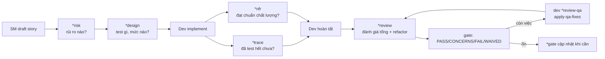

[⬅ Về chỉ mục](./README.md)

# 07 — Tasks nhóm QA (Test Architect)

7 task tạo thành một hệ thống chất lượng hoàn chỉnh: nhận diện rủi ro → thiết kế test → truy vết → đánh giá NFR → review tổng → ra quyết định gate → áp fix.

| Task | Lệnh | Thời điểm | Đầu ra |
|------|------|-----------|--------|
| [risk-profile](#1-risk-profile) | `*risk` | Sau khi draft story, **trước khi code** | `{qaLocation}/assessments/{e}.{s}-risk-{YYYYMMDD}.md` |
| [test-design](#2-test-design) | `*design` | Sau risk, trước khi code | `…-test-design-{YYYYMMDD}.md` |
| [trace-requirements](#3-trace-requirements) | `*trace` | Giữa lúc code | `…-trace-{YYYYMMDD}.md` |
| [nfr-assess](#4-nfr-assess) | `*nfr` | Trong lúc code / đầu review | `…-nfr-{YYYYMMDD}.md` |
| [review-story](#5-review-story) | `*review` | Story ở `Review` | QA Results + gate `.yml` |
| [qa-gate](#6-qa-gate) | `*gate` | Sau khi fix | gate `.yml` |
| [apply-qa-fixes](#7-apply-qa-fixes) | `dev *review-qa` | Sau khi có gate FAIL/CONCERNS | code + test + story update |



---

## 1. `risk-profile`

**Mục đích**: nhận diện và định lượng rủi ro triển khai **trước khi** viết code — điểm can thiệp sớm nhất.

### 6 nhóm rủi ro và tiền tố ID

| Tiền tố | Nhóm | Nội dung điển hình |
|---------|------|--------------------|
| `TECH` | Technical | Phức tạp kiến trúc, thách thức tích hợp, nợ kỹ thuật, khả năng mở rộng, phụ thuộc hệ thống |
| `SEC` | Security | Lỗi auth/authz, lộ dữ liệu, injection, quản lý session, điểm yếu mật mã |
| `PERF` | Performance | Suy giảm thời gian phản hồi, nghẽn thông lượng, cạn tài nguyên, tối ưu truy vấn, lỗi cache |
| `DATA` | Data | Mất dữ liệu, hỏng dữ liệu, vi phạm quyền riêng tư, tuân thủ, lỗ hổng backup/recovery |
| `BUS` | Business | Tính năng không đúng nhu cầu, ảnh hưởng doanh thu, tổn hại uy tín, không tuân thủ quy định, sai thời điểm thị trường |
| `OPS` | Operational | Lỗi deploy, thiếu giám sát, chưa sẵn sàng ứng cứu sự cố, tài liệu kém, chuyển giao kiến thức |

### Cách chấm điểm

**Xác suất (Probability)**: `High (3)` > 70% · `Medium (2)` 30–70% · `Low (1)` < 30%
**Tác động (Impact)**: `High (3)` hậu quả nghiêm trọng (rò rỉ dữ liệu, sập hệ thống, thiệt hại tài chính lớn) · `Medium (2)` vừa (giảm hiệu năng, lỗi dữ liệu nhỏ) · `Low (1)` nhẹ (lỗi thẩm mỹ, bất tiện nhỏ)

**Điểm rủi ro = Xác suất × Tác động**

| Điểm | Mức | Màu |
|------|-----|-----|
| 9 | Critical | 🔴 |
| 6 | High | 🟠 |
| 4 | Medium | 🟡 |
| 2–3 | Low | 🟢 |
| 1 | Minimal | 🔵 |

### Ma trận rủi ro (mẫu đầu ra)

| Risk ID | Description | Probability | Impact | Score | Priority |
|---------|-------------|-------------|--------|-------|----------|
| SEC-001 | XSS vulnerability | High (3) | High (3) | 9 | Critical |
| PERF-001 | Slow query on dashboard | Medium (2) | Medium (2) | 4 | Medium |
| DATA-001 | Backup failure | Low (1) | High (3) | 3 | Low |

### Giảm nhẹ rủi ro (mỗi rủi ro phải có)

```yaml
mitigation:
  risk_id: 'SEC-001'
  strategy: preventive        # preventive | detective | corrective
  actions: [ ... ]            # việc cụ thể phải làm
  testing_requirements: [ ... ]
  residual_risk: 'Low - …'    # rủi ro còn lại sau khi giảm nhẹ
  owner: 'dev'
  timeline: 'Before deployment'
```

### Điểm rủi ro tổng của story

```text
Base Score = 100
Trừ điểm cho mỗi rủi ro:
  Critical (9) → −20
  High (6)     → −10
  Medium (4)   → −5
  Low (2–3)    → −2
Kẹp trong [0, 100]
```

### Ánh xạ sang gate (tất định)

- Bất kỳ rủi ro **≥ 9** → gate **FAIL** (trừ khi được waive)
- Ngược lại, bất kỳ **≥ 6** → gate **CONCERNS**
- Còn lại → **PASS**
- Rủi ro chưa giảm nhẹ → **ghi vào gate**

### Đầu ra (3 phần)

1. **Gate YAML block** — khối `risk_summary` để dán vào file gate
2. **Markdown report** → `{qaLocation}/assessments/{e}.{s}-risk-{YYYYMMDD}.md` gồm: Executive Summary · Critical Risks Requiring Immediate Attention · Risk Distribution (theo nhóm/theo component) · Detailed Risk Register · **Risk-Based Testing Strategy** (3 mức ưu tiên) · Risk Acceptance Criteria (Must Fix Before Production / Can Deploy with Mitigation / Accepted Risks) · Monitoring Requirements · Risk Review Triggers
3. **Story hook line** — dòng để task `review-story` trích dẫn

---

## 2. `test-design`

**Mục đích**: thiết kế chiến lược test hoàn chỉnh — test **gì**, ở **mức nào**, và **tại sao** — để phủ hiệu quả mà không trùng lặp.

**Dữ liệu bắt buộc**: `data/test-levels-framework.md` (tiêu chí unit/integration/e2e) + `data/test-priorities-matrix.md` (phân loại P0/P1/P2/P3).

### 5 bước

| # | Bước | Nội dung |
|---|------|----------|
| 1 | Phân tích yêu cầu | Chẻ mỗi AC thành các kịch bản kiểm được: chức năng cốt lõi · biến thể dữ liệu · điều kiện lỗi · edge case |
| 2 | Áp khung mức test | **Unit**: logic thuần, thuật toán, tính toán · **Integration**: tương tác component, thao tác DB · **E2E**: hành trình người dùng then chốt, tuân thủ |
| 3 | Gán ưu tiên | **P0**: doanh thu, bảo mật, tuân thủ · **P1**: hành trình cốt lõi, dùng thường xuyên · **P2**: tính năng phụ, admin · **P3**: có thì tốt, ít dùng |
| 4 | Thiết kế kịch bản | Theo schema bên dưới |
| 5 | Xác thực độ phủ | Mọi AC có ≥ 1 test · **không trùng phủ giữa các mức** · đường then chốt có nhiều mức · rủi ro đã được giảm nhẹ |

### Schema kịch bản test

```yaml
test_scenario:
  id: '{epic}.{story}-{LEVEL}-{SEQ}'      # vd. 1.3-UNIT-001, 1.3-INT-001, 1.3-E2E-001
  requirement: 'AC reference'
  priority: P0|P1|P2|P3
  level: unit|integration|e2e
  description: 'Đang test cái gì'
  justification: 'Vì sao chọn mức này'
  mitigates_risks: ['RISK-001']            # nếu đã có risk profile
```

### Đầu ra (3 phần)

1. **Test Design Document** → `{qaLocation}/assessments/{e}.{s}-test-design-{YYYYMMDD}.md`, gồm Test Strategy Overview (tổng số kịch bản, phân bố theo mức và theo ưu tiên), bảng kịch bản theo từng AC, Risk Coverage, và **Recommended Execution Order**:
   1. P0 Unit (fail fast) → 2. P0 Integration → 3. P0 E2E → 4. P1 theo thứ tự → 5. P2+ nếu còn thời gian
2. **Gate YAML block**: `test_design: {scenarios_total, by_level{unit,integration,e2e}, by_priority{p0,p1,p2}, coverage_gaps: []}`
3. **Trace references**: đường dẫn ma trận + số lượng P0 test đã nhận diện

### 5 nguyên tắc

**Shift left** (ưu tiên unit hơn integration, integration hơn E2E) · **Risk-based** · **Efficient coverage** (test một lần ở đúng mức) · **Maintainability** · **Fast feedback**.

---

## 3. `trace-requirements`

**Mục đích**: lập ma trận truy vết yêu cầu ↔ test; tìm khoảng trống độ phủ.

**Tiền đề**: story đã có AC; đã có (hoặc đang có) test.

### 5 mức độ phủ

| Mức | Nghĩa |
|-----|-------|
| `full` | Yêu cầu được test hoàn toàn |
| `partial` | Test một phần, còn khoảng trống |
| `none` | Không tìm thấy test nào |
| `integration` | Chỉ được phủ ở integration/e2e |
| `unit` | Chỉ được phủ ở unit |

### Given-When-Then — dùng để **mô tả**, không phải viết code BDD

Đây là điểm rất dễ hiểu sai: task dùng Given-When-Then làm **ngôn ngữ tài liệu hoá** mối liên hệ AC ↔ test, **không** yêu cầu bạn viết test bằng Cucumber/BDD framework.

### Ghi nhận khoảng trống

```yaml
coverage_gaps:
  - requirement: 'AC3: Password reset email sent within 60 seconds'
    gap: 'No test for email delivery timing'
    severity: medium
    suggested_test:
      type: integration
      description: 'Test email service SLA compliance'
  - requirement: 'AC5: Support 1000 concurrent users'
    gap: 'No load testing implemented'
    severity: high
    suggested_test:
      type: performance
      description: 'Load test with 1000 concurrent connections'
```

### Đầu ra

1. **Gate YAML block** dưới khoá `trace`: `totals{requirements, full, partial, none}` · `planning_ref` (trỏ tới test-design) · `uncovered[]` (AC + lý do) · `notes`
2. **Traceability Report** → `{qaLocation}/assessments/{e}.{s}-trace-{YYYYMMDD}.md`: Coverage Summary · Requirement Mappings theo từng AC · **Critical Gaps** · Test Design Recommendations · Risk Assessment
3. **Story hook line**

Tài liệu còn có mục **Quality Indicators** và **Red Flags** để bạn tự đánh giá chất lượng ma trận truy vết.

---

## 4. `nfr-assess`

**Mục đích**: xác thực các yêu cầu phi chức năng dựa trên **chứng cứ thực tế**, không dựa trên lời khai.

### Bước 0 — Cơ chế chống hỏng (fail-safe)

Nếu không tìm được story: **vẫn tạo** file đánh giá, ghi chú "Source story not found", đặt mọi NFR được chọn = **CONCERNS** với ghi chú "Target unknown / evidence missing", và tiếp tục để vẫn tạo ra giá trị.

### Bước 1 — Chọn phạm vi

Chế độ tương tác: hỏi bạn muốn đánh giá NFR nào. Chế độ không tương tác: mặc định **bộ bốn cốt lõi**.

```text
[1] Security (mặc định)      [5] Usability
[2] Performance (mặc định)   [6] Compatibility
[3] Reliability (mặc định)   [7] Portability
[4] Maintainability (mặc định) [8] Functional Suitability
```

### Bước 2 — Tìm ngưỡng (threshold)

Tìm trong: AC của story · `docs/architecture/*.md` · `docs/technical-preferences.md`.
Chế độ tương tác: **hỏi bạn** ngưỡng còn thiếu ("What's your target response time?" → "200ms for API calls").
**Chính sách khi không có ngưỡng**: đặt **CONCERNS** kèm ghi chú **"Target unknown"** — tuyệt đối không tự bịa ngưỡng.

### Bước 3 — Đánh giá nhanh

Với mỗi NFR: có **chứng cứ** đã hiện thực chưa? có **xác thực** được không? có khoảng trống hiển nhiên nào?

### Quy tắc trạng thái (tất định)

| Trạng thái | Điều kiện |
|-----------|-----------|
| **FAIL** | Bất kỳ NFR được chọn có khoảng trống nghiêm trọng, hoặc rõ ràng không đạt ngưỡng |
| **CONCERNS** | Không có FAIL, nhưng có NFR chưa rõ / phủ một phần / thiếu chứng cứ |
| **PASS** | Tất cả NFR được chọn đạt ngưỡng **và có chứng cứ** |

### Điểm chất lượng

```text
quality_score = 100 − 20 × (số FAIL) − 10 × (số CONCERNS)   , kẹp [0, 100]
```
Nếu `technical-preferences.md` định nghĩa trọng số riêng → dùng trọng số đó.

### Đầu ra (4 phần)

1. **Gate YAML block** — **chỉ** cho NFR thực sự đã đánh giá, không có placeholder; có khoá `_assessed: [...]`
2. **Brief Assessment Report** → `{qaLocation}/assessments/{e}.{s}-nfr-{YYYYMMDD}.md`: Summary · **Critical Issues** · **Quick Wins**
3. **Story update line**
4. **Gate integration line**

Tài liệu còn có tiêu chí kiểm chi tiết cho từng NFR (Security/Performance/Reliability/Maintainability), mục **Quick Reference — What to Check**, và phụ lục tham chiếu **ISO 25010** với đủ 8 đặc tính chất lượng.

---

## 5. `review-story`

**Mục đích**: review kiến trúc test toàn diện, thích ứng theo rủi ro; tạo **hai** đầu ra: cập nhật story + file gate chi tiết.

**Tiền đề**: Status = `Review` · Dev đã xong mọi task và cập nhật File List · mọi test tự động đang pass.

### Bước 1 — Tự leo thang chiều sâu review

Chuyển sang **deep review** khi có bất kỳ dấu hiệu:

- Chạm file auth / payment / security
- Story không thêm test nào
- Diff > 500 dòng
- Gate trước là FAIL/CONCERNS
- Story có > 5 acceptance criteria

### Bước 2 — Sáu trục phân tích

| Trục | Nội dung |
|------|----------|
| **A. Requirements Traceability** | Map từng AC tới test xác thực nó (dùng Given-When-Then làm tài liệu, **không** phải code test); tìm khoảng trống; xác nhận mọi yêu cầu có test case |
| **B. Code Quality** | Kiến trúc & design pattern · cơ hội refactor (**và thực hiện refactor**) · trùng lặp/thiếu hiệu quả · tối ưu hiệu năng · lỗ hổng bảo mật · tuân thủ best practice |
| **C. Test Architecture** | Độ phủ đủ ở đúng mức · mức test có phù hợp · chất lượng & khả năng bảo trì của test · chiến lược dữ liệu test · dùng mock/stub hợp lý · edge case & lỗi · thời gian chạy và độ tin cậy |
| **D. NFR** | Security (auth/authz/bảo vệ dữ liệu) · Performance (thời gian phản hồi, tài nguyên) · Reliability (xử lý lỗi, phục hồi) · Maintainability (rõ ràng, tài liệu) |
| **E. Testability** | **Controllability** (kiểm soát được input?) · **Observability** (quan sát được output?) · **Debuggability** (debug lỗi dễ không?) |
| **F. Technical Debt** | Đường tắt tích tụ · test còn thiếu · dependency lỗi thời · vi phạm kiến trúc |

### Bước 3 — Refactor chủ động

- Refactor ở nơi **an toàn và phù hợp**
- **Chạy test** để đảm bảo không phá vỡ gì
- Ghi mọi thay đổi vào QA Results kèm **WHY** và **HOW** rõ ràng
- **KHÔNG** sửa nội dung story ngoài QA Results
- **KHÔNG** đổi Status hay File List — chỉ **khuyến nghị** trạng thái tiếp theo

### Bước 4–6

Kiểm tuân thủ `docs/coding-standards.md`, `docs/unified-project-structure.md`, `docs/testing-strategy.md` · xác thực từng AC đã hiện thực đủ · kiểm tài liệu & comment (thêm comment cho logic phức tạp nếu thiếu, ghi nhận thay đổi API).

### Đầu ra 1 — Cập nhật story (CHỈ section QA Results)

**Quy tắc anchor**: nếu chưa có `## QA Results` → thêm vào cuối file; nếu đã có → **append một entry mới có ngày** phía dưới các entry cũ. **Không bao giờ** sửa section khác.

Khung nội dung:

```markdown
## QA Results
### Review Date: [Date]
### Reviewed By: Quinn (Test Architect)
### Code Quality Assessment
### Refactoring Performed
  - **File**: … / **Change**: … / **Why**: … / **How**: …
### Compliance Check
  - Coding Standards: [✓/✗]  · Project Structure: [✓/✗]
  - Testing Strategy: [✓/✗]  · All ACs Met: [✓/✗]
### Improvements Checklist
  - [x] việc QA đã tự làm
  - [ ] việc để dev làm
### Security Review
### Performance Considerations
### Files Modified During Review
### Gate Status
  Gate: {STATUS} → qa.qaLocation/gates/{epic}.{story}-{slug}.yml
  Risk profile: …  · NFR assessment: …
### Recommended Status
  [✓ Ready for Done] / [✗ Changes Required - See unchecked items above]
  (Story owner decides final status)
```

### Đầu ra 2 — File gate

Render từ `templates/qa-gate-tmpl.yaml`, tạo thư mục `{qaLocation}/gates` nếu chưa có, lưu tại `{qaLocation}/gates/{epic}.{story}-{slug}.yml`.

### Thuật toán quyết định gate (áp dụng THEO THỨ TỰ)

```text
1. Risk (nếu có risk_summary):  điểm ≥ 9 → FAIL      |  ngược lại ≥ 6 → CONCERNS
2. Khoảng trống test (nếu có trace):
      thiếu P0 test                  → CONCERNS
      thiếu P0 test security/data-loss → FAIL
3. Mức nghiêm trọng issue:  có high → FAIL  |  có medium → CONCERNS
4. NFR:  có FAIL → FAIL  |  có CONCERNS → CONCERNS  |  toàn PASS → PASS
5. WAIVED chỉ khi waiver.active: true kèm reason/approver
```

`quality_score = 100 − 20×FAIL − 10×CONCERNS`

### 5 điều kiện chặn review

Story thiếu section then chốt · **File List rỗng hoặc rõ ràng chưa đầy đủ** · không có test khi test là bắt buộc · thay đổi code không khớp yêu cầu story · vấn đề kiến trúc nghiêm trọng cần thảo luận.

### 6 nguyên tắc

Bạn là Test Architect cung cấp đánh giá toàn diện · bạn **có quyền** cải thiện code trực tiếp khi phù hợp · **luôn giải thích** thay đổi để người khác học được · cân bằng giữa hoàn hảo và thực dụng · ưu tiên theo rủi ro · khuyến nghị khả thi kèm **chủ sở hữu rõ ràng**.

---

## 6. `qa-gate`

**Mục đích**: tạo/cập nhật file quyết định gate độc lập — tối giản và dự đoán được.

### Quy tắc slug

lowercase → thay khoảng trắng bằng gạch nối → bỏ dấu câu.
Ví dụ: `"User Auth - Login!"` → `user-auth-login`

### Schema tối thiểu

```yaml
schema: 1
story: '{epic}.{story}'
gate: PASS|CONCERNS|FAIL|WAIVED
status_reason: 'giải thích 1-2 câu'
reviewer: 'Quinn'
updated: '{ISO-8601 timestamp}'
top_issues: []
waiver: { active: false }
```

### Khi có issue

```yaml
top_issues:
  - id: 'SEC-001'
    severity: high              # CHỈ: low | medium | high
    finding: 'No rate limiting on login endpoint'
    suggested_action: 'Add rate limiting middleware before production'
```

### Khi WAIVED

```yaml
gate: WAIVED
waiver:
  active: true
  reason: 'MVP release - performance optimization deferred'
  approved_by: 'Product Owner'
```

### Tiêu chí quyết định

| Gate | Tiêu chí |
|------|----------|
| **PASS** | Mọi AC đạt · không có issue high · độ phủ test đạt chuẩn dự án |
| **CONCERNS** | Có issue không chặn · nên theo dõi và lên lịch xử lý · vẫn đi tiếp được nhưng phải biết |
| **FAIL** | AC không đạt · có issue high · **khuyến nghị trả về InProgress** |
| **WAIVED** | Issue được chấp nhận tường minh · **bắt buộc** có phê duyệt và lý do |

### Thang nghiêm trọng — GIÁ TRỊ CỐ ĐỊNH, KHÔNG BIẾN THỂ

`low` (nhỏ, thẩm mỹ) · `medium` (nên sửa sớm, không chặn) · `high` (nghiêm trọng, nên chặn release)

### Tiền tố ID issue

`SEC-` bảo mật · `PERF-` hiệu năng · `REL-` độ tin cậy · `TEST-` khoảng trống test · `MNT-` khả năng bảo trì · `ARCH-` kiến trúc · `DOC-` tài liệu · `REQ-` yêu cầu

### Hai việc BẮT BUỘC làm

1. **LUÔN** tạo file gate tại `{qaLocation}/gates`
2. **LUÔN** append đúng dòng này vào section QA Results của story:
   ```text
   Gate: {STATUS} → qa.qaLocation/gates/{epic}.{story}-{slug}.yml
   ```

---

## 7. `apply-qa-fixes`

**Mục đích**: **Dev agent** tiêu thụ đầu ra QA một cách hệ thống và áp fix, chỉ cập nhật các section được phép.

### Nguồn đọc

- **Gate (YAML)**: `{qa_root}/gates/{epic}.{story}-*.yml` — nếu nhiều file, dùng **file mới nhất theo thời gian sửa**
- **Assessments (Markdown)**: `…-test-design-*.md`, `…-trace-*.md`, `…-risk-*.md`, `…-nfr-*.md`

### Kế hoạch fix TẤT ĐỊNH — thứ tự ưu tiên

```text
1. Issue mức high trong top_issues (security/perf/reliability/maintainability)
2. NFR: mọi FAIL phải sửa → sau đó tới CONCERNS
3. Test Design coverage_gaps (ưu tiên kịch bản P0)
4. AC chưa được test phủ (từ trace)
5. Khuyến nghị must_fix trong risk_summary
6. Issue medium, rồi low
```

**Hướng dẫn**: ưu tiên viết test đóng khoảng trống **trước hoặc cùng lúc** với sửa code; giữ thay đổi tối thiểu và có mục tiêu.

### Chỉ được cập nhật các section này của story

Tasks/Subtasks checkbox (tick subtask fix bạn thêm) · Dev Agent Record → Agent Model Used, Debug Log References (lệnh/kết quả lint, test), Completion Notes List (đã đổi gì, tại sao, thế nào), File List (mọi file thêm/sửa/xoá) · Change Log (entry mới có ngày) · Status.

**Cấm sửa**: QA Results, Story, Acceptance Criteria, Dev Notes, Testing.

### Quy tắc trạng thái

| Điều kiện | Status đặt |
|-----------|-----------|
| Gate là **PASS** và **mọi** khoảng trống đã đóng | `Ready for Done` |
| Còn lại | `Ready for Review` + **thông báo QA review lại** |

### Cấm tuyệt đối

**Dev KHÔNG sửa file gate.** Nếu fix đã giải quyết issue, hãy **yêu cầu QA chạy lại `review-story`** để cập nhật gate. Quyền sở hữu gate thuộc QA; Dev báo hiệu sự sẵn sàng qua Status.

### 3 điều kiện HALT

Thiếu `core-config.yaml` · không tìm thấy story theo `story_id` · **không có artifact QA nào** (không gate, không assessment) → HALT và yêu cầu QA tạo ít nhất một file gate (hoặc chỉ tiếp tục nếu bạn cung cấp danh sách fix rõ ràng).

### ⚠️ Cảnh báo quan trọng khi dùng thủ công

Task này **viết cứng lệnh và đường dẫn của một dự án Deno cụ thể**:

- Mục Prerequisites/Validate: `deno lint`, `deno test -A`
- Mục Apply Changes: "keep imports centralized via `deps.ts`", "follow DI boundaries in `src/core/di.ts`", tham chiếu `docs/project/typescript-rules.md`
- Ví dụ cuối dùng đường dẫn `docs/project/qa/gates/2.2-*.yml`

**Việc bạn phải làm**: mở `{root}/tasks/apply-qa-fixes.md` và **sửa các lệnh/đường dẫn này theo stack thật của bạn** (npm/pnpm/pytest/go test…) trước khi dùng lần đầu. Nếu không, Dev agent sẽ cố chạy lệnh Deno không tồn tại.

---

## Bảng tra: dùng task QA nào theo tình huống

| Tình huống | Trình tự khuyến nghị |
|-----------|---------------------|
| Story bình thường, rủi ro thấp | `*review` khi xong |
| Story rủi ro cao | `*risk` → `*design` → *(code)* → `*trace` → `*nfr` → `*review` |
| Tích hợp phức tạp | `*trace` trong lúc code (phủ hết điểm tích hợp) → `*nfr` (hiệu năng liên tầng) |
| Yêu cầu hiệu năng cao | `*nfr` sớm và thường xuyên, **không** đợi tới review |
| Brownfield / legacy | `*risk` trước để tìm nguy cơ hồi quy → `*review` tập trung tương thích ngược |
| Sau khi fix xong | `dev *review-qa` → `qa *review` lại → `*gate` nếu cần cập nhật |

---

**Tiếp theo**: [08 — Templates](./08-templates.md)
