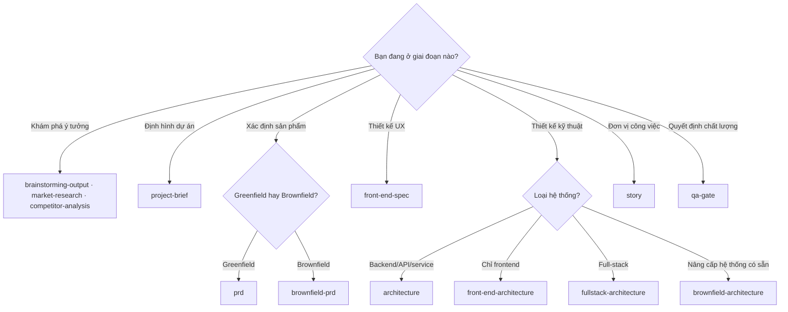

[⬅ Về chỉ mục](./README.md)

# 08 — Templates: 13 khuôn tài liệu

Template là **khuôn đầu ra + chỉ dẫn cho LLM**, viết bằng YAML. Chúng **tự chứa chỉ dẫn** — đó là lý do phần lớn trường hợp không cần task riêng để sinh tài liệu, chỉ cần `create-doc` + template.

## 0. Bảng tổng hợp

| Template | Version | File đầu ra mặc định | Mode | Số section cấp 1 | Agent |
|----------|---------|---------------------|------|------------------|-------|
| `project-brief-tmpl.yaml` | 2.0 | `docs/brief.md` ⚠️ | interactive | 9 | analyst |
| `market-research-tmpl.yaml` | 2.0 | `docs/market-research.md` | interactive | 8 | analyst |
| `competitor-analysis-tmpl.yaml` | 2.0 | `docs/competitor-analysis.md` | interactive | 8 | analyst |
| `brainstorming-output-tmpl.yaml` | 2.0 | `docs/brainstorming-session-results.md` | **non-interactive** | 7 | analyst |
| `prd-tmpl.yaml` | 2.0 | `docs/prd.md` | interactive | 8 | pm |
| `brownfield-prd-tmpl.yaml` | 2.0 | `docs/prd.md` | interactive | 6 | pm |
| `front-end-spec-tmpl.yaml` | 2.0 | `docs/front-end-spec.md` | interactive | 12 | ux-expert |
| `architecture-tmpl.yaml` | 2.0 | `docs/architecture.md` | interactive | 18 | architect |
| `front-end-architecture-tmpl.yaml` | 2.0 | `docs/ui-architecture.md` ⚠️ | interactive | 11 | architect |
| `fullstack-architecture-tmpl.yaml` | 2.0 | `docs/architecture.md` | interactive | 21 | architect |
| `brownfield-architecture-tmpl.yaml` | 2.0 | `docs/architecture.md` | interactive | 15 | architect |
| `story-tmpl.yaml` | 2.0 | `docs/stories/{{epic_num}}.{{story_num}}.{{story_title_short}}.md` | interactive | 7 | sm |
| `qa-gate-tmpl.yaml` | 1.0 | `qa.qaLocation/gates/{{epic_num}}.{{story_num}}-{{story_slug}}.yml` | — (YAML) | — | qa |

⚠️ **Hai tên file khác kỳ vọng thông thường** — xem [file 14](./14-tra-cuu-nhanh-va-canh-bao.md):
- `project-brief-tmpl` xuất ra `docs/brief.md`, nhưng workflow lại nói `project-brief.md`
- `front-end-architecture-tmpl` xuất ra `docs/ui-architecture.md`, không phải `front-end-architecture.md`

---

## 1. Cú pháp template (đặc tả `common/utils/bmad-doc-template.md`)

### Khung bắt buộc

```yaml
template:
  id: template-identifier
  name: Human Readable Template Name
  version: 1.0
  output:
    format: markdown
    filename: default-path/to/{{filename}}.md
    title: '{{variable}} Document Title'      # thành H1 của tài liệu

workflow:
  mode: interactive                            # interactive | yolo | non-interactive
  elicitation: advanced-elicitation

sections:
  - id: section-id                             # BẮT BUỘC
    title: Section Title                       # BẮT BUỘC
    instruction: |                             # BẮT BUỘC — chỉ dẫn cho LLM
      Hướng dẫn chi tiết cách xử lý section này
```

### Thuộc tính section — bảng đầy đủ

| Nhóm | Thuộc tính | Ý nghĩa |
|------|-----------|---------|
| **Bắt buộc** | `id` | Định danh duy nhất |
| | `title` | Tiêu đề heading |
| | `instruction` | Chỉ dẫn cho LLM (**không** in ra tài liệu) |
| **Kiểm soát nội dung** | `type` | Gợi ý loại nội dung |
| | `template` | Text mẫu cố định cho nội dung section |
| | `item_template` | Mẫu cho từng item trong section lặp |
| | `prefix` | Tiền tố cho item có số (vd. `FR`, `NFR`) |
| **Cờ hành vi** | `elicit: true` | **Áp elicitation sau khi render section** |
| | `repeatable: true` | Section có thể lặp nhiều lần |
| | `condition: "..."` | Điều kiện để đưa section vào |
| **Quyền agent** | `owner` | Agent tạo/điền section đầu tiên |
| | `editors: []` | Danh sách agent được sửa |
| | `readonly: true` | Không được sửa sau khi tạo |
| **Hướng dẫn nội dung** | `examples: []` | Ví dụ (**không bao giờ** vào tài liệu đầu ra) |
| | `choices: {}` | Lựa chọn cho quyết định thường gặp |
| | `placeholder` | Text giữ chỗ mặc định |
| **Cấu trúc** | `sections: []` | Section con lồng nhau |

### Các `type` được hỗ trợ

**Loại nội dung**: `bullet-list` · `numbered-list` · `paragraphs` · `table` · `code-block` · `template-text` · `mermaid`
**Loại đặc biệt**: `repeatable-container` · `conditional-block` · `choice-selector`

### Cấp heading

Section cấp 1 trong `sections:` → `##` (H2). Mỗi cấp lồng vào trong → cấp heading tiếp theo. `output.title` là H1.

### Biến và điều kiện

```yaml
title: 'Epic {{epic_number}} {{epic_title}}'
template: 'As a {{user_type}}, I want {{action}}, so that {{benefit}}.'

- id: ui-section
  title: User Interface Design
  condition: Project has UX/UI Requirements     # bỏ qua nếu không thoả
```

### Section lặp lồng nhau (mẫu epic → story → AC)

```yaml
- id: epic-details
  title: Epic {{epic_number}} {{epic_title}}
  repeatable: true
  sections:
    - id: story
      title: Story {{epic_number}}.{{story_number}} {{story_title}}
      repeatable: true
      sections:
        - id: criteria
          title: Acceptance Criteria
          type: numbered-list
          item_template: '{{criterion_number}}: {{criteria}}'
          repeatable: true
```

### Sơ đồ Mermaid trong template

```yaml
- id: system-architecture
  title: System Architecture Diagram
  type: mermaid
  mermaid_type: flowchart
  instruction: Create a system architecture diagram showing key components and data flow
  details: |
    Show: UI layer · API gateway · Core services · Database layer · External integrations
```

**20 giá trị `mermaid_type` được hỗ trợ**:
Cơ bản — `flowchart`, `sequenceDiagram`, `classDiagram`, `stateDiagram`, `erDiagram`, `gantt`, `pie`
Nâng cao — `journey`, `mindmap`, `timeline`, `quadrantChart`, `xyChart`, `sankey`
Chuyên biệt — `c4Context`, `requirement`, `packet`, `block`, `kanban`

### Quyền theo section (ví dụ trong story)

```yaml
- id: story-details
  owner: scrum-master
  editors: [scrum-master]
  sections:
    - id: dev-notes
      owner: dev-agent
      editors: [dev-agent]
    - id: qa-results
      owner: qa-agent
      editors: [qa-agent]
      readonly: true
```

### Xác thực template khi bạn tự viết

- [ ] YAML hợp lệ
- [ ] Đủ trường bắt buộc (`id`, `title`, `instruction`)
- [ ] `id` các section nhất quán, không trùng
- [ ] Cấu trúc lồng đúng
- [ ] Biến `{{...}}` được tham chiếu hợp lệ

---

## 2. Chi tiết từng template

### 2.1 `project-brief-tmpl.yaml` — Project Brief

Đầu ra: `docs/brief.md` · Có mục "Project Brief Elicitation Actions" riêng ở đầu.

Section cấp 1: `introduction` → `executive-summary` → `problem-statement` → `proposed-solution` → `target-users` → `goals-metrics` → `mvp-scope` → `post-mvp-vision` → `technical-considerations`

Vai trò: **tài liệu nền** của cả dự án. Có brief tốt thì PM tạo PRD theo "fast track" (ít câu hỏi hơn); không có brief thì PM phải làm PRD tương tác kỹ hơn.

### 2.2 `market-research-tmpl.yaml` — Market Research Report

Section: `executive-summary` → `research-objectives` → `market-overview` → `customer-analysis` → `competitive-landscape` → `industry-analysis` → `opportunity-assessment` → `appendices`

### 2.3 `competitor-analysis-tmpl.yaml` — Competitive Analysis Report

Section: `executive-summary` → `analysis-scope` → `competitive-landscape` → `competitor-profiles` → `comparative-analysis` → `strategic-analysis` → `strategic-recommendations` → `monitoring-plan`

### 2.4 `brainstorming-output-tmpl.yaml` — Brainstorming Session Results

**`mode: non-interactive`** — đây là template *ghi lại* kết quả một phiên đã diễn ra, không hỏi thêm.

Section: `header` → `executive-summary` (có "Key Themes Identified") → `technique-sessions` → `idea-categorization` → `action-planning` → `reflection-followup` → `footer`

### 2.5 `prd-tmpl.yaml` — Product Requirements Document ⭐

Đầu ra: `docs/prd.md` — **tài liệu then chốt** của pha hoạch định.

| Section | Nội dung |
|---------|----------|
| `goals-context` | Mục tiêu và bối cảnh |
| `requirements` | **FR và NFR** (dùng `prefix: FR`/`NFR` để đánh số) |
| `ui-goals` | Mục tiêu thiết kế UI (có `condition` — bỏ qua nếu không có UI) |
| `technical-assumptions` | Giả định kỹ thuật |
| `epic-list` | Danh sách epic |
| `epic-details` | **Chi tiết từng epic → story → AC** (repeatable lồng 3 cấp) |
| `checklist-results` | Kết quả `pm-checklist` |
| `next-steps` | Bước tiếp theo |

**Đây là tài liệu được shard** thành `docs/prd/` → các file `epic-*.md` mà `sm` đọc để tạo story.

### 2.6 `brownfield-prd-tmpl.yaml` — Brownfield Enhancement PRD

Section: `intro-analysis` (Intro Project Analysis and Context) → `requirements` → `ui-enhancement-goals` → `technical-constraints` → `epic-structure` → `epic-details`

Khác biệt so với PRD greenfield: có phân tích **hệ thống hiện có**, **ràng buộc kỹ thuật đang tồn tại**, và mục tiêu **enhancement** thay vì xây mới.

### 2.7 `front-end-spec-tmpl.yaml` — UI/UX Specification

Section: `introduction` → `information-architecture` → `user-flows` → `wireframes-mockups` → `component-library` → `branding-style` → `accessibility` → `responsiveness` → `animation` → `performance` → `next-steps` → `checklist-results`

Đây là đầu vào cho `*generate-ui-prompt` (sinh prompt cho v0/Lovable) và cho architect.

### 2.8 `architecture-tmpl.yaml` — Architecture Document (backend/service)

18 section cấp 1 — bộ khung kiến trúc đầy đủ:

`introduction` → `high-level-architecture` → `tech-stack` → `data-models` → `components` → `external-apis` → `core-workflows` → `rest-api-spec` → `database-schema` → `source-tree` → `infrastructure-deployment` → `error-handling-strategy` → `coding-standards` → `test-strategy` → `security` → `checklist-results` → `next-steps`

> **Chú ý mối liên hệ với `devLoadAlwaysFiles`**: sau khi shard, các section `coding-standards`, `tech-stack`, `source-tree` trở thành `docs/architecture/coding-standards.md`, `tech-stack.md`, `source-tree.md` — chính ba file mà Dev agent **luôn** nạp. Vì vậy hãy viết ba section này **gọn và mang tính luật lệ**.

### 2.9 `front-end-architecture-tmpl.yaml` — Frontend Architecture

Đầu ra: `docs/ui-architecture.md`

Section: `template-framework-selection` → `frontend-tech-stack` → `project-structure` → `component-standards` → `state-management` → `api-integration` → `routing` → `styling-guidelines` → `testing-requirements` → `environment-configuration` → `frontend-developer-standards`

### 2.10 `fullstack-architecture-tmpl.yaml` — Fullstack Architecture ⭐

**Template lớn nhất** (824 dòng, 21 section) — dùng cho dự án full-stack:

`introduction` → `high-level-architecture` → `tech-stack` → `data-models` → `api-spec` → `components` → `external-apis` → `core-workflows` → `database-schema` → `frontend-architecture` → `backend-architecture` → **`unified-project-structure`** → `development-workflow` → `deployment-architecture` → `security-performance` → `testing-strategy` → `coding-standards` → `error-handling` → `monitoring` → `checklist-results`

> `unified-project-structure` là section mà `create-next-story` dùng ở **bước 4** để kiểm tra khớp cấu trúc dự án. Đừng bỏ qua nó.

### 2.11 `brownfield-architecture-tmpl.yaml` — Brownfield Enhancement Architecture

Section: `introduction` → `enhancement-scope` → `tech-stack` → `data-models` → `component-architecture` → `api-design` → `external-api-integration` → `source-tree` → `infrastructure-deployment` → `coding-standards` → `testing-strategy` → `security-integration` → `checklist-results` → `next-steps`

Trọng tâm: **chiến lược tích hợp** với hệ thống có sẵn, migration từng bước, tương thích ngược.

### 2.12 `story-tmpl.yaml` — Story Document ⭐

Đầu ra: `docs/stories/{{epic_num}}.{{story_num}}.{{story_title_short}}.md`

`agent_config.editable_sections`: Status · Story · Acceptance Criteria · Tasks / Subtasks · Dev Notes · Testing · Change Log

| Section | type | owner | editors | Ghi chú |
|---------|------|-------|---------|---------|
| `status` | choice | scrum-master | scrum-master, dev-agent | choices: `Draft, Approved, InProgress, Review, Done` |
| `story` | template-text | scrum-master | scrum-master | `**As a** {{role}}, **I want** {{action}}, **so that** {{benefit}}` · `elicit: true` |
| `acceptance-criteria` | numbered-list | scrum-master | scrum-master | **copy nguyên từ file epic** · `elicit: true` |
| `tasks-subtasks` | bullet-list | scrum-master | scrum-master, dev-agent | mẫu `- [ ] Task 1 (AC: # if applicable)` · `elicit: true` |
| `dev-notes` | — | scrum-master | scrum-master | **chỉ thông tin trích từ artifact thật** · `elicit: true` |
| `dev-notes › testing-standards` | — | scrum-master | scrum-master | vị trí file test, chuẩn test, framework/pattern, yêu cầu riêng |
| `change-log` | table | scrum-master | scrum-master, dev-agent, qa-agent | cột: Date, Version, Description, Author |
| `dev-agent-record` | — | **dev-agent** | dev-agent | gồm `agent-model`, `debug-log-references`, `completion-notes`, `file-list` |
| `qa-results` | — | **qa-agent** | qa-agent | kết quả review của QA |

**Chỉ dẫn quan trọng nhất trong template** (mục `dev-notes`):

> *"Đặt đủ thông tin trong section này để Dev agent **KHÔNG BAO GIỜ** cần đọc tài liệu kiến trúc; những ghi chú này cùng với task/subtask phải cung cấp cho Dev agent **toàn bộ ngữ cảnh** cần thiết, với chi phí thấp nhất, để thoả mọi AC và hoàn thành mọi task."*

### 2.13 `qa-gate-tmpl.yaml` — Quality Gate Decision

Đây là template **đặc biệt**: `output.format: yaml`, không phải markdown; và bản thân file template chứa các **mục ví dụ** dùng block scalar (`examples`, `optional_fields_examples`) để tham khảo, không phải để render.

Trường bắt buộc (giữ đúng thứ tự đầu file): `schema: 1` · `story` · `story_title` · `gate` · `status_reason` · `reviewer` · `updated` · `waiver: {active: false}` · `top_issues: []` · `risk_summary`

Trường mở rộng tuỳ chọn: `quality_score` · `expires` · `evidence` · `nfr_validation` · `history` (append-only) · `recommendations{immediate[], future[]}`

---

## 3. Cách chọn template



---

**Tiếp theo**: [09 — Checklists](./09-checklists.md)
