[⬅ Về chỉ mục](./README.md)

# 09 — Checklists: 6 bộ kiểm chất lượng

Checklist là **cổng kiểm** ở các mốc quan trọng. Tất cả đều chạy qua task `execute-checklist` (xem [file 05](./05-tasks-tai-lieu.md#3-execute-checklist)).

## 0. Bảng tổng hợp

| Checklist | Dòng | Ai chạy | Khi nào | Kiểm cái gì |
|-----------|------|---------|---------|-------------|
| `pm-checklist.md` | 372 | pm | Sau khi có PRD | PRD và cấu trúc epic/story |
| `architect-checklist.md` | 440 | architect | Sau khi có architecture | Giải pháp kiến trúc |
| `po-master-checklist.md` | 434 | po | **Chốt kiểm pha hoạch định** | Toàn bộ artifact, tính đồng bộ |
| `story-draft-checklist.md` | 155 | sm (tự chạy cuối `create-next-story`) | Sau khi draft story | Story đã đủ để dev làm chưa |
| `story-dod-checklist.md` | 96 | dev (tự chạy trước khi báo xong) | Trước `Ready for Review` | Definition of Done |
| `change-checklist.md` | 184 | pm / po / sm (qua `correct-course`) | Khi có thay đổi giữa dòng | Tác động và hướng xử lý thay đổi |

```mermaid
flowchart LR
    A[PRD xong] --> B[pm-checklist]
    B --> C[Architecture xong] --> D[architect-checklist]
    D --> E[po-master-checklist<br/>CHỐT PHA HOẠCH ĐỊNH]
    E --> F[Shard]
    F --> G[SM draft story] --> H[story-draft-checklist]
    H --> I[Dev implement] --> J[story-dod-checklist]
    J --> K[QA review]
    L[Thay đổi phát sinh] -.-> M[change-checklist qua correct-course]
    M -.-> A
```

---

## 1. `pm-checklist.md` — Product Manager Requirements Checklist

Xác thực PRD và cấu trúc epic/story.

| # | Section | Trọng tâm |
|---|---------|-----------|
| 1 | **PROBLEM DEFINITION & CONTEXT** | Vấn đề có được định nghĩa rõ, có bối cảnh, có bằng chứng |
| 2 | **MVP SCOPE DEFINITION** | Phạm vi MVP có tối giản và hợp lý |
| 3 | **USER EXPERIENCE REQUIREMENTS** | Yêu cầu UX đã nêu đủ |
| 4 | **FUNCTIONAL REQUIREMENTS** | FR rõ ràng, đầy đủ, kiểm được |
| 5 | **NON-FUNCTIONAL REQUIREMENTS** | NFR có ngưỡng cụ thể |
| 6 | **EPIC & STORY STRUCTURE** | Epic/story chia hợp lý, thứ tự đúng |
| 7 | **TECHNICAL GUIDANCE** | Đủ định hướng kỹ thuật cho architect |
| 8 | **CROSS-FUNCTIONAL REQUIREMENTS** | Yêu cầu liên bộ phận |
| 9 | **CLARITY & COMMUNICATION** | Rõ ràng, không nhập nhằng |
| — | **PRD & EPIC VALIDATION SUMMARY** | Tổng kết + tỉ lệ pass |

**Gọi**: `@pm` → `*execute-checklist pm-checklist` (hoặc để `create-doc` tự chạy khi tới section `checklist-results` của `prd-tmpl`).

---

## 2. `architect-checklist.md` — Architect Solution Validation Checklist

Xác thực tài liệu kiến trúc trước khi chuyển sang phát triển.

| # | Section | Trọng tâm |
|---|---------|-----------|
| 1 | **REQUIREMENTS ALIGNMENT** | Kiến trúc phủ đủ FR/NFR trong PRD |
| 2 | **ARCHITECTURE FUNDAMENTALS** | Nền tảng: phân tách quan tâm, ranh giới, tính mô-đun |
| 3 | **TECHNICAL STACK & DECISIONS** | Chọn công nghệ có lý do, có phiên bản cụ thể |
| 4 | **FRONTEND DESIGN & IMPLEMENTATION** `[[FRONTEND ONLY]]` | Thiết kế FE (bỏ qua nếu không có UI) |
| 5 | **RESILIENCE & OPERATIONAL READINESS** | Chịu lỗi, giám sát, sẵn sàng vận hành |
| 6 | **SECURITY & COMPLIANCE** | Bảo mật nhiều tầng, tuân thủ |
| 7 | **IMPLEMENTATION GUIDANCE** | Đủ chỉ dẫn để code |
| 8 | **DEPENDENCY & INTEGRATION MANAGEMENT** | Quản lý phụ thuộc và tích hợp |
| 9 | **AI AGENT IMPLEMENTATION SUITABILITY** ⭐ | **Kiến trúc có phù hợp để AI agent triển khai không** |
| 10 | **ACCESSIBILITY IMPLEMENTATION** `[[FRONTEND ONLY]]` | Khả năng tiếp cận |

> Section 9 là điểm rất đặc trưng của BMAD: kiến trúc không chỉ cần đúng về kỹ thuật, mà còn phải **rõ ràng, tường minh, ít ngầm định** để AI agent triển khai được. Nếu section này fail, story sẽ liên tục gặp vấn đề ở pha phát triển.

**Đánh dấu điều kiện**: `[[FRONTEND ONLY]]` nghĩa là bỏ qua section đó cho dự án backend-only.

**Gọi**: `@architect` → `*execute-checklist` (mặc định là `architect-checklist`).

---

## 3. `po-master-checklist.md` — PO Master Validation Checklist ⭐

**Đây là chốt kiểm quyết định pha hoạch định đã xong hay chưa.** Nó kiểm tính đồng bộ giữa **tất cả** artifact.

| # | Section | Trọng tâm |
|---|---------|-----------|
| 1 | **PROJECT SETUP & INITIALIZATION** | Dự án khởi tạo được, có bước setup rõ |
| 2 | **INFRASTRUCTURE & DEPLOYMENT** | Hạ tầng và triển khai đã tính tới |
| 3 | **EXTERNAL DEPENDENCIES & INTEGRATIONS** | Phụ thuộc ngoài đã nhận diện |
| 4 | **UI/UX CONSIDERATIONS** `[[UI/UX ONLY]]` | Vấn đề UI/UX |
| 5 | **USER/AGENT RESPONSIBILITY** | Phân định việc nào người làm, việc nào agent làm |
| 6 | **FEATURE SEQUENCING & DEPENDENCIES** ⭐ | **Thứ tự tính năng và phụ thuộc** — story có làm được theo thứ tự đã định không |
| 7 | **RISK MANAGEMENT** `[[BROWNFIELD ONLY]]` | Quản lý rủi ro cho dự án có sẵn |
| 8 | **MVP SCOPE ALIGNMENT** | Phạm vi khớp giữa PRD và kiến trúc |
| 9 | **DOCUMENTATION & HANDOFF** | Tài liệu đủ để bàn giao sang pha phát triển |
| 10 | **POST-MVP CONSIDERATIONS** | Sau MVP |
| — | **VALIDATION SUMMARY** | Kết luận: đồng bộ hay chưa |

**Hai đánh dấu điều kiện**: `[[UI/UX ONLY]]` và `[[BROWNFIELD ONLY]]`.

**Gọi**: `@po` → `*execute-checklist-po`

**Kết quả điều khiển luồng**:
- **Đồng bộ** → pha hoạch định hoàn tất → chuyển sang IDE → shard tài liệu
- **Chưa đồng bộ** → PO cập nhật epic/story → agent liên quan cập nhật PRD/architecture → **chạy lại checklist**

---

## 4. `story-draft-checklist.md` — Story Draft Checklist

Kiểm story vừa được draft đã đủ chất lượng để giao cho Dev chưa. **`create-next-story` tự chạy checklist này ở bước 6.**

| # | Section | Câu hỏi cốt lõi |
|---|---------|-----------------|
| 1 | **GOAL & CONTEXT CLARITY** | Mục tiêu story và bối cảnh có rõ? |
| 2 | **TECHNICAL IMPLEMENTATION GUIDANCE** | Đủ chỉ dẫn kỹ thuật để triển khai? |
| 3 | **REFERENCE EFFECTIVENESS** | **Các trích dẫn nguồn có hữu ích và truy được?** |
| 4 | **SELF-CONTAINMENT ASSESSMENT** ⭐ | **Story có tự chứa — Dev không cần đọc tài liệu ngoài?** |
| 5 | **TESTING GUIDANCE** | Chỉ dẫn test có đủ? |
| — | **VALIDATION RESULT** | Kết luận |

> Section 4 là linh hồn của phương pháp. Nếu story không tự chứa, Dev agent sẽ đi đọc PRD/architecture → ngữ cảnh phình → chất lượng giảm → đúng vấn đề mà BMAD sinh ra để giải quyết.

**Gọi thủ công**: `@sm` → `*story-checklist`

---

## 5. `story-dod-checklist.md` — Story Definition of Done Checklist

Dev agent **tự chạy** trước khi đặt `Ready for Review`. Checklist này có mục "Instructions for Developer Agent" ở đầu.

### 7 nhóm kiểm

**1. Requirements Met**
- [ ] Mọi yêu cầu chức năng trong story đã hiện thực
- [ ] Mọi acceptance criteria đã đạt

**2. Coding Standards & Project Structure**
- [ ] Mã mới/sửa tuân thủ nghiêm ngặt `Operational Guidelines`
- [ ] Khớp `Project Structure` (vị trí file, đặt tên…)
- [ ] Tuân thủ `Tech Stack` về công nghệ/phiên bản
- [ ] Tuân thủ `Api Reference` và `Data Models` (nếu story có thay đổi API/data model)
- [ ] Áp dụng best practice bảo mật cơ bản (validate input, xử lý lỗi đúng, **không hardcode secret**)
- [ ] **Không** thêm lỗi/cảnh báo linter mới
- [ ] Comment ở nơi cần thiết (giải thích logic phức tạp, không comment điều hiển nhiên)

**3. Testing**
- [ ] Đủ unit test theo story và Testing Strategy
- [ ] Đủ integration test (nếu áp dụng)
- [ ] **Mọi** test (unit, integration, E2E nếu có) **pass**
- [ ] Độ phủ test đạt chuẩn dự án (nếu đã định nghĩa)

**4. Functionality & Verification**
- [ ] Đã **tự chạy và kiểm chứng bằng tay** (chạy app, kiểm UI, gọi API endpoint)
- [ ] Đã xét và xử lý edge case + điều kiện lỗi một cách nhẹ nhàng

**5. Story Administration**
- [ ] Mọi task trong story đã đánh dấu hoàn thành
- [ ] Mọi làm rõ/quyết định trong lúc phát triển đã được ghi vào story
- [ ] Đã hoàn tất phần wrap-up: ghi chú cho story kế tiếp, **model agent đã dùng**, và changelog

**6. Dependencies, Build & Configuration**
- [ ] Project **build thành công** không lỗi
- [ ] Linting **pass**
- [ ] Dependency mới **đã được duyệt trước trong story HOẶC được người dùng phê duyệt tường minh** (có ghi lại trong story)
- [ ] Dependency mới được ghi vào file dự án (`package.json`, `requirements.txt`…) **kèm biện minh**
- [ ] Không tạo lỗ hổng bảo mật đã biết qua dependency mới
- [ ] Biến môi trường/cấu hình mới được ghi tài liệu và xử lý an toàn

**7. Documentation (nếu áp dụng)**
- [ ] Tài liệu inline (JSDoc/TSDoc/docstring) cho API công khai hoặc logic phức tạp
- [ ] Tài liệu hướng người dùng được cập nhật nếu thay đổi ảnh hưởng họ
- [ ] Tài liệu kỹ thuật (README, sơ đồ) cập nhật nếu có thay đổi kiến trúc đáng kể

### Xác nhận cuối — 5 việc agent phải làm

1. Tóm tắt đã hoàn thành gì trong story này
2. Liệt kê **mọi mục còn `[ ]` kèm lý do**
3. Nhận diện nợ kỹ thuật hoặc việc phải theo sau
4. Ghi lại khó khăn/bài học cho story sau
5. Xác nhận story có **thực sự** sẵn sàng review

> Chỉ dẫn nhúng trong checklist nói thẳng: **"Be honest - it's better to flag issues now than have them discovered later."** Nếu Dev agent tick hết mọi mục mà không nêu vấn đề gì trong khi bạn thấy có vấn đề, hãy yêu cầu nó chạy lại checklist một cách trung thực.

Cuối cùng: `- [ ] I, the Developer Agent, confirm that all applicable items above have been addressed.`

---

## 6. `change-checklist.md` — Change Navigation Checklist

Dùng qua task `correct-course` khi có thay đổi giữa dòng.

| # | Section | Nội dung | `correct-course` dùng ở bước |
|---|---------|----------|------------------------------|
| 1 | **Understand the Trigger & Context** | Chuyện gì đã xảy ra, tại sao | Bước 2 |
| 2 | **Epic Impact Assessment** | Thay đổi ảnh hưởng epic nào, ra sao | Bước 2 |
| 3 | **Artifact Conflict & Impact Analysis** | Artifact nào xung đột, cần sửa gì | Bước 2 |
| 4 | **Path Forward Evaluation** | Các phương án và khuyến nghị hướng đi | Bước 2 (chốt "Recommended Path Forward") |
| 5 | **Sprint Change Proposal Components** | Thành phần của đề xuất thay đổi | Bước 4 (cấu trúc tài liệu đầu ra) |
| 6 | **Final Review & Handoff** | Rà cuối và bàn giao | Bước 5 |

**Ba nhãn trạng thái mục** dùng trong quá trình chạy: `[x] Addressed` · `[N/A]` · `[!] Further Action Needed`

**Đầu ra**: tài liệu **"Sprint Change Proposal"** (xem [file 06 §3](./06-tasks-story.md#3-correct-course)).

---

## 7. Vận hành checklist — thực hành tốt

| Thực hành | Lý do |
|-----------|-------|
| **Chọn chế độ YOLO cho checklist** | Task `execute-checklist` khuyến nghị rõ: chế độ interactive "rất tốn thời gian"; YOLO cho báo cáo tổng rồi thảo luận sau |
| **Đọc phần đầu checklist trước khi chạy** | Mỗi checklist tự ghi nó cần artifact nào; thiếu artifact → agent phải HALT và hỏi |
| **Đừng bỏ qua mục N/A** | Mọi mục N/A **phải có biện minh**, nếu không bạn đang che vấn đề |
| **Xem tỉ lệ pass theo section, không chỉ tổng** | Một section fail nặng quan trọng hơn tỉ lệ tổng đẹp |
| **Chạy lại sau khi sửa** | Đặc biệt với `po-master-checklist` — vòng lặp sửa → kiểm lại là thiết kế có chủ ý |
| **Không tự thêm mục vào checklist đang chạy** | Nếu cần bổ sung, hãy sửa file checklist và ghi lại lý do |

---

**Tiếp theo**: [10 — Data](./10-data.md)
