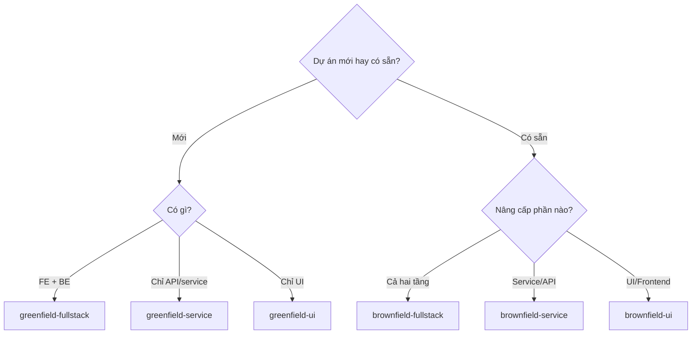
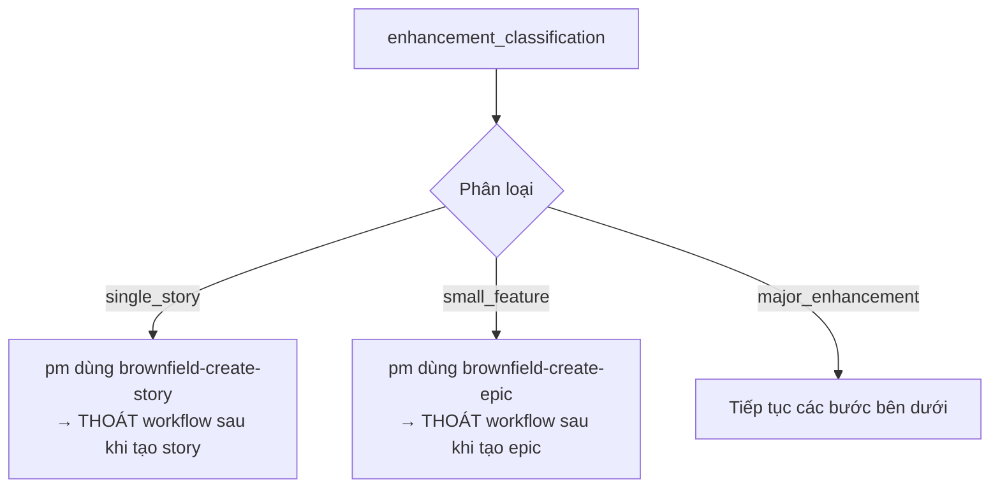
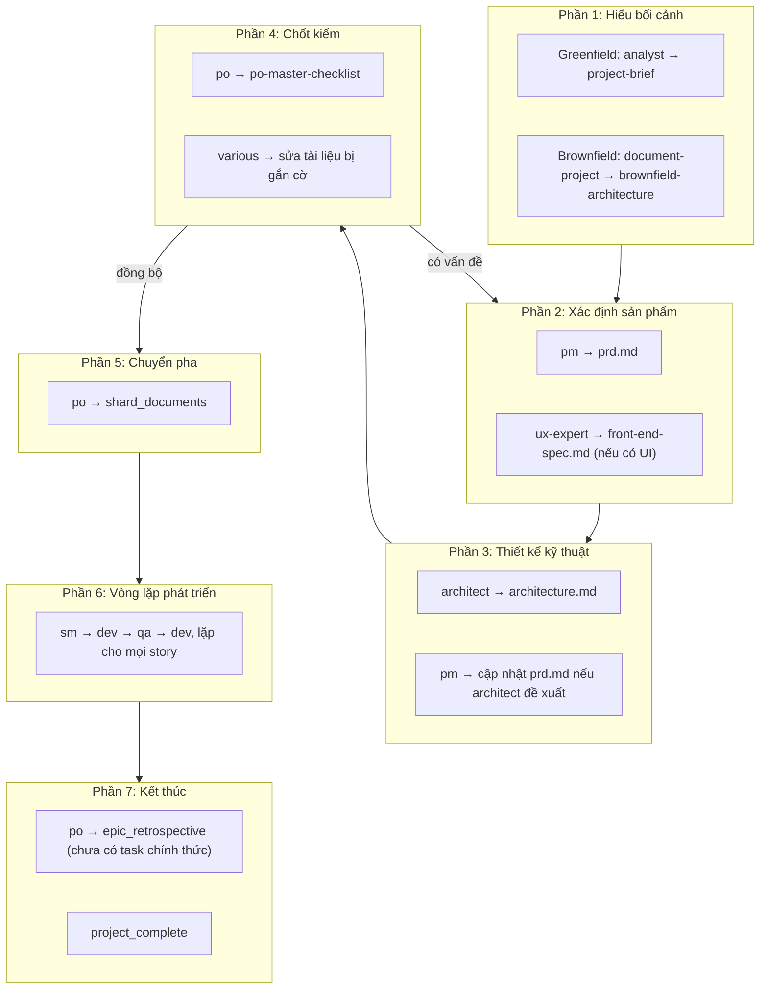

[⬅ Về chỉ mục](./README.md)

# 11 — Workflows: 6 trình tự dự án

Workflow là **bản đồ chiến lược**: nó nói cho bạn (và cho `bmad-orchestrator`) biết vai nào làm gì, theo thứ tự nào, tạo ra artifact gì, và câu bàn giao giữa các bước là gì.

Workflow **không tự chạy** — nó là tài liệu điều hướng. Bạn vẫn gọi từng agent theo trình tự nó chỉ ra.

## 0. Bảng chọn workflow

| Workflow | Type | project_types |
|----------|------|---------------|
| `greenfield-fullstack` | greenfield | web-app, saas, enterprise-app, prototype, mvp |
| `greenfield-service` | greenfield | rest-api, microservice, backend-service, api-prototype, simple-service |
| `greenfield-ui` | greenfield | spa, mobile-app, micro-frontend, static-site, ui-prototype, simple-interface |
| `brownfield-fullstack` | brownfield | feature-addition, refactoring, modernization, integration-enhancement |
| `brownfield-service` | brownfield | service-modernization, api-migration, performance-optimization, integration-enhancement |
| `brownfield-ui` | brownfield | ui-modernization, framework-migration, design-refresh, ux-improvement |



---

## 1. Cấu trúc file workflow

```yaml
workflow:
  id: greenfield-fullstack
  name: Greenfield Full-Stack Application Development
  description: >-
    …
  type: greenfield
  project_types: [ … ]

  sequence:
    - agent: analyst                    # hoặc: step: <tên bước phi-agent>
      creates: project-brief.md         # hoặc updates: / validates:
      requires: <artifact cần có trước>
      uses: <checklist dùng>
      action: <hành động>
      condition: <điều kiện thực hiện>
      optional: true
      optional_steps: [ brainstorming_session, market_research_prompt ]
      repeats: for_each_epic
      notes: "… SAVE OUTPUT: Copy final X to your project's docs/ folder."

  flow_diagram: |
    ```mermaid
    …
    ```

  decision_guidance:
    when_to_use: [ … ]

  handoff_prompts:
    analyst_to_pm: "…"
    pm_to_ux: "…"
    …
```

**Trường quan trọng nhất cho vận hành thủ công**: `notes` (chứa chỉ dẫn "SAVE OUTPUT: …" — nhắc bạn copy artifact về project) và `handoff_prompts` (câu bạn dùng để chuyển sang agent kế tiếp).

---

## 2. `greenfield-fullstack` — chi tiết đầy đủ

Đây là workflow tham chiếu; các workflow khác là biến thể.

### Pha hoạch định

| # | Agent | Tạo/Làm | Cần trước | Điều kiện | Ghi chú |
|---|-------|---------|-----------|-----------|---------|
| 1 | `analyst` | `project-brief.md` | — | — | Có thể brainstorm trước, rồi nghiên cứu sâu tuỳ chọn. **SAVE OUTPUT** vào `docs/`. Bước tuỳ chọn: `brainstorming_session`, `market_research_prompt` |
| 2 | `pm` | `prd.md` | `project-brief.md` | — | Dùng `prd-tmpl`. **SAVE OUTPUT** vào `docs/` |
| 3 | `ux-expert` | `front-end-spec.md` | `prd.md` | — | Dùng `front-end-spec-tmpl`. Bước tuỳ chọn: `user_research_prompt` |
| 4 | `ux-expert` | `v0_prompt` *(tuỳ chọn)* | `front-end-spec.md` | `user_wants_ai_generation` | **KHUYẾN NGHỊ**: sinh prompt UI cho v0/Lovable qua task `generate-ai-frontend-prompt`; sau đó bạn sinh UI ở công cụ ngoài và tải cấu trúc dự án về |
| 5 | `architect` | `fullstack-architecture.md` | `prd.md` + `front-end-spec.md` | — | Dùng `fullstack-architecture-tmpl`. Nếu bạn đã sinh UI bằng v0/Lovable, có thể tích hợp cấu trúc đó vào kiến trúc. **Có thể đề xuất thay đổi story hoặc thêm story mới**. Bước tuỳ chọn: `technical_research_prompt`, `review_generated_ui_structure` |
| 6 | `pm` | cập nhật `prd.md` | `fullstack-architecture.md` | `architecture_suggests_prd_changes` | Nếu architect đề xuất đổi story → cập nhật PRD và **re-export toàn bộ** `prd.md` (không rút gọn) vào `docs/` |
| 7 | `po` | validate `all_artifacts` | — | — | Dùng `po-master-checklist`. Có thể yêu cầu cập nhật bất kỳ tài liệu nào |
| 8 | `various` | cập nhật tài liệu bị gắn cờ | — | `po_checklist_issues` | Quay lại agent liên quan để sửa và re-export |

### Bước hướng dẫn (không phải agent)

| # | Step | Điều kiện | Nội dung |
|---|------|-----------|----------|
| 9 | `project_setup_guidance` | `user_has_generated_ui` | Nếu bạn sinh UI bằng v0/Lovable: polyrepo → đặt project tải về vào repo frontend riêng cạnh repo backend; monorepo → đặt vào `apps/web` hoặc `packages/frontend`. Xem tài liệu kiến trúc để biết chỉ dẫn cụ thể |
| 10 | `development_order_guidance` | — | Dựa trên story trong PRD: story nghiêng frontend → bắt đầu từ frontend; nghiêng backend hoặc API-first → bắt đầu từ backend; tính năng gắn chặt → theo thứ tự story trong monorepo. Tham chiếu epic đã shard để biết thứ tự phát triển |

### Chuyển pha

| # | Agent | Hành động | Ghi chú |
|---|-------|-----------|---------|
| 11 | `po` | `shard_documents` → `sharded_docs` | **Option A**: dùng PO agent — `@po` rồi yêu cầu shard `docs/prd.md`. **Option B**: thủ công — kéo task `shard-doc` + `docs/prd.md` vào chat. Tạo ra `docs/prd/` và `docs/architecture/` |

### Vòng phát triển

| # | Agent | Hành động | Lặp | Ghi chú |
|---|-------|-----------|-----|---------|
| 12 | `sm` | `create_story` → `story.md` | **for_each_epic** | **SM Agent (New Chat)**: `@sm` → `*create`. Story bắt đầu ở trạng thái `Draft` |
| 13 | `analyst/pm` | `review_draft_story` *(tuỳ chọn)* | | Điều kiện `user_wants_story_review`. **NOTE: task `story-review` sắp có** — hiện chưa tồn tại chính thức. Review độ đầy đủ và tính khớp; cập nhật `Draft → Approved` |
| 14 | `dev` | `implement_story` → `implementation_files` | | **Dev Agent (New Chat)**: `@dev`. Triển khai story đã duyệt, cập nhật **File List** với mọi thay đổi, đánh dấu `Review` khi xong |
| 15 | `qa` | `review_implementation` *(tuỳ chọn)* | | **QA Agent (New Chat)**: `@qa` → `review-story`. Review kiểu senior dev, có quyền refactor; sửa vấn đề nhỏ trực tiếp; để lại checklist cho phần còn lại; cập nhật trạng thái story (`Review → Done` hoặc giữ `Review`) |
| 16 | `dev` | `address_qa_feedback` | | Điều kiện `qa_left_unchecked_items`. **Dev Agent (New Chat)**: xử lý các mục còn lại, rồi trả về QA để duyệt cuối |
| 17 | — | `repeat_development_cycle` | | Lặp SM → Dev → QA cho **mọi story** của epic, tới khi hết story trong PRD |

### Kết thúc

| # | Agent | Hành động | Ghi chú |
|---|-------|-----------|---------|
| 18 | `po` | `epic_retrospective` *(tuỳ chọn)* → `epic-retrospective.md` | Điều kiện `epic_complete`. **NOTE: task `epic-retrospective` sắp có** — hiện chưa tồn tại chính thức. Xác nhận epic hoàn thành đúng, ghi lại bài học |
| 19 | — | `workflow_end` → `project_complete` | Mọi story đã triển khai và review. Tham chiếu `{root}/data/bmad-kb.md#IDE Development Workflow` |

### `handoff_prompts` — dùng nguyên văn khi chuyển agent

| Khoá | Câu bàn giao |
|------|-------------|
| `analyst_to_pm` | "Project brief is complete. Save it as `docs/project-brief.md` in your project, then create the PRD." |
| `pm_to_ux` | "PRD is ready. Save it as `docs/prd.md` in your project, then create the UI/UX specification." |
| `ux_to_architect` | "UI/UX spec complete. Save it as `docs/front-end-spec.md` in your project, then create the fullstack architecture." |
| `architect_review` | "Architecture complete. Save it as `docs/fullstack-architecture.md`. Do you suggest any changes to the PRD stories or need new stories added?" |
| `architect_to_pm` | "Please update the PRD with the suggested story changes, then re-export the complete `prd.md` to `docs/`." |
| `updated_to_po` | "All documents ready in `docs/` folder. Please validate all artifacts for consistency." |
| `po_issues` | "PO found issues with [document]. Please return to [agent] to fix and re-save the updated document." |
| `complete` | "All planning artifacts validated and saved in `docs/` folder. Move to IDE environment to begin development." |

### `decision_guidance.when_to_use`

Dùng workflow này khi: xây ứng dụng production-ready · nhiều người tham gia · yêu cầu tính năng phức tạp · cần tài liệu đầy đủ · dự kiến bảo trì lâu dài · ứng dụng enterprise hoặc hướng khách hàng.

---

## 3. `greenfield-service` — API / backend

Khác `greenfield-fullstack` ở chỗ **bỏ toàn bộ bước UX**:

```text
analyst: project-brief.md
  → pm: prd.md
  → architect: architecture.md          ← không có front-end-spec, không có v0 prompt
  → pm: cập nhật prd.md (nếu cần)
  → po: validate all_artifacts
  → various: cập nhật tài liệu bị gắn cờ
  → po: shard_documents
  → [sm → (analyst/pm review) → dev → qa → dev] × mọi story
  → po: epic_retrospective (tuỳ chọn)
  → workflow_end
```

Dùng cho: `rest-api`, `microservice`, `backend-service`, `api-prototype`, `simple-service`.

---

## 4. `greenfield-ui` — frontend thuần

```text
analyst: project-brief.md
  → pm: prd.md
  → ux-expert: front-end-spec.md
  → ux-expert: v0_prompt (tuỳ chọn)
  → architect: front-end-architecture.md     ← lưu ý: template xuất ra docs/ui-architecture.md
  → pm: cập nhật prd.md (nếu cần)
  → po: validate all_artifacts
  → various: cập nhật tài liệu bị gắn cờ
  → step: project_setup_guidance
  → po: shard_documents
  → [sm → (analyst/pm review) → dev → qa → dev] × mọi story
  → repeat_development_cycle
```

Dùng cho: `spa`, `mobile-app`, `micro-frontend`, `static-site`, `ui-prototype`, `simple-interface`.

---

## 5. `brownfield-fullstack` — workflow phức tạp nhất

Điểm đặc biệt: **có bước phân loại và định tuyến ở đầu**, cho phép "thoát sớm" nếu enhancement nhỏ.

### Bước 1 — `enhancement_classification` (agent: `analyst`)

Agent hỏi bạn: *"Can you describe the enhancement scope? Is this a small fix, a feature addition, or a major enhancement requiring architectural changes?"*

Rồi phân loại:

| Phạm vi | Định tuyến |
|---------|-----------|
| **Single story** (< 4 giờ) | Dùng task `brownfield-create-story` |
| **Small feature** (1–3 story) | Dùng task `brownfield-create-epic` |
| **Major enhancement** (nhiều epic) | Tiếp tục workflow đầy đủ |

### Bước 2 — `routing_decision`



> Đây là thiết kế rất thực dụng: **không bắt bạn làm PRD + Architecture cho một bug fix.**

### Bước 3 — `documentation_check` (agent: `analyst`, điều kiện `major_enhancement_path`)

Kiểm tra tài liệu hiện có: tìm architecture docs, API spec, coding standards; đánh giá còn cập nhật và đầy đủ không.

- **Đủ** → **bỏ qua** `document-project`, đi thẳng tới PRD
- **Không đủ** → chạy `document-project` trước

### Bước 4 — `project_analysis` (agent: `architect`, điều kiện `documentation_inadequate`)

Chạy task `document-project` → tạo `brownfield-architecture.md` (hoặc nhiều tài liệu), ghi nhận **trạng thái hiện tại, nợ kỹ thuật, và ràng buộc**; chuyển kết quả sang bước tạo PRD.

### Bước 5 trở đi

```text
pm: prd.md                              (brownfield-prd-tmpl)
  → step: architecture_decision          ← quyết định có cần tài liệu kiến trúc riêng không
  → architect: architecture.md           (nếu cần)
  → po: validate all_artifacts
  → various: cập nhật tài liệu bị gắn cờ
  → po: shard_documents
  → [sm → (analyst/pm review) → dev → qa → dev] × mọi story
  → repeat_development_cycle
```

---

## 6. `brownfield-service` — nâng cấp service/API

```text
step: service_analysis (agent: architect)   ← chạy document-project, tạo nhiều tài liệu
  → pm: prd.md
  → architect: architecture.md
  → po: validate all_artifacts
  → various: cập nhật tài liệu bị gắn cờ
  → po: shard_documents
  → [sm → (analyst/pm review) → dev → qa → dev] × mọi story
  → repeat_development_cycle
  → po: epic_retrospective (tuỳ chọn)
  → workflow_end: project_complete
```

Dùng cho: `service-modernization`, `api-migration`, `performance-optimization`, `integration-enhancement`.

**Khác `brownfield-fullstack`**: không có bước phân loại/định tuyến — luôn chạy `document-project` trước.

---

## 7. `brownfield-ui` — nâng cấp UI/frontend

```text
step: ui_analysis (agent: architect)        ← chạy document-project
  → pm: prd.md
  → ux-expert: front-end-spec.md            ← có thêm bước UX so với brownfield-service
  → architect: architecture.md
  → po: validate all_artifacts
  → various: cập nhật tài liệu bị gắn cờ
  → po: shard_documents
  → [sm → (analyst/pm review) → dev → qa → dev] × mọi story
  → repeat_development_cycle
  → po: epic_retrospective (tuỳ chọn)
  → workflow_end
```

Dùng cho: `ui-modernization`, `framework-migration`, `design-refresh`, `ux-improvement`.

---

## 8. Cấu trúc chung của mọi workflow — nhìn từ trên xuống



**Bảy phần này giống nhau ở mọi workflow.** Khác biệt chỉ nằm ở: có bước UX hay không · greenfield khởi đầu bằng brief hay brownfield khởi đầu bằng `document-project` · brownfield-fullstack có thêm cơ chế định tuyến thoát sớm.

---

## 9. Hai task được workflow tham chiếu nhưng CHƯA TỒN TẠI

| Tham chiếu | Trạng thái | Cách xử lý thủ công |
|-----------|-----------|---------------------|
| `story-review` (bước "review_draft_story") | Workflow ghi rõ **"NOTE: story-review task coming soon"** | Dùng `po *validate-story-draft {story}` (task `validate-next-story`) — nó làm đúng việc này và còn kỹ hơn |
| `epic-retrospective` (bước cuối) | Workflow ghi rõ **"NOTE: epic-retrospective task coming soon"** | Chạy thủ công: dùng `*party-mode` của orchestrator để họp retrospective đa agent, hoặc tự viết `docs/epic-{n}-retrospective.md` theo 4 mục: đã hoàn thành gì · gì chưa đúng kế hoạch · bài học · cải thiện cho epic sau |

---

## 10. Cách dùng workflow thủ công

Workflow không tự chạy. Quy trình thực tế:

1. **Chọn workflow** theo bảng ở mục 0
2. **Mở file YAML** tương ứng trong `bmad-core/workflows/`
3. **Đọc `sequence`** — đây là danh sách việc của bạn
4. Với mỗi bước: gọi agent tương ứng, ra lệnh, **đọc `notes` để biết phải SAVE OUTPUT ở đâu**
5. Dùng **`handoff_prompts`** làm câu chuyển sang bước kế tiếp
6. Kiểm `condition` để biết bước nào bỏ qua được
7. Với bước `repeats: for_each_epic` → lặp cho tới hết

Nếu dùng bundle web, có thể để `bmad-orchestrator` dẫn đường:

```text
*workflow-guidance          → tư vấn chọn workflow phù hợp
*workflow greenfield-fullstack  → bắt đầu workflow
*plan                       → lập kế hoạch chi tiết trước khi bắt đầu
*plan-status                → xem tiến độ
*plan-update                → cập nhật trạng thái kế hoạch
```

(Cơ chế plan được định nghĩa trong `common/utils/workflow-management.md`.)

---

**Tiếp theo**: [12 — Agent teams](./12-agent-teams.md)
