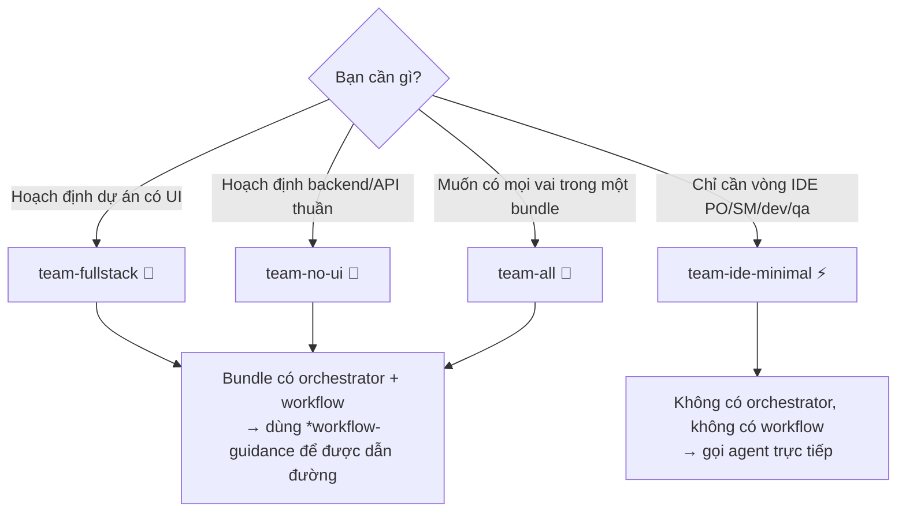

[⬅ Về chỉ mục](./README.md)

# 12 — Agent teams và `common/utils`

## Phần A — Agent teams

Team là **gói vai trò** dùng để dựng bundle một-file cho môi trường web. Trong IDE bạn gọi agent trực tiếp, không cần team.

### 1. Bốn team

| Team | Icon | Mô tả | Agent | Workflow |
|------|------|-------|-------|----------|
| `team-all` | 👥 | Gồm mọi agent hệ thống lõi | `bmad-orchestrator` + `"*"` | 6 workflow |
| `team-fullstack` | 🚀 | Đủ sức làm full stack, chỉ front end, hoặc service | `bmad-orchestrator`, `analyst`, `pm`, `ux-expert`, `architect`, `po` | 6 workflow |
| `team-no-ui` | 🔧 | Team không có phần UX/UI | `bmad-orchestrator`, `analyst`, `pm`, `architect`, `po` | `greenfield-service`, `brownfield-service` |
| `team-ide-minimal` | ⚡ | Tối giản cho vòng PO/SM/dev/qa trong IDE | `po`, `sm`, `dev`, `qa` | `null` |

### 2. Cấu trúc file team

```yaml
bundle:
  name: Team Fullstack
  icon: 🚀
  description: Team capable of full stack, front end only, or service development.
agents:
  - bmad-orchestrator
  - analyst
  - pm
  - ux-expert
  - architect
  - po
workflows:
  - brownfield-fullstack.yaml
  - brownfield-service.yaml
  - brownfield-ui.yaml
  - greenfield-fullstack.yaml
  - greenfield-service.yaml
  - greenfield-ui.yaml
```

### 3. Ba quy tắc phân giải team (do tooling thực thi)

| Quy tắc | Chi tiết |
|---------|----------|
| **Wildcard `"*"`** | = mọi agent trong `bmad-core/agents/` **trừ** `bmad-master` |
| **Orchestrator luôn đứng đầu** | `bmad-orchestrator` được thêm **trước tiên** vào mọi team bundle; nếu team file quên khai báo, tooling **tự thêm** kèm cảnh báo |
| **`bmad-master` bị loại** | Không bao giờ vào team bundle (tránh trùng năng lực với orchestrator và giảm kích thước bundle) |

Tài nguyên trùng lặp giữa các agent được **khử trùng theo đường dẫn** → bundle không lặp nội dung.

### 4. Chú ý: `team-fullstack` KHÔNG có `dev`, `sm`, `qa`

Nhìn bảng ở mục 1: `team-fullstack` chỉ gồm các vai **hoạch định**. Đây là **cố ý** — bundle web dùng cho hoạch định, còn `dev`/`sm`/`qa` làm việc trong IDE nơi có truy cập file thật.

Nếu bạn cần cả vòng phát triển trong một bundle: dùng `team-all`, hoặc `team-ide-minimal` (nhưng team này không có orchestrator nên cũng không có workflow).

> Ghi chú: `bmad-kb.md` mô tả Team Fullstack gồm "PM, Architect, Developer, QA, UX Expert" — **không khớp** với file YAML thật. Hãy tin file YAML.

### 5. Chọn team nào



### 6. Bundle được dựng ra như thế nào

```mermaid
flowchart LR
    A["agent-teams/team-fullstack.yaml"] --> B[Đọc danh sách agent]
    B --> C["Thêm bmad-orchestrator trước tiên"]
    C --> D["Nở wildcard nếu có, loại bmad-master"]
    D --> E["Với mỗi agent: đọc dependencies<br/>tasks · templates · checklists · data · utils"]
    E --> F["Tìm tài nguyên: bmad-core/ → common/"]
    F --> G["Khử trùng theo đường dẫn"]
    G --> H["Thêm workflows của team"]
    H --> I["Ghép: header instructions +<br/>từng tài nguyên bọc mốc START/END +<br/>thay {root} thành .bmad-core"]
    I --> J["dist/teams/team-fullstack.txt"]
```



### 7. Dùng bundle thủ công

1. Mở `dist/teams/team-fullstack.txt`, copy toàn bộ nội dung
2. Tạo Gemini Gem / CustomGPT / Claude Project mới
3. Upload file kèm instruction: **"Your critical operating instructions are attached, do not break character as directed"**
4. Gõ `*help` → orchestrator hiện danh sách agent và workflow **có trong bundle**
5. Gõ `*agent analyst` để biến hình, hoặc `*workflow-guidance` để được tư vấn chọn workflow

**Cách agent định vị tài nguyên trong bundle**: nội dung được bọc bởi mốc

```text
==================== START: .bmad-core/tasks/create-doc.md ====================
…nội dung…
==================== END: .bmad-core/tasks/create-doc.md ====================
```

Khi agent cần `tasks: create-doc`, nó tìm mốc `START: .bmad-core/tasks/create-doc.md`. Nếu agent nói "không tìm thấy tài nguyên", hãy nhắc nó tra theo mốc này.

### 8. Bundle từng agent

`dist/agents/<agent-id>.txt` — bundle chỉ một agent kèm phụ thuộc của nó. Theo `bmad-kb.md`, những file này **không cần thiết** trừ khi bạn muốn tạo một web agent chỉ gồm một vai, không phải cả team.

---

## Phần B — `common/utils`

Hai file tiện ích, sau khi cài sẽ nằm ở `.bmad-core/utils/`.

### 1. `bmad-doc-template.md` — đặc tả cú pháp template

327 dòng, là **spec chuẩn** cho định dạng template YAML. Đọc file này khi bạn muốn tự viết hoặc sửa template. Nội dung đã được trình bày trong [file 08 §1](./08-templates.md#1-cú-pháp-template-đặc-tả-commonutilsbmad-doc-templatemd).

Mục hữu ích nhất: **Migration from Legacy** — cách chuyển template kiểu cũ (markdown + frontmatter) sang YAML:

| Cũ | Mới |
|----|-----|
| Chỉ dẫn `[[LLM:]]` nhúng trong nội dung | trường `instruction` |
| Block `<<REPEAT>>` | `repeatable: true` |
| `^^CONDITIONS^^` | trường `condition` |
| `@{examples}` | mảng `examples` |
| `{{placeholders}}` | cú pháp biến chuẩn |

### 2. `workflow-management.md` — quản lý workflow cho orchestrator

Cho phép `bmad-orchestrator` quản lý và thực thi workflow của team.

**Nạp workflow động**: đọc trường `workflows` của cấu hình team hiện tại. Mỗi team bundle tự định nghĩa workflow nó hỗ trợ.

**Các lệnh workflow** (lưu ý: file này dùng tiền tố `/`, còn agent orchestrator định nghĩa lệnh tiền tố `*` — cả hai đều xuất hiện trong repo):

| Lệnh | Tác dụng |
|------|----------|
| `/workflows` | Liệt kê workflow trong bundle hiện tại hoặc trong thư mục workflows, kèm tiêu đề và mô tả |
| `/agent-list` | Hiện các agent trong bundle |
| `/workflow-start {workflow-id}` | Bắt đầu workflow và chuyển sang agent đầu tiên |
| `/workflow-status` | Hiện tiến độ hiện tại, artifact đã hoàn thành, bước tiếp theo |
| `/workflow-resume` | Tiếp tục workflow từ vị trí cuối; **bạn có thể cung cấp các artifact đã hoàn thành** |
| `/workflow-next` | Hiện agent và hành động được khuyến nghị kế tiếp |

**Luồng thực thi 4 giai đoạn**

1. **Starting** — nạp định nghĩa → xác định stage đầu → chuyển sang agent → dẫn dắt tạo artifact
2. **Stage Transitions** — đánh dấu hoàn thành → kiểm điều kiện → nạp agent kế tiếp → **truyền artifact**
3. **Artifact Tracking** — theo dõi trạng thái, người tạo, timestamp trong `workflow_state`
4. **Interruption Handling** — phân tích artifact bạn cung cấp → xác định vị trí đang ở đâu → gợi ý bước kế tiếp

> Giai đoạn 4 rất hữu ích thực tế: nếu bạn bỏ giữa và quay lại sau (hoặc mất hội thoại), chỉ cần đưa các artifact đã có và gọi `/workflow-resume` — orchestrator sẽ tự suy ra bạn đang ở đâu.

**Truyền ngữ cảnh khi chuyển bước** — phải truyền 4 thứ: artifact trước đó · stage hiện tại · đầu ra kỳ vọng · các quyết định/ràng buộc đã có.

**Workflow nhiều nhánh**: xử lý đường dẫn có điều kiện bằng cách **hỏi câu làm rõ** khi cần.

**5 thực hành tốt**: hiện tiến độ · giải thích mỗi lần chuyển bước · bảo toàn ngữ cảnh · cho phép linh hoạt · theo dõi trạng thái.

**Tích hợp agent**: agent nên "biết workflow" — biết workflow đang chạy, biết vai của mình trong đó, truy cập được artifact, hiểu đầu ra kỳ vọng.

---

## Phần C — `common/tasks`

| Task | Đã trình bày ở |
|------|----------------|
| `create-doc.md` | [file 05 §1](./05-tasks-tai-lieu.md#1-create-doc) |
| `execute-checklist.md` | [file 05 §3](./05-tasks-tai-lieu.md#3-execute-checklist) |

Vì sao hai task này nằm ở `common/` chứ không phải `bmad-core/tasks/`: chúng được **dùng chung** bởi cả core và mọi expansion pack. Sau khi cài, chúng được copy vào `.bmad-core/tasks/` (và vào `.{pack-id}/tasks/` nếu pack cần), nên khi agent nói `{root}/tasks/create-doc.md` là đúng.

---

**Tiếp theo**: [13 — Công thức vận hành thủ công](./13-cong-thuc-van-hanh-thu-cong.md)
