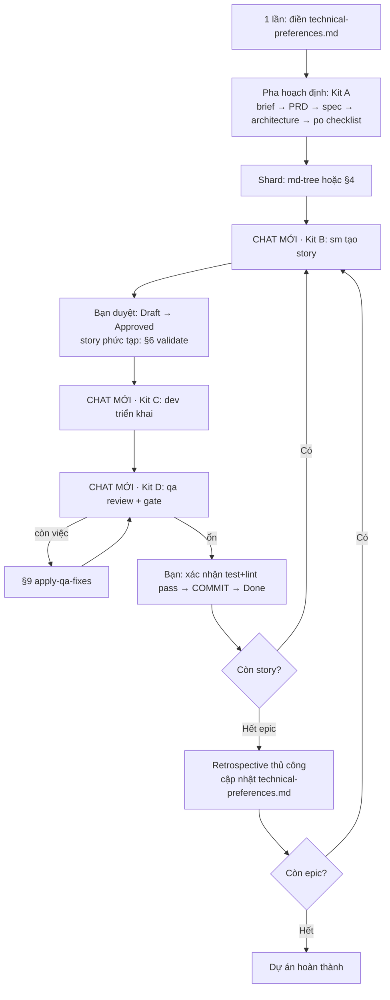

[⬅ Về chỉ mục](./README.md)

# 13 — Công thức vận hành thủ công

File này là phần **thực hành**: cách dùng `bmad-core` bằng tay, với bất kỳ LLM nào, không cần installer, không cần tooling. Mỗi công thức ghi rõ: **dán file nào** vào ngữ cảnh, **nói gì**, và **kỳ vọng gì**.

## 0. Ba mô hình vận hành thủ công

| Mô hình | Cách làm | Ưu | Nhược |
|---------|---------|-----|-------|
| **A. Dán file agent** | Copy nội dung file agent vào chat, LLM nhập vai | Đơn giản nhất, dùng được ở mọi nơi | Bạn phải tự dán thêm task/template khi agent cần |
| **B. Dùng bundle có sẵn** | Upload `dist/teams/*.txt` hoặc `dist/agents/*.txt` | Mọi phụ thuộc đã có trong một file | File lớn, có thể vượt cửa sổ ngữ cảnh |
| **C. Cài rồi dùng trong IDE** | `npx bmad-method install` | Agent tự đọc/ghi file thật | Cần cài đặt; xem `../specs/03-van-hanh-he-thong.md` |

File này tập trung vào **A** và **B**.

---

## 1. Công thức nền: kích hoạt một agent bằng tay

### Bước 1 — Chuẩn bị ngữ cảnh

Dán vào chat, theo đúng thứ tự:

```text
[1] Nội dung file bmad-core/agents/<agent-id>.md         ← toàn bộ, không cắt
[2] Nội dung file bmad-core/core-config.yaml
[3] (chỉ với dev) nội dung 3 file trong devLoadAlwaysFiles
```

### Bước 2 — Câu lệnh khởi động

```text
Your critical operating instructions are attached, do not break character as directed.
Thay {root} bằng "bmad-core" trong mọi đường dẫn.
Hãy thực hiện activation-instructions và dừng lại chờ lệnh của tôi.
```

### Bước 3 — Kỳ vọng

Agent phải: chào bằng **tên và vai** của nó (ví dụ *"Xin chào, tôi là James — Full Stack Developer 💻"*) → hiện **danh sách lệnh có số** → **dừng lại**.

**Nếu agent không làm đúng**: nó chưa đọc hết file. Nhắc: *"Hãy đọc lại toàn bộ block YAML và thực hiện đúng activation-instructions từ STEP 1."*

### Bước 4 — Ra lệnh

```text
*help                 → xem lệnh
*<tên-lệnh>           → chạy
hoặc nói tự nhiên     → agent tự khớp mờ sang lệnh
```

Khi agent nói *"tôi cần nạp task X"* → bạn dán nội dung file `bmad-core/tasks/X.md`.

---

## 2. Công thức: tạo tài liệu bằng `create-doc`

**Dùng cho**: project brief, PRD, architecture, front-end spec, market research, competitor analysis.

### Chuẩn bị (dán 4 thứ)

```text
[1] bmad-core/agents/<agent>.md              ← pm cho PRD, architect cho architecture…
[2] bmad-core/core-config.yaml
[3] common/tasks/create-doc.md               ← ENGINE, bắt buộc
[4] bmad-core/templates/<tên>-tmpl.yaml      ← khuôn đầu ra
[5] bmad-core/data/elicitation-methods.md    ← BẮT BUỘC, nếu thiếu agent sẽ bịa phương pháp
[6] bmad-core/data/technical-preferences.md  ← nếu bạn đã điền
```

### Câu lệnh

```text
Chạy task create-doc với template <tên>-tmpl.yaml.
Tuân thủ nghiêm ngặt: xử lý từng section một; với mỗi section có elicit: true,
hãy trình bày nội dung + rationale chi tiết, rồi đưa đúng 9 lựa chọn có số
(option 1 = "Proceed to next section", option 2-9 lấy từ elicitation-methods),
kết thúc bằng "Select 1-9 or just type your question/feedback:" và ĐỢI tôi trả lời.
```

### Trong lúc chạy

| Bạn gõ | Nghĩa |
|--------|-------|
| `1` | Chấp nhận section, đi tiếp |
| `2`–`9` | Chạy phương pháp tinh chỉnh tương ứng |
| Văn bản tự do | Góp ý trực tiếp, agent áp dụng rồi tiếp |
| `#yolo` | Chuyển sang sinh toàn bộ một lượt |

### Kết thúc

Yêu cầu `*doc-out` để agent xuất bản đầy đủ, rồi **bạn tự lưu** vào đúng đường dẫn:

| Template | Lưu vào |
|----------|---------|
| `project-brief-tmpl` | `docs/project-brief.md` *(template mặc định ghi `docs/brief.md` — hãy chọn một tên và dùng nhất quán)* |
| `prd-tmpl` / `brownfield-prd-tmpl` | `docs/prd.md` |
| `architecture-tmpl` / `fullstack-architecture-tmpl` / `brownfield-architecture-tmpl` | `docs/architecture.md` |
| `front-end-architecture-tmpl` | `docs/ui-architecture.md` |
| `front-end-spec-tmpl` | `docs/front-end-spec.md` |

### Dấu hiệu agent đang làm SAI

- Sinh trọn tài liệu trong một lượt trả lời mà không hỏi gì → **vi phạm**, yêu cầu làm lại từng section
- Hỏi kiểu "Bạn có muốn tôi tiếp tục không? (có/không)" → **sai định dạng**, yêu cầu dùng 9 lựa chọn có số
- Bỏ rationale → yêu cầu bổ sung trade-off, giả định, quyết định đáng chú ý, vùng cần xác thực

---

## 3. Công thức: chạy checklist bằng tay

### Chuẩn bị

```text
[1] bmad-core/agents/<agent>.md
[2] common/tasks/execute-checklist.md
[3] bmad-core/checklists/<tên>-checklist.md
[4] Các artifact mà checklist yêu cầu (đọc phần đầu checklist để biết)
```

### Câu lệnh

```text
Chạy execute-checklist với <tên>-checklist. Dùng chế độ YOLO (xử lý toàn bộ,
báo cáo tổng ở cuối). Đánh dấu từng mục bằng ✅ PASS / ❌ FAIL / ⚠️ PARTIAL / N/A
(mục N/A phải kèm lý do). Cuối cùng đưa tỉ lệ pass theo từng section
và khuyến nghị cải thiện cụ thể.
```

### Kỳ vọng

Báo cáo có: trạng thái tổng · **tỉ lệ pass theo section** · danh sách mục FAIL kèm ngữ cảnh · khuyến nghị · mục N/A kèm biện minh.

---

## 4. Công thức: shard tài liệu bằng tay

### Cách nhanh (khuyến nghị)

```bash
npm install -g @kayvan/markdown-tree-parser
md-tree explode docs/prd.md docs/prd
md-tree explode docs/architecture.md docs/architecture
```

### Cách thủ công hoàn toàn (khi không cài được công cụ)

**Chuẩn bị**: dán `bmad-core/tasks/shard-doc.md` + tài liệu cần chẻ, và **nói rõ** `markdownExploder = false`.

**Câu lệnh**

```text
markdownExploder = false. Hãy chẻ tài liệu này theo quy trình thủ công trong shard-doc:
tách theo heading cấp 2, hạ cấp mọi heading một bậc, đặt tên file lowercase-dash-case,
tạo index.md liệt kê link. Bảo toàn NGUYÊN VẸN code fence, sơ đồ Mermaid, bảng, list.
Lưu ý: dấu ## bên trong code fence KHÔNG phải heading.
Xuất ra cho tôi từng file một, kèm tên file, để tôi tự lưu.
```

**Tự kiểm sau khi chẻ**

- [ ] Số file = số heading `##` trong tài liệu gốc
- [ ] Mỗi file mở đầu bằng `#` (đã hạ cấp)
- [ ] `index.md` có H1 gốc + phần mở đầu + đủ link
- [ ] Sơ đồ Mermaid còn nguyên, mở/đóng code fence đúng
- [ ] Ghép các file lại được tài liệu gốc (tính khả nghịch)
- [ ] `docs/architecture/` có `coding-standards.md`, `tech-stack.md`, `source-tree.md`

---

## 5. Công thức: tạo story bằng tay (quan trọng nhất)

### Chuẩn bị — dán đúng và đủ

```text
[1] bmad-core/agents/sm.md
[2] bmad-core/core-config.yaml
[3] bmad-core/tasks/create-next-story.md
[4] bmad-core/templates/story-tmpl.yaml
[5] File epic liên quan: docs/prd/epic-<n>.md
[6] Tài liệu kiến trúc theo LOẠI story:
      MỌI story:      tech-stack.md · unified-project-structure.md
                      coding-standards.md · testing-strategy.md
      + Backend/API:  data-models.md · database-schema.md · backend-architecture.md
                      rest-api-spec.md · external-apis.md
      + Frontend/UI:  frontend-architecture.md · components.md · core-workflows.md · data-models.md
[7] Story TRƯỚC ĐÓ (nếu có) — để lấy Dev Agent Record
[8] bmad-core/checklists/story-draft-checklist.md
```

### Câu lệnh

```text
Chạy task create-next-story. Đây là story <epic>.<story>.
Yêu cầu bắt buộc:
- Dev Notes CHỈ chứa thông tin trích từ các tài liệu tôi đã cung cấp.
  TUYỆT ĐỐI không bịa thư viện, pattern hay chuẩn nào không có trong tài liệu.
- MỌI chi tiết kỹ thuật phải kèm trích dẫn [Source: architecture/<file>.md#<section>].
- Nhóm nào không có nguồn thì ghi rõ "No specific guidance found in architecture docs".
- Tasks/Subtasks phải tuần tự, có subtask test tường minh, và map AC dạng (AC: 1, 3).
- Đặt Status: Draft.
- Cuối cùng chạy story-draft-checklist và báo cáo kết quả.
```

### Tự kiểm story (làm mỗi lần, đừng bỏ)

- [ ] Status = `Draft`
- [ ] AC copy **nguyên** từ epic, không diễn giải lại
- [ ] Dev Notes có đủ 7 nhóm: Previous Story Insights · Data Models · API Specifications · Component Specifications · File Locations · Testing Requirements · Technical Constraints
- [ ] **Mọi** chi tiết kỹ thuật có `[Source: …]`
- [ ] Không có khẳng định kỹ thuật nào mà bạn không tìm được trong tài liệu nguồn
- [ ] Tasks/Subtasks tuần tự, có test, map AC
- [ ] Có "Project Structure Notes" nếu phát hiện xung đột
- [ ] **Câu hỏi vàng**: *Nếu tôi chỉ đưa file story này cho một dev không biết gì về dự án, họ làm được không?* Nếu **không** → story chưa đạt, yêu cầu SM bổ sung.

### Sau đó — duyệt story

Đọc kỹ, sửa nếu cần (yêu cầu SM sửa, đừng tự phá vỡ cấu trúc trích nguồn), rồi đổi `Status: Draft` → `Approved`.

Với story phức tạp, chạy thêm công thức §6.

---

## 6. Công thức: validate story draft bằng tay

### Chuẩn bị

```text
[1] bmad-core/agents/po.md
[2] bmad-core/core-config.yaml
[3] bmad-core/tasks/validate-next-story.md
[4] bmad-core/templates/story-tmpl.yaml
[5] File story cần kiểm
[6] File epic cha
[7] Các tài liệu kiến trúc mà story trích dẫn
```

### Câu lệnh

```text
Chạy validate-next-story cho story này. Đi đủ 10 bước.
Đặc biệt nghiêm khắc ở bước 8 (Anti-Hallucination Verification):
hãy đối chiếu TỪNG khẳng định kỹ thuật trong Dev Notes với tài liệu nguồn tôi đã cung cấp,
và chỉ ra bất kỳ chi tiết nào KHÔNG được tài liệu hậu thuẫn.
Kết thúc bằng: GO/NO-GO, Implementation Readiness Score 1-10, Confidence Level.
```

### Ngưỡng quyết định

| Kết quả | Hành động |
|---------|-----------|
| GO, score ≥ 8, không có Critical Issue | Chuyển `Approved` |
| GO, score 6–7 | Sửa các Should-Fix rồi chuyển `Approved` |
| NO-GO **hoặc** có bất kỳ Critical Issue **hoặc** có Anti-Hallucination Finding | **Gửi lại SM sửa**, không cho triển khai |

---

## 7. Công thức: triển khai story bằng tay

### Chuẩn bị

```text
[1] bmad-core/agents/dev.md
[2] bmad-core/core-config.yaml
[3] docs/architecture/coding-standards.md
[4] docs/architecture/tech-stack.md
[5] docs/architecture/source-tree.md
[6] File story (Status = Approved)
[7] bmad-core/checklists/story-dod-checklist.md
```

> **Chỉ dán đúng 7 thứ này.** Không dán PRD, không dán architecture đầy đủ — đó là điểm cốt lõi của phương pháp. Nếu Dev cần thêm thông tin, đó là dấu hiệu **story chưa đủ**, hãy quay lại §5.

### Câu lệnh

```text
*develop-story cho story này.
Tuân thủ order-of-execution: đọc task → implement task và subtask → viết test →
chạy validation → CHỈ KHI tất cả pass thì tick [x] → cập nhật File List → lặp.
Chỉ cập nhật các section được phép của Dev Agent Record.
HALT nếu: cần dependency chưa được duyệt / còn nhập nhằng / thất bại 3 lần cho cùng một việc /
thiếu cấu hình / regression fail.
```

### Khi Dev báo xong

Yêu cầu:

```text
Chạy execute-checklist với story-dod-checklist. Hãy TRUNG THỰC:
liệt kê mọi mục còn [ ] kèm lý do, nêu nợ kỹ thuật và việc phải theo sau,
ghi lại khó khăn/bài học cho story sau, rồi xác nhận story có THỰC SỰ sẵn sàng review.
```

Sau đó Dev đặt `Status: Ready for Review`.

### Tự kiểm

- [ ] Mọi task/subtask `[x]` và **có test**
- [ ] Toàn bộ validation + regression đã chạy thật (không phải "chắc là pass")
- [ ] **File List đầy đủ** — mọi file thêm/sửa/xoá
- [ ] Completion Notes ghi rõ đã làm gì, tại sao, thế nào
- [ ] Change Log có entry mới
- [ ] Dev **không** sửa Story / AC / Dev Notes / Testing / QA Results

### Học từ Dev

```text
*explain
```

Dev sẽ giảng lại vừa làm gì và tại sao, ở mức dạy một junior engineer. Rất đáng dùng.

---

## 8. Công thức: QA review bằng tay

### Chuẩn bị

```text
[1] bmad-core/agents/qa.md
[2] bmad-core/core-config.yaml
[3] bmad-core/tasks/review-story.md
[4] bmad-core/templates/qa-gate-tmpl.yaml
[5] File story (Status = Review)
[6] Mã nguồn của các file trong File List
[7] Các file test liên quan
[8] docs/architecture/coding-standards.md + testing-strategy.md + unified-project-structure.md
[9] (nếu có) các assessment đã chạy trước: risk / test-design / trace / nfr
```

### Câu lệnh

```text
Chạy review-story cho story này.
Đi đủ 6 trục: Requirements Traceability · Code Quality · Test Architecture ·
NFR (security/performance/reliability/maintainability) · Testability
(controllability/observability/debuggability) · Technical Debt.
Áp dụng thuật toán gate TẤT ĐỊNH theo thứ tự: risk ≥9→FAIL, ≥6→CONCERNS;
thiếu P0 test→CONCERNS (P0 security/data-loss→FAIL); issue high→FAIL, medium→CONCERNS;
NFR FAIL→FAIL, CONCERNS→CONCERNS; còn lại PASS.
Tính quality_score = 100 − 20×FAIL − 10×CONCERNS.
Đầu ra 1: nội dung để append vào section QA Results (CHỈ section này).
Đầu ra 2: nội dung file gate .yml đầy đủ.
```

### Trước khi bắt đầu — kiểm 3 tiền đề

- [ ] Status = `Review`
- [ ] File List **không rỗng** và có vẻ đầy đủ
- [ ] Test tự động đang pass

Thiếu bất kỳ điều nào → review sẽ vô nghĩa; sửa trước.

### Bạn tự lưu 2 đầu ra

1. Append vào section `## QA Results` của file story (**append entry mới có ngày**, không ghi đè entry cũ)
2. Lưu file gate: `docs/qa/gates/{epic}.{story}-{slug}.yml`

### Cho story rủi ro cao — chạy 4 task trước

| Thứ tự | Task | Dán thêm |
|--------|------|----------|
| 1 | `risk-profile` | `bmad-core/tasks/risk-profile.md` |
| 2 | `test-design` | `bmad-core/tasks/test-design.md` + `data/test-levels-framework.md` + `data/test-priorities-matrix.md` |
| 3 | `trace-requirements` *(giữa lúc code)* | `bmad-core/tasks/trace-requirements.md` + các file test |
| 4 | `nfr-assess` *(giữa lúc code)* | `bmad-core/tasks/nfr-assess.md` |

Mỗi task xuất ra một file trong `docs/qa/assessments/` + một **khối YAML** để dán vào gate.

---

## 9. Công thức: áp QA fix bằng tay

### Chuẩn bị

```text
[1] bmad-core/agents/dev.md
[2] bmad-core/core-config.yaml
[3] bmad-core/tasks/apply-qa-fixes.md          ← ĐÃ SỬA lệnh lint/test theo stack của bạn!
[4] File story
[5] File gate mới nhất: docs/qa/gates/{e}.{s}-*.yml
[6] Các assessment có liên quan
[7] Mã nguồn cần sửa
```

> ⚠️ **Bắt buộc làm trước lần đầu**: mở `bmad-core/tasks/apply-qa-fixes.md` và thay các lệnh Deno (`deno lint`, `deno test -A`) cùng các đường dẫn ví dụ (`deps.ts`, `src/core/di.ts`, `docs/project/typescript-rules.md`) bằng lệnh/đường dẫn thật của dự án bạn.

### Câu lệnh

```text
Chạy apply-qa-fixes cho story này.
Xây kế hoạch fix TẤT ĐỊNH theo đúng thứ tự ưu tiên:
1) issue high  2) NFR FAIL rồi CONCERNS  3) coverage_gaps (ưu tiên P0)
4) AC chưa được phủ  5) risk must_fix  6) medium rồi low.
Ưu tiên viết test đóng khoảng trống trước/cùng lúc với sửa code.
Chỉ cập nhật các section được phép của Dev. KHÔNG sửa file gate.
Đặt Status theo quy tắc: gate PASS và đã đóng hết gap → Ready for Done;
ngược lại → Ready for Review và yêu cầu QA review lại.
```

---

## 10. Công thức: xử lý thay đổi giữa dòng

### Chuẩn bị

```text
[1] bmad-core/agents/pm.md (hoặc po.md / sm.md)
[2] bmad-core/tasks/correct-course.md
[3] bmad-core/checklists/change-checklist.md
[4] docs/prd.md (hoặc docs/prd/ đã shard)
[5] docs/architecture.md (hoặc đã shard)
[6] Các story bị ảnh hưởng
[7] (nếu có) docs/front-end-spec.md
```

### Câu lệnh

```text
Chạy correct-course. Thay đổi là: <mô tả rõ ràng chuyện gì đã xảy ra và tại sao>.
Dùng chế độ Incremental. Đi qua Section 1-4 của change-checklist,
thống nhất "Recommended Path Forward", rồi SOẠN THẲNG các bản sửa cụ thể
cho từng artifact bị ảnh hưởng (dạng "Change Story X.Y from: … To: …").
Cuối cùng tổng hợp thành tài liệu "Sprint Change Proposal".
```

### Sau khi có proposal

| Kết luận | Hành động |
|----------|-----------|
| Các bản sửa là đủ | Bạn (hoặc PO/SM) cập nhật tài liệu và backlog thật |
| Cần replan nền tảng | Chuyển sang `pm`/`architect`, **dùng Sprint Change Proposal làm đầu vào** |

---

## 11. Công thức: khởi đầu dự án brownfield

### Bước 1 — Làm phẳng codebase (nếu dùng web AI)

```bash
npx bmad-method flatten
# hoặc: npx bmad-method flatten -i ./src -o codebase.xml
```

Loại trừ thêm bằng `.bmad-flattenignore` ở gốc project (cú pháp gitignore).

Upload `flattened-codebase.xml` lên web AI.

### Bước 2 — Chọn chiến thuật

| Codebase lớn / monorepo | Dự án nhỏ |
|------------------------|-----------|
| 1. `pm` → `*create-brownfield-prd` | 1. `analyst` → `*document-project` (toàn bộ) |
| 2. `analyst` → `document-project` (chỉ vùng liên quan, dẫn bởi PRD) | 2. `pm` → `*create-brownfield-prd` |
| Ưu: tránh phình tài liệu | Ưu: kỹ hơn · Nhược: dễ sinh tài liệu quá nhiều |

### Bước 3 — Tiếp tục

```text
architect → *create-brownfield-architecture     (chiến lược tích hợp, migration, tương thích ngược)
po        → *execute-checklist-po
po        → *shard-doc ...
```

### Với thay đổi nhỏ — bỏ qua toàn bộ pha hoạch định

| Phạm vi | Dùng |
|---------|------|
| Một thay đổi cô lập < 4 giờ | `pm *create-brownfield-story` |
| Tính năng nhỏ 1–3 story | `pm *create-brownfield-epic` |
| Tài liệu rời rạc, không chuẩn v4 | `sm` + task `create-brownfield-story` |

---

## 12. Công thức: hỏi về chính phương pháp BMad

### Chuẩn bị

```text
[1] bmad-core/agents/bmad-master.md  (hoặc bmad-orchestrator.md)
[2] bmad-core/tasks/kb-mode-interaction.md
[3] bmad-core/data/bmad-kb.md
```

### Câu lệnh

```text
*kb
```

Agent sẽ hiện 8 chủ đề và **đợi bạn chọn** — không trút toàn bộ KB. Chọn số hoặc hỏi tự do.

---

## 13. Bộ khởi động nhanh — copy sẵn

### Kit A — Hoạch định (dán một lần cho cả pha)

```text
bmad-core/agents/pm.md
bmad-core/agents/architect.md
bmad-core/core-config.yaml
common/tasks/create-doc.md
bmad-core/data/elicitation-methods.md
bmad-core/data/technical-preferences.md
bmad-core/templates/prd-tmpl.yaml
bmad-core/templates/fullstack-architecture-tmpl.yaml
```

### Kit B — Tạo story

```text
bmad-core/agents/sm.md
bmad-core/core-config.yaml
bmad-core/tasks/create-next-story.md
bmad-core/templates/story-tmpl.yaml
bmad-core/checklists/story-draft-checklist.md
+ docs/prd/epic-<n>.md
+ tài liệu kiến trúc theo loại story
+ story trước đó
```

### Kit C — Triển khai

```text
bmad-core/agents/dev.md
bmad-core/core-config.yaml
bmad-core/checklists/story-dod-checklist.md
+ docs/architecture/{coding-standards,tech-stack,source-tree}.md
+ file story (Approved)
```

### Kit D — QA review

```text
bmad-core/agents/qa.md
bmad-core/core-config.yaml
bmad-core/tasks/review-story.md
bmad-core/templates/qa-gate-tmpl.yaml
bmad-core/data/test-levels-framework.md
bmad-core/data/test-priorities-matrix.md
+ file story (Review) + mã nguồn trong File List + file test
```

---

## 14. Bảng lỗi thường gặp khi vận hành thủ công

| Triệu chứng | Nguyên nhân | Cách sửa |
|------------|-------------|----------|
| Agent không chào theo tên/vai | Chưa đọc hết file agent | "Hãy đọc lại toàn bộ block YAML và thực hiện activation-instructions từ STEP 1" |
| Agent sinh trọn tài liệu không hỏi gì | Bỏ qua elicitation | "Bạn đã vi phạm workflow create-doc. Hãy làm lại từng section, dừng ở mỗi elicit: true" |
| Agent hỏi yes/no cho elicitation | Sai định dạng | "Dùng đúng 9 lựa chọn có số từ elicitation-methods" |
| Agent bịa phương pháp elicitation | Thiếu file `elicitation-methods.md` | Dán file đó vào ngữ cảnh |
| Story có chi tiết kỹ thuật không nguồn | SM bịa | Chạy `validate-next-story` bước 8, gửi lại SM sửa |
| Dev đòi đọc PRD/architecture | Story chưa tự chứa | Quay lại §5, bổ sung Dev Notes |
| Dev sửa section không được phép | Lệch chuẩn | Hoàn nguyên section đó, nhắc lại giới hạn, mở chat mới |
| QA sửa nhiều section của story | Lệch chuẩn | Chỉ giữ QA Results, hoàn nguyên phần khác |
| Agent nói "không tìm thấy tài nguyên" (bundle web) | Không tra theo mốc | "Hãy tìm mốc `==================== START: .bmad-core/<type>/<file> ====================`" |
| Đường dẫn còn `{root}` | Chưa thay placeholder | Nói rõ: "Thay `{root}` bằng `bmad-core`" |
| Chất lượng giảm dần trong hội thoại | Ngữ cảnh phình | Nén hội thoại, mở chat mới, dán lại kit tương ứng |
| Agent tự nhảy sang epic khác | Vi phạm quy tắc | "TUYỆT ĐỐI không tự nhảy epic. Hãy hỏi tôi story nào cần tạo" |
| Agent tự chẻ tay khi `markdownExploder: true` | Vi phạm quy trình | Cài `md-tree` hoặc đặt cờ `false` rồi chạy lại |

---

## 15. Nhịp làm việc khuyến nghị (thủ công)



---

**Tiếp theo**: [14 — Tra cứu nhanh & cảnh báo](./14-tra-cuu-nhanh-va-canh-bao.md)
