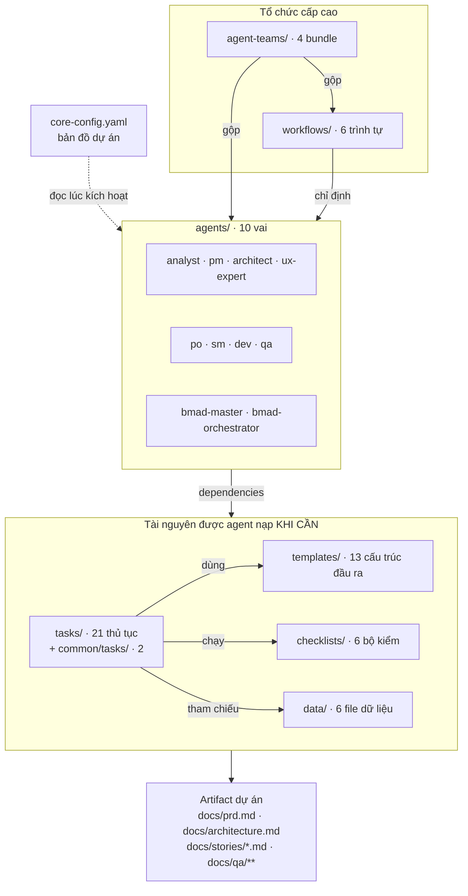

# CẨM NANG VẬN HÀNH `bmad-core` — CHỈ MỤC

> **Mục đích**: tài liệu này mô tả **toàn bộ cách thức vận hành của thư mục `bmad-core/`** (cùng `common/`) để bạn có thể **sử dụng thủ công** — nghĩa là tự đọc, tự chọn agent/task/template, tự dán prompt vào bất kỳ LLM nào, mà không cần installer hay tooling.
>
> Phiên bản nguồn: **BMAD-METHOD™ v4.44.2**. Mọi đường dẫn tính từ gốc repository.

---

## Cách dùng bộ tài liệu này

| Nếu bạn muốn… | Đọc file |
|---------------|----------|
| Hiểu `bmad-core/` gồm những gì và các thành phần gọi nhau thế nào | [01 — Tổng quan & kiến trúc thư mục](./01-tong-quan-kien-truc-thu-muc.md) |
| Biết `core-config.yaml` điều khiển cái gì, ai đọc khoá nào | [02 — core-config.yaml](./02-core-config.md) |
| Tra 10 agent: nhân vật, lệnh, phụ thuộc, giới hạn quyền | [03 — Agents](./03-agents.md) |
| Hiểu giao thức kích hoạt, cú pháp lệnh, các chế độ tương tác | [04 — Giao thức kích hoạt & hệ lệnh](./04-giao-thuc-kich-hoat-va-lenh.md) |
| Vận hành nhóm task tạo/xử lý tài liệu | [05 — Tasks: tài liệu](./05-tasks-tai-lieu.md) |
| Vận hành nhóm task story & thay đổi phạm vi | [06 — Tasks: story](./06-tasks-story.md) |
| Vận hành nhóm task QA / Test Architect | [07 — Tasks: QA](./07-tasks-qa.md) |
| Tra 13 template và cấu trúc section của từng cái | [08 — Templates](./08-templates.md) |
| Tra 6 checklist và cách chạy | [09 — Checklists](./09-checklists.md) |
| Tra 6 file dữ liệu (KB, elicitation, brainstorming, test framework, preferences) | [10 — Data](./10-data.md) |
| Tra 6 workflow và trình tự bước | [11 — Workflows](./11-workflows.md) |
| Tra 4 team bundle | [12 — Agent teams](./12-agent-teams.md) |
| **Công thức chạy thủ công từng bước (không cần cài đặt)** | [13 — Công thức vận hành thủ công](./13-cong-thuc-van-hanh-thu-cong.md) |
| Bảng tra nhanh + các điểm không nhất quán cần biết | [14 — Tra cứu nhanh & cảnh báo](./14-tra-cuu-nhanh-va-canh-bao.md) |

---

## Bản đồ một trang

**Nguyên tắc vận hành cốt lõi cần nhớ trước khi đọc tiếp:**

1. **Agent là vai, task là thủ tục, template là khuôn đầu ra, checklist là bộ kiểm, data là tri thức tham chiếu.**
2. **Task là quy trình CHẠY ĐƯỢC, không phải tài liệu tham khảo** — đọc tới đâu làm tới đó, không đọc lướt.
3. **Chỉ nạp tài nguyên khi cần** — đây là lý do hệ thống giữ được chất lượng trong cửa sổ ngữ cảnh hẹp.
4. **Người dùng là chốt kiểm cuối** — mọi điểm HALT / elicit là cố ý, không phải lỗi.
5. **Không bịa** — mọi chi tiết kỹ thuật trong story phải trích nguồn `[Source: …]`.

---

## Đếm số lượng tài nguyên (đối chiếu khi kiểm tra bản cài)

| Thư mục | Số file | Ghi chú |
|---------|---------|---------|
| `bmad-core/agents/` | 10 | `.md` |
| `bmad-core/tasks/` | 21 | `.md` |
| `bmad-core/templates/` | 13 | `.yaml` |
| `bmad-core/checklists/` | 6 | `.md` |
| `bmad-core/data/` | 6 | `.md` |
| `bmad-core/workflows/` | 6 | `.yaml` |
| `bmad-core/agent-teams/` | 4 | `.yaml` |
| `bmad-core/core-config.yaml` | 1 | |
| `common/tasks/` | 2 | `create-doc.md`, `execute-checklist.md` |
| `common/utils/` | 2 | `bmad-doc-template.md`, `workflow-management.md` |

---

## Liên quan

- Đặc tả – thiết kế – vận hành toàn hệ thống: [`../specs/00-INDEX.md`](../specs/00-INDEX.md)
- Tài liệu gốc của dự án: `../user-guide.md`, `../core-architecture.md`, `../working-in-the-brownfield.md`
- Knowledge base chuẩn: `../../bmad-core/data/bmad-kb.md`
