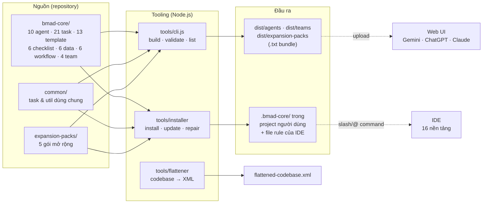

# Bộ tài liệu Đặc tả – Thiết kế – Vận hành hệ thống BMAD-METHOD™ v4.44.2

Bộ tài liệu này được tổng hợp bằng cách đọc và phân tích toàn bộ mã nguồn, tài nguyên ngôn ngữ tự nhiên và cấu hình của repository `BMAD-METHOD` phiên bản **4.44.2** (nhánh v4 – stable, chỉ nhận patch).

## Danh mục tài liệu

| # | Tài liệu | Nội dung | Đối tượng đọc |
|---|----------|----------|---------------|
| 1 | [01-dac-ta-he-thong.md](./01-dac-ta-he-thong.md) | Đặc tả hệ thống đầy đủ (SRS): phạm vi, actor, yêu cầu chức năng FR-A…FR-L, đặc tả định dạng dữ liệu, yêu cầu phi chức năng, ma trận truy vết | PO/PM, kiến trúc, QA, người tích hợp |
| 2 | [02-thiet-ke-he-thong.md](./02-thiet-ke-he-thong.md) | Thiết kế hệ thống (SDD): kiến trúc phân tầng, phân rã module, thiết kế lớp tooling, thuật toán cốt lõi, máy trạng thái, quyết định thiết kế | Kỹ sư phát triển framework, người mở rộng |
| 3 | [03-van-hanh-he-thong.md](./03-van-hanh-he-thong.md) | Cẩm nang vận hành (Runbook): cài đặt, cấu hình, quy trình làm việc hằng ngày, vận hành repo, CI/CD, nâng cấp – sửa chữa, xử lý sự cố | Người dùng cuối, DevOps, maintainer |
| 4 | [04-luong-du-lieu-end-to-end.md](./04-luong-du-lieu-end-to-end.md) | Luồng dữ liệu đầu–cuối: từ lời chào khi cài đặt/kích hoạt agent tới khi dự án hoàn thành — sổ đăng ký artifact, ma trận CRUD, điểm dừng human-in-the-loop, bất biến dữ liệu | Mọi vai trò; đọc để hiểu dữ liệu chạy qua hệ thống thế nào |

### Cẩm nang riêng cho `bmad-core`

Bộ tài liệu chi tiết theo từng thành phần của thư mục `bmad-core/`, viết để **sử dụng thủ công** (đọc – chọn agent/task/template – dán prompt, không cần installer):

👉 **[docs/bmad-core-manual/README.md](../bmad-core-manual/README.md)** — chỉ mục 14 file chi tiết (agents · giao thức kích hoạt · 3 nhóm tasks · templates · checklists · data · workflows · teams · công thức vận hành thủ công · tra cứu nhanh & cảnh báo)

## Bản đồ nhanh hệ thống

```mermaid
flowchart LR
    subgraph SRC["Nguồn (repository)"]
        A["bmad-core/<br/>10 agent · 21 task · 13 template<br/>6 checklist · 6 data · 6 workflow · 4 team"]
        B["common/<br/>task & util dùng chung"]
        C["expansion-packs/<br/>5 gói mở rộng"]
    end
    subgraph TOOL["Tooling (Node.js)"]
        D["tools/cli.js<br/>build · validate · list"]
        E["tools/installer<br/>install · update · repair"]
        F["tools/flattener<br/>codebase → XML"]
    end
    subgraph OUT["Đầu ra"]
        G["dist/agents · dist/teams<br/>dist/expansion-packs<br/>(.txt bundle)"]
        H[".bmad-core/ trong<br/>project người dùng<br/>+ file rule của IDE"]
    end
    A --> D --> G
    B --> D
    C --> D
    A --> E --> H
    B --> E
    C --> E
    G -.->|upload| I["Web UI<br/>Gemini · ChatGPT · Claude"]
    H -.->|slash/@ command| J["IDE<br/>16 nền tảng"]
    F --> K["flattened-codebase.xml"]
```



## Quy ước dùng trong bộ tài liệu

- Đường dẫn dạng `bmad-core/agents/dev.md:61` trỏ tới file:dòng trong repository nguồn.
- `{root}` là placeholder trong tài nguyên nguồn, được thay thế lúc cài đặt/bundle thành `.bmad-core` (hoặc `.<pack-id>`).
- Ký hiệu `*command` là cú pháp lệnh nội bộ của agent; `/agent` hoặc `@agent` là cú pháp gọi agent của IDE.
- FR-x = yêu cầu chức năng, NFR-x = yêu cầu phi chức năng, DS-x = đặc tả cấu trúc dữ liệu, DD-x = quyết định thiết kế.
