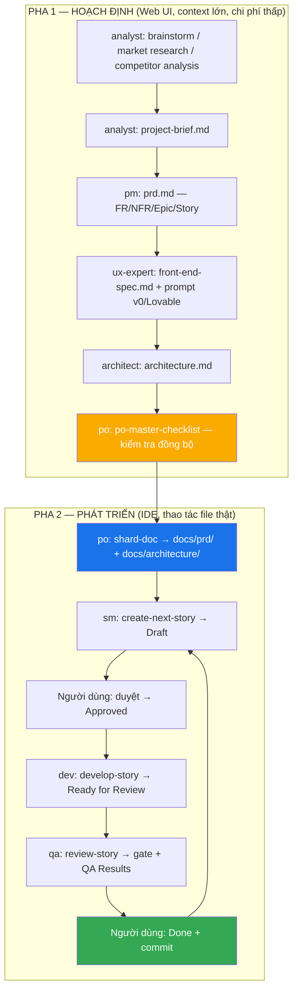

# ĐẶC TẢ HỆ THỐNG — BMAD-METHOD™ v4.44.2

> Tài liệu đặc tả yêu cầu hệ thống (System Requirements Specification) cho framework BMAD-METHOD, phiên bản 4.44.2.
> Nguồn dữ liệu: toàn bộ repository (389 file), bao gồm `bmad-core/`, `common/`, `tools/`, `expansion-packs/`, `dist/`, `docs/`, `.github/`.

---

## 1. Giới thiệu

### 1.1 Mục đích tài liệu

Đặc tả đầy đủ **cái mà hệ thống phải làm**: các thực thể, hành vi, quy trình, định dạng dữ liệu và ràng buộc của BMAD-METHOD. Tài liệu dùng làm cơ sở cho thiết kế (xem `02-thiet-ke-he-thong.md`), kiểm thử, vận hành (xem `03-van-hanh-he-thong.md`) và mở rộng.

### 1.2 Phạm vi sản phẩm

BMAD-METHOD (Breakthrough Method of Agile AI-Driven Development) là **framework điều phối AI agent bằng ngôn ngữ tự nhiên**, phân phối dưới dạng package npm `bmad-method`. Hệ thống KHÔNG phải là runtime AI: nó không gọi API LLM, không chứa logic suy luận. Nó cung cấp:

1. **Tài nguyên ngôn ngữ tự nhiên** (`bmad-core/`, `common/`, `expansion-packs/`): định nghĩa agent, task, template, checklist, workflow, knowledge base — toàn bộ bằng Markdown/YAML.
2. **Tooling Node.js** (`tools/`): build bundle cho web UI, installer/updater vào project người dùng, cấu hình tích hợp IDE, làm phẳng codebase, nâng cấp v3→v4, quản lý phiên bản.
3. **Đầu ra dựng sẵn** (`dist/`): bundle `.txt` một-file cho từng agent, từng team, từng expansion pack.

Phạm vi ứng dụng: phát triển phần mềm greenfield/brownfield là lõi; các miền khác (game, viết sáng tạo, hạ tầng DevOps) thông qua expansion pack.

**Ngoài phạm vi**: v4 bị đóng băng tính năng (chỉ nhận critical patch); mọi tính năng mới thuộc v6 alpha (`npx bmad-method@alpha`).

### 1.3 Thuật ngữ

| Thuật ngữ | Định nghĩa |
|-----------|-----------|
| **Agent** | Một file Markdown chứa block YAML định nghĩa persona, commands và dependencies của một vai trò AI (ví dụ `dev.md` → James, Full Stack Developer) |
| **Task** | File Markdown mô tả thủ tục thực thi từng bước; là *quy trình chạy được*, không phải tài liệu tham khảo |
| **Template** | File YAML định nghĩa cấu trúc tài liệu đầu ra + hướng dẫn LLM cho từng section |
| **Checklist** | File Markdown chứa danh mục kiểm tra chất lượng, chạy qua task `execute-checklist` |
| **Team (bundle)** | File YAML liệt kê tập agent + workflow để gộp thành một bundle web |
| **Workflow** | File YAML mô tả trình tự agent–artifact cho một loại dự án |
| **Bundle** | File `.txt` duy nhất ghép nối toàn bộ agent + dependency, dùng upload lên web UI |
| **Sharding** | Chẻ tài liệu lớn thành nhiều file nhỏ theo heading cấp 2 |
| **Story** | File Markdown là đơn vị công việc; chứa toàn bộ ngữ cảnh để Dev agent thực thi độc lập |
| **Gate** | File YAML ghi quyết định chất lượng của QA: PASS/CONCERNS/FAIL/WAIVED |
| **Expansion pack** | Gói mở rộng miền, cài vào thư mục `.{pack-id}/`, tự chứa (self-contained) |
| **Vibe CEO** | Vai trò của người dùng: định hướng, tinh chỉnh, giám sát; AI thực thi |
| **`{root}`** | Placeholder đường dẫn, thay thế lúc cài/bundle thành `.bmad-core` hoặc `.{pack-id}` |

### 1.4 Tham chiếu

- `README.md`, `docs/user-guide.md`, `docs/core-architecture.md`, `docs/GUIDING-PRINCIPLES.md`
- `docs/working-in-the-brownfield.md`, `docs/expansion-packs.md`, `docs/flattener.md`, `docs/versioning-and-releases.md`
- `bmad-core/data/bmad-kb.md` (knowledge base chuẩn, 809 dòng)
- `common/utils/bmad-doc-template.md` (đặc tả template)

---

## 2. Tổng quan hệ thống

### 2.1 Hai đổi mới cốt lõi

| # | Đổi mới | Cơ chế | Vấn đề được giải |
|---|---------|--------|------------------|
| 1 | **Agentic Planning** | Analyst → PM → Architect → PO phối hợp với người dùng, dùng template có nhúng chỉ dẫn LLM + vòng elicitation bắt buộc | Kế hoạch không nhất quán (planning inconsistency) |
| 2 | **Context-Engineered Development** | SM biến kế hoạch đã shard thành story siêu chi tiết, nhúng sẵn mọi ngữ cảnh kỹ thuật kèm trích dẫn nguồn | Mất ngữ cảnh (context loss) khi Dev agent làm việc |

### 2.2 Hai pha – hai môi trường



**Ranh giới chuyển pha (bắt buộc)**: khi PO xác nhận tài liệu đồng bộ, người dùng phải copy `docs/prd.md` và `docs/architecture.md` vào project rồi chuyển sang IDE. Không được shard trên Web UI.

### 2.3 Cấu trúc repository

| Thư mục | Vai trò | Số lượng |
|---------|---------|----------|
| `bmad-core/agents/` | Định nghĩa agent lõi | 10 file |
| `bmad-core/agent-teams/` | Cấu hình team bundle | 4 file |
| `bmad-core/workflows/` | Workflow theo loại dự án | 6 file |
| `bmad-core/tasks/` | Thủ tục thực thi | 21 file |
| `bmad-core/templates/` | Template tài liệu YAML | 13 file |
| `bmad-core/checklists/` | Checklist chất lượng | 6 file |
| `bmad-core/data/` | Knowledge base & dữ liệu tham chiếu | 6 file |
| `bmad-core/core-config.yaml` | Cấu hình dự án (bản mẫu) | 1 file |
| `common/tasks/`, `common/utils/` | Tài nguyên dùng chung core + pack | 4 file |
| `tools/` | Toàn bộ tooling Node.js | ~35 file JS |
| `expansion-packs/` | 5 gói mở rộng miền | 5 thư mục |
| `dist/` | Bundle dựng sẵn | 10 agent + 4 team + 5 pack |
| `docs/` | Tài liệu người dùng | 10 file |
| `.github/workflows/` | CI/CD | 4 workflow |

---

## 3. Actor và các bên liên quan

| Actor | Loại | Trách nhiệm / tương tác |
|-------|------|------------------------|
| **Người dùng (Vibe CEO)** | Con người | Định hướng, duyệt story, quyết định trạng thái cuối, commit code, là trọng tài chất lượng |
| **LLM host (IDE)** | Hệ thống ngoài | Cursor, Claude Code, Windsurf, Trae, Roo, Kilo, Cline, Gemini CLI, Qwen Code, Crush, GitHub Copilot, Auggie CLI, Codex CLI/Web, OpenCode, iFlow CLI (16 nền tảng) |
| **LLM host (Web)** | Hệ thống ngoài | Gemini Gem, CustomGPT, Claude — tiêu thụ bundle `.txt` |
| **Agent lõi** | Tác nhân AI | 10 persona (mục 5.1) |
| **Installer CLI** | Thành phần hệ thống | `npx bmad-method install|update|status|flatten|list:expansions|update-check` |
| **Build CLI** | Thành phần hệ thống | `node tools/cli.js build|validate|list:agents|list:expansions|build:expansions|upgrade` |
| **Maintainer framework** | Con người | Phát hành phiên bản, review PR, giữ nguyên tắc thiết kế |
| **npm registry / GitHub Actions** | Hệ thống ngoài | Phân phối package, chạy CI, tạo release |

---

## 4. Yêu cầu chức năng — Tổng quan nhóm

| Nhóm | Chủ đề | Mục |
|------|--------|-----|
| FR-A | Hệ thống agent và giao thức kích hoạt | 5.1 |
| FR-B | Team và bundle web | 5.2 |
| FR-C | Workflow theo loại dự án | 5.3 |
| FR-D | Hệ thống template và sinh tài liệu | 5.4 |
| FR-E | Vòng phát triển SM → Dev → QA và story | 5.5 |
| FR-F | Test Architect (QA) và quality gate | 5.6 |
| FR-G | CLI build/validate | 5.7 |
| FR-H | Installer / updater / repair | 5.8 |
| FR-I | Tích hợp IDE | 5.9 |
| FR-J | Expansion pack | 5.10 |
| FR-K | Codebase flattener | 5.11 |
| FR-L | Quản lý phiên bản & phát hành | 5.12 |

---

## 5. Yêu cầu chức năng chi tiết

### 5.1 FR-A — Hệ thống agent

#### FR-A1 — Danh mục agent lõi (bắt buộc đủ 10)

| id | Tên | Chức danh | Icon | Khi nào dùng | Deps (task/template/checklist/data) |
|----|-----|-----------|------|--------------|--------------------------------------|
| `analyst` | Mary | Business Analyst | 📊 | Market research, brainstorming, competitor analysis, project brief, document-project (brownfield) | 5 task, 4 template, 2 data |
| `pm` | John | Product Manager | 📋 | PRD, brownfield PRD/epic/story, ưu tiên tính năng, correct-course | 7 task, 2 template, 2 checklist, 1 data |
| `architect` | Winston | Architect | 🏗️ | Thiết kế hệ thống, chọn công nghệ, API, hạ tầng, document-project | 4 task, 4 template, 1 checklist, 1 data |
| `po` | Sarah | Product Owner | 📝 | Quản lý backlog, validate artifact, shard-doc, validate story draft, correct-course | 4 task, 1 template, 2 checklist |
| `sm` | Bob | Scrum Master | 🏃 | Tạo story (`*draft`), story-checklist, correct-course. **Cấm tuyệt đối implement/sửa code** | 3 task, 1 template, 1 checklist |
| `dev` | James | Full Stack Developer | 💻 | Implement story, debug, refactor, chạy test, áp QA fix | 3 task, 1 checklist |
| `qa` | Quinn | Test Architect & Quality Advisor | 🧪 | risk-profile, test-design, trace, nfr-assess, review, gate | 6 task, 2 template, 1 data |
| `ux-expert` | Sally | UX Expert | 🎨 | Front-end spec, prompt sinh UI cho v0/Lovable | 3 task, 1 template, 1 data |
| `bmad-master` | — | BMad Master Task Executor | 🧙 | Chạy mọi task không cần đổi persona; KB mode | 13 task, 11 template, 6 checklist, 4 data, 6 workflow |
| `bmad-orchestrator` | — | BMad Master Orchestrator | 🎭 | Chỉ dùng trong web bundle: điều phối, biến hình thành agent khác | 3 task, 2 data, 1 util |

#### FR-A2 — Cấu trúc file agent

Mỗi file agent PHẢI gồm: (a) comment `<!-- Powered by BMAD™ Core -->`; (b) heading `# <id>`; (c) `ACTIVATION-NOTICE`; (d) một block ```yaml``` duy nhất chứa `activation-instructions`, `agent`, `persona`, `commands`, `dependencies`; và tùy chọn `IDE-FILE-RESOLUTION`, `REQUEST-RESOLUTION`.

#### FR-A3 — Giao thức kích hoạt (activation protocol)

Hệ thống PHẢI yêu cầu agent thực hiện đúng thứ tự (ví dụ chuẩn `bmad-core/agents/dev.md:19-35`):

1. Đọc toàn bộ file agent — đây là định nghĩa persona đầy đủ.
2. Nhập vai theo mục `agent` + `persona`.
3. Đọc `{root}/core-config.yaml` **trước khi** chào người dùng.
4. Chào theo tên/vai, chạy ngay `*help`, sau đó **HALT** đợi lệnh.
5. KHÔNG nạp file agent khác; chỉ nạp dependency khi người dùng gọi lệnh tương ứng.
6. `agent.customization` (nếu có) ưu tiên cao nhất, ghi đè mọi chỉ dẫn xung khắc.
7. Khi thực thi task từ dependency: **task là workflow chạy được**, chỉ dẫn trong task ghi đè ràng buộc hành vi nền.
8. Task có `elicit=true`: **BẮT BUỘC** tương tác người dùng đúng định dạng, không được bỏ qua để "tối ưu".
9. Mọi lựa chọn trình bày dưới dạng danh sách có số.
10. Giữ nhân vật (STAY IN CHARACTER) cho tới khi được yêu cầu thoát.

Riêng `dev`: PHẢI đọc thêm toàn bộ file trong `devLoadAlwaysFiles`; KHÔNG nạp file nào khác ngoài story được giao; KHÔNG bắt đầu code khi story còn ở trạng thái draft.

#### FR-A4 — Lệnh agent

- Mọi lệnh dùng tiền tố `*` (ví dụ `*help`, `*draft`, `*review {story}`).
- `*help` PHẢI hiển thị danh sách lệnh có số.
- Hệ thống PHẢI khớp yêu cầu tự nhiên với lệnh một cách linh hoạt (REQUEST-RESOLUTION), ví dụ "draft story" → `*create` → task `create-next-story`; nếu không rõ PHẢI hỏi lại.

#### FR-A5 — Nguyên tắc nạp phụ thuộc (lazy loading)

- Dependency khai báo theo kiểu: `tasks`, `templates`, `checklists`, `data`, `utils`, `workflows`.
- Ánh xạ đường dẫn: `{root}/{type}/{name}`.
- Chỉ nạp lúc thực thi, không nạp trước (nguyên tắc "Dev agents must be lean" — `docs/GUIDING-PRINCIPLES.md:7-12`).

#### FR-A6 — Giới hạn quyền theo agent

| Agent | Được sửa | Bị cấm |
|-------|----------|--------|
| `sm` | Story: Status, Story, AC, Tasks/Subtasks, Dev Notes, Testing, Change Log | Toàn bộ mã nguồn |
| `dev` | Story: Tasks/Subtasks checkbox, Dev Agent Record (+ mọi subsection), Agent Model Used, Debug Log References, Completion Notes, File List, Change Log, Status | Story: Story, AC, Dev Notes, Testing, QA Results; file gate YAML |
| `qa` | Story: **chỉ** section QA Results; file gate YAML; refactor mã nguồn khi an toàn | Mọi section story khác, Status, File List |

### 5.2 FR-B — Team và bundle web

#### FR-B1 — Bốn cấu hình team

| Team | Icon | Agent | Workflow | Mục đích |
|------|------|-------|----------|----------|
| `team-all` | 👥 | `bmad-orchestrator` + `*` (wildcard: mọi agent trừ `bmad-master`) | 6 | Mọi vai trò |
| `team-fullstack` | 🚀 | orchestrator, analyst, pm, ux-expert, architect, po | 6 | Full-stack / FE-only / service |
| `team-no-ui` | 🔧 | orchestrator, analyst, pm, architect, po | greenfield-service, brownfield-service | Backend/API, không UX |
| `team-ide-minimal` | ⚡ | po, sm, dev, qa | null | Tối giản cho vòng IDE |

#### FR-B2 — Quy tắc phân giải team

- `"*"` = mọi agent trong `bmad-core/agents/` **trừ** `bmad-master`.
- `bmad-orchestrator` PHẢI luôn được thêm đầu tiên vào mọi team bundle (kể cả khi team file không khai báo — hệ thống tự thêm và ghi cảnh báo).
- `bmad-master` PHẢI bị loại khỏi team bundle.
- Tài nguyên trùng lặp giữa các agent PHẢI được khử trùng (dedupe) theo đường dẫn tuyệt đối.

#### FR-B3 — Định dạng bundle

- Mỗi bundle mở đầu bằng "Web Agent Bundle Instructions" (sinh động theo loại bundle và tên pack).
- Mỗi tài nguyên bọc trong cặp mốc:
  `==================== START: .bmad-core/<type>/<file> ====================` … `==================== END: … ====================`
- Mọi `{root}` trong nội dung PHẢI thay bằng `.bmad-core` (hoặc `.{pack-id}`).
- Nội dung agent trong bundle PHẢI được xử lý: loại bỏ `root`, `IDE-FILE-RESOLUTION`, `REQUEST-RESOLUTION` ở cấp gốc YAML và trong `activation-instructions`; tái tạo YAML với header mới.

#### FR-B4 — Đầu ra bundle

- `dist/agents/<agent-id>.txt` (10 file)
- `dist/teams/<team-id>.txt` (4 file)
- `dist/expansion-packs/<pack>/agents/*.txt` và `dist/expansion-packs/<pack>/teams/*.txt`

### 5.3 FR-C — Workflow

#### FR-C1 — Sáu workflow lõi

| Workflow | Loại | project_types |
|----------|------|---------------|
| `greenfield-fullstack` | greenfield | web-app, saas, enterprise-app, prototype, mvp |
| `greenfield-service` | greenfield | rest-api, microservice, backend-service, api-prototype, simple-service |
| `greenfield-ui` | greenfield | spa, mobile-app, micro-frontend, static-site, ui-prototype, simple-interface |
| `brownfield-fullstack` | brownfield | feature-addition, refactoring, modernization, integration-enhancement |
| `brownfield-service` | brownfield | service-modernization, api-migration, performance-optimization, integration-enhancement |
| `brownfield-ui` | brownfield | ui-modernization, framework-migration, design-refresh, ux-improvement |

#### FR-C2 — Cấu trúc workflow

Mỗi workflow PHẢI có: `id`, `name`, `description`, `type`, `project_types`, `sequence[]`, `flow_diagram` (Mermaid), `decision_guidance.when_to_use[]`, `handoff_prompts{}`.

Mỗi bước trong `sequence` có thể mang: `agent`, `creates`/`updates`/`validates`, `requires`, `uses`, `action`, `condition`, `optional`, `optional_steps[]`, `repeats`, `notes` (kèm chỉ dẫn "SAVE OUTPUT: …").

#### FR-C3 — Điều phối workflow

- `bmad-orchestrator` PHẢI phát hiện workflow có trong bundle lúc runtime, không giả định workflow không tồn tại.
- Cung cấp `*workflow-guidance` (tư vấn chọn workflow), `*plan`, `*plan-status`, `*plan-update` (theo `common/utils/workflow-management.md`).

### 5.4 FR-D — Template và sinh tài liệu

#### FR-D1 — Danh mục 13 template

| Template | Đầu ra tiêu chuẩn | Agent chủ |
|----------|-------------------|-----------|
| `project-brief-tmpl.yaml` | `docs/project-brief.md` | analyst |
| `market-research-tmpl.yaml` | `docs/market-research.md` | analyst |
| `competitor-analysis-tmpl.yaml` | `docs/competitor-analysis.md` | analyst |
| `brainstorming-output-tmpl.yaml` | file output brainstorming | analyst |
| `prd-tmpl.yaml` | `docs/prd.md` | pm |
| `brownfield-prd-tmpl.yaml` | `docs/prd.md` (brownfield) | pm |
| `front-end-spec-tmpl.yaml` | `docs/front-end-spec.md` | ux-expert |
| `architecture-tmpl.yaml` | `docs/architecture.md` (backend) | architect |
| `front-end-architecture-tmpl.yaml` | `docs/front-end-architecture.md` | architect |
| `fullstack-architecture-tmpl.yaml` | `docs/fullstack-architecture.md` | architect |
| `brownfield-architecture-tmpl.yaml` | `docs/architecture.md` (brownfield) | architect |
| `story-tmpl.yaml` | `docs/stories/{epic}.{story}.{slug}.md` | sm |
| `qa-gate-tmpl.yaml` | `docs/qa/gates/{epic}.{story}-{slug}.yml` | qa |

#### FR-D2 — Đặc tả template (theo `common/utils/bmad-doc-template.md`)

Bắt buộc: `template{id,name,version,output{format,filename,title}}`, `workflow{mode,elicitation}`, `sections[]`.
Mỗi section bắt buộc: `id`, `title`, `instruction`. Tùy chọn: `type`, `template`, `item_template`, `prefix`, `elicit`, `repeatable`, `condition`, `owner`, `editors[]`, `readonly`, `examples[]`, `choices{}`, `placeholder`, `sections[]` (lồng nhau).

Kiểu nội dung hỗ trợ: `bullet-list`, `numbered-list`, `paragraphs`, `table`, `code-block`, `template-text`, `mermaid`, `repeatable-container`, `conditional-block`, `choice-selector`.
`mermaid_type` hỗ trợ 20 loại (flowchart, sequenceDiagram, classDiagram, stateDiagram, erDiagram, gantt, pie, journey, mindmap, timeline, quadrantChart, xyChart, sankey, c4Context, requirement, packet, block, kanban…).

#### FR-D3 — Task `create-doc` (bắt buộc tuân thủ nghiêm)

- PHẢI vô hiệu mọi tối ưu hiệu năng; xử lý **tuần tự từng section**.
- Với section `elicit: true`: HARD STOP — trình bày nội dung → nêu rationale chi tiết (trade-off, giả định, quyết định đáng chú ý, vùng cần xác thực) → đưa **đúng 9 lựa chọn có số**: option 1 luôn là "Proceed to next section", option 2–9 chọn từ `data/elicitation-methods` → kết câu "Select 1-9 or just type your question/feedback:" → **đợi phản hồi**.
- CẤM: câu hỏi yes/no, định dạng khác 1-9, tự tạo phương pháp elicitation mới.
- Vi phạm được định nghĩa rõ: tạo trọn tài liệu mà không có tương tác người dùng.
- `#yolo` cho phép chuyển sang chế độ YOLO (xử lý toàn bộ section một lượt).
- Nếu section có `owner`/`editors`/`readonly`, tài liệu sinh ra PHẢI ghi chú agent chịu trách nhiệm.

#### FR-D4 — Task `shard-doc`

- Nếu `markdownExploder: true`: thử `md-tree explode {input} {output}`. Thành công → thông báo và DỪNG. Thất bại → hướng dẫn cài `@kayvan/markdown-tree-parser` global hoặc đặt `markdownExploder: false`, rồi **DỪNG** (không tự chẻ tay).
- Nếu `markdownExploder: false`: chẻ tay theo heading `##`, đổi cấp heading (`##`→`#`, `###`→`##`…), sinh tên file lowercase-dash-case, tạo `index.md` liệt kê liên kết.
- PHẢI bảo toàn nguyên vẹn code fence, sơ đồ Mermaid, bảng, list, inline code, link, `{{placeholder}}`; `##` bên trong code block KHÔNG phải heading.
- PHẢI đảm bảo quá trình chẻ là khả nghịch (có thể ghép lại tài liệu gốc).

#### FR-D5 — Advanced elicitation

`bmad-core/tasks/advanced-elicitation.md` + `bmad-core/data/elicitation-methods.md` cung cấp bộ phương pháp tinh chỉnh nội dung; sau khi người dùng chọn phương pháp 2–9, hệ thống PHẢI thực thi phương pháp, trình bày kết quả, rồi cho 3 lựa chọn: áp dụng thay đổi / về menu elicitation / hỏi thêm.

#### FR-D6 — Danh mục 21 task lõi + 2 task chung

Nhóm tài liệu: `create-doc` (common), `execute-checklist` (common), `shard-doc`, `index-docs`, `document-project`, `advanced-elicitation`, `facilitate-brainstorming-session`, `create-deep-research-prompt`, `generate-ai-frontend-prompt`, `kb-mode-interaction`.
Nhóm story: `create-next-story`, `validate-next-story`, `brownfield-create-epic`, `brownfield-create-story`, `create-brownfield-story`, `correct-course`.
Nhóm QA: `risk-profile`, `test-design`, `trace-requirements`, `nfr-assess`, `review-story`, `qa-gate`, `apply-qa-fixes`.

### 5.5 FR-E — Vòng phát triển và story

#### FR-E1 — Task `create-next-story` (SM)

Thực thi TUẦN TỰ, không nhảy bước:

1. Nạp `{root}/core-config.yaml`; nếu thiếu → **HALT** kèm hướng dẫn khắc phục. Trích `devStoryLocation`, `prd.*`, `architecture.*`.
2. Xác định story kế tiếp: đọc story cao nhất trong `devStoryLocation`; nếu chưa `Done` → cảnh báo và hỏi người dùng có chấp nhận rủi ro; nếu epic đã xong → hỏi 3 lựa chọn. **TUYỆT ĐỐI không tự nhảy sang epic khác.** Nếu chưa có story nào → story là `1.1`.
3. Thu thập yêu cầu từ epic + đọc Dev Agent Record của story trước (completion notes, deviation, bài học).
4. Đọc kiến trúc theo loại story:
   - Mọi story: `tech-stack.md`, `unified-project-structure.md`, `coding-standards.md`, `testing-strategy.md`
   - Backend/API: thêm `data-models.md`, `database-schema.md`, `backend-architecture.md`, `rest-api-spec.md`, `external-apis.md`
   - Frontend/UI: thêm `frontend-architecture.md`, `components.md`, `core-workflows.md`, `data-models.md`
   - Full-stack: cả hai nhóm
5. Kiểm tra khớp cấu trúc dự án; ghi xung đột vào "Project Structure Notes".
6. Điền template story. **Dev Notes CHỈ chứa thông tin trích từ tài liệu kiến trúc**, mọi chi tiết kỹ thuật PHẢI kèm trích dẫn `[Source: architecture/{file}.md#{section}]`; nếu không tìm thấy PHẢI ghi rõ "No specific guidance found in architecture docs". CẤM bịa thư viện/pattern/chuẩn mới.
7. Sinh Tasks/Subtasks tuần tự, có unit test là subtask tường minh, liên kết AC (`Task 1 (AC: 1, 3)`).
8. Đặt Status = `Draft`, chạy `execute-checklist` với `story-draft-checklist`, báo cáo tóm tắt.

#### FR-E2 — Trạng thái story

`Draft` → `Approved` → `InProgress` → `Review` → `Done` (choices trong `story-tmpl.yaml:29`). Mỗi lần đổi trạng thái PHẢI có xác nhận của người dùng.

#### FR-E3 — Lệnh `*develop-story` (Dev)

- **Thứ tự thực thi**: đọc task (đầu tiên/kế tiếp) → implement task + subtask → viết test → chạy validation → **chỉ khi TẤT CẢ pass** mới tick `[x]` → cập nhật File List → lặp.
- **Điều kiện HALT**: cần dependency chưa được duyệt; còn nhập nhằng sau khi đã đọc story; thất bại 3 lần liên tiếp cho cùng một việc; thiếu cấu hình; regression fail.
- **Điều kiện "ready for review"**: code khớp yêu cầu + mọi validation pass + tuân thủ chuẩn + File List đầy đủ.
- **Hoàn tất**: mọi task/subtask `[x]` và có test → chạy toàn bộ validation + regression ("DON'T BE LAZY, EXECUTE ALL TESTS") → File List đầy đủ → chạy `execute-checklist` với `story-dod-checklist` → đặt Status `Ready for Review` → HALT.
- Lệnh khác: `*explain` (giảng lại như dạy junior), `*review-qa` (chạy `apply-qa-fixes.md`), `*run-tests`.

#### FR-E4 — Quản lý ngữ cảnh hội thoại

- BẮT BUỘC mở chat mới khi chuyển giữa SM, Dev, QA.
- Dùng model suy luận mạnh nhất cho bước SM tạo story.
- Chỉ 1 story được triển khai tại một thời điểm, tuần tự đến khi hết epic.
- CẤM dùng `bmad-master`/`bmad-orchestrator` cho việc tạo story và implement (`bmad-kb.md:166-171`).

#### FR-E5 — `correct-course` và validate

- `correct-course` (pm/po/sm) xử lý thay đổi giữa dòng bằng `change-checklist`.
- `validate-next-story` (po/dev) đối chiếu story draft với artifact nguồn trước khi cho phép triển khai.

### 5.6 FR-F — Test Architect (QA) và quality gate

#### FR-F1 — Sáu năng lực và thời điểm dùng

| Lệnh (alias) | Task | Thời điểm | Đầu ra |
|--------------|------|-----------|--------|
| `*risk` (`*risk-profile`) | `risk-profile.md` | Sau khi SM draft story, trước khi code | `{qaLocation}/assessments/{epic}.{story}-risk-{YYYYMMDD}.md` |
| `*design` (`*test-design`) | `test-design.md` | Sau risk, trước khi code | `…-test-design-{YYYYMMDD}.md` |
| `*trace` (`*trace-requirements`) | `trace-requirements.md` | Giữa lúc implement | `…-trace-{YYYYMMDD}.md` |
| `*nfr` (`*nfr-assess`) | `nfr-assess.md` | Trong lúc implement / đầu review | `…-nfr-{YYYYMMDD}.md` |
| `*review` | `review-story.md` | Story ở trạng thái Review | QA Results trong story + file gate |
| `*gate` | `qa-gate.md` | Sau khi fix, cần cập nhật quyết định | `{qaLocation}/gates/{epic}.{story}-{slug}.yml` |

#### FR-F2 — Điều kiện tiên quyết review

Status story = `Review`; Dev đã hoàn tất mọi task và cập nhật File List; toàn bộ test tự động pass.

#### FR-F3 — Tự động leo thang chiều sâu review

Khi có bất kỳ dấu hiệu: chạm file auth/payment/security; story không thêm test; diff > 500 dòng; gate trước là FAIL/CONCERNS; story > 5 AC.

#### FR-F4 — Sáu trục phân tích

(A) Truy vết yêu cầu (AC ↔ test, dùng Given-When-Then làm tài liệu, không phải code BDD); (B) Chất lượng mã + refactor chủ động; (C) Kiến trúc test (mức test phù hợp, dữ liệu test, mock, edge case, thời gian chạy); (D) NFR bộ bốn: Security, Performance, Reliability, Maintainability; (E) Khả năng kiểm thử: controllability, observability, debuggability; (F) Nợ kỹ thuật.

#### FR-F5 — Thuật toán quyết định gate (áp dụng theo thứ tự)

1. Risk (nếu có `risk_summary`): điểm ≥ 9 → **FAIL**; ngược lại ≥ 6 → **CONCERNS**.
2. Khoảng trống test: thiếu P0 test → **CONCERNS**; thiếu P0 test về security/data-loss → **FAIL**.
3. Mức nghiêm trọng issue: có `high` → **FAIL**; có `medium` → **CONCERNS**.
4. NFR: có FAIL → **FAIL**; có CONCERNS → **CONCERNS**; còn lại → **PASS**.
5. **WAIVED** chỉ khi `waiver.active: true` kèm `reason` + `approved_by` (+ hạn hiệu lực).

`quality_score = 100 − 20 × (số FAIL) − 10 × (số CONCERNS)`, chặn trong [0, 100]. Nếu `technical-preferences.md` định nghĩa trọng số riêng thì dùng trọng số đó.

#### FR-F6 — Bản chất advisory

Gate là **khuyến nghị**, không chặn: đội tự chọn ngưỡng chất lượng. QA chỉ khuyến nghị trạng thái tiếp theo (`Ready for Done` / `Changes Required`), chủ story quyết định. QA sở hữu file gate; Dev KHÔNG được sửa file gate.

#### FR-F7 — `suggested_owner` cho mỗi issue

`dev` (cần sửa code) | `sm` (cần làm rõ yêu cầu) | `po` (cần quyết định nghiệp vụ).

#### FR-F8 — `apply-qa-fixes` (Dev tiêu thụ đầu ra QA)

Đọc gate mới nhất (theo mtime) + các assessment; xây kế hoạch fix **tất định theo thứ tự ưu tiên**: (1) issue high; (2) NFR FAIL → CONCERNS; (3) coverage_gaps (ưu tiên P0); (4) AC chưa được phủ; (5) risk must_fix; (6) medium → low. Ưu tiên viết test trước/cùng lúc với sửa code. Chỉ cập nhật section được phép của Dev. Quy tắc trạng thái: gate PASS và đã đóng hết gap → `Ready for Done`; ngược lại → `Ready for Review` và yêu cầu QA review lại.

#### FR-F9 — Chuẩn chất lượng test bắt buộc

Không flaky test; không hard wait (chỉ dynamic waiting); test stateless & parallel-safe; tự dọn dữ liệu; mức test phù hợp (unit cho logic, integration cho tương tác, e2e cho hành trình); assertion nằm trong test, không ẩn trong helper.

### 5.7 FR-G — CLI build/validate (`tools/cli.js`)

| Lệnh | Chức năng | Tùy chọn |
|------|-----------|----------|
| `build` | Dựng bundle agent + team + expansion pack | `-a/--agents-only`, `-t/--teams-only`, `-e/--expansions-only`, `--no-expansions`, `--no-clean` |
| `build:expansions` | Dựng bundle expansion pack | `--expansion <name>`, `--no-clean` |
| `list:agents` | Liệt kê agent | — |
| `list:expansions` | Liệt kê expansion pack | — |
| `validate` | Phân giải dependency mọi agent + team, báo lỗi nếu thiếu | — |
| `upgrade` | Nâng cấp project v3 → v4 | `-p/--project`, `--dry-run`, `--no-backup` |

Yêu cầu: `validate` PHẢI thoát mã ≠ 0 khi có dependency không phân giải được; `build` PHẢI thoát mã ≠ 0 khi lỗi.

### 5.8 FR-H — Installer / updater

#### FR-H1 — Lệnh CLI (`tools/installer/bin/bmad.js`)

`install` (`-f/--full`, `-x/--expansion-only`, `-d/--directory`, `-i/--ide <ide...>`, `-e/--expansion-packs <packs...>`), `update` (deprecated → chuyển sang `install`), `update-check` (so version với npm registry, timeout 30 s), `list:expansions`, `status`, `flatten` (`-i`, `-o`).

#### FR-H2 — Phát hiện trạng thái cài đặt

| Trạng thái | Điều kiện nhận biết | Hành vi |
|-----------|--------------------|---------|
| `clean` | Không có `.bmad-core/install-manifest.yaml`, không có `bmad-agent/` | Cài mới |
| `v4_existing` | Có `.bmad-core/install-manifest.yaml` | Kiểm tra integrity → menu upgrade/repair/reinstall/expansions/cancel |
| `v3_existing` | Có thư mục `bmad-agent/` | Menu upgrade v3→v4 / cài song song / hủy |
| `unknown_existing` | Có `.bmad-core/` nhưng thiếu manifest | Menu cài đè / đổi thư mục / hủy |

Cờ phụ: `hasOtherFiles` (thư mục có file khác nhưng chưa có BMad → vẫn coi là clean).

#### FR-H3 — Luồng hỏi đáp cài đặt tương tác

1. Nhập đường dẫn project (mặc định cwd).
2. Chọn thành phần (multiselect): BMad core + từng expansion pack, hiển thị `(v-cũ → v-mới)` hoặc `(v - reinstall)`.
3. Nếu chọn core: hỏi `prdSharded`, `architectureSharded`. Nếu tắt sharding kiến trúc → cảnh báo bắt buộc về `devLoadAlwaysFiles` và yêu cầu xác nhận, không xác nhận thì hủy cài.
4. Chọn IDE (multiselect, 16 lựa chọn); nếu không chọn gì PHẢI hỏi xác nhận và cho phép quay lại.
5. Cấu hình bổ sung theo IDE: GitHub Copilot (defaults/manual/skip), OpenCode (tiền tố `bmad-` cho agent, `bmad:tasks:` cho command), Auggie CLI (user global / workspace).
6. Hỏi có kèm web bundle: all / teams / agents / custom + thư mục đích (mặc định `<project>/web-bundles`).

#### FR-H4 — Nội dung được cài

- Toàn bộ `bmad-core/` → `<project>/.bmad-core/`, mọi `{root}` thay bằng `.bmad-core`.
- Toàn bộ `common/` → `<project>/.bmad-core/` (giữ cấu trúc `tasks/`, `utils/`), thay `{root}`.
- Ba tài liệu từ `docs/`: `user-guide.md`, `enhanced-ide-development-workflow.md`, `working-in-the-brownfield.md` → `.bmad-core/`.
- Expansion pack đã chọn → `<project>/.{pack-id}/`.
- File cấu hình/rule của IDE đã chọn.
- Web bundle (nếu chọn) → thư mục chỉ định.
- `install-manifest.yaml` (trừ chế độ `expansion-only`).

#### FR-H5 — Manifest và toàn vẹn

- Manifest chứa: `version`, `installed_at` (ISO-8601), `install_type`, `agent`, `ides_setup[]`, `expansion_packs[]`, `files[]` với `{path, hash, modified}`.
- Hash = SHA-256 (streaming) rút gọn 16 ký tự hex đầu.
- `checkFileIntegrity` phân loại `missing` / `modified`, **bỏ qua chính file manifest**.
- Trước khi ghi đè file đã bị sửa PHẢI backup thành `.bak`, `.bak1`, `.bak2`… (tìm tên chưa tồn tại).

#### FR-H6 — Các chế độ xử lý cài đặt đã tồn tại

- **Upgrade** (version mới hơn): kiểm tra file đã sửa → hỏi backup-and-overwrite / skip / cancel → cài lại → dọn file `.yml` legacy đã có bản `.yaml`.
- **Repair** (cùng version, có lỗi integrity): backup file đã sửa → phục hồi file thiếu/đã sửa (ưu tiên nguồn `common/` với xử lý `{root}`, còn lại từ `bmad-core/`) → xóa `.yml` legacy → cảnh báo cập nhật custom mode nếu dùng Cursor.
- **Reinstall / Downgrade**: xóa `.bmad-core/` rồi cài mới.
- **Expansions only**: chỉ cài/cập nhật expansion pack, không tạo `.bmad-core`.

#### FR-H7 — Cấu hình sinh ra

Khi người dùng chọn sharding, installer PHẢI ghi lại `prd.prdSharded` và `architecture.architectureSharded` trong `.bmad-core/core-config.yaml`.

### 5.9 FR-I — Tích hợp IDE

#### FR-I1 — 16 nền tảng và định dạng tương ứng

| IDE | Format | Vị trí sinh ra | Cách gọi |
|-----|--------|----------------|----------|
| Cursor | multi-file `.mdc` | `.cursor/rules/bmad/` | `@dev` |
| Claude Code | multi-file `.md` | `.claude/commands/{slashPrefix}/agents|tasks/` | `/dev` |
| iFlow CLI | multi-file `.md` | `.iflow/commands/BMad/` | `/dev` |
| Crush | multi-file `.md` | `.crush/commands/BMad/` | Ctrl+P → Tab |
| Windsurf | multi-file `.md` | `.windsurf/workflows/` | `/dev` |
| Trae | multi-file `.md` | `.trae/rules/` | `@dev` |
| Cline | multi-file `.md` | `.clinerules/` | `@dev` |
| Roo Code | custom-modes | `.roomodes` | chọn mode `bmad-dev` |
| Kilo Code | custom-modes | `.kilocodemodes` | chọn mode `bmad-dev` |
| Gemini CLI | multi-file `.toml` | `.gemini/commands/BMad/` | `/BMad:agents:dev` |
| Qwen Code | multi-file `.toml` | `.qwen/commands/BMad/` | `/BMad:agents:dev` |
| GitHub Copilot | multi-file `.md` | `.github/chatmodes/` | Chat view → Agent |
| Auggie CLI | multi-location | `~/.augment/commands/bmad/` và/hoặc `./.augment/commands/bmad/` | `/bmad:dev` |
| Codex CLI | project-memory | `AGENTS.md` | prompt tự nhiên "As dev, …" |
| Codex Web | project-memory | `AGENTS.md` + bỏ ignore `.bmad-core` | commit rồi prompt |
| OpenCode | jsonc-config | `opencode.jsonc` / `opencode.json` | agent/command đã merge |

#### FR-I2 — Quy tắc sinh file rule

- Nội dung agent gốc PHẢI được nhúng, mọi `{root}` thay bằng đường dẫn thực (`.bmad-core` hoặc `.{pack-id}`).
- Với command file: PHẢI thêm header hướng dẫn (ví dụ `# /dev Command` + "When this command is used, adopt the following agent persona:").
- Tiền tố slash lấy từ `core-config.yaml:slashPrefix` (mặc định `BMad`) hoặc `config.yaml:slashPrefix` của pack (ví dụ `BmadG`, `bmad-cw`).
- Với expansion pack, PHẢI ưu tiên bản agent/task trong pack, fallback về core.

#### FR-I3 — Idempotency và bảo toàn cấu hình người dùng

- OpenCode: merge `instructions`, `agent`, `command` bằng file-reference `{file:./.bmad-core/...}`, giữ nguyên trường khác và comment; nếu key đã tồn tại và không do BMAD quản lý → bỏ qua và gợi ý bật tiền tố.
- Codex: cập nhật/tạo block BMAD trong `AGENTS.md` (thư mục agent + section chi tiết theo agent + tasks); thêm script `bmad:refresh`, `bmad:list`, `bmad:validate` nếu có `package.json`.
- Roo/Kilo: sinh custom mode, hỗ trợ giới hạn quyền file theo regex từ `ide-agent-config.yaml:roo-permissions`.
- Cline: sắp xếp agent theo `ide-agent-config.yaml:cline-order`.

### 5.10 FR-J — Expansion pack

#### FR-J1 — Năm pack sẵn có

| Pack | Nội dung chính | slashPrefix |
|------|----------------|-------------|
| `bmad-2d-phaser-game-dev` | 3 agent (game-designer, game-developer, game-sm), 2 workflow, 5 template | — |
| `bmad-2d-unity-game-dev` | 4 agent (+ game-architect), 2 workflow, 5 template, 4 checklist | — |
| `bmad-godot-game-dev` | 10 agent (bộ đầy đủ song song core), 5 checklist, ~20 task, cấu hình QA riêng | `BmadG` |
| `bmad-creative-writing` | 10 agent viết sáng tạo, 8 workflow, 27 checklist, tích hợp KDP | `bmad-cw` |
| `bmad-infrastructure-devops` | agent hạ tầng/DevOps | — |

#### FR-J2 — Cấu trúc pack

`config.yaml` (bắt buộc: `name`, `version`, `short-title`, `description`, `author`; tùy chọn: `slashPrefix`, `markdownExploder`, `qa.*`, `prd.*`, `architecture.*`, `devLoadAlwaysFiles[]`, `qaLoadAlwaysFiles[]`, `devDebugLog`, `devStoryLocation`) + các thư mục `agents/`, `agent-teams/`, `templates/`, `tasks/`, `checklists/`, `workflows/`, `data/`, `utils/`, `schemas/`.

#### FR-J3 — Nguyên tắc tự chứa (self-contained)

Khi cài pack, hệ thống PHẢI:
1. Copy các thư mục có tồn tại trong pack, thay `{root}` → `.{pack-id}`.
2. Phân giải dependency của mọi agent trong pack: nếu dependency không có trong pack → tìm trong `bmad-core/` → copy vào pack folder (kèm thay `{root}` → `.{pack-id}`); nếu không tìm thấy → cảnh báo.
3. Phân giải agent core được team của pack tham chiếu → copy vào pack folder.
4. Tạo `install-manifest.yaml` riêng trong `.{pack-id}/` (có thêm `expansion_pack_id`, `expansion_pack_name`).
Kết quả: pack chạy độc lập không cần `.bmad-core`.

#### FR-J4 — Thứ tự ưu tiên khi bundle pack

Tài nguyên trong pack **ghi đè** tài nguyên cùng tên trong core; thứ tự tìm kiếm: pack → `bmad-core` → `common`. Mọi tài nguyên còn lại của pack (chưa là dependency) vẫn được thêm vào bundle team.

#### FR-J5 — Quản lý phiên bản pack

So sánh version: bằng nhau → repair/overwrite/skip/cancel; cũ hơn → hỏi upgrade; mới hơn → keep/downgrade/cancel.

### 5.11 FR-K — Codebase flattener

| Yêu cầu | Đặc tả |
|---------|--------|
| FR-K1 | Gộp toàn bộ file text của project thành **một file XML** cho AI tiêu thụ |
| FR-K2 | Phát hiện file: dùng `git ls-files` khi ở trong git repo, fallback glob scan |
| FR-K3 | Bộ lọc: `.gitignore` + tập mặc định (node_modules, build output, cache, log, thư mục IDE, lockfile, media/binary lớn, `.env*`, file XML đã sinh) + `.bmad-flattenignore` (áp dụng sau) |
| FR-K4 | Phát hiện & loại trừ file binary (vẫn đếm trong thống kê) |
| FR-K5 | XML: encoding UTF-8, root `<files>`, mỗi file là `<file path="relative/path">` với nội dung trong `<![CDATA[…]]>`; PHẢI xử lý an toàn chuỗi `]]>` bằng cách chẻ CDATA |
| FR-K6 | Chế độ tương tác: nếu không truyền `-i`/`-o` và terminal là TTY → tự phát hiện project root (marker `.git`, `package.json`…) và hỏi xác nhận; ngữ cảnh non-TTY (CI) → dùng root đã phát hiện, không hỏi |
| FR-K7 | Thống kê hoàn tất: số file xử lý, đường dẫn output, tổng kích thước nguồn, kích thước XML, tổng số dòng, token ước lượng, phân tách text/binary/errors |
| FR-K8 | Concurrency tự chọn theo CPU và khối lượng, không cần cấu hình |

### 5.12 FR-L — Quản lý phiên bản và phát hành

| Yêu cầu | Đặc tả |
|---------|--------|
| FR-L1 | Phiên bản nguồn duy nhất: `package.json:version` (4.44.2); installer đồng bộ qua `tools/sync-installer-version.js` |
| FR-L2 | Script bump: `version:patch|minor|major`, `version:all[:patch|minor|major]`, `version:expansion*`, `update-expansion-version.js` |
| FR-L3 | Release thủ công qua GitHub Actions "Manual Release": validate → bump → cập nhật installer package.json → build → commit → sinh release notes phân loại theo conventional commit (`feat`/`fix`/`chore`/other) → tag `v<version>` → publish npm `@latest` → tạo GitHub Release |
| FR-L4 | `npm run preview:release` xem trước nội dung release |
| FR-L5 | CI PR validation: `npm run validate` + `format:check` + `lint` + `test --if-present`, comment lên PR khi fail; chỉ chạy trên fork nếu `vars.ENABLE_CI_IN_FORK == 'true'` |
| FR-L6 | Pre-commit hook (husky + lint-staged): eslint --fix (max-warnings=0) + prettier cho js/cjs/mjs, eslint+prettier cho yaml, prettier cho json/md |
| FR-L7 | `./tools/sync-version.sh` đồng bộ file local với bản npm latest |

---

## 6. Đặc tả cấu trúc dữ liệu

### DS-1 — File agent (`bmad-core/agents/*.md`)

```yaml
IDE-FILE-RESOLUTION: [...]        # tùy chọn, bị loại khi bundle web
REQUEST-RESOLUTION: "..."         # tùy chọn, bị loại khi bundle web
activation-instructions: [...]    # bắt buộc
agent:
  name: <tên người>               # bắt buộc
  id: <slug>                      # bắt buộc, khớp tên file
  title: <chức danh>              # bắt buộc
  icon: <emoji>
  whenToUse: <mô tả>              # dùng sinh description cho IDE
  customization: <null|chuỗi>     # ưu tiên cao nhất khi có
persona:
  role: / style: / identity: / focus: / core_principles: [...]
commands: [ <name>: <mô tả|object lồng> ]
dependencies:
  tasks|templates|checklists|data|utils|workflows: [ <tên file> ]
```

### DS-2 — File team (`bmad-core/agent-teams/*.yaml`)

```yaml
bundle: { name: <str>, icon: <emoji>, description: <str> }
agents: [ <agent-id> | "*" ]
workflows: [ <workflow-file.yaml> ] | null
```

### DS-3 — File workflow (`bmad-core/workflows/*.yaml`)

```yaml
workflow:
  id: / name: / description: / type: greenfield|brownfield
  project_types: [...]
  sequence:
    - agent: <id>|various        # hoặc step: <tên bước>
      creates|updates|validates: <artifact>
      requires: <artifact|[artifact]>
      uses: <checklist>
      action: <hành động>
      condition: <điều kiện>
      optional: true|false
      optional_steps: [...]
      repeats: <mô tả>
      notes: <hướng dẫn + "SAVE OUTPUT: ...">
  flow_diagram: |  ```mermaid ... ```
  decision_guidance: { when_to_use: [...] }
  handoff_prompts: { <from>_to_<to>: <prompt> }
```

### DS-4 — File template (`bmad-core/templates/*.yaml`)

Xem FR-D2. Bắt buộc `template{}` + `workflow{}` + `sections[]`; hỗ trợ `agent_config.editable_sections[]` (ví dụ `story-tmpl.yaml:15-23`).

### DS-5 — File story (`docs/stories/{epic}.{story}.{slug}.md`)

| Section | owner | editors | Ghi chú |
|---------|-------|---------|---------|
| Status | scrum-master | scrum-master, dev-agent | choices: Draft/Approved/InProgress/Review/Done |
| Story | scrum-master | scrum-master | mẫu "As a … I want … so that …" |
| Acceptance Criteria | scrum-master | scrum-master | copy nguyên từ epic |
| Tasks / Subtasks | scrum-master | scrum-master, dev-agent | checkbox, tham chiếu AC |
| Dev Notes | scrum-master | scrum-master | chỉ trích từ artifact, kèm `[Source: …]` |
| Dev Notes › Testing | scrum-master | scrum-master | chuẩn test áp dụng |
| Change Log | scrum-master | scrum-master, dev-agent, qa-agent | bảng Date/Version/Description/Author |
| Dev Agent Record | dev-agent | dev-agent | gồm Agent Model Used, Debug Log References, Completion Notes List, File List |
| QA Results | qa-agent | qa-agent | chỉ QA ghi, append theo ngày |

### DS-6 — File gate (`docs/qa/gates/{epic}.{story}-{slug}.yml`)

Bắt buộc: `schema: 1`, `story`, `story_title`, `gate` (PASS|CONCERNS|FAIL|WAIVED), `status_reason` (1–2 câu), `reviewer`, `updated` (ISO-8601), `waiver{active:false}`, `top_issues: []`, `risk_summary{totals{critical,high,medium,low}, recommendations{must_fix[],monitor[]}}`.
Tùy chọn: `quality_score` (0–100), `expires` (thường 2 tuần), `evidence{tests_reviewed, risks_identified, trace{ac_covered[],ac_gaps[]}}`, `nfr_validation{security,performance,reliability,maintainability → {status,notes}}`, `recommendations{immediate[],future[]}`, `history[]` (append-only).
`top_issues[]` item: `id`, `severity` (chỉ `low|medium|high`), `finding`, `suggested_action`, `suggested_owner`.

### DS-7 — `core-config.yaml`

```yaml
markdownExploder: true                 # bật md-tree explode
qa: { qaLocation: docs/qa }
prd:
  prdFile: docs/prd.md
  prdVersion: v4                       # v3|v4
  prdSharded: true
  prdShardedLocation: docs/prd
  epicFilePattern: epic-{n}*.md
architecture:
  architectureFile: docs/architecture.md
  architectureVersion: v4
  architectureSharded: true
  architectureShardedLocation: docs/architecture
customTechnicalDocuments: null
devLoadAlwaysFiles:                    # dev agent luôn nạp
  - docs/architecture/coding-standards.md
  - docs/architecture/tech-stack.md
  - docs/architecture/source-tree.md
devDebugLog: .ai/debug-log.md
devStoryLocation: docs/stories
slashPrefix: BMad
```

### DS-8 — `install-manifest.yaml`

```yaml
version: <package version>
installed_at: <ISO-8601>
install_type: full|single-agent|team|expansion-only
agent: <agent-id|null>
ides_setup: [ <ide-id> ]
expansion_packs: [ <pack-id> ]
files:
  - { path: .bmad-core/…, hash: <16 hex>, modified: false }
```

### DS-9 — Bundle `.txt`

Header instructions → `==================== START: <web-path> ====================` + nội dung (đã trim, đã thay `{root}`) + `==================== END: … ====================`, các section nối bằng `\n`.
`web-path` được suy ra: bỏ phần đầu (`bmad-core`/`common`) hoặc bỏ `expansion-packs/<pack>` rồi ghép tiền tố `.<bundleRoot>/`.

### DS-10 — XML flattener

```xml
<?xml version="1.0" encoding="UTF-8"?>
<files>
  <file path="src/index.js"><![CDATA[
    // nội dung
  ]]></file>
</files>
```

### DS-11 — Cây tài liệu chuẩn của project người dùng

```text
docs/
├── project-brief.md
├── prd.md                  → shard → docs/prd/ (index.md, epic-*.md, …)
├── architecture.md         → shard → docs/architecture/ (coding-standards.md, tech-stack.md, source-tree.md, …)
├── front-end-spec.md
├── stories/                {epic}.{story}.{slug}.md
└── qa/
    ├── assessments/        {epic}.{story}-{risk|test-design|trace|nfr}-{YYYYMMDD}.md
    └── gates/              {epic}.{story}-{slug}.yml
.ai/debug-log.md
.bmad-core/                 (framework đã cài)
.{pack-id}/                 (expansion pack đã cài)
```

---

## 7. Yêu cầu phi chức năng

| Mã | Nhóm | Yêu cầu |
|----|------|---------|
| NFR-1 | Nền tảng | Node.js ≥ 20.10.0 (`package.json:engines`); tài liệu người dùng ghi ≥ 18 — **áp dụng mốc 20.10.0**. Chạy trên Windows/macOS/Linux |
| NFR-2 | Hiệu quả ngữ cảnh | Dev agent PHẢI tối thiểu dependency (hiện tại: 3 task + 1 checklist); tài nguyên nhiều-file-nhỏ, nạp theo yêu cầu |
| NFR-3 | Ngôn ngữ tự nhiên trước | Lõi framework KHÔNG chứa mã lập trình; toàn bộ agent/task/template là Markdown/YAML |
| NFR-4 | Tách biệt quan tâm | Chỉ dẫn LLM nằm trong trường `instruction`, tách khỏi nội dung; markup template không bao giờ lộ ra tài liệu đầu ra |
| NFR-5 | An toàn dữ liệu người dùng | Không ghi đè file đã sửa mà không backup `.bak*`; hash toàn vẹn cho mọi file cài đặt |
| NFR-6 | Idempotency | Cài lại/refresh không tạo entry trùng trong cấu hình IDE; giữ nguyên trường và comment do người dùng thêm |
| NFR-7 | Hiệu năng I/O | Hash bằng stream; file > 5 MB copy bằng stream; concurrency flattener tự điều chỉnh theo CPU |
| NFR-8 | Bộ nhớ | `memory-profiler.js` theo dõi mức dùng bộ nhớ của installer |
| NFR-9 | Khả năng bảo trì | ESLint (max-warnings=0) + Prettier + yaml-lint bắt buộc pass trước release; lint-staged ở pre-commit |
| NFR-10 | Khả năng kiểm chứng | `npm run validate` phân giải mọi dependency của mọi agent/team; CI chặn PR nếu fail |
| NFR-11 | Khả năng mở rộng | Thêm agent/task/template/checklist/workflow/pack chỉ bằng thêm file + khai báo dependency, không sửa tooling |
| NFR-12 | Tính di động | Bundle `.txt` là file đơn, tự chứa, có thể chia sẻ/di chuyển; expansion pack tự chứa sau khi cài |
| NFR-13 | Khả năng dùng | CLI tương tác có banner, spinner (ora), màu (chalk), multiselect có cảnh báo dùng SPACEBAR; luôn in hướng dẫn dùng agent theo IDE sau khi cài |
| NFR-14 | Giấy phép & nhãn hiệu | MIT; "BMAD™" và "BMAD-METHOD™" là nhãn hiệu của BMad Code, LLC; mọi tài nguyên lõi mang comment `<!-- Powered by BMAD™ Core -->` |
| NFR-15 | Trạng thái phiên bản | v4 chỉ nhận critical patch; PR tính năng mới chuyển sang nhánh v6 |

---

## 8. Ràng buộc và giả định

### 8.1 Ràng buộc

1. Hệ thống KHÔNG gọi API LLM; mọi suy luận do IDE/web host thực hiện.
2. Kích hoạt agent phụ thuộc việc host tuân thủ chỉ dẫn trong file — không có cơ chế cưỡng chế kỹ thuật.
3. Sharding tự động cần `@kayvan/markdown-tree-parser` cài global.
4. Tên file `docs/prd.md` và `docs/architecture.md` là **quy ước bắt buộc** cho tự động hóa.
5. VS Code thuần (không extension AI) không chạy được agent.
6. Bundle web bị giới hạn bởi cửa sổ ngữ cảnh của nền tảng đích.
7. `apply-qa-fixes.md` hiện hard-code lệnh Deno (`deno lint`, `deno test -A`) trong phần Prerequisites/Validate — cần điều chỉnh theo stack thực tế của project.

### 8.2 Giả định

1. Người dùng vận hành như "Vibe CEO": duyệt và quyết định ở mọi mốc.
2. Project của người dùng dùng git (khuyến nghị commit sau mỗi story).
3. Với dự án brownfield, `document-project` được chạy trước khi lập kế hoạch.
4. Mỗi lần chuyển agent là một hội thoại mới.

---

## 9. Ma trận truy vết yêu cầu → hiện thực

| Yêu cầu | File hiện thực chính |
|---------|---------------------|
| FR-A1…A6 | `bmad-core/agents/*.md` (10 file) |
| FR-B1…B4 | `bmad-core/agent-teams/*.yaml`, `tools/lib/dependency-resolver.js`, `tools/builders/web-builder.js`, `tools/md-assets/web-agent-startup-instructions.md` |
| FR-C1…C3 | `bmad-core/workflows/*.yaml`, `common/utils/workflow-management.md`, `bmad-core/agents/bmad-orchestrator.md` |
| FR-D1…D6 | `bmad-core/templates/*.yaml`, `common/tasks/create-doc.md`, `common/utils/bmad-doc-template.md`, `bmad-core/tasks/{shard-doc,advanced-elicitation,index-docs}.md`, `bmad-core/data/elicitation-methods.md` |
| FR-E1…E5 | `bmad-core/tasks/{create-next-story,validate-next-story,correct-course}.md`, `bmad-core/templates/story-tmpl.yaml`, `bmad-core/agents/{sm,dev,po}.md`, `bmad-core/checklists/{story-draft,story-dod}-checklist.md` |
| FR-F1…F9 | `bmad-core/tasks/{risk-profile,test-design,trace-requirements,nfr-assess,review-story,qa-gate,apply-qa-fixes}.md`, `bmad-core/templates/qa-gate-tmpl.yaml`, `bmad-core/data/{test-levels-framework,test-priorities-matrix}.md`, `bmad-core/agents/qa.md` |
| FR-G | `tools/cli.js`, `tools/builders/web-builder.js`, `tools/lib/{dependency-resolver,yaml-utils}.js` |
| FR-H1…H7 | `tools/installer/bin/bmad.js`, `tools/installer/lib/{installer,file-manager,config-loader,resource-locator,module-manager,memory-profiler}.js`, `tools/installer/config/install.config.yaml` |
| FR-I1…I3 | `tools/installer/lib/{ide-setup,ide-base-setup}.js`, `tools/installer/config/{install.config.yaml,ide-agent-config.yaml}` |
| FR-J1…J5 | `expansion-packs/*/config.yaml`, `tools/installer/lib/installer.js` (`installExpansionPacks`, `resolveExpansionPackCoreDependencies`, `resolveExpansionPackCoreAgents`, `repairExpansionPack`), `tools/builders/web-builder.js` (`buildExpansion*`) |
| FR-K1…K8 | `tools/flattener/{main,discovery,ignoreRules,binary,files,aggregate,xml,stats,stats.helpers,projectRoot,prompts}.js` |
| FR-L1…L7 | `.github/workflows/{manual-release,pr-validation,format-check}.yaml`, `tools/{version-bump,bump-all-versions,bump-expansion-version,update-expansion-version,sync-installer-version,preview-release-notes}.js`, `tools/sync-version.sh`, `.husky/` |
| NFR-1…15 | `package.json`, `eslint.config.mjs`, `prettier.config.mjs`, `docs/GUIDING-PRINCIPLES.md`, `LICENSE` |
