# THIẾT KẾ HỆ THỐNG — BMAD-METHOD™ v4.44.2

> Tài liệu thiết kế hệ thống (System Design Document) — mô tả **cách** hệ thống được cấu tạo để thoả mãn các yêu cầu trong `01-dac-ta-he-thong.md`.

---

## Mục lục

1. [Mục tiêu và nguyên tắc thiết kế](#1-mục-tiêu-và-nguyên-tắc-thiết-kế)
2. [Kiến trúc tổng thể](#2-kiến-trúc-tổng-thể)
3. [Phân rã module](#3-phân-rã-module)
4. [Thiết kế tầng ngôn ngữ tự nhiên (bmad-core)](#4-thiết-kế-tầng-ngôn-ngữ-tự-nhiên-bmad-core)
5. [Thiết kế tầng tooling](#5-thiết-kế-tầng-tooling)
6. [Thuật toán cốt lõi](#6-thuật-toán-cốt-lõi)
7. [Máy trạng thái và mô hình quyền](#7-máy-trạng-thái-và-mô-hình-quyền)
8. [Thiết kế tích hợp IDE](#8-thiết-kế-tích-hợp-ide)
9. [Thiết kế expansion pack](#9-thiết-kế-expansion-pack)
10. [Quyết định thiết kế (ADR)](#10-quyết-định-thiết-kế-adr)
11. [Giới hạn thiết kế đã biết](#11-giới-hạn-thiết-kế-đã-biết)

---

## 1. Mục tiêu và nguyên tắc thiết kế

### 1.1 Bốn nguyên tắc nền (theo `docs/GUIDING-PRINCIPLES.md`)

| # | Nguyên tắc | Hệ quả thiết kế cụ thể |
|---|-----------|------------------------|
| 1 | **Dev agent phải gọn** | `dev.md` chỉ khai báo 3 task + 1 checklist; toàn bộ ngữ cảnh kỹ thuật được "nén" sẵn vào story thay vì để agent tự đi đọc |
| 2 | **Ngôn ngữ tự nhiên trước** | Lõi không có mã lập trình; tooling nằm hoàn toàn ngoài `bmad-core/` |
| 3 | **Agent = vai, Task = thủ tục, Template = đầu ra** | Ba loại tài nguyên tách biệt; template agent-agnostic, tái dùng chéo agent |
| 4 | **Khai báo dependency tối thiểu, tường minh** | Dependency là whitelist, đồng thời là input cho bộ phân giải khi bundle/cài |

Bổ sung: **"nhiều file nhỏ tốt hơn một file lớn nhiều nhánh"** — tách task theo mục đích thay vì viết một task đầy điều kiện; **tái dùng `create-doc`** thay vì tạo task sinh tài liệu mới.

### 1.2 Ràng buộc kiến trúc dẫn dắt thiết kế

- Không có runtime của chính hệ thống: LLM host là "máy thực thi". Mọi cơ chế cưỡng chế đều là **cưỡng chế bằng prompt** (CRITICAL, MANDATORY, HALT, VIOLATION INDICATOR).
- Hai môi trường đích khác nhau về khả năng: web UI không truy cập file (⇒ cần bundle một-file), IDE truy cập file (⇒ cần cài đặt vào project + rule/command).
- Cửa sổ ngữ cảnh là tài nguyên khan hiếm ⇒ toàn bộ thiết kế tối ưu cho việc **nạp muộn** và **nén ngữ cảnh vào artifact**.

---

## 2. Kiến trúc tổng thể

### 2.1 Phân tầng

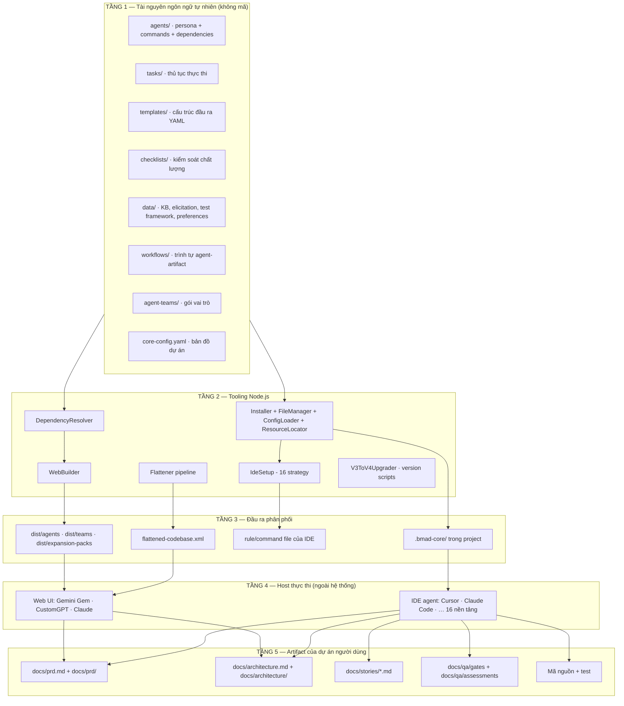

### 2.2 Sơ đồ ngữ cảnh (C4 – Level 1)

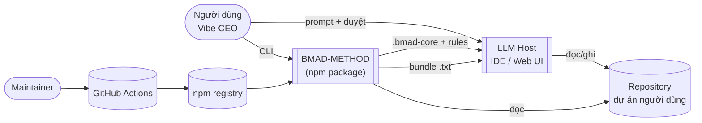

### 2.3 Nguyên lý "brain + packaging"

`bmad-core/` là **bộ não**; `tools/` là **cơ chế đóng gói và phân phối bộ não** cho từng môi trường. Hệ quả: thay đổi hành vi agent = sửa Markdown/YAML, không cần sửa JS; thay đổi kênh phân phối = sửa JS, không cần sửa nội dung agent.

---

## 3. Phân rã module

### 3.1 Bảng module

| Module | Đường dẫn | Trách nhiệm | Phụ thuộc |
|--------|-----------|-------------|-----------|
| Core resources | `bmad-core/` | Định nghĩa toàn bộ hành vi agent | — |
| Common resources | `common/` | Tài nguyên dùng chung giữa core và pack (`create-doc`, `execute-checklist`, `bmad-doc-template`, `workflow-management`) | — |
| Expansion packs | `expansion-packs/<id>/` | Tài nguyên theo miền | core (fallback) |
| Build CLI | `tools/cli.js` | Điểm vào build/validate/list/upgrade | WebBuilder, V3ToV4Upgrader, IdeSetup |
| WebBuilder | `tools/builders/web-builder.js` | Sinh bundle `.txt` | DependencyResolver, yaml-utils, js-yaml |
| DependencyResolver | `tools/lib/dependency-resolver.js` | Phân giải & khử trùng dependency | yaml-utils |
| yaml-utils | `tools/lib/yaml-utils.js` | Trích block YAML từ file agent (kèm làm sạch commands) | js-yaml |
| Installer CLI | `tools/installer/bin/bmad.js` | Hỏi đáp tương tác, parse tham số | installer, inquirer, chalk, semver |
| Installer | `tools/installer/lib/installer.js` | Điều phối toàn bộ vòng đời cài đặt (2013 dòng) | file-manager, config-loader, ide-setup, resource-locator |
| FileManager | `tools/installer/lib/file-manager.js` | Copy/hash/backup/manifest/ghi cấu hình | fs-extra, crypto, js-yaml |
| ConfigLoader | `tools/installer/lib/config-loader.js` | Đọc `install.config.yaml`, liệt kê agent/team/pack | js-yaml |
| ResourceLocator | `tools/installer/lib/resource-locator.js` | Định vị & cache tài nguyên nguồn, glob | glob |
| IdeSetup | `tools/installer/lib/ide-setup.js` | 16 chiến lược sinh cấu hình IDE (2453 dòng) | ide-base-setup, comment-json |
| IdeBaseSetup | `tools/installer/lib/ide-base-setup.js` | Hàm dùng chung: liệt kê agent, tìm path, đọc title, tạo nội dung rule | — |
| ModuleManager | `tools/installer/lib/module-manager.js` | Nạp module theo yêu cầu + cache (giảm bộ nhớ khởi động) | — |
| MemoryProfiler | `tools/installer/lib/memory-profiler.js` | Đo mức dùng bộ nhớ | — |
| Flattener | `tools/flattener/*.js` | Pipeline codebase → XML | glob, ignore |
| Upgrader | `tools/upgraders/v3-to-v4-upgrader.js` | Chuyển đổi cấu trúc v3 → v4 | file-manager |
| Version tools | `tools/{version-bump,bump-all-versions,bump-expansion-version,update-expansion-version,sync-installer-version,preview-release-notes}.js`, `tools/sync-version.sh` | Bump/đồng bộ/preview release | semver |

### 3.2 Sơ đồ phụ thuộc tooling

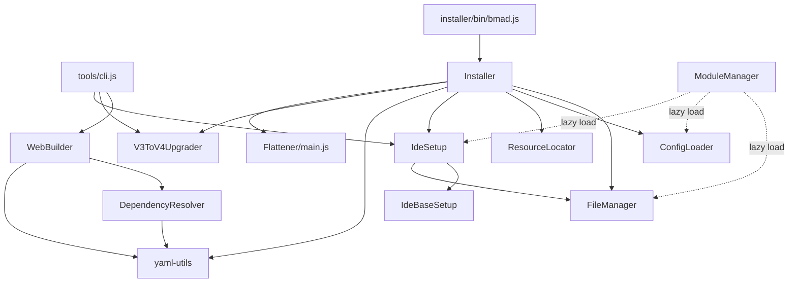

---

## 4. Thiết kế tầng ngôn ngữ tự nhiên (bmad-core)

### 4.1 Mô hình đối tượng của tài nguyên

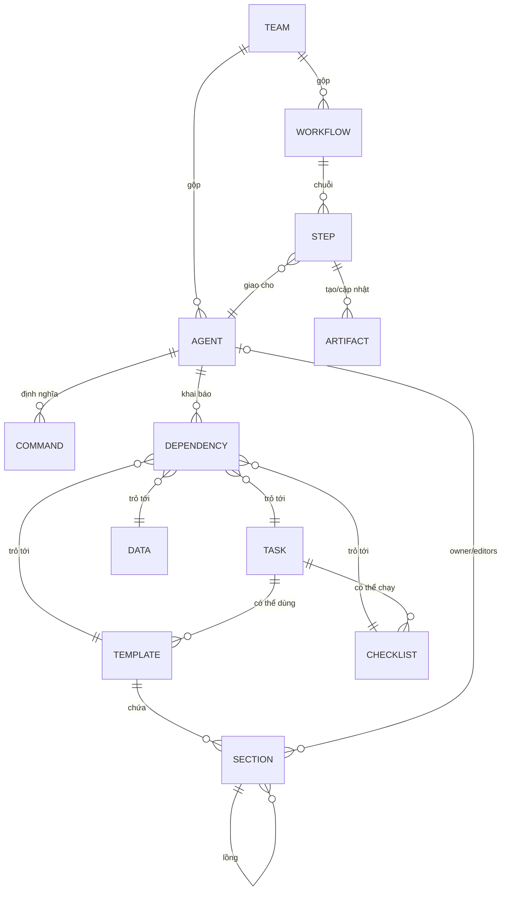

### 4.2 Thiết kế agent: "self-contained persona file"

Mỗi file agent là **một đơn vị triển khai độc lập**: có thể copy nguyên vào command file của IDE, hoặc nhúng nguyên vào bundle. Do đó file agent chứa:

- **Header cưỡng chế**: `ACTIVATION-NOTICE` + "COMPLETE AGENT DEFINITION FOLLOWS - NO EXTERNAL FILES NEEDED" — chống việc host đi tìm file khác.
- **`IDE-FILE-RESOLUTION`**: quy tắc ánh xạ `{root}/{type}/{name}`, có ghi rõ "FOR LATER USE ONLY - NOT FOR ACTIVATION" để tránh nạp sớm.
- **`REQUEST-RESOLUTION`**: cho phép khớp mờ yêu cầu tự nhiên → lệnh.
- **`activation-instructions`** dạng STEP 1..N + các dòng `DO NOT`/`CRITICAL`.
- **`persona`** (role/style/identity/focus/core_principles) — quyết định chất lượng đầu ra.
- **`commands`** — giao diện công khai của agent.
- **`dependencies`** — whitelist tài nguyên.

Thiết kế này cho phép ba kênh phân phối dùng **cùng một nguồn**: file gốc (IDE), file gốc đã thay `{root}` (command IDE), file gốc đã lược bỏ phần IDE-only (bundle web).

### 4.3 Thiết kế task: workflow chạy được

Task được thiết kế như **script bằng tiếng Anh** với các cấu trúc điều khiển tường minh:

| Cấu trúc | Ví dụ | Mục đích |
|----------|-------|----------|
| Bước tuần tự có số | `### 0. Load Core Configuration` … `### 6.` | Ngăn agent nhảy bước |
| HALT | "If the file does not exist, HALT and inform the user: …" | Chặn thực thi khi thiếu tiền đề |
| Điều kiện phân nhánh | "If `architectureVersion: >= v4` and `architectureSharded: true` … Else …" | Thích ứng cấu hình dự án |
| Cưỡng chế tương tác | "**IF elicit: true** → MANDATORY 1-9 options format" | Giữ human-in-the-loop |
| Chỉ báo vi phạm | "VIOLATION INDICATOR: If you create a complete document without user interaction…" | Cho LLM tự phát hiện lệch chuẩn |
| Ràng buộc nguồn dữ liệu | "NEVER invent or assume technical details", "ALWAYS cite `[Source: …]`" | Chống ảo giác |
| Ưu tiên tất định | `apply-qa-fixes` mục "Build Deterministic Fix Plan (Priority Order)" | Kết quả lặp lại được |

### 4.4 Thiết kế template: tách cấu trúc – chỉ dẫn – nội dung

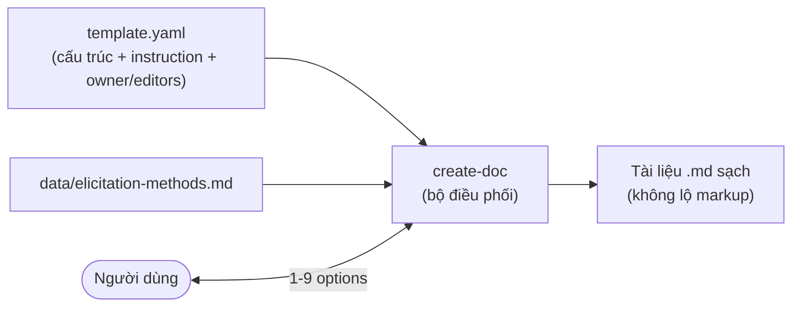

Ba thành phần khớp nhau: `bmad-doc-template.md` (đặc tả markup) + `create-doc.md` (engine) + `advanced-elicitation.md` (lớp tinh chỉnh). Quan trọng: **template tự chứa chỉ dẫn**, nên phần lớn trường hợp không cần task riêng để sinh tài liệu.

### 4.5 Thiết kế "nén ngữ cảnh" vào story

Đây là thiết kế trung tâm giải quyết context loss:

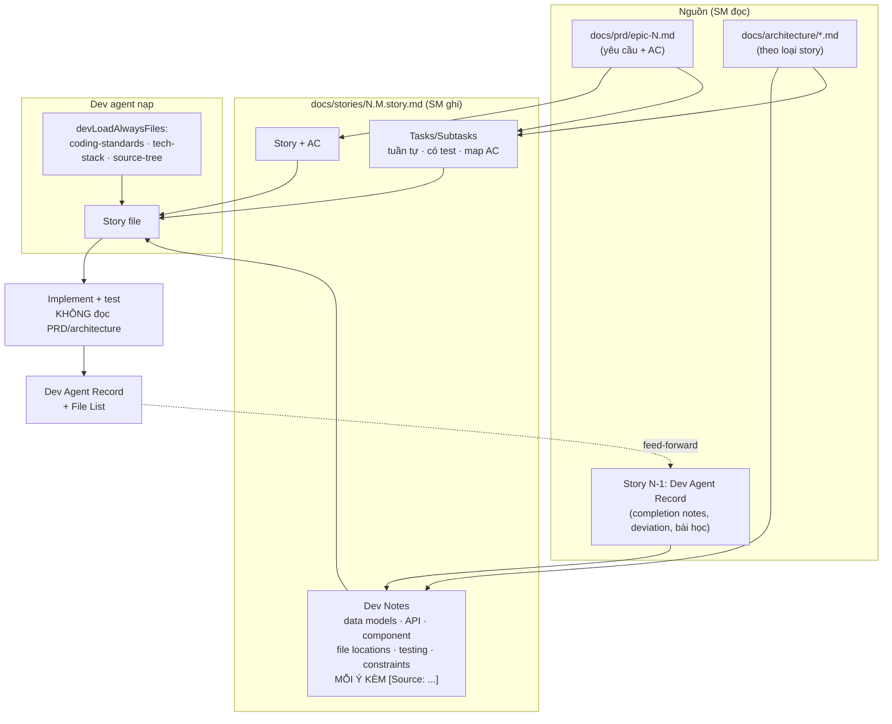

Vòng phản hồi `Dev Agent Record → story kế tiếp` là cơ chế học liên tục giữa các story mà không cần bộ nhớ ngoài.

---

## 5. Thiết kế tầng tooling

### 5.1 `DependencyResolver`

| Thành viên | Ký hiệu | Hành vi |
|-----------|---------|---------|
| `constructor(rootDir)` | — | Thiết lập `bmadCore`, `common`, `cache: Map` |
| `resolveAgentDependencies(agentId)` | → `{agent, resources[]}` | Đọc file agent, trích YAML (có clean commands), lặp qua 5 loại dep `tasks, templates, checklists, data, utils` |
| `resolveTeamDependencies(teamId)` | → `{team, agents[], resources[]}` | Thêm `bmad-orchestrator` trước tiên; nở wildcard `*`; loại `bmad-master`; khử trùng resource bằng `Map` khoá theo path; nạp thêm `workflows` của team |
| `loadResource(type, id)` | → `{type,id,path,content}` \| `null` | Thứ tự tìm: `bmad-core/<type>/<id>` → `common/<type>/<id>`; cache theo `type#id`; cảnh báo nếu không thấy |
| `listAgents()` / `listTeams()` | → `string[]` | Đọc thư mục, lọc `.md` / `.yaml` |

Thiết kế đáng chú ý: **fallback hai tầng core → common** cho phép đặt tài nguyên dùng chung ở `common/` mà agent chỉ khai báo tên file, không cần biết nó nằm đâu.

### 5.2 `WebBuilder`

| Phương thức | Vai trò |
|-------------|---------|
| `cleanOutputDirs()` | Xoá `dist/` trước khi build |
| `buildAgents()` / `buildTeams()` | Lặp toàn bộ agent/team, ghi `.txt` vào mọi `outputDirs` |
| `buildAgentBundle(id)` / `buildTeamBundle(id)` | Ghép: instructions → agent config → resources |
| `generateWebInstructions(type, packName?)` | Sinh header động, thay ví dụ đường dẫn theo bundle root |
| `convertToWebPath(filePath, bundleRoot)` | Chuẩn hoá path: bỏ segment đầu (`bmad-core`/`common`) hoặc bỏ `expansion-packs/<pack>`, ghép tiền tố `.<bundleRoot>/` |
| `processAgentContent(content)` | Với file agent: parse YAML, `delete root`, `delete IDE-FILE-RESOLUTION`, `delete REQUEST-RESOLUTION`, lọc `activation-instructions`, dump lại + header mới |
| `formatSection(path, content, bundleRoot)` | Bọc mốc START/END, gọi `processAgentContent` nếu path chứa `/agents/`, thay `{root}` |
| `buildExpansionPack(name, opts)` | Build từng agent của pack + một team bundle |
| `buildExpansionAgentBundle` / `buildExpansionTeamBundle` | Phân giải dep với thứ tự **pack → core → common**; thêm nốt tài nguyên pack chưa dùng |

### 5.3 `Installer` — bản đồ phương thức

| Nhóm | Phương thức |
|------|-------------|
| Vòng đời | `install`, `performFreshInstall`, `performUpdate`, `performRepair`, `performReinstall` |
| Nhận diện | `detectInstallationState`, `detectExpansionPacks`, `findInstallation`, `compareVersions` |
| Xử lý trạng thái | `handleExistingV4Installation`, `handleV3Installation`, `handleUnknownInstallation` |
| Expansion pack | `installExpansionPacks`, `resolveExpansionPackCoreDependencies`, `resolveExpansionPackCoreAgents`, `repairExpansionPack` |
| Tài nguyên phụ | `copyCommonItems`, `copyDocsItems`, `installWebBundles`, `getWebBundleInfo`, `cleanupLegacyYmlFiles` |
| Truy vấn | `getCoreVersion`, `listAgents`, `listExpansionPacks`, `showStatus`, `getAvailableAgents/ExpansionPacks/Teams` |
| Phụ trợ | `showSuccessMessage`, `flatten`, `update` (deprecated) |

### 5.4 `FileManager` — thiết kế an toàn dữ liệu

| Phương thức | Điểm thiết kế |
|-------------|---------------|
| `calculateFileHash` | SHA-256 **streaming**, trả 16 hex đầu ⇒ cân bằng giữa độ phân biệt và kích thước manifest |
| `copyFileWithRootReplacement` | Nếu file > 5 MB dùng stream; thay mọi `{root}` |
| `copyDirectoryWithRootReplacement` | Copy cây thư mục kèm thay thế |
| `createManifest` / `createExpansionPackManifest` | Ghi version từ `package.json` (nguồn chân lý duy nhất) |
| `checkModifiedFiles` / `checkFileIntegrity` | So hash; **bỏ qua chính manifest** (luôn khác do timestamp) |
| `backupFile` | Tìm tên `.bak`, `.bak1`, `.bak2`… chưa tồn tại ⇒ không bao giờ mất bản sao trước |
| `modifyCoreConfig` | Đọc–sửa–ghi YAML để áp lựa chọn sharding |

### 5.5 Pipeline Flattener

```mermaid
graph LR
    A[projectRoot.js<br/>phát hiện root] --> B[prompts.js<br/>xác nhận nếu TTY]
    B --> C[discovery.js<br/>git ls-files hoặc glob]
    C --> D[ignoreRules.js<br/>.gitignore + defaults + .bmad-flattenignore]
    D --> E[binary.js<br/>phân loại text/binary]
    E --> F[files.js<br/>đọc nội dung]
    F --> G[aggregate.js<br/>gom theo concurrency tự chọn]
    G --> H[xml.js<br/>CDATA-safe, chẻ chuỗi ]]&gt;]
    H --> I[stats.js + stats.helpers.js<br/>thống kê + token ước lượng]
    I --> J[flattened-codebase.xml]
```
```mermaid
flowchart LR
    A[projectRoot.js<br/>phát hiện root] --> B[prompts.js<br/>xác nhận nếu TTY]
    B --> C[discovery.js<br/>git ls-files hoặc glob]
    C --> D[ignoreRules.js<br/>.gitignore + defaults + .bmad-flattenignore]
    D --> E[binary.js<br/>phân loại text/binary]
    E --> F[files.js<br/>đọc nội dung]
    F --> G[aggregate.js<br/>gom theo concurrency tự chọn]
    G --> H[xml.js<br/>CDATA-safe, chẻ chuỗi ]]>]
    H --> I[stats.js + stats.helpers.js<br/>thống kê + token ước lượng]
    I --> J[flattened-codebase.xml]
```

---

## 6. Thuật toán cốt lõi

### 6.1 Phân giải dependency cho team (có wildcard + dedupe)

```text
resolveTeam(teamId):
  team ← parseYaml(bmad-core/agent-teams/{teamId}.yaml)
  agents ← []           ; resources ← Map()        # khoá = đường dẫn tuyệt đối
  # 1. orchestrator luôn đứng đầu
  orch ← resolveAgent("bmad-orchestrator")
  agents.push(orch.agent) ; ∀r ∈ orch.resources: resources[r.path] ← r
  # 2. nở wildcard
  toResolve ← team.agents
  if "*" ∈ toResolve:
      toResolve ← (toResolve \ {"*"}) ∪ (listAgents() \ {bmad-master} \ toResolve)
  # 3. phân giải từng agent, khử trùng tài nguyên
  ∀id ∈ toResolve, id ∉ {bmad-orchestrator, bmad-master}:
      d ← resolveAgent(id) ; agents.push(d.agent)
      ∀r ∈ d.resources: resources[r.path] ← r
  # 4. workflow của team
  ∀w ∈ team.workflows: resources[path(w)] ← loadResource("workflows", w)
  return {team, agents, resources: values(resources)}
```

Độ phức tạp: O(A × D) lần đọc file, giảm về O(1) cho mỗi `type#id` nhờ cache; dedupe theo path ⇒ bundle không lặp nội dung.

### 6.2 Thứ tự ưu tiên tài nguyên khi bundle expansion pack

```text
for each dependency key = "{type}#{name}":
    if key ∈ expansionResources:  load từ expansion-packs/<pack>/{type}/{name}   # override
    elif exists bmad-core/{type}/{name}: load từ core
    elif exists common/{type}/{name}:    load từ common
    else: warn "not found"
# sau cùng: thêm mọi tài nguyên còn lại của pack chưa nằm trong allDependencies
```

Ý nghĩa thiết kế: pack có thể **thay thế** tài nguyên core cùng tên (ví dụ `create-doc.md` riêng của `bmad-creative-writing`) mà không cần fork core.

### 6.3 Máy trạng thái cài đặt

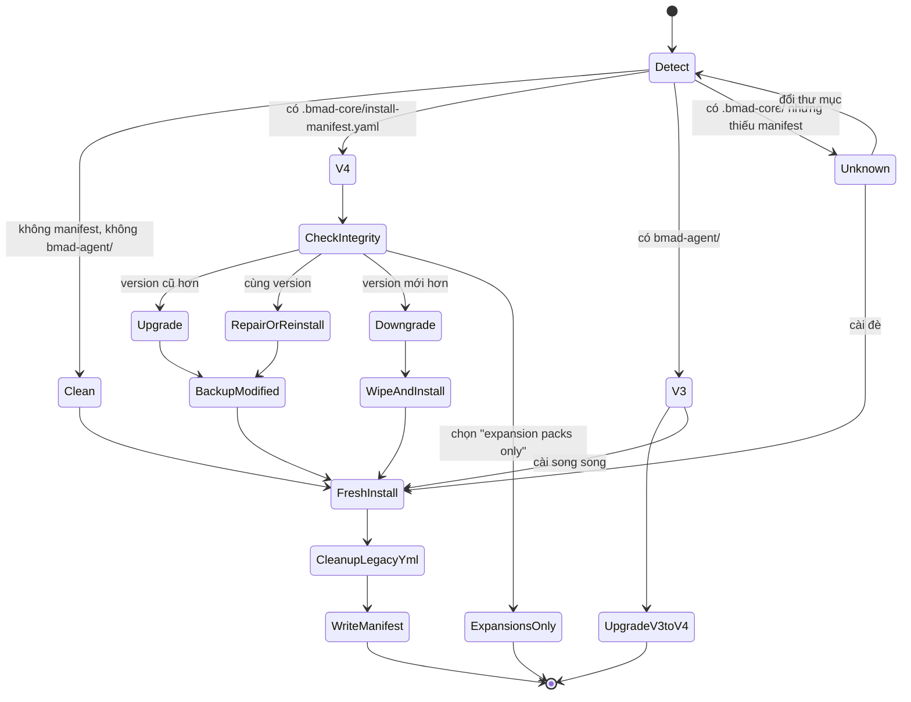

### 6.4 Trình tự cài đặt (sequence)

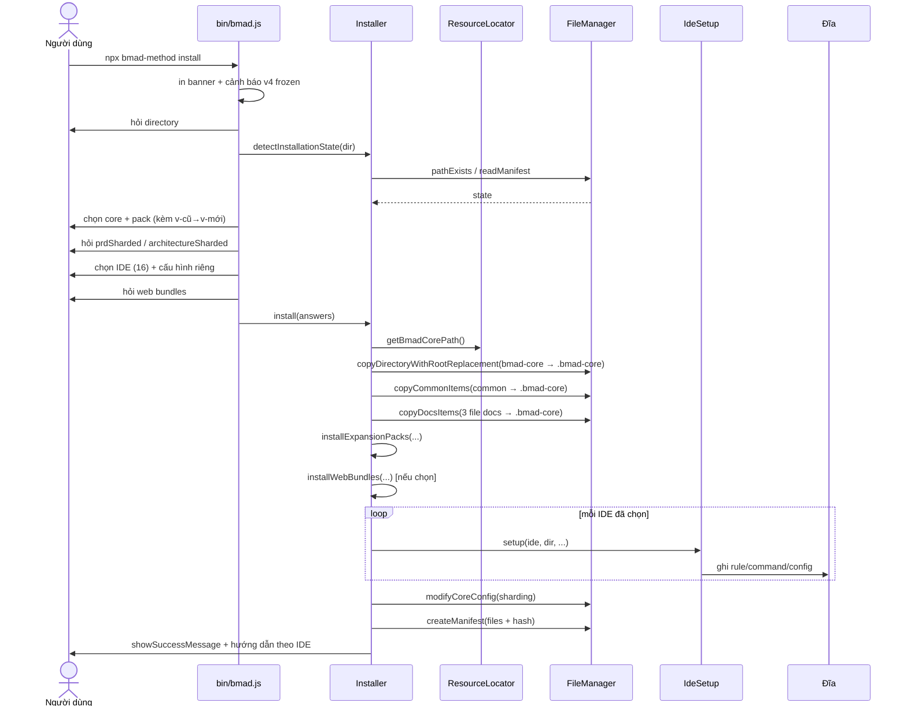

### 6.5 Thuật toán kiểm tra toàn vẹn & sửa chữa

```text
integrity(installDir, manifest):
    missing ← [] ; modified ← []
    ∀f ∈ manifest.files:
        if f.path endsWith "install-manifest.yaml": continue      # tự loại trừ
        if ¬exists(f.path): missing.push(f.path)
        elif hash(f.path) ≠ f.hash: modified.push(f.path)
    return {missing, modified}

repair(...):
    ∀f ∈ modified: backupFile(f)                                   # .bak / .bak1 / ...
    ∀f ∈ missing ∪ modified:
        if exists(common/<rel>):   ghi nội dung common với {root}→".bmad-core"
        elif exists(bmad-core/<rel>): copyFile
        else warn "source not found"
        if f endsWith ".yaml" ∧ exists(f.replace(".yaml",".yml")): unlink(.yml)
    cleanupLegacyYmlFiles()
    if "cursor" ∈ manifest.ides_setup: cảnh báo cập nhật custom mode
```

### 6.6 Thuật toán quyết định gate (QA)

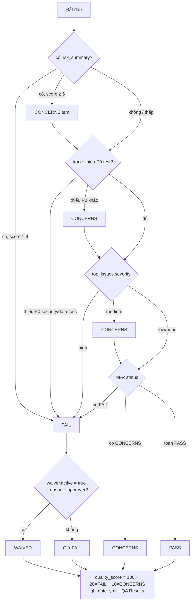

### 6.7 Thuật toán sharding

```text
shard(doc, dest):
    if config.markdownExploder = true:
        r ← exec("md-tree explode {doc} {dest}")
        if r.ok: báo thành công ; STOP
        else: hướng dẫn cài @kayvan/markdown-tree-parser hoặc tắt cờ ; STOP   # KHÔNG tự chẻ tay
    # chỉ tới đây khi cờ = false
    sections ← parseLevel2(doc)          # ## ở ngoài code fence mới là heading
    ∀s ∈ sections:
        name ← kebabCase(strip(s.title)) + ".md"
        content ← demoteHeadings(s)       # ## → #, ### → ##, ...
        write(dest/name, content)
    write(dest/index.md, H1 gốc + phần mở đầu + danh sách link)
    validate: không mất nội dung, heading đúng cấp, khả nghịch
```

---

## 7. Máy trạng thái và mô hình quyền

### 7.1 Vòng đời story

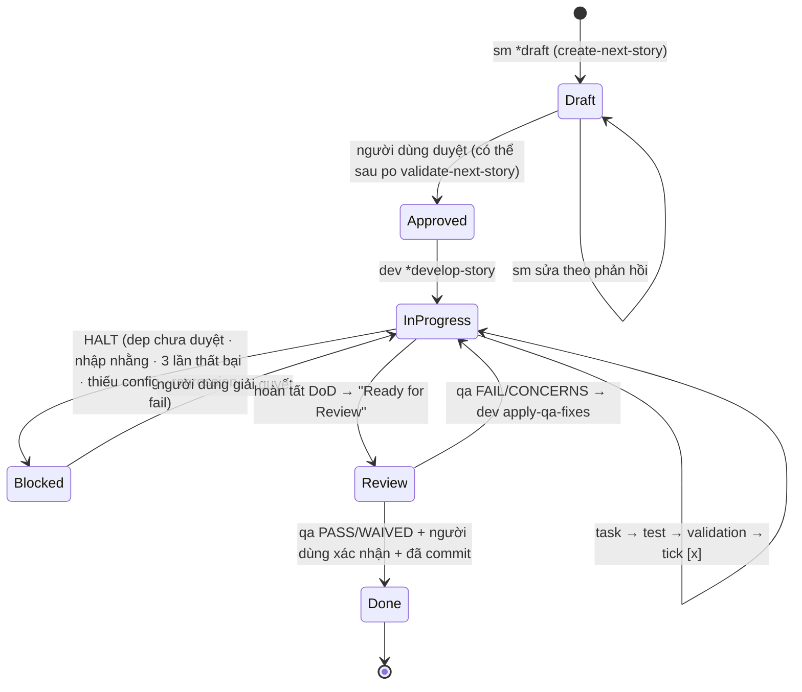

### 7.2 Ma trận quyền ghi (section story)

| Section | sm | dev | qa | Người dùng |
|---------|----|-----|----|-----------|
| Status | ✅ tạo | ✅ cập nhật | ❌ (chỉ khuyến nghị) | ✅ quyết định cuối |
| Story / Acceptance Criteria | ✅ | ❌ | ❌ | ✅ |
| Tasks / Subtasks | ✅ tạo | ✅ tick checkbox | ❌ | ✅ |
| Dev Notes / Testing | ✅ | ❌ | ❌ | ✅ |
| Dev Agent Record (+ File List, Completion Notes, Debug Log, Agent Model) | ❌ | ✅ | ❌ | — |
| Change Log | ✅ | ✅ | ✅ | ✅ |
| QA Results | ❌ | ❌ | ✅ (append theo ngày) | — |
| `docs/qa/gates/*.yml` | ❌ | ❌ | ✅ sở hữu | — |

Thiết kế quyền này được cưỡng chế bằng prompt ở ba nơi độc lập (agent file, task file, template `owner/editors`) — **phòng thủ nhiều lớp** vì không có cơ chế kỹ thuật nào chặn được LLM ghi sai chỗ.

### 7.3 Điểm dừng human-in-the-loop

| Vị trí | Cơ chế |
|--------|--------|
| Mỗi section template có `elicit: true` | HARD STOP + 9 lựa chọn có số |
| Sau khi SM tạo story | Người dùng chuyển Draft → Approved |
| Khi story trước chưa `Done` | Cảnh báo + hỏi có chấp nhận rủi ro |
| Khi epic đã hoàn tất | Hỏi 3 lựa chọn, tuyệt đối không tự nhảy epic |
| Khi thiếu `core-config.yaml` | HALT kèm hướng dẫn khắc phục |
| 5 điều kiện blocking của Dev | HALT |
| Trước khi đánh `Done` | Xác nhận regression + lint pass, **commit trước khi tiếp tục** |
| Khi installer phát hiện file đã sửa | Hỏi backup / skip / cancel |
| Khi tắt sharding kiến trúc | Yêu cầu xác nhận rủi ro |

---

## 8. Thiết kế tích hợp IDE

### 8.1 Mẫu Strategy

`IdeSetup.setup(ide, installDir, selectedAgent, spinner, preConfiguredSettings)` là **dispatcher** ánh xạ 16 IDE tới 16 phương thức `setupX`, phân thành 5 họ định dạng:

| Họ định dạng | IDE | Cơ chế ghi |
|--------------|-----|-----------|
`multi-file` | cursor (`.mdc`), claude-code, iflow-cli, crush, windsurf, trae, cline, github-copilot (`.md`), gemini, qwen-code (`.toml`) | Mỗi agent/task → một file rule/command trong thư mục quy ước |
| `custom-modes` | roo (`.roomodes`), kilo (`.kilocodemodes`) | Một file mode duy nhất, có thể kèm `fileRegex` giới hạn quyền |
| `project-memory` | codex, codex-web (`AGENTS.md`) | Cập nhật block BMAD trong file memory ở gốc project |
| `jsonc-config` | opencode (`opencode.jsonc`) | Merge JSONC bảo toàn comment, dùng file-reference `{file:./...}` |
| `multi-location` | auggie-cli | Ghi vào `~/.augment/commands/bmad/` và/hoặc `./.augment/commands/bmad/` |

### 8.2 Quy trình sinh cấu hình (ví dụ Claude Code)

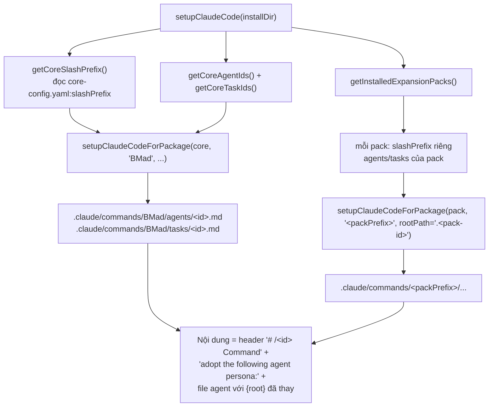

### 8.3 Nguyên tắc bảo toàn cấu hình người dùng

- **Không phá huỷ**: OpenCode/Codex chỉ merge phần do BMAD quản lý; key lạ được bỏ qua kèm gợi ý bật tiền tố.
- **Idempotent**: chạy lại `install -f -i <ide>` cập nhật đúng chỗ, không sinh trùng.
- **Tuỳ biến va chạm tên**: tiền tố `bmad-` (agent) và `bmad:tasks:` (command) là opt-in.
- **Chỉ gói đã chọn**: IDE setup chỉ áp dụng cho core/pack mà người dùng đã chọn ở bước trước.

---

## 9. Thiết kế expansion pack

### 9.1 Nguyên lý tự chứa

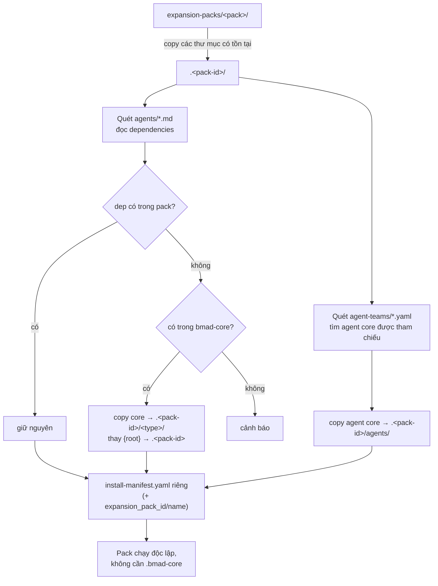

Quy tắc suy tên file dependency: nếu tên không có đuôi thì `templates` → `.yaml`, các loại khác → `.md`.

### 9.2 Ranh giới core ↔ pack

| Thuộc core | Thuộc pack |
|-----------|-----------|
| Nhu cầu phát triển phần mềm phổ quát | Nhu cầu theo miền cụ thể |
| Không làm phình ngữ cảnh dev agent | Bất cứ thứ gì làm phình core |
| Theo đúng khuôn mẫu agent/task/template hiện có | KB lớn, tài liệu nặng, quy trình phi kỹ thuật |

### 9.3 Cấu hình riêng của pack

Pack có `config.yaml` đóng vai trò như `core-config.yaml` thu nhỏ: `slashPrefix` riêng (`BmadG`, `bmad-cw`), có thể khai báo `devLoadAlwaysFiles`, thêm khoá riêng như `qaLoadAlwaysFiles` (pack Godot) — cho thấy schema cấu hình **mở rộng được** mà tooling không cần biết trước.

---

## 10. Quyết định thiết kế (ADR)

| # | Quyết định | Lý do | Đánh đổi |
|---|-----------|-------|----------|
| DD-1 | Lõi hoàn toàn bằng ngôn ngữ tự nhiên, không mã | Cộng đồng phi lập trình cũng mở rộng được; không phụ thuộc runtime | Không cưỡng chế được hành vi, phụ thuộc mức tuân thủ của LLM |
| DD-2 | Agent file tự chứa persona đầy đủ | Cho phép nhúng nguyên vào IDE command và bundle web từ một nguồn | File agent dài; trùng lặp header giữa các agent |
| DD-3 | Nạp dependency muộn (lazy) + whitelist tường minh | Giữ ngữ cảnh cho code; bundle nhỏ nhất có thể | Agent không thể tuỳ ý dùng tài nguyên ngoài whitelist |
| DD-4 | Hai môi trường, hai kênh phân phối (bundle `.txt` vs `.bmad-core/`) | Tối ưu chi phí: hoạch định ở web context lớn, phát triển ở IDE | Người dùng phải copy tài liệu qua lại ở mốc chuyển pha |
| DD-5 | Sharding tài liệu theo heading cấp 2 | Story chỉ cần đọc mảnh liên quan; giảm ngữ cảnh cho SM/Dev | Thêm một bước thủ công; cần công cụ ngoài (`md-tree`) |
| DD-6 | Nén ngữ cảnh vào story + bắt buộc trích `[Source: …]` | Dev không cần đọc PRD/architecture; chống ảo giác; truy vết được | SM tốn ngữ cảnh và cần model mạnh |
| DD-7 | Quyền ghi theo section, cưỡng chế ở 3 lớp | Nhiều agent cùng ghi một file mà không phá nhau | Không có kiểm soát kỹ thuật; phải mô tả lặp lại |
| DD-8 | Gate QA là advisory, không blocking | Đội tự chọn ngưỡng; tránh QA trở thành nút cổ chai | Có thể bỏ qua rủi ro nếu người dùng không đọc gate |
| DD-9 | Quyết định gate tất định (thứ tự ưu tiên rõ) | Kết quả nhất quán giữa các lần chạy và giữa các model | Kém linh hoạt với ngữ cảnh đặc thù |
| DD-10 | Hash 16 hex + manifest cho mọi file cài đặt | Phát hiện file người dùng đã sửa, không ghi đè mù | Manifest dài; hash rút gọn về lý thuyết có thể trùng |
| DD-11 | Backup `.bak*` thay vì hỏi từng file | Không bao giờ mất tuỳ biến của người dùng | Rác file backup tích tụ |
| DD-12 | Expansion pack tự chứa (copy cả dep core) | Pack dùng được kể cả khi không cài core | Trùng lặp nội dung giữa `.bmad-core/` và `.{pack}/`; cập nhật core không tự lan sang pack |
| DD-13 | Pack ghi đè core theo tên file | Tuỳ biến sâu không cần fork | Rủi ro lệch hành vi ngầm giữa pack và core |
| DD-14 | Mẫu Strategy cho 16 IDE trong một file | Thêm IDE = thêm một `setupX` + một entry config | `ide-setup.js` phình tới 2453 dòng |
| DD-15 | `package.json:version` là nguồn chân lý duy nhất | Tránh lệch version giữa installer, manifest, pack | Cần script đồng bộ (`sync-installer-version.js`) |
| DD-16 | Elicitation bắt buộc 9 lựa chọn có số | Ép human-in-the-loop, chống LLM "chạy một hơi" | Quy trình chậm hơn; cần `#yolo` làm lối thoát |
| DD-17 | `bmad-master` bị loại khỏi team bundle | Tránh trùng năng lực với orchestrator, giảm kích thước bundle | Người dùng web không có sẵn master trong team |
| DD-18 | Cảnh báo thay vì lỗi khi thiếu dependency lúc bundle pack | Pack chưa hoàn chỉnh vẫn build được | Lỗi có thể lọt tới runtime |

---

## 11. Giới hạn thiết kế đã biết

| # | Giới hạn | Ảnh hưởng | Hướng giảm nhẹ |
|---|----------|-----------|----------------|
| L-1 | Không có cơ chế cưỡng chế kỹ thuật cho quyền ghi section | Agent có thể ghi sai section | Nhắc lặp ở 3 lớp; người dùng review diff |
| L-2 | `apply-qa-fixes.md` hard-code lệnh Deno (`deno lint`, `deno test -A`) và đường dẫn ví dụ (`deps.ts`, `src/core/di.ts`) | Không khớp dự án Node/Python/…; Dev có thể chạy lệnh sai | Sửa task theo stack thực tế của project sau khi cài |
| L-3 | `docs/user-guide.md` ghi Node ≥ 18 còn `package.json` yêu cầu ≥ 20.10.0 | Người dùng có thể cài trên Node không hỗ trợ | Lấy `package.json` làm chuẩn |
| L-4 | Trùng lặp nội dung: `bmad-kb.md` xuất hiện cả ở core và nhiều pack | Nội dung có thể phân kỳ theo thời gian | Coi bản core là chuẩn khi lệch |
| L-5 | Hash rút gọn 16 hex | Xác suất trùng lý thuyết | Đủ dùng cho mục đích phát hiện sửa đổi |
| L-6 | `ide-setup.js` quá lớn (2453 dòng) | Khó bảo trì, dễ hồi quy khi thêm IDE | Đã tách `ide-base-setup.js`; nên tách tiếp theo họ định dạng |
| L-7 | Bundle web phải nằm trong cửa sổ ngữ cảnh của host | `team-all.txt` có thể quá lớn với một số nền tảng | Dùng `team-fullstack`/`team-no-ui` hoặc bundle từng agent |
| L-8 | Sharding tự động phụ thuộc gói global bên ngoài | Thiếu gói ⇒ task dừng, không tự chẻ tay | Cài `@kayvan/markdown-tree-parser -g` hoặc đặt `markdownExploder: false` |
| L-9 | Một số bước workflow tham chiếu task "coming soon" (story-review, epic-retrospective) | Bước tồn tại trên sơ đồ nhưng chưa có task chính thức | Thực hiện thủ công / dùng checklist tương đương |
| L-10 | v4 đóng băng tính năng | Không nhận cải tiến mới | Chuyển sang v6 alpha khi cần tính năng mới |

---

## Tham chiếu chéo

- Yêu cầu chi tiết: [`01-dac-ta-he-thong.md`](./01-dac-ta-he-thong.md)
- Quy trình vận hành, lệnh cụ thể, xử lý sự cố: [`03-van-hanh-he-thong.md`](./03-van-hanh-he-thong.md)
- Luồng dữ liệu đầu–cuối: [`04-luong-du-lieu-end-to-end.md`](./04-luong-du-lieu-end-to-end.md)
