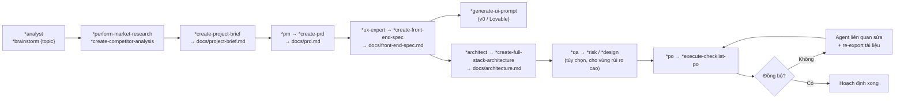
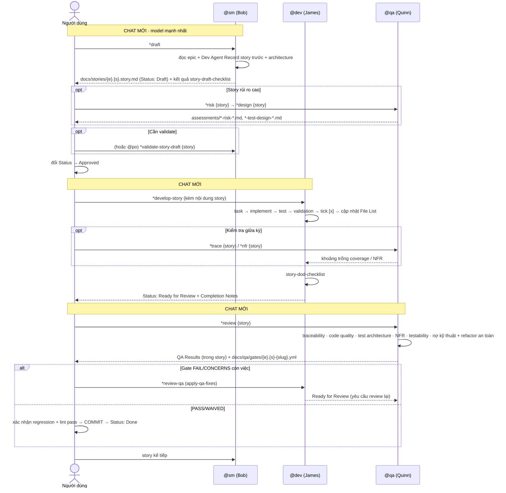

# CẨM NANG VẬN HÀNH HỆ THỐNG — BMAD-METHOD™ v4.44.2

> Tài liệu vận hành (Operations Manual / Runbook): cài đặt, cấu hình, quy trình làm việc hằng ngày, vận hành repository framework, nâng cấp – sửa chữa, giám sát và xử lý sự cố.

---

## Mục lục

1. [Yêu cầu môi trường](#1-yêu-cầu-môi-trường)
2. [Cài đặt](#2-cài-đặt)
3. [Cấu hình](#3-cấu-hình)
4. [Vận hành pha hoạch định](#4-vận-hành-pha-hoạch-định)
5. [Chuyển pha và sharding](#5-chuyển-pha-và-sharding)
6. [Vận hành vòng phát triển SM → Dev → QA](#6-vận-hành-vòng-phát-triển-sm--dev--qa)
7. [Runbook Test Architect (QA)](#7-runbook-test-architect-qa)
8. [Runbook brownfield](#8-runbook-brownfield)
9. [Vận hành repository framework](#9-vận-hành-repository-framework)
10. [Nâng cấp, sửa chữa, hoàn nguyên](#10-nâng-cấp-sửa-chữa-hoàn-nguyên)
11. [Xử lý sự cố](#11-xử-lý-sự-cố)
12. [Bảo trì định kỳ và thực hành tốt](#12-bảo-trì-định-kỳ-và-thực-hành-tốt)
13. [Bảng tra lệnh nhanh](#13-bảng-tra-lệnh-nhanh)

---

## 1. Yêu cầu môi trường

| Thành phần | Yêu cầu | Ghi chú |
|-----------|---------|---------|
| Node.js | **≥ 20.10.0** | `package.json:engines`. Tài liệu người dùng ghi ≥ 18 nhưng hãy lấy mốc 20.10.0 |
| npm | ≥ 9 | |
| Git | Đã cài & cấu hình | Bắt buộc cho flattener chế độ nhanh và cho commit theo story |
| `@kayvan/markdown-tree-parser` | Cài global | `npm install -g @kayvan/markdown-tree-parser` — cần cho sharding tự động |
| IDE có AI agent | 1 trong 16 nền tảng | VS Code thuần (không extension AI) KHÔNG chạy được agent |
| VS Code extensions (tùy chọn) | "Markdown All in One" + "Markdown Preview Mermaid Support" | Để xem sơ đồ Mermaid trong tài liệu |
| Nền tảng web (tùy chọn) | Gemini Gem / CustomGPT / Claude | Cho pha hoạch định chi phí thấp |

---

## 2. Cài đặt

### 2.1 Cài vào project (khuyến nghị)

```bash
cd <thư-mục-project>
npx bmad-method install
```

Lệnh này xử lý cả: cài mới, nâng cấp bản v4 đã có, và cài expansion pack.

### 2.2 Luồng hỏi đáp và cách trả lời

| Bước | Câu hỏi | Khuyến nghị |
|------|---------|-------------|
| 1 | Đường dẫn project | Đường dẫn tuyệt đối tới gốc project |
| 2 | Chọn thành phần (multiselect) | Tick `BMad Agile Core System`; tick thêm pack nếu cần |
| 3 | "PRD sẽ được shard?" | `Yes` (mặc định) |
| 4 | "Architecture sẽ được shard?" | `Yes`. Nếu chọn `No` → phải tự tạo `coding-standards.md`, `tech-stack.md`, `source-tree.md` hoặc xoá chúng khỏi `devLoadAlwaysFiles`, và phải xác nhận cảnh báo |
| 5 | Chọn IDE (**MULTISELECT — dùng SPACEBAR**) | Tick đúng IDE đang dùng; Enter để xác nhận |
| 6 | Cấu hình GitHub Copilot (nếu chọn) | `Use recommended defaults` |
| 7 | Cấu hình OpenCode (nếu chọn) | Bật cả hai tiền tố để tránh va chạm tên |
| 8 | Vị trí Auggie CLI (nếu chọn) | `Workspace` cho dự án dùng chung team |
| 9 | Kèm web bundle? | `No` nếu hoạch định trên web bằng file trong `dist/`; `Yes` nếu muốn bản copy trong project |

### 2.3 Cài không tương tác (CI / script)

```bash
# Cài đầy đủ cho 1 IDE
npx bmad-method install -f -d . -i claude-code

# Nhiều IDE cùng lúc
npx bmad-method install -f -d . -i cursor claude-code windsurf

# Kèm expansion pack
npx bmad-method install -f -d . -i cursor -e bmad-creative-writing bmad-godot-game-dev

# Chỉ cài expansion pack (không tạo .bmad-core)
npx bmad-method install -x -d . -e bmad-infrastructure-devops

# Refresh cấu hình cho một IDE sau khi đổi tài nguyên
npx bmad-method install -f -i opencode
npx bmad-method install -f -i codex        # local
npx bmad-method install -f -i codex-web    # tracked cho Codex Web
```

### 2.4 Cài từ clone repository

```bash
git clone -b V4 https://github.com/bmad-code-org/BMAD-METHOD.git
cd BMAD-METHOD
npm ci
npm run install:bmad        # build + cài vào thư mục đích được hỏi
```

### 2.5 Kết quả sau khi cài — kiểm tra

```text
<project>/
├── .bmad-core/
│   ├── agents/            (10 file .md)
│   ├── agent-teams/       (4 file .yaml)
│   ├── workflows/         (6 file .yaml)
│   ├── tasks/             (21 + 2 task từ common/)
│   ├── templates/         (13 file .yaml)
│   ├── checklists/        (6 file .md)
│   ├── data/              (6 file .md)
│   ├── utils/             (từ common/)
│   ├── core-config.yaml
│   ├── install-manifest.yaml
│   ├── user-guide.md
│   ├── enhanced-ide-development-workflow.md
│   └── working-in-the-brownfield.md
├── .{pack-id}/            (nếu cài expansion pack, có manifest riêng)
└── <file cấu hình IDE>    (.claude/commands/BMad/…, .cursor/rules/bmad/…, AGENTS.md, opencode.jsonc, .roomodes…)
```

Kiểm tra nhanh:

```bash
npx bmad-method status          # trạng thái cài đặt
npx bmad-method list:expansions # pack sẵn có
npx bmad-method update-check    # có bản mới trên npm?
```

Xác nhận: mọi `{root}` trong file đã cài phải được thay bằng `.bmad-core` (hoặc `.{pack-id}`). Nếu còn `{root}` → cài lỗi, chạy repair.

### 2.6 Thiết lập cho nền tảng web (2 phút)

1. Mở `dist/teams/team-fullstack.txt` (hoặc `team-no-ui.txt`, `team-all.txt`).
2. Tạo Gemini Gem / CustomGPT mới.
3. Upload file với instruction: `Your critical operating instructions are attached, do not break character as directed`.
4. Gõ `*help` để xem lệnh; gõ `*analyst` để bắt đầu.
5. Bất cứ lúc nào cần hiểu quy trình: gọi `*agent bmad-orchestrator` rồi `*kb-mode`.

---

## 3. Cấu hình

### 3.1 `.bmad-core/core-config.yaml`

| Khoá | Giá trị mặc định | Khi nào sửa |
|------|-----------------|-------------|
| `markdownExploder` | `true` | Đặt `false` nếu không muốn/không thể cài `md-tree` |
| `qa.qaLocation` | `docs/qa` | Đổi khi dự án có cấu trúc docs khác |
| `prd.prdFile` | `docs/prd.md` | Giữ nguyên để tự động hoá hoạt động |
| `prd.prdVersion` | `v4` | `v3` cho dự án legacy |
| `prd.prdSharded` | `true` | `false` nếu epic nhúng trong PRD |
| `prd.prdShardedLocation` | `docs/prd` | |
| `prd.epicFilePattern` | `epic-{n}*.md` | Đổi theo quy ước đặt tên epic |
| `architecture.architectureFile` | `docs/architecture.md` | |
| `architecture.architectureVersion` | `v4` | `v3` = monolithic |
| `architecture.architectureSharded` | `true` | |
| `architecture.architectureShardedLocation` | `docs/architecture` | |
| `customTechnicalDocuments` | `null` | Khai báo tài liệu kỹ thuật ngoài chuẩn |
| `devLoadAlwaysFiles` | coding-standards / tech-stack / source-tree | **Khoá quan trọng nhất** — xem 3.2 |
| `devDebugLog` | `.ai/debug-log.md` | Nơi Dev ghi log thất bại lặp lại |
| `devStoryLocation` | `docs/stories` | |
| `slashPrefix` | `BMad` | Tiền tố slash command cho IDE |

### 3.2 Vận hành `devLoadAlwaysFiles`

Đây là danh sách file Dev agent **luôn** nạp mọi task ⇒ ảnh hưởng trực tiếp tới chi phí và chất lượng.

**Quy tắc vận hành:**

1. Sau khi shard architecture, xác nhận cả 3 file thực sự tồn tại (nếu tài liệu kiến trúc dùng tên khác, cập nhật danh sách).
2. Giữ chúng **càng gọn càng tốt** — chỉ chứa quy tắc agent PHẢI tuân thủ.
3. Khi codebase đã hình thành pattern nhất quán, **rút gọn** `coding-standards.md`: agent sẽ tự suy ra chuẩn từ code xung quanh.
4. Nếu tắt `architectureSharded`, phải tự tạo 3 file này hoặc xoá khỏi danh sách.

### 3.3 `.bmad-core/data/technical-preferences.md`

Hồ sơ kỹ thuật cá nhân/tổ chức, ảnh hưởng gợi ý của PM và Architect ở mọi dự án. Nội dung nên gồm: stack ưa dùng, design pattern, dịch vụ ngoài, chuẩn code, **anti-pattern cần tránh**, và trọng số riêng cho `quality_score` nếu muốn khác mặc định.

Vận hành: cập nhật liên tục sau mỗi dự án (thêm cả điều nên dùng và điều nên tránh). Khi tạo bundle web tuỳ biến, hãy chèn nội dung file này để agent có preference ngay từ câu đầu tiên.

### 3.4 Cấu hình expansion pack

Mỗi pack có `.{pack-id}/config.yaml` với `slashPrefix` riêng (ví dụ `BmadG`, `bmad-cw`) và có thể mang `devLoadAlwaysFiles`, `qaLoadAlwaysFiles`, `devStoryLocation` riêng. Sửa file này khi muốn đổi vị trí artifact của pack.

---

## 4. Vận hành pha hoạch định

### 4.1 Chọn môi trường

| Việc | Nên làm ở | Vì sao |
|------|-----------|--------|
| Brainstorm, market/competitor research | Web UI | Context lớn, chi phí thấp |
| Project brief, PRD, Architecture, Front-end spec | Web UI (hoặc IDE nếu chấp nhận chi phí) | Tài liệu lớn |
| Sharding, story, code, test | IDE | Cần thao tác file thật |

### 4.2 Trình tự chuẩn (greenfield)



### 4.3 Lệnh theo agent (pha hoạch định)

| Agent | Lệnh chính |
|-------|-----------|
| `analyst` (Mary) | `*brainstorm {topic}`, `*perform-market-research`, `*create-competitor-analysis`, `*create-project-brief`, `*research-prompt {topic}`, `*elicit`, `*doc-out`, `*yolo` |
| `pm` (John) | `*create-prd`, `*create-brownfield-prd`, `*create-epic`, `*create-story`, `*correct-course`, `*shard-prd`, `*doc-out` |
| `ux-expert` (Sally) | `*create-front-end-spec`, `*generate-ui-prompt` |
| `architect` (Winston) | `*create-full-stack-architecture`, `*create-backend-architecture`, `*create-front-end-architecture`, `*create-brownfield-architecture`, `*document-project`, `*execute-checklist {checklist}`, `*research {topic}`, `*shard-prd` |
| `po` (Sarah) | `*execute-checklist-po`, `*shard-doc {document} {destination}`, `*validate-story-draft {story}`, `*correct-course`, `*create-epic`, `*create-story` |

### 4.4 Cách làm việc với elicitation

Khi agent trình bày một section và đưa 9 lựa chọn:

- Gõ `1` để sang section kế tiếp.
- Gõ `2`–`9` để chạy một phương pháp tinh chỉnh (từ `data/elicitation-methods.md`).
- Gõ tự do để phản hồi/hỏi.
- Gõ `#yolo` để chuyển chế độ YOLO (sinh toàn bộ một lượt) — dùng khi đã rất rõ yêu cầu.

**Đừng bỏ qua bước này**: đây là nơi chất lượng tài liệu được tạo ra.

### 4.5 Prompt mẫu

```text
# PRD
"I want to build a [loại] application that [mục đích cốt lõi].
Help me brainstorm features and create a comprehensive PRD."

# Architecture
"Based on this PRD, design a scalable technical architecture
that can handle [yêu cầu cụ thể]."
```

---

## 5. Chuyển pha và sharding

### 5.1 Checklist chuyển pha (bắt buộc)

- [ ] `docs/prd.md` đã có trong project (bản đầy đủ, không rút gọn)
- [ ] `docs/architecture.md` đã có trong project
- [ ] `docs/front-end-spec.md` (nếu có UI)
- [ ] PO đã chạy `po-master-checklist` và xác nhận đồng bộ
- [ ] Đã mở project trong IDE có AI agent
- [ ] **KHÔNG shard trên Web UI**

### 5.2 Thực hiện shard

```text
@po
*shard-doc docs/prd.md docs/prd
*shard-doc docs/architecture.md docs/architecture
```

Hoặc kéo file `shard-doc` task + tài liệu vào chat. Sau khi shard, xác nhận:

- [ ] `docs/prd/` có `index.md` và ít nhất một `epic-*.md`, story sắp theo thứ tự phát triển
- [ ] `docs/architecture/` có `coding-standards.md`, `tech-stack.md`, `source-tree.md` (khớp `devLoadAlwaysFiles`)
- [ ] Không mất nội dung: code fence, sơ đồ Mermaid, bảng còn nguyên
- [ ] Heading đã hạ một cấp trong từng file con

Nếu `md-tree` chưa cài, task sẽ **dừng** và yêu cầu bạn cài hoặc đặt `markdownExploder: false`. Đừng cố ép agent chẻ tay khi cờ đang bật.

---

## 6. Vận hành vòng phát triển SM → Dev → QA

### 6.1 Nguyên tắc vận hành bất di bất dịch

| # | Nguyên tắc |
|---|-----------|
| 1 | **Mở chat mới mỗi lần đổi agent** (SM → Dev → QA) |
| 2 | Dùng **model suy luận mạnh nhất** cho bước SM tạo story |
| 3 | **Chỉ 1 story** được triển khai tại một thời điểm, tuần tự |
| 4 | Dùng đúng `@sm` để tạo story và `@dev` để code — **không** dùng `bmad-master`/`bmad-orchestrator` |
| 5 | **Commit sau mỗi story** trước khi sang story kế tiếp |
| 6 | Người dùng duyệt mọi lần đổi trạng thái |

### 6.2 Vòng lặp chuẩn



### 6.3 Bước 1 — SM tạo story

```text
@sm
*draft
```

Kiểm tra đầu ra:

- [ ] File `docs/stories/{epic}.{story}.*.md` được tạo, Status = `Draft`
- [ ] AC copy đúng từ epic
- [ ] **Dev Notes**: mọi chi tiết kỹ thuật đều có `[Source: architecture/xxx.md#section]`; nơi không có nguồn phải ghi "No specific guidance found in architecture docs"
- [ ] Tasks/Subtasks tuần tự, có subtask test tường minh, có map AC
- [ ] Có mục "Project Structure Notes" nếu phát hiện xung đột
- [ ] Kết quả `story-draft-checklist` được báo cáo

Nếu SM cảnh báo "Found incomplete story!" → **xử lý story cũ trước**; chỉ override khi bạn chấp nhận rủi ro.
Nếu SM báo epic đã hoàn tất → chọn tường minh epic/story kế tiếp; SM không được tự nhảy.

### 6.4 Bước 2 — Người dùng duyệt

Đọc story, sửa nếu cần (yêu cầu SM sửa, không tự ý sửa Dev Notes theo cách phá vỡ trích nguồn), rồi đổi `Status: Draft` → `Approved`.

Với story phức tạp, nên chạy thêm:

```text
@po
*validate-story-draft docs/stories/{epic}.{story}.*.md
```

### 6.5 Bước 3 — Dev triển khai

```text
@dev
*develop-story
```

Nên dán/kèm nội dung story để tiết kiệm thời gian agent tra cứu.

Trong lúc chạy, Dev sẽ: đọc task → implement → viết test → chạy validation → chỉ tick `[x]` khi tất cả pass → cập nhật File List → lặp.

Dev sẽ **HALT** khi: cần dependency chưa được duyệt / còn nhập nhằng sau khi đã đọc story / thất bại 3 lần cho cùng một việc / thiếu cấu hình / regression fail. Khi HALT: xử lý nguyên nhân gốc rồi yêu cầu tiếp tục — đừng ép agent bỏ qua.

Lệnh hỗ trợ: `*run-tests`, `*explain` (giảng lại chi tiết như dạy junior), `*review-qa` (áp fix từ QA).

Khi xong: Dev chạy `story-dod-checklist`, đặt `Status: Ready for Review`, rồi HALT.

### 6.6 Bước 4 — Review và đóng story

Hai lựa chọn:

**A. Có QA review (khuyến nghị cho story rủi ro):**

```text
@qa
*review docs/stories/{epic}.{story}.*.md
```

**B. Không QA review:**

- [ ] **QUAN TRỌNG**: tự xác nhận toàn bộ regression test và lint đang pass
- [ ] **COMMIT trước khi tiếp tục**
- [ ] Đổi `Status` → `Done`

Sau khi có gate, nếu cần cập nhật quyết định:

```text
@qa
*gate docs/stories/{epic}.{story}.*.md
```

### 6.7 Xử lý thay đổi giữa dòng

Khi phát sinh thay đổi phạm vi/kỹ thuật đang giữa epic:

```text
@pm   (hoặc @po / @sm)
*correct-course
```

Task này chạy `change-checklist` để đánh giá tác động, đề xuất cập nhật epic/story/tài liệu.

---

## 7. Runbook Test Architect (QA)

### 7.1 Bảng thời điểm – lệnh – đầu ra

| Giai đoạn | Lệnh | Khi nào | Đầu ra |
|-----------|------|---------|--------|
| Story drafting | `@qa *risk {story}` | Ngay sau SM draft | `docs/qa/assessments/{e}.{s}-risk-{YYYYMMDD}.md` |
| Story drafting | `@qa *design {story}` | Sau risk | `…-test-design-{YYYYMMDD}.md` |
| Development | `@qa *trace {story}` | Giữa lúc code | `…-trace-{YYYYMMDD}.md` |
| Development | `@qa *nfr {story}` | Khi đang build feature | `…-nfr-{YYYYMMDD}.md` |
| Review | `@qa *review {story}` | Story `Ready for Review` | QA Results + `docs/qa/gates/{e}.{s}-{slug}.yml` |
| Post-review | `@qa *gate {story}` | Sau khi fix | Cập nhật gate |

Alias: `*risk`→`*risk-profile`, `*design`→`*test-design`, `*nfr`→`*nfr-assess`, `*trace`→`*trace-requirements`.

### 7.2 Đọc gate

| Gate | Ý nghĩa | Hành động vận hành |
|------|---------|--------------------|
| **PASS** | Đạt mọi yêu cầu quan trọng | Có thể đóng story |
| **CONCERNS** | Có vấn đề không nghiêm trọng | Đội xem xét; quyết định fix ngay hay ghi nhận nợ |
| **FAIL** | Vấn đề nghiêm trọng (security, thiếu P0 test) | Nên fix trước khi đóng: `@dev *review-qa` |
| **WAIVED** | Đã chấp nhận rủi ro | Bắt buộc có `reason` + `approved_by` + hạn hiệu lực |

`quality_score = 100 − 20×FAIL − 10×CONCERNS`. Gate là **advisory** — đội tự chọn ngưỡng chất lượng, nhưng phải quyết định có ý thức.

### 7.3 Chiến lược theo tình huống

| Tình huống | Cách vận hành |
|-----------|---------------|
| Story rủi ro cao | Luôn `*risk` + `*design` trước khi code; thêm checkpoint `*trace`/`*nfr` giữa kỳ |
| Tích hợp phức tạp | `*trace` trong lúc code để phủ hết điểm tích hợp; `*nfr` để kiểm hiệu năng liên tầng |
| Yêu cầu hiệu năng cao | `*nfr` sớm và thường xuyên, không đợi tới review |
| Brownfield/legacy | Bắt đầu bằng `*risk` để tìm nguy cơ hồi quy; `*review` tập trung tương thích ngược |

### 7.4 Chuẩn chất lượng test được cưỡng chế

Không flaky test · không hard wait · test stateless & parallel-safe · tự dọn dữ liệu · đúng mức test (unit cho logic, integration cho tương tác, e2e cho hành trình) · assertion nằm trong test.

---

## 8. Runbook brownfield

### 8.1 Chuẩn bị: làm phẳng codebase

```bash
npx bmad-method flatten
npx bmad-method flatten -i /path/to/src -o my-project.xml
```

Loại trừ thêm file không muốn đưa vào XML bằng `.bmad-flattenignore` ở gốc project:

```text
seeds/**
scripts/private/**
**/*.snap
```

Kết quả: `flattened-codebase.xml` — upload lên web AI để agent có toàn bộ ngữ cảnh codebase.

### 8.2 Hai phương án

**Phương án 1 — PRD trước (khuyến nghị cho codebase lớn / monorepo):**

1. Upload project lên Gemini Web (URL GitHub, file, hoặc zip / XML đã flatten)
2. `@pm` → `*create-brownfield-prd`
3. `@analyst` → `*document-project` (chọn định dạng "single document" cho Web UI; PRD dẫn hướng chỉ tài liệu hoá vùng liên quan)

**Phương án 2 — Tài liệu trước (dự án nhỏ):**

1. Upload project
2. `@analyst` → `*document-project` (tài liệu hoá toàn bộ)
3. `@pm` → `*create-brownfield-prd`

### 8.3 Tiếp tục

```text
@architect  *create-brownfield-architecture   # chiến lược tích hợp, migration, tương thích ngược
@po         *execute-checklist-po
@po         *shard-doc ...
```

Với thay đổi nhỏ, không cần PRD đầy đủ:

```text
@pm  *create-brownfield-epic     # một epic cho enhancement gọn
@pm  *create-brownfield-story    # một story cho thay đổi cô lập
```

### 8.4 Bốn yếu tố thành công

1. Tài liệu trước: luôn chạy `document-project` nếu docs cũ/thiếu
2. Cung cấp ngữ cảnh: cho agent truy cập đúng vùng code liên quan
3. Tập trung tích hợp: nhấn mạnh tương thích, không phá vỡ
4. Tiếp cận tăng dần: kế hoạch rollout và test từng bước

Chi tiết: `docs/working-in-the-brownfield.md`.

---

## 9. Vận hành repository framework

### 9.1 Lệnh npm

| Lệnh | Tác dụng |
|------|----------|
| `npm run build` | Dựng toàn bộ bundle (agent + team + expansion pack) vào `dist/` |
| `npm run build:agents` | Chỉ bundle agent |
| `npm run build:teams` | Chỉ bundle team |
| `npm run validate` | Phân giải dependency mọi agent/team — **chạy trước mọi commit lớn** |
| `npm run format` / `format:check` | Prettier cho js/cjs/mjs/json/md/yaml |
| `npm run lint` / `lint:fix` | ESLint (max-warnings=0) cho js/cjs/mjs/yaml |
| `npm run fix` | `format` + `lint:fix` |
| `npm run list:agents` | Liệt kê agent |
| `npm run flatten` | Chạy flattener |
| `npm run install:bmad` | Cài BMad vào thư mục đích |
| `npm run pre-release` | `validate` + `format:check` + `lint` |
| `npm run preview:release` | Xem trước release notes |
| `npm run release:patch|minor|major` | Kích hoạt workflow "Manual Release" trên GitHub |
| `npm run release:watch` | Theo dõi tiến trình release |
| `npm run version:patch|minor|major` | Bump version local |
| `npm run version:all[:patch|minor|major]` | Bump version core + mọi pack |
| `npm run version:expansion:set` | Đặt version cho một pack |
| `npm run setup:hooks` | Cài git hooks |

### 9.2 CLI build trực tiếp

```bash
node tools/cli.js build --agents-only
node tools/cli.js build --no-expansions --no-clean
node tools/cli.js build:expansions --expansion bmad-godot-game-dev
node tools/cli.js validate
node tools/cli.js list:agents
node tools/cli.js list:expansions
node tools/cli.js upgrade -p /path/to/v3-project --dry-run
```

### 9.3 Quy trình thêm tài nguyên mới

| Thêm gì | Bước |
|---------|------|
| **Task mới** | Tạo `bmad-core/tasks/<name>.md` → thêm vào `dependencies.tasks` của agent liên quan → thêm lệnh trong `commands` → `npm run validate` → `npm run build` |
| **Template mới** | Tạo `bmad-core/templates/<name>-tmpl.yaml` theo `common/utils/bmad-doc-template.md` → khai báo trong `dependencies.templates` → lệnh dùng dạng `use create-doc with <name>-tmpl.yaml` → validate → build |
| **Checklist mới** | Tạo `bmad-core/checklists/<name>-checklist.md` → khai báo → dùng qua `execute-checklist` |
| **Agent mới** | Tạo `bmad-core/agents/<id>.md` đủ 5 khối YAML → thêm vào team file nếu cần → validate → build |
| **Workflow mới** | Tạo `bmad-core/workflows/<id>.yaml` đủ `sequence`, `flow_diagram`, `handoff_prompts` → khai báo trong team → validate |
| **Expansion pack mới** | Tạo `expansion-packs/<id>/` với `config.yaml` + các thư mục tài nguyên → `node tools/cli.js build:expansions --expansion <id>` |

Nguyên tắc bắt buộc khi thêm: **không làm phình dev agent**; ưu tiên nhiều task nhỏ thay vì một task nhiều nhánh; tái dùng `create-doc` thay vì viết task sinh tài liệu mới.

### 9.4 CI/CD

| Workflow | Kích hoạt | Nội dung |
|----------|-----------|----------|
| `pr-validation.yaml` | PR vào `main` (opened/synchronize/reopened) | Node 20 → `npm ci` → `validate` → `format:check` → `lint` → `test --if-present` → comment lên PR nếu fail. Trên fork chỉ chạy khi `vars.ENABLE_CI_IN_FORK == 'true'` |
| `format-check.yaml` | Push/PR | Kiểm tra định dạng |
| `manual-release.yaml` | `workflow_dispatch` với `version_bump` | validate → bump → sync installer version → build → commit → sinh release notes theo conventional commit → tag `v<x.y.z>` → publish npm `@latest` → tạo GitHub Release |
| `discord.yaml` | Sự kiện repo | Thông báo Discord |

Git hooks (husky + lint-staged) chạy ở pre-commit: eslint --fix + prettier cho js/cjs/mjs; eslint + prettier cho yaml; prettier cho json/md.

### 9.5 Phát hành

```bash
npm run preview:release                          # xem trước
npm run release:minor && npm run release:watch    # phát hành + theo dõi

# kiểm tra
gh run list --workflow="Manual Release"
npm view bmad-method dist-tags
git tag -l | sort -V | tail -5
gh release view --web

# nếu file local lệch bản npm
./tools/sync-version.sh
```

Chính sách version: patch = sửa lỗi; minor = tính năng; major = breaking. Với v4: **chỉ patch quan trọng**; tính năng mới thuộc nhánh v6.

---

## 10. Nâng cấp, sửa chữa, hoàn nguyên

### 10.1 Nâng cấp bản đã cài

```bash
cd <project>
npx bmad-method install
```

Installer tự phát hiện `.bmad-core/install-manifest.yaml` và hiển thị menu:

| Lựa chọn | Khi nào xuất hiện | Hành vi |
|----------|------------------|---------|
| `Upgrade BMad core (vA → vB)` | Có bản mới hơn | Kiểm tra file đã sửa → hỏi backup/skip/cancel → cài lại → dọn `.yml` legacy |
| `Repair installation` | Cùng version + có file thiếu/đã sửa | Backup file đã sửa → phục hồi từ nguồn |
| `Force reinstall` | Cùng version | Xoá `.bmad-core/` → cài mới |
| `Downgrade` | Bản đã cài mới hơn | Xoá → cài bản trong package |
| `Add/update expansion packs only` | Luôn có | Chỉ xử lý pack |
| `Cancel` | Luôn có | Không thay đổi |

### 10.2 Bảo toàn tuỳ biến

- Mọi file đã sửa được backup thành `.bak`, `.bak1`, `.bak2`… trước khi ghi đè.
- Sau nâng cấp: so sánh `<file>` với `<file>.bak` để đưa lại tuỳ biến của bạn.
- Nên **không** sửa trực tiếp file trong `.bmad-core/`; thay vào đó dùng `agent.customization`, `technical-preferences.md`, và `core-config.yaml`.

### 10.3 Sau khi nâng cấp — việc cần làm

- [ ] Với **Cursor**: cập nhật lại custom agent mode trong GUI (installer sẽ cảnh báo)
- [ ] Với **OpenCode / Codex**: chạy lại `npx bmad-method install -f -i <ide>` để refresh
- [ ] Kiểm tra `core-config.yaml` vẫn giữ đúng `devLoadAlwaysFiles` của bạn
- [ ] Chạy thử một agent: `/dev` hoặc `@dev` → phải chào và hiện `*help`

### 10.4 Nâng cấp v3 → v4

```bash
node tools/cli.js upgrade -p /path/to/v3-project --dry-run   # xem trước
node tools/cli.js upgrade -p /path/to/v3-project             # thực thi (có backup)
```

Hoặc chạy `npx bmad-method install` trong project v3: installer phát hiện `bmad-agent/` và chào menu upgrade / cài song song / hủy.

### 10.5 Hoàn nguyên

| Tình huống | Cách hoàn nguyên |
|-----------|------------------|
| Nâng cấp làm hỏng tuỳ biến | Phục hồi từ file `.bak*` tương ứng |
| Muốn về bản cũ hoàn toàn | `npx bmad-method@<version> install` rồi chọn Downgrade |
| `.bmad-core/` hỏng nặng | Xoá thư mục → `npx bmad-method install` (Force reinstall) |
| Cấu hình IDE lỗi | Xoá file/thư mục rule của IDE → `install -f -i <ide>` |

---

## 11. Xử lý sự cố

### 11.1 Cài đặt

| Triệu chứng | Nguyên nhân | Xử lý |
|------------|-------------|-------|
| `Could not load required modules` | Chạy sai thư mục hoặc npx cache lỗi | Chạy lại ở gốc project; `npx clear-npx-cache` |
| Thư mục không tồn tại | Đường dẫn sai | Chọn "Create the directory and continue" hoặc nhập lại |
| "Directory contains existing files" | Có `.bmad-core/` nhưng thiếu manifest | Chọn "Install anyway" hoặc xoá thư mục rồi cài lại |
| Không có IDE nào được cấu hình | Quên dùng SPACEBAR ở multiselect | Chạy lại và dùng SPACEBAR để tick |
| File cài xong vẫn còn `{root}` | Copy không qua đường thay thế | Chạy repair; nếu vẫn lỗi → Force reinstall |
| `update-check` timeout | Mạng/registry | Bỏ qua; kiểm tra thủ công `npm view bmad-method version` |

### 11.2 Sharding & tài liệu

| Triệu chứng | Nguyên nhân | Xử lý |
|------------|-------------|-------|
| "md-tree command is not available" | Chưa cài parser global | `npm install -g @kayvan/markdown-tree-parser` hoặc đặt `markdownExploder: false` |
| Shard làm mất sơ đồ/code block | Chẻ tay sai ngữ cảnh markdown | Dùng `md-tree`; kiểm tra `##` bên trong code fence |
| Agent báo thiếu `core-config.yaml` | Chưa cài hoặc sai thư mục | Cài BMad vào gốc project; hoặc copy `bmad-core/core-config.yaml` và cấu hình |
| Dev không tìm thấy `coding-standards.md` | Tắt sharding kiến trúc hoặc tên file khác | Tạo file hoặc sửa `devLoadAlwaysFiles` |

### 11.3 Vòng phát triển

| Triệu chứng | Nguyên nhân | Xử lý |
|------------|-------------|-------|
| Dev tự đi đọc PRD/architecture | Dev Notes thiếu ngữ cảnh | Yêu cầu SM bổ sung Dev Notes (kèm `[Source:]`), tạo lại story |
| Dev sửa section không được phép | Agent lệch chuẩn | Hoàn nguyên section, nhắc lại giới hạn, cân nhắc mở chat mới |
| Dev HALT sau 3 lần thất bại | Vấn đề gốc chưa được giải quyết | Đọc `.ai/debug-log.md`, tự chẩn đoán/khoanh vùng rồi hướng dẫn lại |
| SM tự nhảy sang epic khác | Vi phạm quy tắc | Yêu cầu chọn lại story tường minh |
| Chất lượng agent giảm dần | Ngữ cảnh phình | Nén hội thoại + mở chat mới (nên làm sau mỗi story) |
| Story dở dang nhưng đã tạo story mới | Override cảnh báo | Đóng story cũ trước; tuân thủ "1 story tại một thời điểm" |
| `apply-qa-fixes` chạy lệnh `deno` không đúng stack | Task hard-code Deno | Sửa mục Prerequisites/Validate trong `.bmad-core/tasks/apply-qa-fixes.md` theo stack thật |

### 11.4 Bundle web

| Triệu chứng | Nguyên nhân | Xử lý |
|------------|-------------|-------|
| Agent web "không thấy" tài nguyên | Không tra mốc START/END | Nhắc agent tìm `==================== START: .bmad-core/<type>/<file> ====================` |
| Bundle quá lớn cho nền tảng | Dùng `team-all.txt` | Dùng `team-fullstack.txt`/`team-no-ui.txt` hoặc bundle từng agent |
| Agent phá vai (break character) | Instruction upload thiếu | Upload lại kèm: "Your critical operating instructions are attached, do not break character as directed" |
| Bundle thiếu tài nguyên mới thêm | Chưa build lại | `npm run build` |

### 11.5 Build & CI

| Triệu chứng | Nguyên nhân | Xử lý |
|------------|-------------|-------|
| `Resource not found: <type>/<id>` | Dependency khai báo sai tên/đuôi file | Sửa `dependencies` (templates dùng `.yaml`, còn lại `.md`) |
| `validate` fail | Thiếu file hoặc YAML sai | Đọc tên tài nguyên trong log, tạo/sửa file |
| `Team ... missing bmad-orchestrator` | Team file thiếu orchestrator | Vô hại (tự thêm) nhưng nên khai báo tường minh |
| PR bị CI chặn | lint/format/validate fail | `npm run fix` rồi `npm run pre-release` trước khi push |
| CI không chạy trên fork | Thiết kế bảo vệ | Đặt biến repo `ENABLE_CI_IN_FORK=true` |

---

## 12. Bảo trì định kỳ và thực hành tốt

### 12.1 Nhịp vận hành

| Tần suất | Việc |
|----------|------|
| **Mỗi story** | Chat mới cho mỗi agent · review story trước khi Approved · commit sau khi Done · nén hội thoại |
| **Mỗi epic** | Chạy retrospective (thủ công — chưa có task chính thức) · rà lại `devLoadAlwaysFiles` cho gọn · cập nhật `technical-preferences.md` |
| **Hàng tuần** | `npx bmad-method update-check` · rà `docs/qa/gates/` xem gate CONCERNS/FAIL còn treo · dọn file `.bak*` đã xử lý |
| **Khi có patch v4** | `npx bmad-method install` → Upgrade → so `.bak` → refresh cấu hình IDE |
| **Khi codebase ổn định pattern** | Rút gọn `coding-standards.md` |

### 12.2 Thực hành tốt

- **Ngữ cảnh**: chỉ giữ file liên quan trong context; file càng gọn càng tốt.
- **Chọn đúng agent**: dùng agent chuyên biệt cho việc chuyên biệt; `bmad-master` chỉ tiện cho việc lẻ, không dùng cho story/implement.
- **Lặp nhỏ**: chia việc thành story nhỏ, làm tuần tự.
- **Commit thường xuyên**: trước khi đóng mỗi story.
- **Minh bạch gate**: chia sẻ quyết định gate cho cả đội.
- **Đầu vào tốt → đầu ra tốt**: đầu tư cho brief/PRD/architecture, không bỏ qua elicitation.
- **Đừng chống lại HALT**: mỗi lần HALT là hệ thống đang bảo vệ chất lượng.

### 12.3 Checklist "sức khoẻ" cài đặt

- [ ] `npx bmad-method status` không báo lỗi
- [ ] `.bmad-core/install-manifest.yaml` tồn tại, `version` khớp bản mong muốn
- [ ] Không còn `{root}` chưa thay trong `.bmad-core/`
- [ ] `core-config.yaml` trỏ đúng đường dẫn thực tế của dự án
- [ ] Mọi file trong `devLoadAlwaysFiles` đều tồn tại và gọn
- [ ] Gọi thử một agent → chào đúng tên/vai + hiện `*help`
- [ ] `docs/prd/` và `docs/architecture/` đã shard đầy đủ
- [ ] Không có story nào ở `InProgress` khi bắt đầu story mới

---

## 13. Bảng tra lệnh nhanh

### 13.1 CLI

```bash
# Cài / cập nhật
npx bmad-method install
npx bmad-method install -f -d . -i claude-code cursor
npx bmad-method install -x -e bmad-creative-writing
npx bmad-method status
npx bmad-method list:expansions
npx bmad-method update-check
npx bmad-method flatten -i . -o codebase.xml

# Repo framework
npm run validate && npm run format:check && npm run lint    # = pre-release
npm run build
node tools/cli.js build:expansions --expansion <pack>
node tools/cli.js upgrade -p <v3-project> --dry-run
npm run preview:release && npm run release:patch && npm run release:watch
```

### 13.2 Gọi agent theo IDE

| IDE | Cú pháp |
|-----|---------|
| Claude Code, Windsurf, iFlow CLI | `/dev`, `/pm`, `/architect` |
| Cursor, Trae, Cline | `@dev`, `@pm`, `@architect` |
| Gemini CLI, Qwen Code | `/BMad:agents:dev`, `/BMad:tasks:create-doc` |
| Roo Code, Kilo Code | Chọn mode `bmad-dev` từ mode selector |
| GitHub Copilot | Chat view (`Ctrl+Alt+I` / `⌃⌘I`) → chọn **Agent** |
| Auggie CLI | `/bmad:dev` |
| Codex CLI/Web | Prompt tự nhiên: "As dev, implement …" |
| Crush | `Ctrl+P` → `Tab` → chọn agent/task |
| Web bundle | `*agent dev`, `*help`, `*kb-mode` |

### 13.3 Lệnh agent theo vai trò

```text
# Hoạch định
@analyst    *brainstorm {topic} | *perform-market-research | *create-competitor-analysis | *create-project-brief | *research-prompt {topic} | *document-project
@pm         *create-prd | *create-brownfield-prd | *create-brownfield-epic | *create-brownfield-story | *correct-course | *shard-prd
@ux-expert  *create-front-end-spec | *generate-ui-prompt
@architect  *create-full-stack-architecture | *create-backend-architecture | *create-front-end-architecture | *create-brownfield-architecture | *document-project | *execute-checklist {checklist} | *research {topic}
@po         *execute-checklist-po | *shard-doc {doc} {dest} | *validate-story-draft {story} | *correct-course

# Phát triển
@sm         *draft | *story-checklist | *correct-course
@dev        *develop-story | *run-tests | *explain | *review-qa
@qa         *risk {story} | *design {story} | *trace {story} | *nfr {story} | *review {story} | *gate {story}

# Meta
@bmad-master        *task {task} | *create-doc {template} | *execute-checklist {checklist} | *shard-doc {doc} {dest} | *document-project | *kb | *yolo
bmad-orchestrator   *help | *agent {name} | *workflow {name} | *workflow-guidance | *plan | *plan-status | *plan-update | *kb-mode | *party-mode | *status | *chat-mode

# Chung
*help | *doc-out | *yolo | *exit | #yolo (trong create-doc)
```

---

## Tham chiếu chéo

- Yêu cầu hệ thống: [`01-dac-ta-he-thong.md`](./01-dac-ta-he-thong.md)
- Thiết kế và thuật toán: [`02-thiet-ke-he-thong.md`](./02-thiet-ke-he-thong.md)
- Luồng dữ liệu đầu–cuối: [`04-luong-du-lieu-end-to-end.md`](./04-luong-du-lieu-end-to-end.md)
- Tài liệu gốc: `docs/user-guide.md`, `docs/core-architecture.md`, `docs/working-in-the-brownfield.md`, `docs/flattener.md`, `docs/versioning-and-releases.md`, `bmad-core/data/bmad-kb.md`
