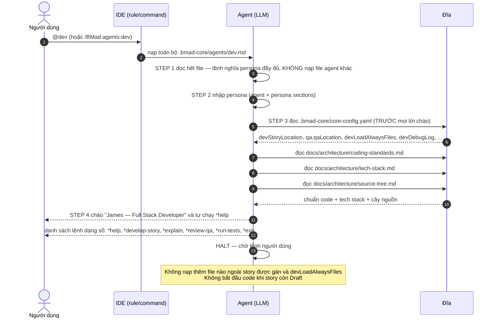
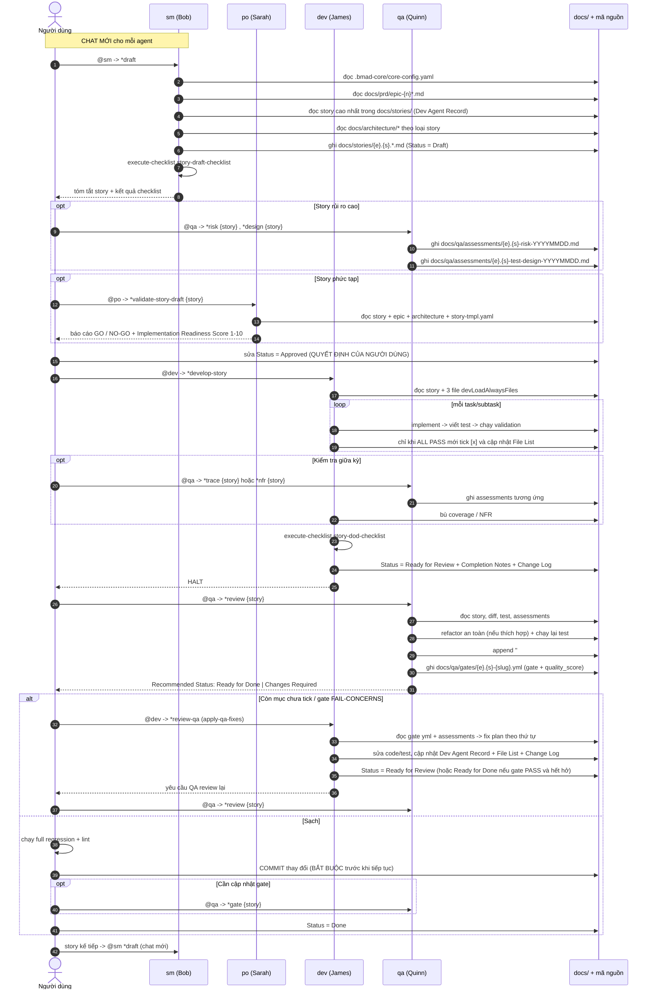
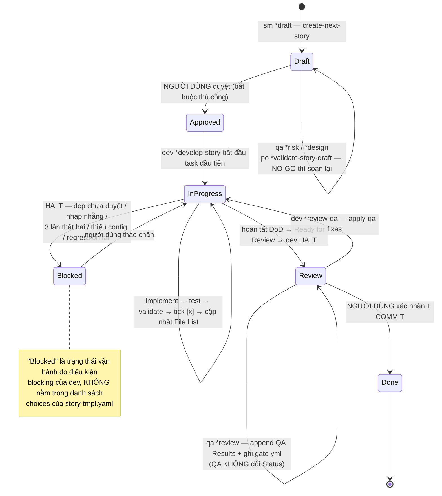
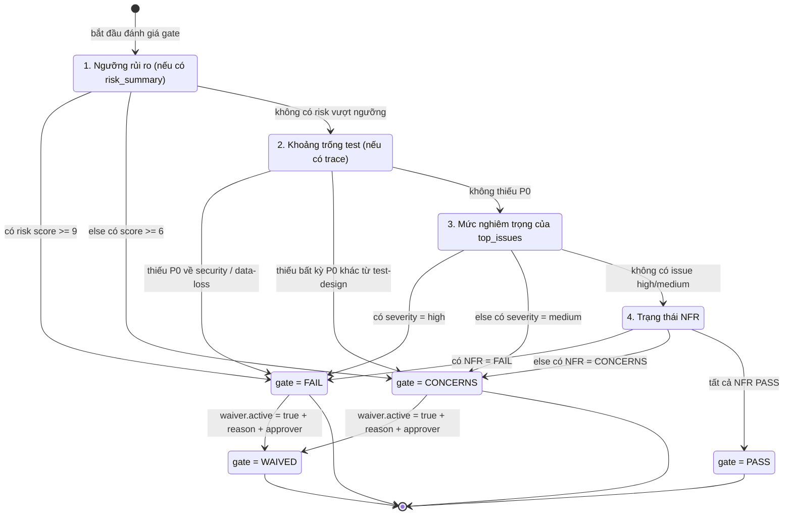
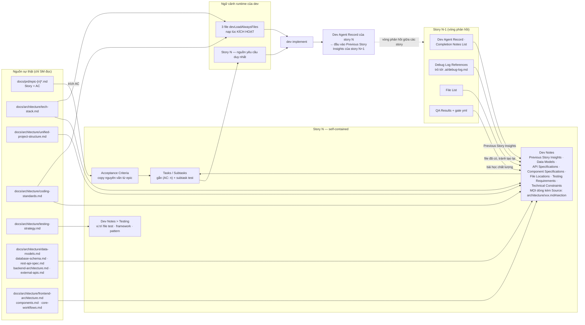
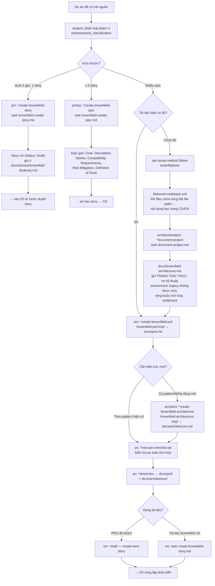
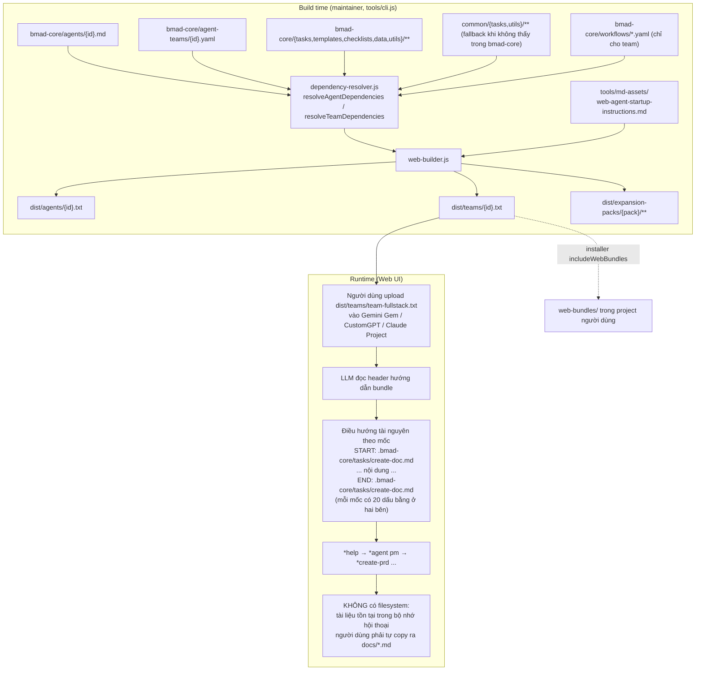

# LUỒNG DỮ LIỆU ĐẦU–CUỐI — BMAD-METHOD™ v4.44.2

Tài liệu này truy vết **dữ liệu, artifact và trạng thái** đi qua hệ thống BMAD-METHOD từ khoảnh khắc đầu tiên (người dùng chạy installer, banner chào mừng, lời chào của agent) đến khoảnh khắc cuối (mọi story trong mọi epic đã `Done`, epic retrospective, dự án hoàn thành).

Mọi đường dẫn, tên lệnh, tên trường trong tài liệu được xác minh trực tiếp từ mã nguồn và tài nguyên của repository `BMAD-METHOD` v4.44.2.

---

## Mục lục

1. [Phạm vi, quy ước và ký hiệu](#1-phạm-vi-quy-ước-và-ký-hiệu)
2. [Sơ đồ tổng quan luồng dữ liệu end-to-end](#2-sơ-đồ-tổng-quan-luồng-dữ-liệu-end-to-end)
3. [Sổ đăng ký artifact](#3-sổ-đăng-ký-artifact)
4. [G0 — Cài đặt và khởi tạo](#4-g0--cài-đặt-và-khởi-tạo)
   - 4.1 [Luồng cài đặt installer](#41-luồng-cài-đặt-installer-sequence-diagram)
   - 4.2 [Các bước G0](#42-các-bước-g0)
   - 4.3 [Luồng kích hoạt agent và lời chào](#43-luồng-kích-hoạt-agent-và-lời-chào-sequence-diagram)
5. [G1 — Hoạch định](#5-g1--hoạch-định)
6. [G2 — Chuyển pha và sharding](#6-g2--chuyển-pha-và-sharding)
7. [G3 — Vòng lặp phát triển](#7-g3--vòng-lặp-phát-triển)
   - 7.1 [Sequence diagram một vòng story hoàn chỉnh](#71-sequence-diagram-một-vòng-story-hoàn-chỉnh)
   - 7.2 [Các bước G3](#72-các-bước-g3)
   - 7.3 [State machine trạng thái story](#73-state-machine-trạng-thái-story)
   - 7.4 [State machine quyết định gate](#74-state-machine-quyết-định-gate)
8. [G4 — Kết thúc epic và kết thúc dự án](#8-g4--kết-thúc-epic-và-kết-thúc-dự-án)
9. [Ma trận đọc/ghi (CRUD) agent × artifact](#9-ma-trận-đọcghi-crud-agent--artifact)
10. [Luồng dữ liệu ngữ cảnh (context flow)](#10-luồng-dữ-liệu-ngữ-cảnh-context-flow)
11. [Luồng dữ liệu nhánh brownfield](#11-luồng-dữ-liệu-nhánh-brownfield)
12. [Luồng dữ liệu của bundle web](#12-luồng-dữ-liệu-của-bundle-web)
13. [Bảng điểm dừng bắt buộc (human-in-the-loop gates)](#13-bảng-điểm-dừng-bắt-buộc-human-in-the-loop-gates)
14. [Bảng bất biến dữ liệu (data invariants)](#14-bảng-bất-biến-dữ-liệu-data-invariants)
15. [Điểm không nhất quán phát hiện trong repository](#15-điểm-không-nhất-quán-phát-hiện-trong-repository)
16. [Tham chiếu chéo](#16-tham-chiếu-chéo)

---

## 1. Phạm vi, quy ước và ký hiệu

### 1.1 Phạm vi

| Trong phạm vi | Ngoài phạm vi |
|---|---|
| Luồng dữ liệu của tooling Node.js: installer, web-builder, flattener | Nội dung nghiệp vụ cụ thể của dự án người dùng |
| Luồng artifact tài liệu: brief → PRD → architecture → shard → story → code → gate | Chi tiết prompt engineering nội bộ của LLM |
| Trạng thái story, quyết định gate, quyền ghi theo section | Expansion pack (chỉ nêu điểm móc nối) |
| Điểm dừng chờ người dùng, bất biến dữ liệu | Nhánh v6 alpha (repo này là v4 frozen) |

### 1.2 Quy ước

- `bmad-core/...` = đường dẫn **trong repository nguồn**.
- `.bmad-core/...` = đường dẫn **trong project của người dùng** sau khi cài đặt.
- `{root}` = placeholder trong tài nguyên nguồn; installer/web-builder thay thế thành `.bmad-core` (hoặc `.<pack-id>` cho expansion pack).
- `docs/...` = đường dẫn artifact trong project người dùng, mặc định theo `bmad-core/core-config.yaml`.
- `*command` = lệnh nội bộ của agent (bắt buộc tiền tố `*`). `@agent` hoặc `/BMad:agents:agent` = cú pháp gọi agent của IDE (`slashPrefix: BMad`).
- **HALT** = agent dừng hẳn, chờ đầu vào người dùng, không tự tiếp tục.

### 1.3 Giá trị cấu hình nền (`bmad-core/core-config.yaml`)

| Khóa | Giá trị | Ai đọc |
|---|---|---|
| `markdownExploder` | `true` | task `shard-doc` |
| `qa.qaLocation` | `docs/qa` | qa (mọi task), dev (`apply-qa-fixes`) |
| `prd.prdFile` | `docs/prd.md` | pm, po, sm |
| `prd.prdVersion` | `v4` | sm |
| `prd.prdSharded` | `true` (installer có thể ghi lại) | sm, po |
| `prd.prdShardedLocation` | `docs/prd` | sm |
| `prd.epicFilePattern` | `epic-{n}*.md` | sm |
| `architecture.architectureFile` | `docs/architecture.md` | architect, po, sm |
| `architecture.architectureVersion` | `v4` | sm |
| `architecture.architectureSharded` | `true` (installer có thể ghi lại) | sm |
| `architecture.architectureShardedLocation` | `docs/architecture` | sm |
| `customTechnicalDocuments` | `null` | sm |
| `devLoadAlwaysFiles` | `docs/architecture/coding-standards.md`, `docs/architecture/tech-stack.md`, `docs/architecture/source-tree.md` | **dev, lúc kích hoạt** |
| `devDebugLog` | `.ai/debug-log.md` | dev |
| `devStoryLocation` | `docs/stories` | sm, dev, qa, po |
| `slashPrefix` | `BMad` | ide-setup (sinh đường dẫn command) |

---

## 2. Sơ đồ tổng quan luồng dữ liệu end-to-end

```mermaid
flowchart TD
    subgraph G0["G0 — Cài đặt và khởi tạo"]
        A0["npx bmad-method install"] --> A1["banner ASCII + version + cảnh báo v4 frozen"]
        A1 --> A2["hỏi directory / thành phần / sharding / IDE / web bundles"]
        A2 --> A3["copy bmad-core + common + 3 file docs<br/>thay {root} = .bmad-core"]
        A3 --> A4[".bmad-core/ + core-config.yaml<br/>+ file rule của IDE<br/>+ install-manifest.yaml"]
        A4 --> A5["kích hoạt agent: đọc agent .md<br/>nạp core-config.yaml → chào → *help → HALT"]
    end

    subgraph G1["G1 — Hoạch định (Web UI hoặc IDE)"]
        B1["analyst: *brainstorm / *perform-market-research<br/>/ *create-competitor-analysis"] --> B2["analyst: *create-project-brief<br/>→ project brief"]
        B2 --> B3["pm: *create-prd<br/>→ docs/prd.md (FR/NFR/Epic/Story)"]
        B3 --> B4["ux-expert: *create-front-end-spec<br/>→ docs/front-end-spec.md"]
        B4 --> B5["ux-expert: *generate-ui-prompt (tùy chọn)"]
        B5 --> B6["architect: *create-full-stack-architecture<br/>→ docs/architecture.md"]
        B6 --> B7["qa: *risk / *design sớm (tùy chọn)"]
        B7 --> B8["po: *execute-checklist-po<br/>po-master-checklist"]
        B8 -->|"lệch"| B3
    end

    subgraph G2["G2 — Chuyển pha và sharding (chỉ trong IDE)"]
        C1["copy docs/prd.md + docs/architecture.md vào project"] --> C2["po: *shard-doc<br/>md-tree explode"]
        C2 --> C3["docs/prd/*.md (epic-{n}*.md + index.md)<br/>docs/architecture/*.md (+ index.md)"]
    end

    subgraph G3["G3 — Vòng lặp phát triển (một story mỗi lượt)"]
        D1["sm: *draft — create-next-story"] --> D2["docs/stories/{e}.{s}.*.md<br/>Status = Draft"]
        D2 --> D3["qa: *risk + *design (tùy chọn)<br/>po: *validate-story-draft (tùy chọn)"]
        D3 --> D4{"Người dùng duyệt?"}
        D4 -->|"Approved"| D5["dev: *develop-story"]
        D4 -->|"Cần sửa"| D1
        D5 --> D6["mã nguồn + test<br/>+ Dev Agent Record + File List"]
        D6 --> D7["qa: *trace / *nfr giữa kỳ (tùy chọn)"]
        D7 --> D8["Status = Review"]
        D8 --> D9{"Yêu cầu QA review?"}
        D9 -->|"Có"| D10["qa: *review → QA Results<br/>+ docs/qa/gates/*.yml"]
        D9 -->|"Không"| D12
        D10 --> D11{"gate / checklist còn hở?"}
        D11 -->|"Có"| D5b["dev: *review-qa — apply-qa-fixes"]
        D5b --> D10
        D11 -->|"Không"| D12["người dùng: chạy full regression + COMMIT"]
        D12 --> D13["Status = Done"]
        D13 --> D14{"Còn story trong epic?"}
        D14 -->|"Còn"| D1
    end

    subgraph G4["G4 — Kết thúc"]
        E1["hết epic: xác nhận epic kế tiếp"] --> E2["po: epic retrospective (tùy chọn,<br/>CHƯA có task chính thức)"]
        E2 --> E3["mọi story Done trong mọi epic<br/>→ Project Complete"]
    end

    A5 --> B1
    B8 --> C1
    C3 --> D1
    D14 -->|"Hết"| E1
```



---

## 3. Sổ đăng ký artifact

Ký hiệu: **C** = tạo, **R** = đọc, **U** = sửa.

| # | Artifact / đường dẫn | Agent/công cụ tạo (C) | Agent đọc (R) | Agent sửa (U) | Thời điểm sinh | Định dạng |
|---|---|---|---|---|---|---|
| 1 | `.bmad-core/**` (agents, tasks, templates, checklists, data, workflows, agent-teams, utils) | installer (`performFreshInstall`) | mọi agent | installer khi update/repair | G0 | Markdown + YAML |
| 2 | `.bmad-core/core-config.yaml` | installer (copy) | **mọi agent lúc kích hoạt** | installer (`modifyCoreConfig`), người dùng | G0 | YAML |
| 3 | `.bmad-core/install-manifest.yaml` | `file-manager.createManifest` | installer (`detectInstallationState`, `checkFileIntegrity`) | installer | cuối G0 | YAML |
| 4 | `.bmad-core/user-guide.md`, `.bmad-core/enhanced-ide-development-workflow.md`, `.bmad-core/working-in-the-brownfield.md` | installer (`copyDocsItems`) | người dùng, bmad-master (KB) | – | G0 | Markdown |
| 5 | File rule/command của IDE: `.claude/commands/BMad/**`, `.cursor/rules/bmad/**`, `.gemini/commands/BMad/**`, `.qwen/commands/BMad/**`, `.iflow/commands/BMad/**`, `.crush/commands/BMad/**`, `.windsurf/workflows/**`, `.trae/rules/**`, `.clinerules/**`, `.github/chatmodes/**` + `.vscode/settings.json`, `.roomodes`, `.kilocodemodes`, `AGENTS.md`, `opencode.jsonc`, `.augment/commands/bmad/**` | `ide-setup.js` | IDE | ide-setup lần cài sau | G0 | MD / TOML / JSON / JSONC |
| 6 | `dist/agents/*.txt`, `dist/teams/*.txt`, `dist/expansion-packs/**` | `tools/cli.js` → `web-builder.js` | LLM trên Web UI | web-builder (rebuild) | trước G1 (do maintainer build) | Text bundle |
| 7 | `web-bundles/**` trong project | installer (`installWebBundles`) | người dùng (upload) | installer | G0 (tùy chọn) | Text bundle |
| 8 | `flattened-codebase.xml` | `npx bmad-method flatten` (`tools/flattener/`) | analyst / architect / pm trên Web UI | rerun flatten | G1 nhánh brownfield | XML + CDATA |
| 9 | `docs/brainstorming-session-results.md` | analyst `*brainstorm` | pm | analyst | G1 | Markdown |
| 10 | `docs/market-research.md` | analyst `*perform-market-research` | pm | analyst | G1 | Markdown |
| 11 | `docs/competitor-analysis.md` | analyst `*create-competitor-analysis` | pm | analyst | G1 | Markdown |
| 12 | `docs/brief.md` (workflow gọi là `docs/project-brief.md`) | analyst `*create-project-brief` | pm, po | analyst | G1 | Markdown |
| 13 | `docs/prd.md` | pm `*create-prd` (hoặc `*create-brownfield-prd`) | ux-expert, architect, po, sm | pm | G1 | Markdown (FR/NFR/Epic/Story) |
| 14 | `docs/front-end-spec.md` | ux-expert `*create-front-end-spec` | architect, po | ux-expert | G1 | Markdown |
| 15 | Prompt AI UI cho v0/Lovable | ux-expert `*generate-ui-prompt` | công cụ ngoài | – | G1 (tùy chọn) | Text |
| 16 | `docs/architecture.md` (template fullstack / backend / brownfield đều xuất về tên này); front-end riêng: `docs/ui-architecture.md` | architect `*create-*-architecture` | po, sm | architect | G1 | Markdown |
| 17 | `docs/brownfield-architecture.md` | architect/analyst `*document-project` | pm, po, sm | architect | G1 brownfield | Markdown |
| 18 | `docs/prd/index.md` + `docs/prd/epic-{n}*.md` + các shard khác | po `*shard-doc` (md-tree explode) | sm | po (reshard) | G2 | Markdown |
| 19 | `docs/architecture/index.md` + `coding-standards.md`, `tech-stack.md`, `source-tree.md`, `unified-project-structure.md`, `testing-strategy.md`, `data-models.md`, … | po `*shard-doc` | sm (theo loại story), **dev (3 file devLoadAlwaysFiles)** | po (reshard) | G2 | Markdown |
| 20 | `docs/stories/{epicNum}.{storyNum}.*.md` | sm `*draft` | dev, qa, po, sm (story kế tiếp) | dev (section được phép), qa (chỉ QA Results) | G3 mỗi vòng | Markdown theo `story-tmpl.yaml` |
| 21 | Mã nguồn + test của dự án | dev `*develop-story` | qa (`*review`) | dev, qa (refactor an toàn) | G3 | tùy tech stack |
| 22 | `.ai/debug-log.md` (`devDebugLog`) | dev | dev, sm (qua Debug Log References) | dev | G3 khi lỗi lặp | Markdown |
| 23 | `docs/qa/assessments/{epic}.{story}-risk-{YYYYMMDD}.md` | qa `*risk-profile` | dev (`apply-qa-fixes`), qa `*review` | qa (bản mới theo ngày) | G3 (tùy chọn) | Markdown |
| 24 | `docs/qa/assessments/{epic}.{story}-test-design-{YYYYMMDD}.md` | qa `*test-design` | dev, qa `*trace` | qa | G3 (tùy chọn) | Markdown |
| 25 | `docs/qa/assessments/{epic}.{story}-trace-{YYYYMMDD}.md` | qa `*trace` | dev, qa `*review` | qa | G3 (tùy chọn) | Markdown |
| 26 | `docs/qa/assessments/{epic}.{story}-nfr-{YYYYMMDD}.md` | qa `*nfr-assess` | dev, qa `*review` | qa | G3 (tùy chọn) | Markdown |
| 27 | `docs/qa/gates/{epic}.{story}-{slug}.yml` | qa `*review` / `*gate` (template `qa-gate-tmpl.yaml`) | dev (`apply-qa-fixes`), người dùng | **chỉ qa** | G3 | YAML `schema: 1` |
| 28 | `docs/index.md` | task `index-docs` (bmad-master) | người dùng | bmad-master | bất kỳ lúc nào | Markdown |
| 29 | `epic-retrospective.md` | po (workflow khai báo) — **chưa có task chính thức** | – | – | G4 (tùy chọn) | Markdown |

---

## 4. G0 — Cài đặt và khởi tạo

### 4.1 Luồng cài đặt installer (sequence diagram)

```mermaid
sequenceDiagram
    autonumber
    actor U as Người dùng
    participant CLI as bin/bmad.js
    participant INS as lib/installer.js
    participant FM as lib/file-manager.js
    participant IDE as lib/ide-setup.js
    participant FS as Đĩa (project)

    U->>CLI: npx bmad-method install
    CLI->>CLI: promptInstallation()
    CLI-->>U: banner ASCII BMAD-METHOD + "Installer vX.Y.Z"
    CLI-->>U: cảnh báo "v4 stable but frozen" + gợi ý v6 alpha
    CLI->>U: hỏi đường dẫn project directory
    U-->>CLI: directory
    CLI->>INS: detectInstallationState(installDir)
    INS->>FM: pathExists .bmad-core/install-manifest.yaml
    FM->>FS: đọc manifest nếu có
    FS-->>FM: nội dung / không có
    FM-->>INS: manifest hoặc null
    INS-->>CLI: state = clean | v4_existing | v3_existing | unknown_existing
    CLI->>INS: getAvailableExpansionPacks()
    CLI-->>U: checkbox chọn bmad-core + expansion packs
    CLI-->>U: hỏi prdSharded? architectureSharded?
    Note over CLI,U: Nếu architectureSharded = false thì cảnh báo devLoadAlwaysFiles và hỏi acknowledge; không đồng ý -> exit
    CLI-->>U: multiselect 16 IDE
    Note over CLI,U: github-copilot / opencode / auggie-cli có prompt cấu hình riêng ngay tại đây
    CLI-->>U: hỏi include web bundles? loại bundle? thư mục?
    CLI->>INS: install(answers)

    INS->>FM: copyDirectoryWithRootReplacement(bmad-core, .bmad-core, ".bmad-core")
    FM->>FS: ghi .bmad-core/** và thay {root} trong .md/.yaml/.yml
    INS->>FS: copyCommonItems() — common/** -> .bmad-core/**
    INS->>FS: copyDocsItems() — user-guide.md, enhanced-ide-development-workflow.md, working-in-the-brownfield.md
    INS->>FS: findFiles('**/*') trong .bmad-core -> danh sách files cho manifest
    INS->>INS: installExpansionPacks() -> .<pack-id>/
    INS->>FS: installWebBundles() -> web-bundles/ (nếu chọn)
    loop mỗi IDE đã chọn
        INS->>IDE: setup(ide, installDir, ...)
        IDE->>FS: ghi file rule/command/chatmode/AGENTS.md/opencode.jsonc
    end
    INS->>FM: modifyCoreConfig(installDir, config)
    FM->>FS: ghi lại .bmad-core/core-config.yaml với prdSharded/architectureSharded
    INS->>FM: createManifest(installDir, config, files)
    FM->>FS: sha256 từng file (16 hex đầu) -> .bmad-core/install-manifest.yaml
    INS-->>U: "✓ BMad Method installed successfully!" + hướng dẫn IDE + nhắc đọc user-guide.md
```

### 4.2 Các bước G0

#### G0.1 — Khởi chạy installer và banner chào mừng

| Mục | Nội dung |
|---|---|
| **Trigger** | `npx bmad-method install` (hoặc `npx bmad-method install -f -i claude-code`) |
| **Input** | `tools/installer/package.json` → `version`, `name`; `bmad-core/core-config.yaml` → `short-title` (không có trong file v4.44.2 nên fallback `BMad Agile Core System`) |
| **Xử lý** | `promptInstallation()` in banner ASCII `BMAD-METHOD` (chuỗi ký tự khối, cùng nội dung với `tools/shared/bannerArt.js` → `BMAD_LARGE`), dòng `🚀 Universal AI Agent Framework for Any Domain`, `✨ Installer v{version}`, khối cảnh báo `⚠️ You are installing BMad v4 (stable but frozen)` + gợi ý `npx bmad-method@alpha install` |
| **Output** | Chỉ stdout — **chưa ghi file nào** |
| **State change** | Không |
| **Điều kiện sang bước sau** | Luôn tiếp tục sang prompt directory |

#### G0.2 — Thu thập câu trả lời cấu hình

| Mục | Nội dung |
|---|---|
| **Trigger** | Sau banner |
| **Input** | stdin của người dùng; `installer.getAvailableExpansionPacks()`; `installer.getAvailableTeams()` (nếu chọn web bundle theo team) |
| **Xử lý** | Thứ tự prompt cố định: (1) `directory` (default `path.resolve('.')`), (2) `detectInstallationState()`, (3) checkbox thành phần (bmad-core + expansion packs, nhãn hiển thị `(v cũ → v mới)` nếu đã có), (4) `prdSharded` (default `true`), (5) `architectureSharded` (default `true`), (6) multiselect 16 IDE: cursor, claude-code, iflow-cli, windsurf, trae, roo, kilo, cline, gemini, qwen-code, crush, github-copilot, auggie-cli, codex, codex-web, opencode, (7) cấu hình riêng cho `github-copilot` / `opencode` / `auggie-cli`, (8) web bundles + thư mục đích |
| **Output** | Object `answers` trong bộ nhớ tiến trình |
| **State change** | `answers.installType` = `full` \| `expansion-only`; `state.type` xác định nhánh install/update/repair |
| **Điều kiện HALT** | `architectureSharded = false` và người dùng **không** `acknowledge` → in `Installation cancelled.` và `process.exit(0)`; chọn 0 IDE mà không confirm → quay lại bước chọn IDE |

#### G0.3 — Phát hiện trạng thái cài đặt

| Mục | Nội dung |
|---|---|
| **Trigger** | Nội bộ, ngay sau prompt `directory` |
| **Input** | `{installDir}/.bmad-core/install-manifest.yaml`, `{installDir}/bmad-agent/`, `{installDir}/.bmad-core/`, glob `**/*` (bỏ `.git`, `node_modules`), các thư mục dot `.*` |
| **Xử lý** | Theo thứ tự: có manifest → `v4_existing` (đọc luôn manifest); có `bmad-agent/` → `v3_existing`; có `.bmad-core/` không manifest → `unknown_existing`; còn lại → `clean` (kèm cờ `hasOtherFiles`) |
| **Output** | `state = { type, hasV4Manifest, hasV3Structure, hasBmadCore, hasOtherFiles, manifest, expansionPacks }` |
| **State change** | Quyết định nhánh: `performFreshInstall` \| `performUpdate` \| `performRepair` \| `performReinstall` \| `handleUnknownInstallation` |
| **Điều kiện sang bước sau** | `clean` → fresh install; `v4_existing` → so version + `checkFileIntegrity` (sha256 16 hex) rồi hỏi update/repair/reinstall |

#### G0.4 — Ghi `.bmad-core/` vào project

| Mục | Nội dung |
|---|---|
| **Trigger** | `installer.performFreshInstall(config, installDir, spinner)` |
| **Input** | `bmad-core/**` (10 agent, 21 task, 13 template, 6 checklist, 6 data, 6 workflow, 4 agent-team), `common/**` (`tasks/create-doc.md`, `tasks/execute-checklist.md`, `utils/bmad-doc-template.md`, `utils/workflow-management.md`), `docs/{user-guide.md, enhanced-ide-development-workflow.md, working-in-the-brownfield.md}` |
| **Xử lý** | `copyDirectoryWithRootReplacement()` copy toàn bộ, thay `{root}` → `.bmad-core` **chỉ** cho phần mở rộng `.md`, `.yaml`, `.yml` (file > 5 MB xử lý bằng stream Transform); `copyCommonItems()` và `copyDocsItems()` cũng thay `{root}` |
| **Output** | `{installDir}/.bmad-core/**` — bao gồm `core-config.yaml`, `agents/*.md`, `tasks/*.md`, `templates/*.yaml`, `checklists/*.md`, `data/*.md`, `workflows/*.yaml`, `agent-teams/*.yaml`, `utils/*.md`, 3 file docs |
| **State change** | Project chuyển từ "chưa có BMAD" sang "có framework" |
| **Điều kiện sang bước sau** | Thu được `files[]` (glob `**/*` trên thư mục đích) để dựng manifest |

#### G0.5 — Cấu hình IDE

| Mục | Nội dung |
|---|---|
| **Trigger** | Vòng lặp `for (const ide of ides)` trong `performFreshInstall` |
| **Input** | `.bmad-core/agents/*.md`, `.bmad-core/tasks/*.md`, `tools/installer/config/install.config.yaml` (`rule-dir`, `format`), `tools/installer/config/ide-agent-config.yaml` (`roo-permissions` fileRegex, `cline-order`) |
| **Xử lý** | Sinh file dẫn tham chiếu tới định nghĩa agent gốc, **không nhân bản logic agent**. Ví dụ Gemini CLI ghi `.gemini/commands/BMad/agents/{id}.toml` chứa `@{.bmad-core/agents/{id}.md}`; Roo ghi mode vào `.roomodes` kèm `fileRegex` hạn chế loại file mỗi agent được sửa; Codex ghi block BMAD vào `AGENTS.md`; OpenCode merge `agent`/`command`/`instructions` vào `opencode.jsonc` |
| **Output** | Xem mục 3 hàng #5 |
| **State change** | IDE có thể gọi `@sm`, `/BMad:agents:dev`, `*task create-next-story`… |
| **Điều kiện sang bước sau** | Không bắt buộc; nếu chọn 0 IDE thì in `No IDE configuration was set up.` |

#### G0.6 — Ghi lại core-config và tạo manifest

| Mục | Nội dung |
|---|---|
| **Trigger** | Cuối `performFreshInstall` |
| **Input** | `.bmad-core/core-config.yaml`; `config.prdSharded`, `config.architectureSharded`; `files[]` |
| **Xử lý** | `modifyCoreConfig()` đọc YAML, set `coreConfig.prd.prdSharded` và `coreConfig.architecture.architectureSharded`, `yaml.dump` ghi lại. Sau đó `createManifest()` đọc `version` từ `package.json` gốc, hash sha256 từng file rồi cắt 16 ký tự hex đầu |
| **Output** | `.bmad-core/core-config.yaml` (đã cập nhật) và `.bmad-core/install-manifest.yaml` với các trường `version`, `installed_at` (ISO-8601), `install_type`, `agent`, `ides_setup[]`, `expansion_packs[]`, `files[] = {path, hash, modified:false}` |
| **State change** | Cài đặt trở thành "có thể kiểm toán": lần chạy installer sau sẽ so hash để phát hiện file bị sửa/mất |
| **Điều kiện sang bước sau** | `showSuccessMessage()` in hướng dẫn IDE + `📖 IMPORTANT: Please read the user guide at docs/user-guide.md` |

> **Lưu ý thứ tự quan trọng:** `modifyCoreConfig` chạy **trước** `createManifest`, nên hash trong manifest khớp với `core-config.yaml` đã sửa. Ngược lại, `ide-setup` chạy **trước** `createManifest` nhưng `files[]` chỉ được liệt kê từ thư mục `.bmad-core` → **file rule của IDE không nằm trong manifest** và không được kiểm tra tính toàn vẹn.

### 4.3 Luồng kích hoạt agent và lời chào (sequence diagram)

Giao thức này giống nhau cho cả 10 agent lõi (đối chiếu `bmad-core/agents/dev.md:19-35`, `sm.md:19-32`, `qa.md:19-32`, `po.md:19-32`). Riêng `dev` có thêm bước nạp `devLoadAlwaysFiles`.



| Mục | Nội dung |
|---|---|
| **Trigger** | `@{agent}` / `/BMad:agents:{agent}` / upload bundle `dist/teams/*.txt` + `*agent dev` |
| **Input** | `.bmad-core/agents/{id}.md` (toàn bộ), `.bmad-core/core-config.yaml`, riêng dev thêm 3 file `devLoadAlwaysFiles` |
| **Xử lý** | 4 STEP như sơ đồ; `agent.customization` luôn thắng mọi chỉ dẫn xung đột; task có `elicit=true` không được bỏ qua |
| **Output** | Không ghi file — chỉ ngữ cảnh phiên và lời chào + `*help` |
| **State change** | Phiên chuyển sang persona đã chọn |
| **Điều kiện HALT** | Sau lời chào + `*help`, agent **HALT** trừ khi lệnh được truyền kèm lúc kích hoạt |

---

## 5. G1 — Hoạch định

Có thể chạy trên Web UI (bundle `dist/teams/team-fullstack.txt`) hoặc trong IDE. Trên Web UI **không có filesystem**: agent giữ tài liệu trong bộ nhớ hội thoại và yêu cầu người dùng tự copy ra file (`web-agent-startup-instructions.md`: *"You have no file system to write to"*).

Handoff chuẩn lấy từ `bmad-core/workflows/greenfield-fullstack.yaml` → `handoff_prompts`.

#### G1.1 — Nghiên cứu đầu vào (tùy chọn)

| Mục | Nội dung |
|---|---|
| **Trigger** | `@analyst` + `*brainstorm {topic}` \| `*perform-market-research` \| `*create-competitor-analysis` \| `*research-prompt {topic}` |
| **Input** | Ý tưởng của người dùng; `.bmad-core/data/brainstorming-techniques.md`; template tương ứng |
| **Xử lý** | `*brainstorm` chạy `facilitate-brainstorming-session.md` với `brainstorming-output-tmpl.yaml`; hai lệnh còn lại chạy `create-doc.md` + template — mỗi section `elicit: true` là HARD STOP với menu 1-9 |
| **Output** | `docs/brainstorming-session-results.md`, `docs/market-research.md`, `docs/competitor-analysis.md` |
| **State change** | Không có state hình thức; kết quả là đầu vào ngữ cảnh cho brief |
| **Điều kiện sang bước sau** | Người dùng chọn tiếp tục; không bắt buộc |

#### G1.2 — Project brief

| Mục | Nội dung |
|---|---|
| **Trigger** | `@analyst` + `*create-project-brief` |
| **Input** | `project-brief-tmpl.yaml`; các tài liệu nghiên cứu ở G1.1 (nếu có) |
| **Xử lý** | `create-doc.md` chạy tuần tự section; mỗi section `elicit: true` → trình bày nội dung + rationale + menu 1-9 rồi **chờ** |
| **Output** | `docs/brief.md` (template) — workflow và handoff prompt gọi tên `docs/project-brief.md` |
| **State change** | Artifact #12 tồn tại |
| **Điều kiện sang bước sau** | `analyst_to_pm`: *"Project brief is complete. Save it as docs/project-brief.md in your project, then create the PRD."* |

#### G1.3 — PRD

| Mục | Nội dung |
|---|---|
| **Trigger** | `@pm` + `*create-prd` |
| **Input** | `docs/brief.md`; `prd-tmpl.yaml`; `.bmad-core/data/technical-preferences.md` |
| **Xử lý** | `create-doc.md` + `prd-tmpl.yaml`: sinh Goals, Requirements (FR/NFR), UI Design Goals, Technical Assumptions, **Epic List** rồi từng **Epic Details** với Story + Acceptance Criteria đánh số |
| **Output** | `docs/prd.md` — nguồn duy nhất của epic và AC cho toàn bộ G3 |
| **State change** | Backlog logic được xác lập (epic 1..N, story 1..M mỗi epic) |
| **Điều kiện sang bước sau** | `pm_to_ux`: *"PRD is ready. Save it as docs/prd.md in your project, then create the UI/UX specification."* |

#### G1.4 — Đặc tả UI/UX (dự án có frontend)

| Mục | Nội dung |
|---|---|
| **Trigger** | `@ux-expert` + `*create-front-end-spec`; tùy chọn `*generate-ui-prompt` |
| **Input** | `docs/prd.md`; `front-end-spec-tmpl.yaml`; (cho prompt AI) `generate-ai-frontend-prompt.md` |
| **Xử lý** | Sinh IA, user flow, component library, branding, a11y, responsive; `*generate-ui-prompt` đóng gói spec thành prompt cho v0/Lovable |
| **Output** | `docs/front-end-spec.md`; prompt AI UI (text, người dùng dán sang công cụ ngoài) |
| **State change** | Không |
| **Điều kiện sang bước sau** | `ux_to_architect`: *"UI/UX spec complete. Save it as docs/front-end-spec.md in your project, then create the fullstack architecture."* |

#### G1.5 — Kiến trúc

| Mục | Nội dung |
|---|---|
| **Trigger** | `@architect` + `*create-full-stack-architecture` (hoặc `*create-backend-architecture` / `*create-front-end-architecture` / `*create-brownfield-architecture`) |
| **Input** | `docs/prd.md`, `docs/front-end-spec.md`, `.bmad-core/data/technical-preferences.md`, template kiến trúc tương ứng; nếu người dùng đã sinh UI bằng v0/Lovable thì thêm cấu trúc project tải về |
| **Xử lý** | Sinh Tech Stack, Data Models, API Spec, Components, Core Workflows, Database Schema, **Unified Project Structure**, **Coding Standards**, **Testing Strategy**, Source Tree — chính là các section sau này bị shard thành file mà sm và dev đọc |
| **Output** | `docs/architecture.md` (`architecture-tmpl`, `fullstack-architecture-tmpl`, `brownfield-architecture-tmpl` đều khai báo `filename: docs/architecture.md`); `front-end-architecture-tmpl` xuất `docs/ui-architecture.md` |
| **State change** | Nguồn sự thật kỹ thuật tồn tại; từ đây mọi Dev Notes phải trích từ đây |
| **Điều kiện sang bước sau** | `architect_review`: hỏi có cần đổi story trong PRD không → nếu có, `architect_to_pm` yêu cầu pm cập nhật và **re-export toàn bộ `prd.md`** |

#### G1.6 — Chiến lược test sớm (tùy chọn)

| Mục | Nội dung |
|---|---|
| **Trigger** | `@qa` + `*risk {story}` / `*design {story}` trên epic/story mức cao |
| **Input** | `docs/prd.md`, `docs/architecture.md`, `.bmad-core/data/test-levels-framework.md`, `test-priorities-matrix.md` |
| **Xử lý** | `risk-profile.md` tính probability × impact; `test-design.md` phân tầng unit/integration/e2e và gán P0..P3 |
| **Output** | `docs/qa/assessments/{epic}.{story}-risk-{YYYYMMDD}.md`, `…-test-design-{YYYYMMDD}.md` |
| **State change** | Không đổi trạng thái story; tạo dữ liệu để gate sau này áp ngưỡng |
| **Điều kiện sang bước sau** | Không bắt buộc |

#### G1.7 — PO validate toàn bộ artifact

| Mục | Nội dung |
|---|---|
| **Trigger** | `@po` + `*execute-checklist-po` |
| **Input** | `docs/brief.md`, `docs/prd.md`, `docs/front-end-spec.md`, `docs/architecture.md`; `.bmad-core/checklists/po-master-checklist.md` |
| **Xử lý** | `execute-checklist.md` chạy từng mục checklist, đối chiếu chéo tính nhất quán, đầy đủ, thứ tự phụ thuộc |
| **Output** | Báo cáo checklist trong hội thoại (không có file cố định); danh sách tài liệu cần sửa |
| **State change** | Cổng "kế hoạch đã nhất quán" |
| **Điều kiện sang bước sau** | Không còn issue → `complete`: *"All planning artifacts validated and saved in docs/ folder. Move to IDE environment to begin development."* Còn issue → `po_issues` quay lại agent tương ứng (vòng lặp G1.3–G1.7) |

---

## 6. G2 — Chuyển pha và sharding

#### G2.1 — Đưa tài liệu vào project và chuyển sang IDE

| Mục | Nội dung |
|---|---|
| **Trigger** | Người dùng thao tác thủ công sau khi PO thông qua |
| **Input** | Nội dung `prd.md` và `architecture.md` (nếu làm trên Web UI thì nằm trong hội thoại) |
| **Xử lý** | Copy/paste hoặc lưu file vào `docs/` của project; mở project trong IDE đã cấu hình ở G0.5 |
| **Output** | `docs/prd.md`, `docs/architecture.md` trong repo dự án |
| **State change** | Môi trường chuyển từ Web UI (không filesystem) sang IDE (có filesystem) |
| **Điều kiện sang bước sau** | Hai file phải tồn tại đúng vị trí `prd.prdFile` / `architecture.architectureFile` |

#### G2.2 — Sharding

| Mục | Nội dung |
|---|---|
| **Trigger** | `@po` + `*shard-doc docs/prd.md docs/prd`, sau đó `*shard-doc docs/architecture.md docs/architecture` (tương đương `@pm *shard-prd`, `@architect *shard-prd`, `@bmad-master *shard-doc`) |
| **Input** | `.bmad-core/core-config.yaml` → `markdownExploder`; `docs/prd.md`; `docs/architecture.md` |
| **Xử lý** | `markdownExploder: true` → chạy `md-tree explode {input} {output}` (gói `@kayvan/markdown-tree-parser`). Cắt theo heading cấp 2, hạ cấp heading (`##` → `#`, `###` → `##`…), sinh `index.md` liệt kê link. Nếu lệnh không có → **STOP**, yêu cầu `npm install -g @kayvan/markdown-tree-parser` hoặc đặt `markdownExploder: false`. Chỉ khi `markdownExploder: false` mới được shard thủ công |
| **Output** | `docs/prd/index.md` + các shard, trong đó epic khớp `epicFilePattern: epic-{n}*.md`; `docs/architecture/index.md` + `coding-standards.md`, `tech-stack.md`, `source-tree.md`, `unified-project-structure.md`, `testing-strategy.md`, `data-models.md`, `database-schema.md`, `backend-architecture.md`, `rest-api-spec.md`, `external-apis.md`, `frontend-architecture.md`, `components.md`, `core-workflows.md` (tùy nội dung tài liệu gốc) |
| **State change** | Từ đây `sm` có thể định vị epic; `dev` có 3 file `devLoadAlwaysFiles` để nạp lúc kích hoạt |
| **Điều kiện HALT** | `md-tree` không khả dụng mà `markdownExploder: true` → dừng, không shard thủ công |
| **Điều kiện sang bước sau** | Tồn tại `docs/prd/epic-*.md` và (nếu `architectureSharded: true`) `docs/architecture/index.md` |

> **Bất biến:** không shard trên Web UI. Sharding là thao tác filesystem, chỉ chạy trong IDE.

---

## 7. G3 — Vòng lặp phát triển

### 7.1 Sequence diagram một vòng story hoàn chỉnh



### 7.2 Các bước G3

#### G3.1 — SM soạn story (`create-next-story`)

| Mục | Nội dung |
|---|---|
| **Trigger** | Chat mới → `@sm` → `*draft` |
| **Input (đọc gì, từ đâu)** | ① `.bmad-core/core-config.yaml` → `devStoryLocation`, `prd.*`, `architecture.*`, `workflow.*`. ② epic file: `docs/prd/epic-{n}*.md` (nếu `prdSharded`) hoặc section trong `docs/prd.md`. ③ story số cao nhất trong `docs/stories/` — đọc **Dev Agent Record**: Completion Notes, Debug Log References, sai lệch triển khai, bài học. ④ tài liệu kiến trúc theo loại story: mọi story đọc `tech-stack.md`, `unified-project-structure.md`, `coding-standards.md`, `testing-strategy.md`; backend/API thêm `data-models.md`, `database-schema.md`, `backend-architecture.md`, `rest-api-spec.md`, `external-apis.md`; frontend/UI thêm `frontend-architecture.md`, `components.md`, `core-workflows.md`, `data-models.md`; full-stack đọc cả hai nhóm. ⑤ `story-tmpl.yaml` |
| **Xử lý** | Xác định story kế tiếp; trích **chỉ** thông tin liên quan story hiện tại; kiểm tra khớp `unified-project-structure.md` và ghi lệch vào "Project Structure Notes"; điền template; chạy `execute-checklist story-draft-checklist` |
| **Output (ghi gì, vào đâu)** | `docs/stories/{epicNum}.{storyNum}.*.md` gồm: `Status`, `Story` (As a / I want / so that), `Acceptance Criteria` (copy nguyên từ epic), `Tasks / Subtasks` (checkbox, gắn `(AC: 1, 3)`), `Dev Notes` (Previous Story Insights, Data Models, API Specifications, Component Specifications, File Locations, Testing Requirements, Technical Constraints), `Dev Notes > Testing`, `Change Log`, và các section rỗng `Dev Agent Record`, `QA Results` |
| **State change** | `Status = Draft` |
| **Điều kiện HALT** | Thiếu `.bmad-core/core-config.yaml` → **HALT** với thông báo yêu cầu copy từ GitHub hoặc chạy installer. Story cao nhất chưa `Done` → **ALERT** và hỏi có chấp nhận rủi ro override. Epic đã hết story → hỏi 1) sang epic kế 2) chọn story cụ thể 3) hủy — **NEVER automatically skip to another epic** |
| **Điều kiện sang bước sau** | Story file tồn tại, mọi chi tiết kỹ thuật có `[Source: architecture/{filename}.md#{section}]`, checklist đã chạy |

#### G3.2 — Đánh giá rủi ro và thiết kế test trước khi code (tùy chọn)

| Mục | Nội dung |
|---|---|
| **Trigger** | `@qa` → `*risk {story}` và/hoặc `*design {story}` |
| **Input** | Story draft, `docs/architecture/*`, `test-levels-framework.md`, `test-priorities-matrix.md` |
| **Xử lý** | Sinh ma trận rủi ro (score = probability × impact) và ma trận test theo tầng + độ ưu tiên P0..P3 |
| **Output** | `docs/qa/assessments/{epic}.{story}-risk-{YYYYMMDD}.md`, `docs/qa/assessments/{epic}.{story}-test-design-{YYYYMMDD}.md`, kèm khối YAML để dán vào gate và dòng hook để dán vào story |
| **State change** | Story vẫn `Draft`; dữ liệu này sẽ chi phối quyết định gate ở G3.6 |
| **Điều kiện sang bước sau** | Không bắt buộc |

#### G3.3 — PO validate story draft (tùy chọn)

| Mục | Nội dung |
|---|---|
| **Trigger** | `@po` → `*validate-story-draft {story}` |
| **Input** | `.bmad-core/core-config.yaml`, story file, epic cha, tài liệu kiến trúc, `.bmad-core/templates/story-tmpl.yaml` |
| **Xử lý** | 10 bước: đầy đủ template → cấu trúc file/source tree → UI → thỏa mãn AC → hướng dẫn test → bảo mật → thứ tự task → **chống ảo giác** (mọi tuyên bố kỹ thuật phải truy vết được nguồn) → độ sẵn sàng cho dev → báo cáo |
| **Output** | Báo cáo hội thoại: Template Compliance Issues, Critical Issues, Should-Fix, Nice-to-Have, Anti-Hallucination Findings, **GO/NO-GO** + Implementation Readiness Score 1-10 + Confidence Level |
| **State change** | Không tự đổi Status |
| **Điều kiện HALT** | Thiếu `core-config.yaml` → HALT |
| **Điều kiện sang bước sau** | GO → chờ người dùng duyệt; NO-GO → quay lại G3.1 |

#### G3.4 — Người dùng duyệt story

| Mục | Nội dung |
|---|---|
| **Trigger** | Người dùng đọc story và tự sửa `Status` |
| **Input** | Story file `Status = Draft` |
| **Xử lý** | Quyết định của con người — không agent nào tự làm thay |
| **Output** | `Status: Approved` trong story file |
| **State change** | `Draft → Approved` |
| **Điều kiện HALT** | `dev.md`: *"Do NOT begin development until a story is not in draft mode and you are told to proceed"* |

#### G3.5 — Dev triển khai (`*develop-story`)

| Mục | Nội dung |
|---|---|
| **Trigger** | Chat mới → `@dev` → `*develop-story` |
| **Input** | Story file (nguồn duy nhất về yêu cầu) + 3 file `devLoadAlwaysFiles` đã nạp lúc kích hoạt. **NEVER** nạp `prd.md` / `architecture.md` trừ khi story notes hoặc người dùng chỉ định rõ |
| **Xử lý (order-of-execution)** | `Read (first or next) task` → `Implement Task and its subtasks` → `Write tests` → `Execute validations` → **chỉ khi ALL pass** mới `update the task checkbox with [x]` → `Update story section File List` → lặp cho tới hết |
| **Output** | Mã nguồn + test trong repo; trong story file cập nhật: checkbox `Tasks / Subtasks`, `Dev Agent Record` (`Agent Model Used`, `Debug Log References`, `Completion Notes List`, `File List`), `Change Log`, `Status`; log lỗi lặp vào `.ai/debug-log.md` (`devDebugLog`) |
| **State change** | `Approved → InProgress` → (completion) `Ready for Review` |
| **Điều kiện HALT (blocking)** | Cần dependency chưa được duyệt → xác nhận với người dùng; yêu cầu còn nhập nhằng sau khi đã đọc story; **3 lần** thất bại liên tiếp khi cố sửa cùng một chỗ; thiếu config; regression fail |
| **Điều kiện sang bước sau (completion)** | Mọi Task/Subtask `[x]` và có test → chạy **toàn bộ** validation và regression (*"DON'T BE LAZY, EXECUTE ALL TESTS and CONFIRM"*) → File List đầy đủ → chạy `execute-checklist story-dod-checklist` → set `Status: Ready for Review` → **HALT** |
| **Ràng buộc ghi** | Chỉ được sửa: Tasks/Subtasks checkbox, toàn bộ `Dev Agent Record`, `File List`, `Change Log`, `Status`. **Không** sửa `Story`, `Acceptance Criteria`, `Dev Notes`, `Testing`, `QA Results` |

#### G3.6 — QA review (`review-story`)

| Mục | Nội dung |
|---|---|
| **Trigger** | Chat mới → `@qa` → `*review {story}` |
| **Input** | `story_id`, `story_path` = `{devStoryLocation}/{epic}.{story}.*.md`, `story_title`, `story_slug`; diff mã nguồn; test; các file `docs/qa/assessments/{epic}.{story}-*.md` nếu có; `.bmad-core/data/technical-preferences.md` (trọng số quality score tùy biến) |
| **Tiền điều kiện** | `Status` phải là `Review`; dev đã hoàn tất task và cập nhật File List; test tự động đang pass |
| **Xử lý** | Đánh giá rủi ro để chọn độ sâu (**auto-escalate deep review** khi: chạm file auth/payment/security, story không thêm test, diff > 500 dòng, gate trước là FAIL/CONCERNS, story có > 5 AC). Sau đó: truy vết AC ↔ test bằng Given-When-Then, review chất lượng code, kiến trúc test, NFR (security/performance/reliability/maintainability), testability (controllability/observability/debuggability), nợ kỹ thuật; **active refactoring** an toàn rồi chạy lại test |
| **Output 1** | Append `## QA Results` vào story: Review Date, Reviewed By `Quinn (Test Architect)`, Code Quality Assessment, Refactoring Performed (File/Change/Why/How), Compliance Check, Improvements Checklist (tick việc QA tự làm, để trống việc dev phải làm), Security Review, Performance Considerations, Files Modified During Review, Gate Status, Recommended Status |
| **Output 2** | `docs/qa/gates/{epic}.{story}-{slug}.yml` render từ `qa-gate-tmpl.yaml`: `schema: 1`, `story`, `story_title`, `gate`, `status_reason`, `reviewer`, `updated`, `top_issues[]` (`id`, `severity`, `finding`, `suggested_action`, `suggested_owner` ∈ dev/sm/po), `waiver`, `quality_score`, `expires`, `evidence` (`tests_reviewed`, `risks_identified`, `trace.ac_covered`, `trace.ac_gaps`), `nfr_validation.*`, `recommendations.immediate/future` |
| **State change** | **Không** đổ`Status`, **không** sửa `File List` — chỉ *khuyến nghị* (`Ready for Done` hoặc `Changes Required`). Chủ story quyết định |
| **Điều kiện HALT (blocking)** | Story thiếu section quan trọng; `File List` rỗng hoặc rõ ràng thiếu; không có test khi test là bắt buộc; thay đổi không khớp yêu cầu story; vấn đề kiến trúc nghiêm trọng cần thảo luận |
| **Điều kiện sang bước sau** | Còn mục chưa tick trong Improvements Checklist hoặc gate FAIL/CONCERNS → G3.7; ngược lại → G3.8 |

#### G3.7 — Dev sửa theo QA (`apply-qa-fixes`)

| Mục | Nội dung |
|---|---|
| **Trigger** | Chat mới → `@dev` → `*review-qa` |
| **Input** | `.bmad-core/core-config.yaml` → `qa_root` (`qa.qaLocation`), `story_root` (`devStoryLocation`); gate mới nhất theo mtime `{qa_root}/gates/{epic}.{story}-*.yml`; `{qa_root}/assessments/{epic}.{story}-{test-design|trace|risk|nfr}-*.md`; story file |
| **Xử lý (fix plan tất định, đúng thứ tự)** | ① `top_issues` severity high (security/perf/reliability/maintainability) → ② NFR `FAIL` rồi `CONCERNS` → ③ `test_design.coverage_gaps` (ưu tiên P0) → ④ AC chưa được trace phủ → ⑤ `risk_summary.recommendations.must_fix` → ⑥ severity medium rồi low. Ưu tiên viết test đóng khoảng trống trước/song song với sửa code |
| **Output** | Mã nguồn + test đã sửa; story file cập nhật **chỉ**: Tasks/Subtasks checkbox, Dev Agent Record (Agent Model Used, Debug Log References, Completion Notes List, File List), Change Log (mục mới có ngày), Status |
| **State change** | Gate `PASS` và mọi khoảng trống đã đóng → `Status: Ready for Done`; ngược lại → `Status: Ready for Review` + thông báo QA review lại |
| **Điều kiện HALT** | Thiếu `.bmad-core/core-config.yaml`; không tìm thấy story file; **không có artifact QA nào** (không gate, không assessment) → HALT và yêu cầu QA sinh ít nhất một gate |
| **Bất biến** | *"Dev does not modify gate YAML"* — quyền sở hữu gate thuộc QA; dev chỉ phát tín hiệu qua `Status` |

#### G3.8 — Người dùng chốt Done và commit

| Mục | Nội dung |
|---|---|
| **Trigger** | Người dùng sau khi QA khuyến nghị `Ready for Done` (hoặc bỏ qua QA) |
| **Input** | Story file, gate yml, kết quả regression + lint |
| **Xử lý** | Xác nhận **toàn bộ** regression và lint pass; **COMMIT** thay đổi trước khi tiếp tục; nếu cần đổi trạng thái gate → `@qa` `*gate {story}` |
| **Output** | Commit trong VCS; `Status: Done` trong story file; (tùy chọn) gate yml cập nhật |
| **State change** | `Review → Done` |
| **Điều kiện sang bước sau** | Có story kế trong epic → quay lại G3.1 với **chat mới**; hết story → G4 |

### 7.3 State machine trạng thái story

Tập hợp giá trị hợp lệ theo `story-tmpl.yaml` (`type: choice`): `Draft`, `Approved`, `InProgress`, `Review`, `Done`.



### 7.4 State machine quyết định gate

Quy tắc tất định, áp dụng **theo thứ tự** (`bmad-core/tasks/review-story.md` §Gate Decision Criteria).



**Quality score:** `quality_score = 100 - (20 × số FAIL) - (10 × số CONCERNS)`, chặn trong khoảng 0..100. Nếu `.bmad-core/data/technical-preferences.md` định nghĩa trọng số riêng thì dùng trọng số đó.

**Ý nghĩa:** `PASS` = mọi yêu cầu then chốt đạt, không có vấn đề blocking; `CONCERNS` = có vấn đề không nghiêm trọng, team nên xem lại; `FAIL` = vấn đề nghiêm trọng cần xử lý; `WAIVED` = vấn đề được ghi nhận nhưng miễn trừ có chủ ý.

---

## 8. G4 — Kết thúc epic và kết thúc dự án

#### G4.1 — Hết story trong epic

| Mục | Nội dung |
|---|---|
| **Trigger** | `@sm` → `*draft` khi mọi story của epic hiện tại đã `Done` |
| **Input** | `docs/stories/*` (story cao nhất `Done`), `docs/prd/epic-{n}*.md` |
| **Xử lý** | `create-next-story` §1.1 phát hiện epic hoàn tất và **hỏi người dùng**: *"Epic {epicNum} Complete… 1) Begin Epic {epicNum + 1} with story 1 2) Select a specific story to work on 3) Cancel story creation"* |
| **Output** | Không ghi file cho tới khi người dùng chọn |
| **State change** | Không |
| **Điều kiện HALT** | **CRITICAL: NEVER automatically skip to another epic. User MUST explicitly instruct which story to create.** |

#### G4.2 — Epic retrospective (tùy chọn)

| Mục | Nội dung |
|---|---|
| **Trigger** | Người dùng yêu cầu po thực hiện retrospective sau khi epic hoàn tất |
| **Input** | Toàn bộ story của epic (Dev Agent Record + QA Results), gate yml, assessments |
| **Xử lý** | Workflow khai báo `agent: po`, `action: epic_retrospective`, `creates: epic-retrospective.md`, `condition: epic_complete`, `optional: true` — kèm ghi chú **`NOTE: epic-retrospective task coming soon`** |
| **Output** | `epic-retrospective.md` (tên do workflow đề xuất; **không có template và không có file task chính thức** trong `bmad-core/tasks/`; `po.md` cũng không có command `*epic-retrospective`) |
| **State change** | Không đổi trạng thái story |
| **Ghi chú** | Muốn có retrospective ngay bây giờ thì dùng `bmad-orchestrator` `*party-mode` hoặc quy trình tự định nghĩa; hoặc dùng `*correct-course` (task `correct-course.md` có thật) khi cần điều chỉnh kế hoạch giữa dòng |

#### G4.3 — Dự án hoàn thành

| Mục | Nội dung |
|---|---|
| **Trigger** | Mọi story trong mọi epic của `docs/prd.md` đã `Done` và đã commit |
| **Input** | `docs/stories/**`, `docs/qa/gates/**`, lịch sử VCS |
| **Xử lý** | `workflow_end` / `action: project_complete`: *"All stories implemented and reviewed! Project development phase complete."* Tham chiếu `{root}/data/bmad-kb.md#IDE Development Workflow` |
| **Output** | Trạng thái cuối: `docs/prd/`, `docs/architecture/`, `docs/stories/` (toàn bộ `Done`), `docs/qa/gates/` (mỗi story có ≥ 1 gate), `docs/qa/assessments/`, mã nguồn + test hoàn chỉnh |
| **State change** | Kết thúc pha phát triển |
| **Điều kiện sang bước sau** | Muốn mở rộng tiếp → quay về G1 (greenfield mới) hoặc nhánh brownfield ở mục 11 |

---

## 9. Ma trận đọc/ghi (CRUD) agent × artifact

**C** = tạo, **R** = đọc, **U** = sửa, **–** = không truy cập. Ô ghi kèm ràng buộc section khi có.

| Artifact | analyst | pm | ux-expert | architect | po | sm | dev | qa | bmad-master | orchestrator | installer/tooling |
|---|---|---|---|---|---|---|---|---|---|---|---|
| `.bmad-core/core-config.yaml` | R | R | R | R | R | R | R | R | R | R | **C/U** |
| `.bmad-core/install-manifest.yaml` | – | – | – | – | – | – | – | – | – | – | **C/U/R** |
| `dist/*.txt`, `web-bundles/**` | – | – | – | – | – | – | – | – | – | – | **C** (web-builder / installer) |
| `flattened-codebase.xml` | R | R | – | R | – | – | – | – | R | – | **C** (flattener) |
| `docs/brainstorming-session-results.md` | **C/U** | R | – | – | R | – | – | – | C/U | – | – |
| `docs/market-research.md`, `docs/competitor-analysis.md` | **C/U** | R | – | R | R | – | – | – | C/U | – | – |
| `docs/brief.md` | **C/U** | R | – | R | R | – | – | – | C/U | – | – |
| `docs/prd.md` | R | **C/U** | R | R | R/U¹ | R | –² | R | C/U | – | – |
| `docs/front-end-spec.md` | – | R | **C/U** | R | R | R | –² | R | C/U | – | – |
| `docs/architecture.md` / `docs/ui-architecture.md` | – | R | R | **C/U** | R | R | –² | R | C/U | – | – |
| `docs/brownfield-architecture.md` | R/C³ | R | – | **C/U** | R | R | –² | R | C/U | – | – |
| `docs/prd/**` (shard, epic) | – | R | – | – | **C** (shard-doc) | **R** | –² | R | C | – | – |
| `docs/architecture/**` (shard) | – | – | – | R | **C** (shard-doc) | **R** | **R** (3 file `devLoadAlwaysFiles`) | R | C | – | – |
| `docs/stories/{e}.{s}.*.md` | R⁴ | R⁴ | – | – | **R** + U¹ | **C/U** (Status, Story, AC, Tasks, Dev Notes, Testing, Change Log) | **U** (Tasks checkbox, Dev Agent Record, File List, Change Log, Status) | **U** (chỉ `QA Results`) | C/U | – | – |
| Mã nguồn + test | – | – | – | – | – | **không bao giờ**⁵ | **C/U** | **U** (refactor an toàn) | U | – | – |
| `.ai/debug-log.md` | – | – | – | – | – | R⁶ | **C/U** | R | – | – | – |
| `docs/qa/assessments/**` | – | – | – | – | R | R | **R** | **C/U** | – | – | – |
| `docs/qa/gates/**.yml` | – | – | – | – | R | R | **R** (không sửa) | **C/U** | – | – | – |
| `docs/index.md` | – | – | – | – | – | – | – | – | **C/U** (`index-docs`) | – | – |

¹ `po` sửa tài liệu khi `po-master-checklist` phát hiện lệch, hoặc phát hành báo cáo validate story; po không phải chủ sở hữu section nào của story theo `story-tmpl.yaml`.
² `dev.md` core principle: *"NEVER load PRD/architecture/other docs files unless explicitly directed in story notes or direct command from user."*
³ Trong nhánh brownfield, `document-project` có thể do analyst, architect hoặc bmad-master thực thi.
⁴ Workflow có bước tùy chọn `analyst/pm: review_draft_story` nhưng **chưa có task chính thức** (`NOTE: story-review task coming soon`).
⁵ `sm.md`: *"You are NOT allowed to implement stories or modify code EVER!"*
⁶ `sm` đọc gián tiếp qua `Debug Log References` trong Dev Agent Record của story trước.

---

## 10. Luồng dữ liệu ngữ cảnh (context flow)

Mục tiêu thiết kế: **dev agent không bao giờ phải đọc `prd.md` hay `architecture.md`**. Điều này đạt được bằng bốn cơ chế nhúng dữ liệu.



### 10.1 Bốn cơ chế truyền ngữ cảnh

| Cơ chế | Dữ liệu được nhúng | Ai nhúng | Ai tiêu thụ | Ràng buộc |
|---|---|---|---|---|
| **Dev Notes** trong story | Data models, API spec, component spec, đường dẫn file chính xác, yêu cầu test, ràng buộc kỹ thuật (version, performance, security) | sm (`create-next-story` §5) | dev | *"MUST contain ONLY information extracted from architecture documents. NEVER invent or assume technical details."* Mỗi chi tiết phải có `[Source: architecture/{filename}.md#{section}]`. Không tìm được thì ghi rõ `"No specific guidance found in architecture docs"` |
| **devLoadAlwaysFiles** | Chuẩn code, tech stack, cây nguồn — dùng cho **mọi** story | installer ghi danh sách vào `core-config.yaml`; dev tự đọc | dev | Nạp ở STEP kích hoạt, trước lời chào; nếu tắt `architectureSharded` thì người dùng vẫn phải tự tạo 3 file này (installer cảnh báo rõ) |
| **File List** | Mọi file được tạo/sửa/xóa trong story | dev (cập nhật liên tục theo order-of-execution) | qa (`review-story` chặn nếu rỗng), sm (story kế tiếp), dev (`apply-qa-fixes`) | Là căn cứ duy nhất để QA biết phải review gì; QA sửa file thì **yêu cầu dev cập nhật lại File List**, QA không tự sửa |
| **Completion Notes + Debug Log References** | Sai lệch triển khai, quyết định kỹ thuật, khó khăn, bài học | dev | sm ở vòng story kế tiếp (`create-next-story` §2) | Đây chính là **vòng phản hồi giữa các story**: đầu ra của story N trở thành mục `Previous Story Insights` trong Dev Notes của story N+1 |

### 10.2 Vì sao thiết kế này quan trọng

- **Cắt phình ngữ cảnh:** dev chỉ giữ 1 story + 3 file chuẩn thay vì toàn bộ PRD và architecture.
- **Chống ảo giác:** vì Dev Notes bắt buộc có `[Source: …]`, `validate-next-story` §8 có thể kiểm tra từng tuyên bố; điều gì không có nguồn thì bị gắn cờ.
- **Bù đắp mất ngữ cảnh giữa các chat:** mỗi agent chạy trong chat mới nên không có bộ nhớ chung; story file chính là **bộ nhớ được tuần tự hóa trên đĩa** giữa sm → dev → qa → sm.

---

## 11. Luồng dữ liệu nhánh brownfield



### 11.1 Chi tiết dữ liệu từng bước brownfield

| Bước | Trigger | Input | Output | Ghi chú dữ liệu |
|---|---|---|---|---|
| Phân loại phạm vi | `@analyst` (workflow `brownfield-fullstack`) | Mô tả của người dùng | Quyết định route: `single_story` \| `small_feature` \| `major_enhancement` | Hỏi thẳng: *"Can you describe the enhancement scope?"* |
| Flatten codebase | `npx bmad-method flatten [-i dir] [-o file]` | Toàn bộ file nguồn (lọc theo `ignoreRules`, phát hiện binary) | `flattened-codebase.xml` (default tại project root) | XML dạng `<files>` → mỗi file là `<file path='...'><![CDATA[ nội dung ]]></file>`; chuỗi `]]>` trong nội dung được escape thành `]]]]><![CDATA[>`; file binary chỉ ghi thẻ rỗng `<file path='...'/>` |
| `document-project` | `@architect` (hoặc `@analyst`, `@bmad-master`) + `*document-project` | Codebase (hoặc `flattened-codebase.xml` dán vào Web UI); **PRD nếu đã có** để thu hẹp phạm vi | `docs/brownfield-architecture.md` | Nếu **không** có PRD, task **bắt buộc hỏi** 4 lựa chọn (tạo PRD trước / cung cấp yêu cầu / mô tả trọng tâm / document toàn bộ). Tài liệu phải ghi *thực tế* gồm nợ kỹ thuật, pattern không nhất quán, legacy "DO NOT MODIFY", workaround |
| Brownfield PRD | `@pm` + `*create-brownfield-prd` | `docs/brownfield-architecture.md` hoặc tài liệu sẵn có | `docs/prd.md` (template `brownfield-prd-tmpl.yaml`) | Bắt đầu bằng "Intro Project Analysis and Context" / "Existing Project Overview" |
| Brownfield architecture | `@architect` + `*create-brownfield-architecture` | `docs/prd.md` | `docs/architecture.md` (template `brownfield-architecture-tmpl.yaml`) | Chỉ tạo khi có thay đổi kiến trúc thực sự |
| Epic nhỏ | `@pm`/`@po` + `*create-brownfield-epic` | Ngữ cảnh dự án + mô tả tính năng | Epic dạng văn bản trong hội thoại: Title, Goal, Description, **Stories (tối đa 3)**, Compatibility Requirements, Risk Mitigation, Definition of Done | Task **không khai báo đường dẫn file cố định**; người dùng tự lưu |
| Story rời | `@pm`/`@po` + `*create-brownfield-story` | Ngữ cảnh dự án | Story dạng văn bản: Title, User Story, Story Context, AC, Technical Notes, Definition of Done, Risk/Compatibility Check | Task **không khai báo đường dẫn file cố định** |
| Story brownfield từ tài liệu rời | `@sm` + task `create-brownfield-story.md` | Một trong: PRD/architecture đã shard (`docs/prd/`, `docs/architecture/`), `docs/brownfield-architecture.md`, `docs/prd.md`, file epic | Story `## Status: Draft` tại `docs/stories/epic-{n}-story-{m}.md` (nếu từ epic) hoặc `docs/stories/brownfield-{feature-name}.md` (nếu độc lập) | Task này khoan dung với tài liệu không chuẩn và có thể phải hỏi thêm ngữ cảnh từ người dùng |

---

## 12. Luồng dữ liệu của bundle web



### 12.1 Quy tắc biến đổi dữ liệu khi bundle

| Giai đoạn | Xử lý | Hệ quả dữ liệu |
|---|---|---|
| Giải phụ thuộc agent | Đọc `bmad-core/agents/{id}.md`, trích khối YAML (`extractYamlFromAgent(content, true)`), lấy `dependencies.{tasks,templates,checklists,data,utils}` | Chỉ tài nguyên được khai báo mới vào bundle → bundle agent nhỏ hơn bundle team |
| Giải phụ thuộc team | Đọc `bmad-core/agent-teams/{id}.yaml`; **luôn thêm `bmad-orchestrator` trước tiên**; `agents: ["*"]` = mọi agent **trừ `bmad-master`**; thêm `workflows` khai báo | Tài nguyên dùng chung được **dedupe theo `path`** qua `Map` |
| Tìm tài nguyên | Thử `bmad-core/{type}/{id}` trước, không có thì `common/{type}/{id}`; không thấy thì log `Resource not found` | `create-doc.md`, `execute-checklist.md` đến từ `common/` |
| `processAgentContent` | Với file trong `/agents/`: xóa `root`, `IDE-FILE-RESOLUTION`, `REQUEST-RESOLUTION` ở cấp gốc YAML và lọc chúng khỏi `activation-instructions`; dựng lại header `# {agent.id}` + `CRITICAL: Read the full YAML...` | Bundle web **không chứa** hướng dẫn phân giải file kiểu IDE (vì web không có filesystem) |
| `replaceRootReferences` | `{root}` → `.bmad-core` (hoặc `.{packName}`) | Đường dẫn trong bundle luôn khớp mốc START/END |
| `formatSection` | Bọc mỗi tài nguyên bằng `==================== START: {path} ====================` / `==================== END: {path} ====================` | Đây là "mục lục ảo": LLM tra tài nguyên bằng cách tìm mốc, không đọc đĩa. Có thể trỏ tới section trong file bằng `{root}/tasks/create-story.md#section-name` |
| Ghi ra | `dist/agents/{agentId}.txt`, `dist/teams/{teamId}.txt`, `dist/expansion-packs/{pack}/...`; `cleanOutputDirs()` xóa sạch `dist` trước khi build | Bundle là **một file text độc lập**, chia sẻ/di chuyển được |
| Cài vào project | `installer.installWebBundles()` copy theo `webBundleType` = `all` \| `teams` \| `agents` \| `custom` vào `webBundlesDirectory` (default `{directory}/web-bundles`) | Người dùng có bundle cục bộ để upload mà không cần clone repo |

---

## 13. Bảng điểm dừng bắt buộc (human-in-the-loop gates)

| # | Vị trí | Cơ chế dừng | Nguồn | Bỏ qua được? |
|---|---|---|---|---|
| 1 | Prompt `directory` của installer | `inquirer.prompt` + validate không rỗng | `bin/bmad.js` | Có, bằng `-d <path>` ở chế độ direct |
| 2 | Chọn thành phần cài đặt | checkbox, validate ≥ 1 mục | `bin/bmad.js` | Có, bằng `-f` / `-x` |
| 3 | `architectureSharded = false` | Cảnh báo `devLoadAlwaysFiles` + confirm `acknowledge` (default `false`); không đồng ý → `Installation cancelled.` + `exit(0)` | `bin/bmad.js` | Không, khi ở chế độ interactive |
| 4 | Chọn 0 IDE | confirm `⚠️ You have NOT selected any IDEs…` (default `false`); không xác nhận → quay lại chọn IDE | `bin/bmad.js` | – |
| 5 | Phát hiện cài đặt v4 đã có | Hiển thị version + kết quả `checkFileIntegrity` rồi hỏi update / repair / reinstall | `installer.js` | – |
| 6 | **Mọi section `elicit: true`** trong template (project-brief, prd, architecture, front-end-spec, story…) | HARD STOP: nội dung + rationale + **menu số 1-9** (1 = "Proceed to next section", 2-9 lấy từ `data/elicitation-methods`) + câu kết `"Select 1-9 or just type your question/feedback:"` | `common/tasks/create-doc.md` | Chỉ bằng `#yolo` / `*yolo` (người dùng chủ động tắt) |
| 7 | Lời chào mọi agent | Sau chào + `*help` → **HALT** chờ lệnh | `agents/*.md` activation-instructions | Có, nếu truyền lệnh kèm lúc kích hoạt |
| 8 | Thiếu `.bmad-core/core-config.yaml` khi tạo story | **HALT** + hướng dẫn copy từ GitHub hoặc chạy installer | `tasks/create-next-story.md` §0 | Không |
| 9 | Thiếu `core-config.yaml` khi validate story | **HALT**: *"core-config.yaml not found. This file is required for story validation."* | `tasks/validate-next-story.md` §0 | Không |
| 10 | Thiếu `core-config.yaml` / story / artifact QA khi `apply-qa-fixes` | **HALT** và yêu cầu QA sinh ít nhất một gate | `tasks/apply-qa-fixes.md` | Không |
| 11 | Story trước chưa `Done` | **ALERT** + hỏi *"…would you like to accept risk & override to create the next story in draft?"* | `tasks/create-next-story.md` §1.1 | Có, người dùng chấp nhận rủi ro |
| 12 | Epic đã hoàn tất | Hỏi 3 lựa chọn; **NEVER automatically skip to another epic** | `tasks/create-next-story.md` §1.1 | Không |
| 13 | `md-tree` không khả dụng nhưng `markdownExploder: true` | **STOP HERE** — không shard thủ công cho tới khi cài `@kayvan/markdown-tree-parser` hoặc đặt `markdownExploder: false` | `tasks/shard-doc.md` | Không |
| 14 | Duyệt story `Draft → Approved` | Người dùng tự đổi Status; dev không được bắt đầu khi story còn draft | `agents/dev.md` activation-instructions | Không |
| 15 | Điều kiện blocking của dev | **HALT** khi: dependency chưa được duyệt, yêu cầu nhập nhằng, **3 lần** sửa thất bại, thiếu config, regression fail | `agents/dev.md` `develop-story.blocking` | Không |
| 16 | Dev hoàn tất | Set `Ready for Review` rồi **HALT** — không tự chuyển sang story kế | `agents/dev.md` `develop-story.completion` | Không |
| 17 | Điều kiện blocking của QA review | Dừng review và xin làm rõ khi story thiếu section, **File List rỗng**, không có test khi cần, code không khớp yêu cầu, vấn đề kiến trúc lớn | `tasks/review-story.md` | Không |
| 18 | QA chỉ *khuyến nghị* trạng thái | `Recommended Status: [✓ Ready for Done] / [✗ Changes Required]` — *"(Story owner decides final status)"* | `tasks/review-story.md` | Không |
| 19 | Xác nhận `Done` + **COMMIT** | Người dùng phải xác minh full regression + lint rồi commit: *"IMPORTANT: COMMIT YOUR CHANGES BEFORE PROCEEDING!"* | `docs/user-guide.md` Core Development Cycle | Không |
| 20 | Chuyển pha Web UI → IDE | Người dùng phải tự copy `docs/prd.md`, `docs/architecture.md` và mở IDE | `docs/user-guide.md`, `handoff_prompts.complete` | Không |
| 21 | `document-project` không có PRD | Bắt buộc hỏi 4 lựa chọn thu hẹp phạm vi trước khi phân tích | `tasks/document-project.md` §1 | Có, chọn "Document everything" |
| 22 | `*exit` của po / pm / bmad-master | `exit: Exit (confirm)` | `agents/po.md`, `pm.md`, `bmad-master.md` | – |

---

## 14. Bảng bất biến dữ liệu (data invariants)

| # | Bất biến | Nơi được quy định | Hệ quả nếu vi phạm |
|---|---|---|---|
| I-01 | Mọi chi tiết kỹ thuật trong `Dev Notes` phải kèm `[Source: architecture/{filename}.md#{section}]`; không tìm thấy thì ghi rõ `"No specific guidance found in architecture docs"` | `create-next-story.md` §3.3, §5 | `validate-next-story.md` §8 gắn cờ Anti-Hallucination → NO-GO |
| I-02 | `Dev Notes` **chỉ** chứa thông tin trích từ tài liệu kiến trúc — *"NEVER invent or assume technical details"* | `create-next-story.md` §5 | Dev triển khai theo dữ liệu bịa |
| I-03 | Story phải **self-contained**: dev không cần đọc tài liệu ngoài | `story-tmpl.yaml` (dev-notes instruction), `dev.md` core principle | Ngữ cảnh phình, dev đọc sai nguồn |
| I-04 | Chỉ **một** story ở trạng thái đang triển khai tại một thời điểm; story trước phải `Done` trước khi soạn story kế (hoặc người dùng chấp nhận rủi ro override) | `create-next-story.md` §1.1 | Xung đột File List, review chồng chéo |
| I-05 | Không tự động nhảy epic — người dùng phải chỉ định rõ story cần tạo | `create-next-story.md` §1.1 (`CRITICAL: NEVER`) | Mất kiểm soát thứ tự backlog |
| I-06 | `dev` chỉ ghi: Tasks/Subtasks checkbox, `Dev Agent Record` + mọi subsection, `File List`, `Change Log`, `Status` | `dev.md` `story-file-updates-ONLY`; `story-tmpl.yaml` `editors` | Ghi đè yêu cầu do sm sở hữu |
| I-07 | `qa` chỉ ghi section `QA Results` của story; không đổi `Status`, không đổi `File List` | `qa.md` `story-file-permissions`; `review-story.md` §3, Output 1 | Mất quyền quyết định của chủ story |
| I-08 | `dev` **không** sửa file gate YAML; muốn đổi gate phải yêu cầu QA chạy lại `review-story` | `apply-qa-fixes.md` §6 | Gate mất tính độc lập kiểm định |
| I-09 | `sm` **không bao giờ** viết mã hay sửa code | `sm.md` core_principles | Ranh giới soạn story / triển khai bị phá |
| I-10 | Chỉ tick `[x]` một task **sau khi** đã implement + viết test + validation pass | `dev.md` `develop-story.order-of-execution` | Tiến độ báo cáo sai |
| I-11 | `File List` phải liệt kê đủ mọi file tạo/sửa/xóa trước khi chuyển `Ready for Review` | `dev.md` `ready-for-review`, `completion` | QA chặn review (blocking condition) |
| I-12 | AC trong story phải **copy nguyên văn** danh sách đánh số từ epic | `story-tmpl.yaml` acceptance-criteria instruction | Lệch yêu cầu giữa PRD và story |
| I-13 | `Status` chỉ nhận giá trị trong `Draft \| Approved \| InProgress \| Review \| Done` | `story-tmpl.yaml` section `status` (`type: choice`) | Máy trạng thái không xác định (xem mục 15) |
| I-14 | Gate chỉ nhận `PASS \| CONCERNS \| FAIL \| WAIVED`; `WAIVED` **chỉ khi** `waiver.active: true` kèm reason + approver | `review-story.md`, `qa-gate-tmpl.yaml` | Miễn trừ không có người chịu trách nhiệm |
| I-15 | Thứ tự quy tắc gate là tất định: risk → coverage → severity → NFR | `review-story.md` Gate Decision Criteria | Kết quả gate không tái lập được |
| I-16 | `quality_score = 100 - 20×FAIL - 10×CONCERNS`, chặn 0..100 | `review-story.md` | Điểm không so sánh được giữa các story |
| I-17 | Không shard trên Web UI; sharding là thao tác filesystem trong IDE | `user-guide.md` Web UI to IDE Transition, `shard-doc.md` | Không sinh được `docs/prd/`, `docs/architecture/` |
| I-18 | Sharding phải **bảo toàn nội dung**, chỉ điều chỉnh cấp heading; phải khả nghịch (dựng lại được bản gốc) | `shard-doc.md` Important Notes | Mất code block / mermaid / bảng |
| I-19 | Luôn mở **chat mới** khi đổi agent (SM → Dev → QA) | `greenfield-fullstack.yaml` (`SM Agent (New Chat)`, `Dev Agent (New Chat)`, `QA Agent (New Chat)`) | Ngữ cảnh rò rỉ, persona lẫn lộn, chi phí token tăng |
| I-20 | `core-config.yaml` được nạp **trước mọi lời chào** của agent | `agents/*.md` STEP 3 | Agent chào rồi đọc sai đường dẫn artifact |
| I-21 | Task có `elicit: true` không được bỏ qua để "tiết kiệm"; phải dùng đúng định dạng 1-9 | `agents/*.md` MANDATORY INTERACTION RULE; `create-doc.md` | Tài liệu sinh ra không có phản hồi người dùng |
| I-22 | `agent.customization` luôn thắng mọi chỉ dẫn xung đột | `agents/*.md` activation-instructions | Tùy biến của dự án bị bỏ qua |
| I-23 | Agent chỉ nạp file phụ thuộc **khi người dùng chọn lệnh**, không pre-load | `agents/*.md` IDE-FILE-RESOLUTION + `ONLY load dependency files when…` | Phình ngữ cảnh vô ích |
| I-24 | `{root}` phải được thay thế đúng: `.bmad-core` khi cài đặt, `.{bundleRoot}` khi bundle web | `file-manager.copyFileWithRootReplacement`, `web-builder.replaceRootReferences` | Agent trỏ tới đường dẫn không tồn tại |
| I-25 | Hash trong manifest là **16 ký tự hex đầu** của sha256; bỏ qua chính `install-manifest.yaml` khi kiểm tra toàn vẹn | `file-manager.calculateFileHash`, `checkFileIntegrity` | Báo động giả do timestamp |
| I-26 | Phải COMMIT sau mỗi story `Done`, trước khi sang story kế | `user-guide.md` Core Development Cycle | Mất khả năng rollback theo story |
| I-27 | Tài liệu brownfield phải ghi **trạng thái thực**, kể cả nợ kỹ thuật và workaround — không phải kiến trúc mong muốn | `document-project.md` §3 | Agent lập kế hoạch dựa trên hệ thống không tồn tại |

---

## 15. Điểm không nhất quán phát hiện trong repository

Ghi nhận để người đọc không bị nhầm khi đối chiếu tài liệu với mã nguồn. Không phải lỗi chặn, nhưng ảnh hưởng tới luồng dữ liệu.

| # | Vấn đề | Vị trí |
|---|---|---|
| N-01 | **Trạng thái story ngoài enum.** `story-tmpl.yaml` khai báo `choices: [Draft, Approved, InProgress, Review, Done]`, nhưng `dev.md` `completion` set `'Ready for Review'` và `apply-qa-fixes.md` set `Ready for Done` / `Ready for Review`. Ba giá trị `Ready for *` không nằm trong enum | `bmad-core/templates/story-tmpl.yaml:29`, `agents/dev.md:68`, `tasks/apply-qa-fixes.md:107-108` |
| N-02 | **Dev vừa được phép vừa bị cấm sửa `Status`.** Dòng "ONLY authorized to edit… Change Log, Status" ngay sau đó là "DO NOT modify Status, Story, Acceptance Criteria…" | `bmad-core/agents/dev.md:64-65` |
| N-03 | **`Change Log` cho phép `qa-agent` sửa** trong `story-tmpl.yaml` (`editors: [scrum-master, dev-agent, qa-agent]`), trong khi `qa.md` và `review-story.md` khẳng định QA **chỉ** được sửa `QA Results` | `templates/story-tmpl.yaml:101` vs `agents/qa.md:57-59` |
| N-04 | **Tên file story không thống nhất.** Task ghi `{devStoryLocation}/{epicNum}.{storyNum}.story.md`; template ghi `docs/stories/{{epic_num}}.{{story_num}}.{{story_title_short}}.md`; `review-story` dùng glob `{epic}.{story}.*.md` (glob dung nạp cả hai) | `tasks/create-next-story.md:24,80` vs `templates/story-tmpl.yaml:8` |
| N-05 | **Tên file project brief.** Template xuất `docs/brief.md`; workflow và handoff prompt nói `docs/project-brief.md` | `templates/project-brief-tmpl.yaml:8` vs `workflows/greenfield-fullstack.yaml:22,234` |
| N-06 | **Tên file kiến trúc.** `greenfield-fullstack.yaml` khai báo `creates: fullstack-architecture.md`, còn `fullstack-architecture-tmpl.yaml` và `core-config.yaml` đều dùng `docs/architecture.md` | `workflows/greenfield-fullstack.yaml:43,50` vs `templates/fullstack-architecture-tmpl.yaml:8`, `core-config.yaml:12` |
| N-07 | **Vị trí epic đã shard.** `core-config.yaml` đặt `prdShardedLocation: docs/prd`, nhưng `user-guide.md` ghi `Sharded Epics → docs/epics/`, và `create-brownfield-story.md` nhắc `docs/epics/ or similar` | `core-config.yaml:9` vs `docs/user-guide.md:90`, `tasks/create-brownfield-story.md:41` |
| N-08 | **Đường dẫn chuẩn trong `review-story` thiếu tiền tố `architecture/`**: tham chiếu `docs/coding-standards.md`, `docs/unified-project-structure.md`, `docs/testing-strategy.md` trong khi `devLoadAlwaysFiles` dùng `docs/architecture/coding-standards.md`… | `tasks/review-story.md:91-93` vs `core-config.yaml:18-20` |
| N-09 | **`apply-qa-fixes.md` chứa nội dung riêng của một dự án cụ thể**: `Deno 2`, `deno lint`, `deno test -A`, `docs/project/typescript-rules.md`, `deps.ts`, `src/core/di.ts`, ví dụ `docs/project/qa/...` — không tương thích với dự án dùng stack khác | `tasks/apply-qa-fixes.md:39-43, 83-85, 123-124, 133` |
| N-10 | **`validate-next-story.md` tham chiếu template hai định dạng**: §0 ghi `bmad-core/templates/story-tmpl.md`, §1 ghi `.bmad-core/templates/story-tmpl.yaml` (chỉ bản `.yaml` tồn tại) | `tasks/validate-next-story.md:20` vs `:24` |
| N-11 | **Đường dẫn `qa.qaLocation` bị dùng như literal path** trong template và các dòng hook (`qa.qaLocation/gates/{epic}.{story}-{slug}.yml`) thay vì giá trị đã resolve (`docs/qa/gates/...`). Cần agent tự thay thế lúc chạy | `templates/qa-gate-tmpl.yaml:8`, `tasks/review-story.md:172-174`, `tasks/qa-gate.md:133` |
| N-12 | **Hai task được workflow tham chiếu nhưng chưa tồn tại**: `story-review` (bước `review_draft_story`) và `epic-retrospective` — cả hai đều ghi `NOTE: … task coming soon`; `po.md` cũng không có command tương ứng | `workflows/greenfield-fullstack.yaml:107,153`, `workflows/brownfield-fullstack.yaml:129,175` |
| N-13 | **`brownfield-create-epic.md` và `brownfield-create-story.md` không khai báo đường dẫn file đầu ra**, chỉ xuất nội dung trong hội thoại — khác với `create-brownfield-story.md` (có gợi ý `docs/stories/…`) | `tasks/brownfield-create-epic.md`, `tasks/brownfield-create-story.md` |
| N-14 | **`modifyCoreConfig()` ghi lại `core-config.yaml` bằng `yaml.dump`**, làm mất dòng comment đầu file `# <!-- Powered by BMAD™ Core -->` và mọi comment khác | `tools/installer/lib/file-manager.js:274-299` |
| N-15 | **File rule của IDE không được đưa vào `install-manifest.yaml`**: `files[]` chỉ lấy từ glob trong `.bmad-core`, dù `ide-setup` chạy trước `createManifest` → không kiểm tra được toàn vẹn của `.claude/`, `.cursor/`, `AGENTS.md`… | `tools/installer/lib/installer.js:249-254, 406-447` |
| N-16 | **`bmad-core/core-config.yaml` không có khóa `short-title`** dù `bin/bmad.js` đọc nó (có fallback `'BMad Agile Core System'`); tương tự các task đọc `workflow.*` từ config nhưng khóa `workflow` không tồn tại | `bin/bmad.js:253`, `tasks/create-next-story.md:15` |
| N-17 | **Lỗi chính tả trong chỉ dẫn quan trọng**: `CRITICAL AEGNT SHARDING RULES` (đúng phải là `AGENT`) | `tasks/shard-doc.md:76` |
| N-18 | **Danh sách IDE giữa CLI help và prompt lệch nhau**: help của `-i, --ide` liệt kê `other` và không có `crush`, còn `choices` của prompt có `Crush` và không có `other`; chế độ direct thì lọc bỏ `other` | `bin/bmad.js:52, 75, 404-421` |

---

## 16. Tham chiếu chéo

| Tài liệu | Nội dung liên quan tới tài liệu này |
|---|---|
| [`01-dac-ta-he-thong.md`](./01-dac-ta-he-thong.md) | Đặc tả hệ thống (SRS): actor, yêu cầu chức năng FR-A…FR-L, đặc tả định dạng dữ liệu (DS-x) của story/gate/manifest, yêu cầu phi chức năng, ma trận truy vết. Dùng khi cần định nghĩa hình thức của các artifact được truy vết ở mục 3. |
| [`02-thiet-ke-he-thong.md`](./02-thiet-ke-he-thong.md) | Thiết kế hệ thống (SDD): kiến trúc phân tầng, phân rã module tooling, thuật toán cốt lõi (dependency resolution, root replacement, hash toàn vẹn), máy trạng thái, quyết định thiết kế DD-x. Dùng khi cần biết *cách* các bước ở mục 4 và 12 được hiện thực. |
| [`03-van-hanh-he-thong.md`](./03-van-hanh-he-thong.md) | Cẩm nang vận hành (Runbook): cài đặt, cấu hình, quy trình làm việc hằng ngày, CI/CD, nâng cấp – sửa chữa, xử lý sự cố. Dùng khi cần thao tác thực tế tương ứng với các bước G0–G4 và các điểm dừng ở mục 13. |
| [`00-INDEX.md`](./00-INDEX.md) | Danh mục bộ tài liệu và quy ước ký hiệu dùng chung. |

Tài liệu gốc trong repository nên đọc kèm:

- `docs/user-guide.md` — sơ đồ Planning Workflow và Core Development Cycle chính thức.
- `docs/core-architecture.md` — kiến trúc framework.
- `docs/working-in-the-brownfield.md` — quy trình brownfield đầy đủ.
- `docs/flattener.md` — chi tiết công cụ flatten codebase.
- `bmad-core/data/bmad-kb.md` — knowledge base mà `bmad-master`/`bmad-orchestrator` nạp ở `*kb-mode`.
